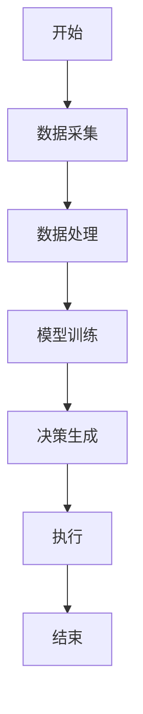
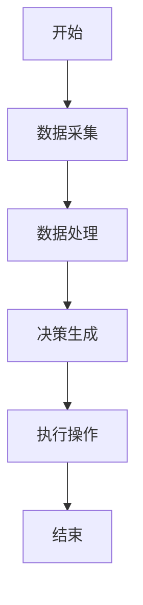
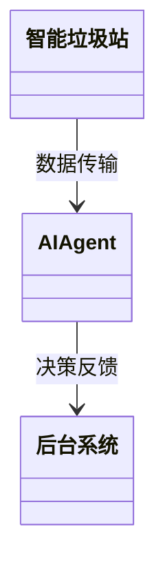
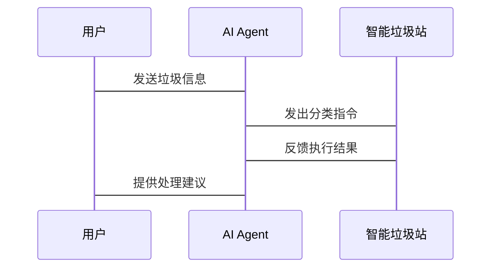

                 


### 第一部分: 背景介绍与核心概念

#### 第1章: 智能垃圾站与AI Agent的背景介绍

##### 1.1 问题背景与描述

###### 1.1.1 当前垃圾管理的痛点
社区垃圾管理面临诸多挑战，包括垃圾量增加、分类效率低下、资源浪费等。传统的人工管理方式效率低，且难以实时监控和优化。

###### 1.1.2 社区垃圾回收的挑战
社区垃圾回收涉及垃圾分类、收集、运输等多个环节，现有模式存在效率低下、资源浪费等问题，亟需智能化解决方案。

###### 1.1.3 AI Agent在垃圾管理中的作用
AI Agent可以通过智能感知、数据分析和自主决策，优化垃圾收集和处理流程，提升效率和资源利用率。

##### 1.2 问题解决与边界

###### 1.2.1 智能垃圾站的定义
智能垃圾站是一种集成AI技术的设备，能够自动识别、分类和处理垃圾，优化社区垃圾管理流程。

###### 1.2.2 AI Agent的核心功能
AI Agent负责数据采集、分析和决策，指导智能垃圾站进行操作，实现高效垃圾管理。

###### 1.2.3 系统的边界与外延
系统边界包括智能垃圾站、AI Agent和后台管理系统。外延涉及垃圾运输、处理等后续环节。

##### 1.3 核心概念与结构

###### 1.3.1 智能垃圾站的组成要素
包括智能传感器、AI识别模块、机械臂、数据传输模块等。

###### 1.3.2 AI Agent的工作原理
AI Agent通过传感器数据和历史信息，使用机器学习模型进行分类和决策，指导垃圾站操作。

###### 1.3.3 系统架构的核心要素
数据采集层、AI处理层、执行层和用户交互层。

#### 第2章: 核心概念与联系

##### 2.1 核心概念原理

###### 2.1.1 AI Agent的基本原理
AI Agent通过数据采集、分析和决策，实现对智能垃圾站的控制和优化。

###### 2.1.2 智能垃圾站的运行机制
垃圾站通过传感器识别垃圾类型，AI Agent分析后，指挥机械臂进行分类和处理。

###### 2.1.3 系统的核心算法
包括垃圾分类算法、路径规划算法和资源优化算法。

##### 2.2 概念属性对比表
| 概念       | 学习能力 | 决策能力 | 执行能力 |
|------------|----------|----------|----------|
| AI Agent   | 强        | 强        | 强        |
| 智能垃圾站 | 弱        | 弱        | 强        |

##### 2.3 ER实体关系图
```mermaid
erd
  entity AI Agent {
    id
    状态
    行为
  }
  entity 智能垃圾站 {
    id
    类型
    位置
  }
  AI Agent --> 智能垃圾站: 控制
```

#### 第3章: 算法原理讲解

##### 3.1 算法流程


##### 3.2 核心算法代码
```python
def ai_agent_decision(data):
    # 数据处理
    processed_data = preprocess(data)
    # 模型预测
    prediction = model.predict(processed_data)
    # 决策生成
    decision = generate_decision(prediction)
    return decision
```

##### 3.3 数学模型与公式

###### 3.3.1 决策树模型
$$\text{决策树} = \sum_{i=1}^{n} \text{特征}_i \times \text{权重}_i$$

###### 3.3.2 机器学习模型
$$\text{预测值} = \beta_0 + \beta_1 x_1 + \dots + \beta_k x_k$$

#### 第4章: 系统分析与架构设计

##### 4.1 问题场景介绍

###### 4.1.1 系统目标
优化社区垃圾管理，提高效率和资源利用率。

###### 4.1.2 使用场景
社区垃圾站的日常使用，包括垃圾分类、收集和处理。

###### 4.1.3 用户角色
社区居民、垃圾站管理员、系统维护人员。

##### 4.2 系统功能设计

###### 4.2.1 功能模块
- 数据采集模块：采集垃圾类型、重量等数据。
- AI处理模块：分析数据，生成决策。
- 执行模块：指挥机械臂进行操作。
- 用户交互模块：提供操作界面，反馈信息。

###### 4.2.2 功能流程


##### 4.3 系统架构设计

###### 4.3.1 系统架构图


##### 4.4 系统接口设计

###### 4.4.1 接口描述
- 数据接口：传感器数据输入。
- 控制接口：AI Agent控制机械臂。
- 反馈接口：系统状态反馈。

##### 4.5 系统交互设计

###### 4.5.1 交互流程


### 第二部分: 项目实战

#### 第5章: 项目实战

##### 5.1 环境安装

###### 5.1.1 系统需求
- 操作系统：Linux/Windows/MacOS
- 开发工具：Python 3.6+
- 依赖库：TensorFlow, scikit-learn, Mermaid

##### 5.2 核心代码实现

###### 5.2.1 数据预处理代码
```python
import pandas as pd
from sklearn.preprocessing import StandardScaler

def preprocess(data):
    # 数据标准化
    scaler = StandardScaler()
    processed_data = scaler.fit_transform(data)
    return processed_data
```

###### 5.2.2 模型训练代码
```python
from sklearn.tree import DecisionTreeClassifier

def train_model(train_data, labels):
    model = DecisionTreeClassifier()
    model.fit(train_data, labels)
    return model
```

###### 5.2.3 决策生成代码
```python
def generate_decision(model, test_data):
    prediction = model.predict(test_data)
    return prediction
```

##### 5.3 实际案例分析

###### 5.3.1 案例背景
某社区引入智能垃圾站，希望通过AI Agent优化垃圾处理流程。

###### 5.3.2 数据分析
分析垃圾类型、时间分布，识别高峰期和低谷期。

###### 5.3.3 模型优化
通过数据反馈，调整模型参数，提高分类准确率。

##### 5.4 代码应用解读与分析

###### 5.4.1 代码解读
解释每部分代码的功能，如何处理数据、训练模型、生成决策。

###### 5.4.2 优化建议
根据实际运行情况，提出模型优化和系统改进的建议。

#### 第6章: 总结与展望

##### 6.1 总结

###### 6.1.1 系统优点
高效、智能、节省人力。

###### 6.1.2 系统不足
初期投入高，维护复杂。

##### 6.2 未来展望

###### 6.2.1 技术发展
引入更先进的AI技术，如深度学习、强化学习。

###### 6.2.2 应用拓展
扩展到更多领域，如智能交通、智能医疗。

### 第三部分: 最佳实践 tips、小结、注意事项、拓展阅读

#### 6.3 最佳实践 tips

##### 6.3.1 开发建议
- 使用模块化设计，便于维护和扩展。
- 定期更新模型，保持分类准确率。
- 优化系统交互，提升用户体验。

##### 6.3.2 注意事项
- 数据隐私保护，确保居民信息不泄露。
- 系统安全性，防止恶意攻击。
- 系统容错设计，确保故障时能安全运行。

#### 6.4 小结

通过本章的学习，读者可以深入了解AI Agent在社区垃圾管理中的应用，掌握系统的架构设计和实现方法，为实际应用提供参考。

#### 6.5 拓展阅读

建议读者进一步阅读相关领域的书籍和论文，如《机器学习实战》、《深度学习入门》等，以拓展知识面和技术能力。

### 结语

智能垃圾站与AI Agent的结合，不仅优化了社区垃圾管理，也为智慧城市的发展提供了新的思路。未来，随着AI技术的不断进步，这类系统将更加智能化、高效化，为人类社会带来更多的便利。

