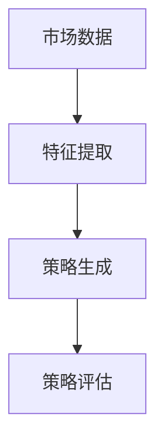
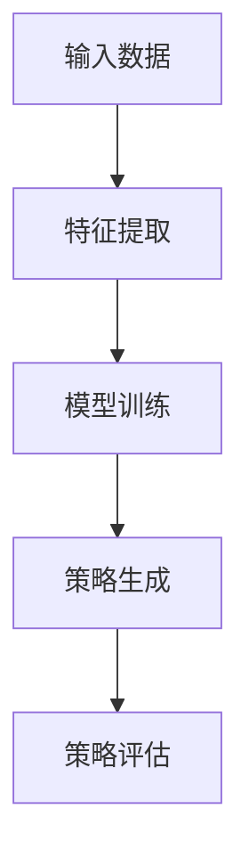
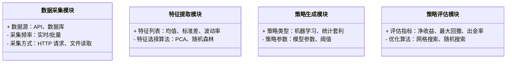
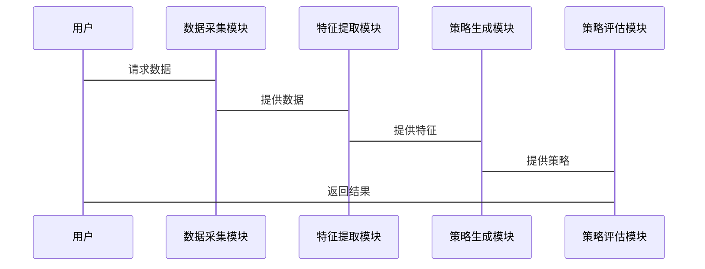

                 


# 智能外汇交易策略生成器

> 关键词：智能外汇交易，策略生成器，机器学习，算法交易，外汇市场

> 摘要：智能外汇交易策略生成器是一种利用先进的机器学习算法和大数据分析技术来优化外汇交易策略的工具。本文将从背景与基础、核心概念、算法原理、系统架构、项目实战等多个方面详细探讨智能外汇交易策略生成器的设计与实现，帮助读者全面理解其工作原理和应用价值。

---

# 第一部分: 智能外汇交易策略生成器的背景与基础

## 第1章: 外汇交易与智能算法概述

### 1.1 外汇交易的基本概念

#### 1.1.1 外汇市场的定义与运作机制

外汇市场是全球最大的金融市场之一，参与者包括银行、企业和个人。其运作机制基于汇率的波动，交易者通过买入或卖出货币对来获利。

#### 1.1.2 外汇交易的主要类型

- 套期保值：为了对冲风险。
- 投机交易：基于市场走势进行押注。
- 套利交易：利用汇率差异获利。

#### 1.1.3 传统交易策略与智能交易策略的区别

传统交易策略依赖人工分析和经验，而智能交易策略则通过算法自动分析数据并生成交易信号。

### 1.2 智能算法在外汇交易中的作用

#### 1.2.1 传统交易策略的局限性

- 人工分析耗时且易受情绪影响。
- 数据量大，难以快速处理。

#### 1.2.2 智能算法的优势与应用场景

- **优势**：快速处理数据，发现隐藏模式，减少人为错误。
- **应用场景**：高频交易、风险控制、套利机会识别。

#### 1.2.3 外汇市场数据的特点与挑战

- **数据特点**：时间序列数据、高频性、非平稳性。
- **挑战**：噪声多，数据量大，模型易过拟合。

### 1.3 本章小结

本章介绍了外汇市场的基本概念、传统交易策略的局限性以及智能算法在外汇交易中的优势和应用场景，为后续内容打下基础。

---

# 第二部分: 智能外汇交易策略生成器的核心概念与联系

## 第2章: 智能外汇交易策略生成器的核心概念

### 2.1 数据处理与特征提取

#### 2.1.1 市场数据的采集与预处理

- 数据来源：API接口、历史数据平台。
- 数据清洗：处理缺失值、异常值。

#### 2.1.2 特征工程的基本原理

- 特征提取：从数据中提取有用的特征，如均值、标准差、波动率等。
- 特征选择：使用统计或机器学习方法选择重要特征。

#### 2.1.3 时间序列数据的特征提取方法

- 移动平均线（MA）：计算一定时间内的平均值。
- 相对强弱指数（RSI）：衡量市场的超买或超卖状态。
- 布林带（Bollinger Bands）：衡量价格的波动范围。

### 2.2 策略生成算法的原理

#### 2.2.1 基于机器学习的策略生成方法

- 监督学习：如随机森林、支持向量机（SVM）。
- 无监督学习：如聚类分析。

#### 2.2.2 基于统计套利的策略生成方法

- 套利机会识别：利用市场价差进行套利。
- 统计套利模型：如均值回归模型。

#### 2.2.3 基于强化学习的策略生成方法

- 状态空间：市场状态、资产价格。
- 动作空间：买入、卖出、持有。
- 奖励函数：利润最大化。

### 2.3 策略评估与优化

#### 2.3.1 策略评估的指标与方法

- 净收益（Net Profit）：策略的总收益。
- 最大回撤（Maximum Drawdown）：策略的最大亏损幅度。
- 出金率（Profit Factor）：衡量策略的盈利能力。

#### 2.3.2 策略优化的基本原理

- 参数优化：调整模型参数以提高性能。
- 纪律性优化：确保策略在不同市场条件下表现一致。

#### 2.3.3 策略回测与风险控制

- 回测：在历史数据上测试策略。
- 风险控制：设置止损、止盈机制。

### 2.4 核心概念对比与ER实体关系图

#### 2.4.1 不同策略生成算法的特征对比（表格形式）

| 算法类型       | 输入数据         | 输出策略       | 优势                     |
|----------------|------------------|---------------|--------------------------|
| 机器学习       | 历史价格数据     | 买入/卖出信号 | 高准确性，适应性强       |
| 统计套利       | 市场价差数据     | 套利信号       | 稳定性高，风险可控       |
| 强化学习       | 市场状态数据     | 动作信号       | 自适应性强，动态调整       |

#### 2.4.2 实体关系图（Mermaid）



---

# 第三部分: 智能外汇交易策略生成器的算法原理讲解

## 第3章: 基于机器学习的策略生成算法

### 3.1 算法流程图



### 3.2 算法实现代码

```python
import pandas as pd
import numpy as np
from sklearn.ensemble import RandomForestClassifier
from sklearn.metrics import accuracy_score

# 示例代码：基于随机森林的策略生成
def generate_strategy(data, target_col):
    # 特征选择
    features = data.drop(columns=[target_col])
    target = data[target_col]
    
    # 模型训练
    model = RandomForestClassifier()
    model.fit(features, target)
    
    # 预测策略
    predicted = model.predict(features)
    
    return predicted

# 数据示例
data = pd.DataFrame({
    'open': [1.0, 1.05, 1.1, 1.08],
    'high': [1.0, 1.05, 1.1, 1.08],
    'low': [1.0, 1.0, 1.05, 1.08],
    'close': [1.05, 1.1, 1.08, 1.1]
})
target_col = 'close'
predicted = generate_strategy(data, target_col)
print(predicted)
```

### 3.3 算法的数学模型和公式

#### 3.3.1 随机森林的数学模型

随机森林是一种基于树的集成方法，其数学模型可以表示为：

$$
\hat{y} = \text{median}(\{y_i\}_{i=1}^{n})
$$

其中，$y_i$ 是每个决策树的预测结果。

#### 3.3.2 线性回归的数学模型

线性回归的数学模型可以表示为：

$$
y = \beta_0 + \beta_1 x_1 + \beta_2 x_2 + \cdots + \beta_k x_k + \epsilon
$$

其中，$\beta_i$ 是回归系数，$\epsilon$ 是误差项。

---

# 第四部分: 智能外汇交易策略生成器的系统分析与架构设计

## 第4章: 系统功能设计与架构

### 4.1 问题场景介绍

智能外汇交易策略生成器需要在复杂的市场环境中快速响应，支持多种策略生成算法，并具备良好的扩展性和可维护性。

### 4.2 系统功能设计

#### 4.2.1 功能模块

- 数据采集模块：负责采集市场数据。
- 特征提取模块：提取交易特征。
- 策略生成模块：生成交易策略。
- 策略评估模块：评估策略性能。

#### 4.2.2 领域模型（Mermaid 类图）



### 4.3 系统架构设计

#### 4.3.1 系统架构（Mermaid 架构图）


### 4.4 系统接口设计

#### 4.4.1 API 接口

- 输入接口：市场数据接口。
- 输出接口：策略信号接口。

### 4.5 系统交互设计（Mermaid 序列图）



---

# 第五部分: 智能外汇交易策略生成器的项目实战

## 第5章: 项目实战与案例分析

### 5.1 环境安装与配置

#### 5.1.1 安装 Python 环境

```bash
pip install python
pip install pandas numpy scikit-learn
```

#### 5.1.2 安装数据接口

```bash
pip install pandas-datareader
```

### 5.2 系统核心实现源代码

#### 5.2.1 数据采集模块

```python
import pandas_datareader as pdr

def get_data(ticker, start, end):
    data = pdr.get_data_yahoo(ticker, start, end)
    return data
```

#### 5.2.2 特征提取模块

```python
def extract_features(data):
    features = data.copy()
    features['SMA_20'] = features['Close'].rolling(20).mean()
    features['STD_20'] = features['Close'].rolling(20).std()
    return features
```

#### 5.2.3 策略生成模块

```python
from sklearn.svm import SVC

def generate_strategy(features, target):
    model = SVC()
    model.fit(features, target)
    predicted = model.predict(features)
    return predicted
```

### 5.3 代码应用解读与分析

#### 5.3.1 数据采集

- 使用 `pandas_datareader` 从 Yahoo Finance 采集数据。
- 数据包括开盘价、收盘价、最高价、最低价、成交量等。

#### 5.3.2 特征提取

- 计算简单移动平均线（SMA）和标准差（STD）。
- 特征用于后续模型训练。

#### 5.3.3 策略生成

- 使用支持向量机（SVM）模型生成交易信号。
- 预测结果为买入、卖出或持有。

### 5.4 实际案例分析

#### 5.4.1 数据准备

```python
import datetime

start = datetime.datetime(2020, 1, 1)
end = datetime.datetime(2022, 12, 31)
data = get_data('EUR/USD', start, end)
features = extract_features(data)
```

#### 5.4.2 模型训练与预测

```python
target = data['Close']
predicted = generate_strategy(features, target)
```

#### 5.4.3 结果分析

- 计算净收益、最大回撤等指标。
- 对比不同策略的性能。

### 5.5 项目小结

本章通过实际案例展示了智能外汇交易策略生成器的实现过程，包括数据采集、特征提取、模型训练和策略生成等步骤。

---

# 第六部分: 智能外汇交易策略生成器的最佳实践与总结

## 第6章: 最佳实践与总结

### 6.1 最佳实践 tips

- 数据清洗是关键，避免噪声干扰。
- 特征工程要精益求精，选择合适特征。
- 模型选择要结合实际场景，避免过度拟合。
- 策略回测要全面，包括不同市场条件下的表现。

### 6.2 小结

智能外汇交易策略生成器通过结合机器学习、大数据分析和金融知识，能够显著提升交易效率和准确性。然而，实际应用中仍需注意风险控制和策略调整。

### 6.3 注意事项

- 避免过度依赖单一算法，建议多策略组合。
- 定期更新模型，适应市场变化。
- 设置合理的止损机制，防止重大损失。

### 6.4 拓展阅读

- 《机器学习实战》
- 《算法交易：数学模型与实践》
- 《Python金融大数据分析》

---

# 附录: 全书总结与展望

智能外汇交易策略生成器是人工智能与金融结合的典型应用，未来随着技术进步，其应用将更加广泛和深入。读者通过本文可以掌握其核心原理和实现方法，为实际应用打下坚实基础。

