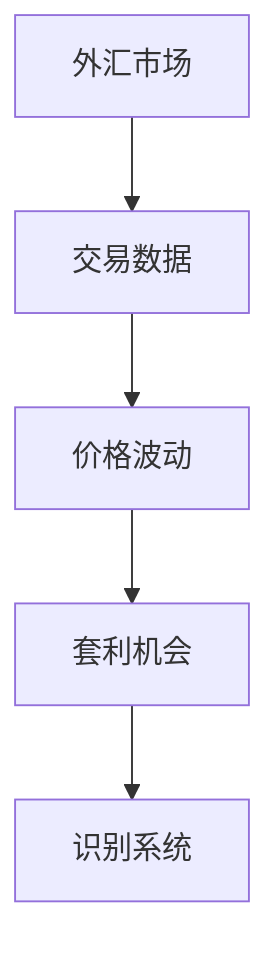
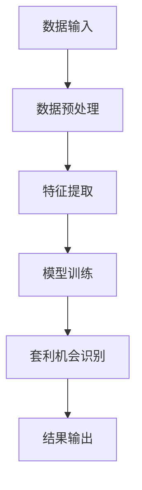
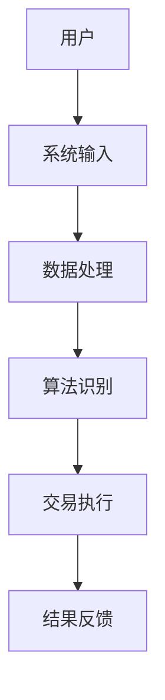

                 


# 智能外汇套利机会识别系统

## 关键词：智能外汇套利，机会识别，机器学习，算法，系统架构

## 摘要：本文深入探讨了智能外汇套利机会识别系统的设计与实现，结合金融市场的特点，介绍了系统的背景、核心概念、算法原理、系统架构、项目实战及最佳实践。通过详细的技术分析和案例研究，揭示了如何利用先进的算法和系统架构来识别套利机会，帮助投资者在复杂多变的外汇市场中捕捉盈利机会。

---

## 第1章: 智能外汇套利机会识别系统背景介绍

### 1.1 外汇套利机会识别的背景与意义

#### 1.1.1 外汇市场的基本概念与运作机制

外汇市场是全球最大的金融市场，24小时连续运行，参与者包括银行、企业、个人和机构投资者。市场的运作机制基于汇率的波动，汇率反映了两种货币的相对价值。外汇交易包括即期交易、远期交易和衍生品交易，其中即期交易最为常见。

#### 1.1.2 套利机会的定义与分类

套利是指利用市场中的价格差异，通过同时在不同市场或不同资产上进行买卖操作，以无风险或低风险的方式获利。外汇套利机会主要分为汇率套利、利差套利和跨市场套利。汇率套利是利用不同市场间的汇率差异进行交易，利差套利则基于不同国家的利率差异，跨市场套利则是利用同一资产在不同市场中的价格差异。

#### 1.1.3 智能外汇套利机会识别系统的核心目标与价值

智能外汇套利机会识别系统的核心目标是通过技术手段，实时监测和分析外汇市场的价格数据，识别潜在的套利机会，并为交易者提供决策支持。系统的价值体现在高效性、准确性和实时性上，能够在复杂多变的市场环境中快速捕捉套利机会，降低交易风险。

### 1.2 问题背景与问题描述

#### 1.2.1 外汇市场中的价格差异与套利机会

外汇市场的价格差异主要源于市场参与者的买卖行为、市场深度、信息不对称和套利行为本身。套利机会的存在是市场不完美的表现，而智能系统的目标正是利用这些不完美之处，帮助交易者获利。

#### 1.2.2 套利机会识别的挑战与难点

套利机会识别的挑战主要在于市场的高频波动、数据的实时性和完整性、算法的复杂性以及监管环境的变化。高频交易需要系统具备极低的延迟，同时数据的完整性和准确性直接影响识别结果。此外，监管政策的变化也可能影响套利机会的存在与否。

#### 1.2.3 系统需要解决的主要问题

系统需要解决的主要问题包括：如何实时采集和处理大量外汇数据，如何准确识别套利机会，如何在识别后快速做出交易决策，以及如何应对市场环境的变化。

### 1.3 问题解决与边界外延

#### 1.3.1 外汇套利机会识别的解决方案

解决方案包括数据采集与处理、套利机会识别算法、交易执行系统和风险管理模块。数据采集与处理负责获取实时的汇率数据，套利机会识别算法通过分析数据寻找价格差异，交易执行系统负责快速下单，风险管理模块则监控和管理交易风险。

#### 1.3.2 系统的边界与适用范围

系统的边界包括数据来源、交易品种、交易时间窗口和交易规模。适用范围限于主要货币对和标准化的金融产品，且适用于中低风险的套利策略。

#### 1.3.3 系统的限制与不足

系统的限制包括数据延迟、算法的有效性和交易成本。在数据采集过程中可能会存在延迟，影响识别的及时性；算法的有效性依赖于市场的实际波动情况；交易成本和滑点也可能影响最终的收益。

### 1.4 核心概念与组成要素

#### 1.4.1 外汇套利机会识别的核心概念

核心概念包括汇率波动、价格差异、套利窗口和交易信号。汇率波动是套利机会的来源，价格差异是套利的基础，套利窗口是价格差异存在的时段，交易信号则是系统发出的交易指令。

#### 1.4.2 系统组成要素的详细描述

系统组成要素包括数据采集模块、数据分析模块、算法模块、交易执行模块和风险管理模块。数据采集模块负责获取实时数据，数据分析模块进行数据清洗和特征提取，算法模块识别套利机会，交易执行模块根据识别结果下单，风险管理模块监控和管理风险。

#### 1.4.3 核心概念之间的关系与联系

核心概念之间的关系通过ER图展示，展示各概念之间的关联和作用方向。

---

## 第2章: 外汇套利机会识别的核心概念与联系

### 2.1 核心概念原理

#### 2.1.1 外汇市场的价格形成机制

外汇市场的价格形成机制基于供求关系，买卖双方的交易行为决定了汇率的波动。价格形成机制受到宏观经济因素、市场情绪、政策变化和突发事件的影响。

#### 2.1.2 套利机会的数学模型

套利机会的数学模型可以用时间序列分析的方法，将汇率数据作为输入，通过模型预测未来的价格走势，寻找价格差异。常用的模型包括ARIMA和LSTM。

#### 2.1.3 智能识别算法的基本原理

智能识别算法基于机器学习，使用神经网络和深度学习技术，从历史数据中学习套利机会的特征，构建分类模型，识别潜在的套利机会。

### 2.2 核心概念属性特征对比表

| 概念          | 特征                | 描述                                                                 |
|---------------|--------------------|----------------------------------------------------------------------|
| 汇率波动       | 波动幅度            | 描述汇率在一定时间内的波动程度                                   |
| 价格差异      | 差异程度           | 描述不同市场或不同时间点之间的价格差异                           |
| 套利窗口      | 持续时间           | 描述价格差异存在的时长                                             |
| 交易信号      | 发出时间           | 描述交易信号的触发条件和触发时间                                   |

### 2.3 ER实体关系图



---

## 第3章: 外汇套利机会识别算法原理

### 3.1 算法原理讲解

#### 3.1.1 时间序列分析算法

时间序列分析算法用于预测未来的汇率走势，识别价格差异。常用的模型包括ARIMA和Prophet。

#### 3.1.2 机器学习算法

机器学习算法包括监督学习和无监督学习，用于分类和回归任务。常用的模型包括随机森林、支持向量机和神经网络。

#### 3.1.3 基于统计套利的算法

基于统计套利的算法通过寻找资产之间的协整关系，利用均值回归的特性进行套利。常用的模型包括配对交易策略。

### 3.2 算法流程图



### 3.3 算法数学模型与公式

#### 3.3.1 时间序列模型

ARIMA模型的公式为：
$$ARIMA(p, d, q)$$
其中，p为自回归阶数，d为差分阶数，q为移动平均阶数。

#### 3.3.2 机器学习模型

LSTM模型的结构包括输入门、遗忘门和输出门，公式为：
$$LSTM(p, h, c, o)$$
其中，p为输入大小，h为隐藏层大小，c为细胞状态大小，o为输出大小。

---

## 第4章: 系统分析与架构设计方案

### 4.1 系统功能设计

系统功能包括数据采集、数据处理、套利机会识别、交易执行和风险管理。数据采集模块负责获取实时数据，数据处理模块进行清洗和特征提取，套利机会识别模块基于算法识别机会，交易执行模块根据信号下单，风险管理模块监控和管理风险。

### 4.2 系统架构设计

系统架构采用分层设计，包括数据层、服务层、应用层和表现层。数据层负责数据存储和管理，服务层提供数据处理和算法服务，应用层实现套利机会识别和交易执行，表现层提供用户界面和结果展示。

### 4.3 系统接口设计

系统接口包括数据接口、算法接口和交易接口。数据接口与数据源对接，算法接口与交易系统对接，交易接口与交易执行系统对接。

### 4.4 系统交互流程图



---

## 第5章: 项目实战

### 5.1 环境配置

项目需要安装Python、Pandas、NumPy、Matplotlib、Scikit-learn和TensorFlow等库。环境配置包括安装依赖和设置开发环境。

### 5.2 核心代码实现

套利机会识别的Python代码示例如下：
```python
import pandas as pd
import numpy as np
from sklearn.model import LinearRegression

# 数据预处理
data = pd.read_csv('exchange_rate.csv')
data = data.dropna()

# 特征提取
X = data[['currency1', 'currency2']]
y = data['target']

# 模型训练
model = LinearRegression()
model.fit(X, y)

# 预测
new_data = pd.DataFrame({'currency1': [x1], 'currency2': [x2]})
predicted = model.predict(new_data)
```

### 5.3 案例分析

以欧元/美元为例，分析套利机会。通过历史数据，识别汇率波动，寻找套利窗口，发出交易信号，执行交易并监控风险。

### 5.4 项目总结

项目总结包括系统的性能评估、实际应用效果和改进建议。性能评估包括识别准确率、交易成本和收益比，实际应用效果包括实际交易中的表现，改进建议包括优化算法、增加数据源和加强风险管理。

---

## 第6章: 最佳实践、小结与注意事项

### 6.1 最佳实践 tips

- 数据源的选择和处理是关键，确保数据的准确性和实时性。
- 算法的选择和调优直接影响识别效果，建议根据市场情况选择合适的算法。
- 风险管理是系统的重要组成部分，建议采用严格的止损策略。

### 6.2 小结

本文详细介绍了智能外汇套利机会识别系统的设计与实现，从背景到算法，从系统架构到项目实战，全面分析了系统的各个方面。通过系统的实现，可以帮助交易者在外汇市场中捕捉套利机会，提高交易效率和收益。

### 6.3 注意事项

- 交易者需注意市场风险和政策变化，避免因市场波动导致的损失。
- 系统的维护和更新是持续的过程，需要根据市场变化不断优化算法和策略。
- 交易成本和滑点也是需要考虑的因素，可能影响最终的收益。

### 6.4 拓展阅读

推荐读者阅读《算法交易》、《机器学习在金融中的应用》和《外汇市场分析》等书籍，进一步深入了解套利机会识别的理论和实践。

---

## 结语

智能外汇套利机会识别系统是一个复杂而有趣的课题，结合了金融、算法和系统设计等多个领域的知识。通过技术手段的不断进步和创新，我们可以更好地理解和利用市场中的套利机会，为投资者创造价值。希望本文能够为读者提供有益的参考和启示，帮助他们在外汇市场中取得成功。

---

