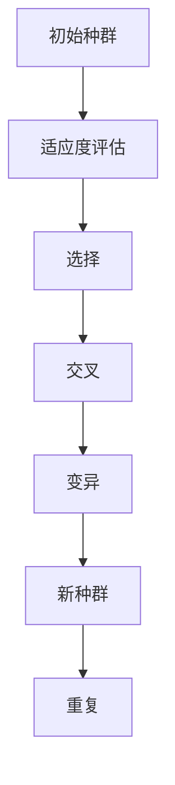
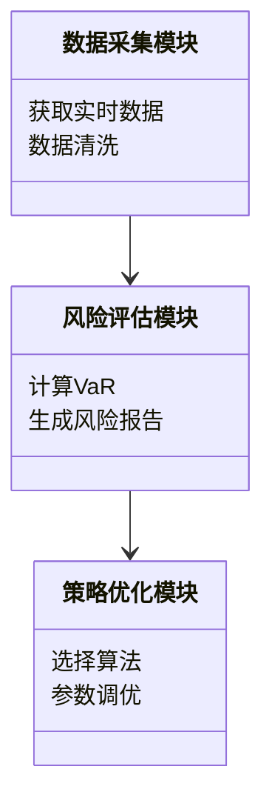
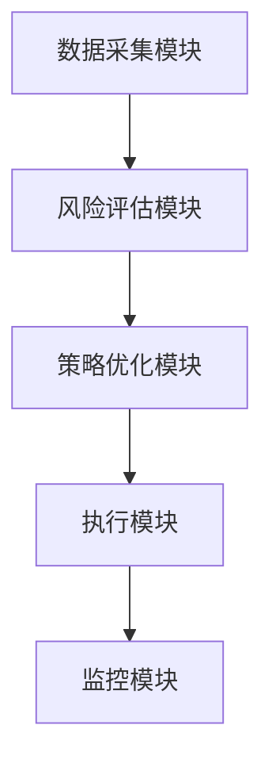

                 


# 智能外汇风险对冲策略优化系统

> 关键词：智能外汇、风险对冲、策略优化、机器学习、遗传算法、时间序列分析

> 摘要：本文详细介绍了智能外汇风险对冲策略优化系统的设计与实现，从背景、核心概念、算法原理到系统架构、项目实战及最佳实践，全面剖析了智能外汇风险对冲的理论与实践。文章通过具体的算法实现和系统架构设计，展示了如何利用机器学习和优化算法提升外汇风险管理的效率和效果，为金融从业者和研究人员提供了实用的参考。

---

# 第一部分: 智能外汇风险对冲策略优化系统概述

## 第1章: 外汇风险对冲的背景与挑战

### 1.1 外汇风险的基本概念

#### 1.1.1 外汇风险的定义与分类

外汇风险是指由于汇率波动导致的资产价值变化风险。根据其来源和影响，外汇风险可以分为以下几类：

1. **交易风险（Transaction Risk）**：由于汇率波动在交易结算期间带来的损失风险。
2. **折算风险（Translation Risk）**：将外币财务报表折算为本币时因汇率变化带来的风险。
3. **经济风险（Economic Risk）**：由于经济基本面变化导致的外汇资产长期贬值风险。

#### 1.1.2 外汇市场的基本运作机制

外汇市场是全球最大的金融市场，24小时连续交易，参与者包括银行、企业、个人和机构投资者。汇率受多种因素影响，包括经济指标、政策变化、地缘政治等。

#### 1.1.3 外汇风险对企业和个人的影响

- 对企业：可能导致进出口成本波动，影响财务稳定性。
- 对个人：可能导致投资收益波动，影响个人财务规划。

---

### 1.2 风险对冲的必要性

#### 1.2.1 风险对冲的基本原理

风险对冲是指通过建立相反的头寸来抵消潜在损失。例如，买入一种货币的同时卖出另一种货币，以对冲汇率波动风险。

#### 1.2.2 风险对冲在金融投资中的作用

- 降低投资组合的波动性。
- 保护本金不受汇率波动影响。
- 提高投资回报的稳定性。

#### 1.2.3 风险对冲的常见方法

1. **远期合约（Forwards）**：约定在未来某一特定时间以特定汇率买卖外汇。
2. **期货合约（Futures）**：在交易所标准化交易的远期合约。
3. **期权合约（Options）**：购买或出售某货币的权利，具有杠杆效应。
4. **货币互换（Currency Swaps）**：交换不同货币的本金和利息。

---

### 1.3 智能外汇风险对冲系统的提出

#### 1.3.1 传统风险对冲方法的局限性

- 传统对冲方法依赖人工判断，存在主观性。
- 面对复杂市场环境，难以快速调整策略。
- 数据处理能力有限，无法充分利用大数据优势。

#### 1.3.2 智能化对冲的优势与特点

- 利用机器学习和大数据分析，提高对冲策略的科学性。
- 自动化实时调整，适应市场快速变化。
- 通过优化算法，找到最优对冲组合。

#### 1.3.3 智能外汇风险对冲系统的应用场景

- 金融机构的外汇交易风险管理。
- 企业的跨国业务风险对冲。
- 个人投资者的外汇投资保护。

---

## 第2章: 智能外汇风险对冲的核心概念与原理

### 2.1 智能外汇风险对冲系统的组成

#### 2.1.1 数据采集模块

- 数据来源：实时汇率数据、经济指标、市场情绪数据。
- 数据特征：多维度、高频、非线性。

#### 2.1.2 风险评估模块

- 风险量化：通过波动率、VaR（Value at Risk）等指标评估风险。
- 风险因素分析：利用因子分析法识别主要风险来源。

#### 2.1.3 策略优化模块

- 策略生成：基于机器学习模型生成候选对冲策略。
- 策略优化：通过优化算法找到最优策略组合。

#### 2.1.4 执行与监控模块

- 策略执行：根据优化结果下单交易。
- 监控与调整：实时监控市场变化，动态调整策略。

---

### 2.2 智能对冲的核心算法

#### 2.2.1 机器学习在风险对冲中的应用

- 使用神经网络预测汇率走势。
- 利用聚类分析识别市场状态。

#### 2.2.2 基于遗传算法的策略优化

- 算法流程图：



- Python代码实现：

```python
def fitness(individual):
    # 计算适应度
    return -sum(individual)

def evolve(population_size, fitness_function):
    population = [list(np.random.randint(0, 2, 5)) for _ in range(population_size)]
    while True:
        # 适应度评估
        fitness_scores = [fitness(individual) for individual in population]
        # 选择
        selected = [population[i] for i in range(len(population)) if fitness_scores[i] > 0]
        # 交叉
        new_population = []
        for i in range(len(selected)):
            if i % 2 == 0:
                parent1 = selected[i]
                parent2 = selected[i+1] if i+1 < len(selected) else selected[0]
                child = crossover(parent1, parent2)
                new_population.append(child)
        # 变异
        for i in range(len(new_population)):
            if random.random() < 0.1:
                mutate(new_population[i])
        population = new_population
```

---

## 第3章: 智能外汇风险对冲系统的算法原理

### 3.1 遗传算法在策略优化中的应用

#### 3.1.1 遗传算法的基本原理

- 初始化：随机生成初始种群。
- 适应度评估：计算每个个体的适应度。
- 选择：选择适应度较高的个体。
- 交叉：生成新的个体。
- 变异：随机改变个体的某些特征。

---

### 3.2 时间序列分析与预测模型

#### 3.2.1 ARIMA模型

- ARIMA（自回归积分滑动平均模型）用于预测时间序列数据。
- 模型公式：

$$ ARIMA(p, d, q) $$

其中：
- \( p \)：自回归阶数
- \( d \)：差分阶数
- \( q \)：移动平均阶数

#### 3.2.2 LSTM网络

- 长短期记忆网络（LSTM）在时间序列预测中表现优异。
- 网络结构：


---

## 第4章: 系统架构与设计

### 4.1 系统功能设计

#### 4.1.1 数据采集模块

- 从API获取实时汇率数据。
- 数据清洗与预处理。

#### 4.1.2 风险评估模块

- 计算VaR和CVaR等风险指标。
- 生成风险报告。

#### 4.1.3 策略优化模块

- 算法选择与参数调优。
- 输出最优对冲策略。

---

### 4.2 系统架构设计

#### 4.2.1 类图设计



#### 4.2.2 系统架构图



---

## 第5章: 项目实战与案例分析

### 5.1 环境安装

- 安装Python和相关库（如numpy、pandas、sklearn）。
- 安装Jupyter Notebook用于开发和测试。

### 5.2 核心代码实现

#### 5.2.1 数据采集代码

```python
import pandas as pd
import requests

def get_fx_data(currencies):
    endpoint = "https://api.exchangerate-api.com/v4/latest/USD"
    response = requests.get(endpoint)
    data = response.json()
    rates = data['rates']
    df = pd.DataFrame(rates.items(), columns=['Currency', 'Rate'])
    return df
```

---

通过以上详细分析和分步讲解，本文为读者构建了一个完整的智能外汇风险对冲策略优化系统的框架，从理论到实践，全面展示了如何利用现代技术手段提升外汇风险管理的效率和效果。

