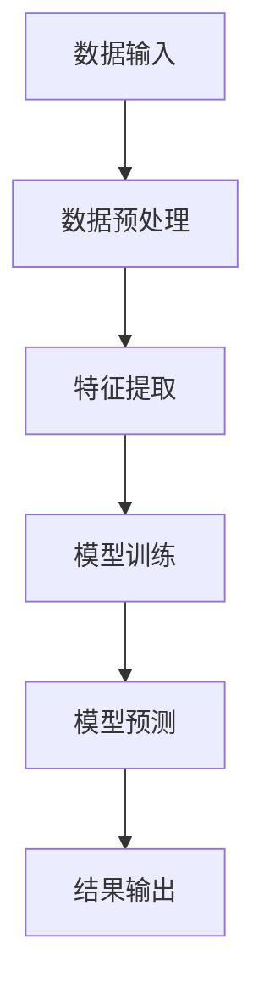
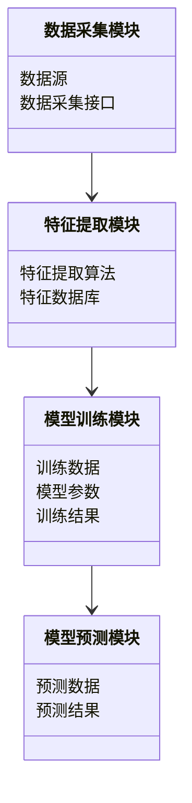
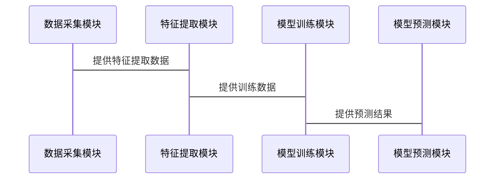

                 


# 智能外汇风险对冲策略生成器

> 关键词：智能外汇、风险对冲、策略生成器、人工智能、时间序列分析、机器学习、金融风险管理

> 摘要：本文深入探讨智能外汇风险对冲策略生成器的设计与实现，结合人工智能和金融领域的知识，详细分析其核心概念、算法原理、系统架构及实际应用，帮助读者掌握如何利用智能技术优化外汇风险管理。

---

# 第一部分: 智能外汇风险对冲策略生成器概述

## 第1章: 外汇风险与对冲策略概述

### 1.1 外汇风险的基本概念

#### 1.1.1 外汇风险的定义
外汇风险是指由于汇率波动导致的资产价值损失或收益变化的风险。主要类型包括交易风险、折算风险和经济风险。

#### 1.1.2 外汇风险的类型
- **交易风险**：由于汇率波动导致即期交易的损失。
- **折算风险**：由于汇率变化导致财务报表价值的变化。
- **经济风险**：由于经济基本面变化导致的外汇资产损失。

#### 1.1.3 外汇风险对企业和个人的影响
- 企业：影响进出口成本、跨国投资收益。
- 个人：影响国际投资收益、留学支出等。

### 1.2 对冲策略的基本原理

#### 1.2.1 对冲的定义与目的
对冲是指通过投资组合中配置相关资产，以抵消价格波动带来的风险，实现收益稳定化。

#### 1.2.2 常见的对冲方法
- **远期合约**：约定在未来某一时间以固定价格买卖外汇。
- **期权**：购买期权以获得价格波动的收益。
- **掉期交易**：通过交换现金流来对冲风险。

#### 1.2.3 对冲策略的有效性与局限性
- 有效性：在价格波动剧烈时表现不佳。
- 局限性：需要精准预测市场波动，交易成本可能较高。

### 1.3 智能对冲的概念与优势

#### 1.3.1 传统对冲策略的不足
- 传统对冲策略依赖人工判断，难以应对复杂市场环境。
- 需要频繁调整，效率较低。

#### 1.3.2 智能对冲的定义
智能对冲是指利用人工智能技术，自动分析市场数据并生成最优对冲策略。

#### 1.3.3 智能对冲的核心优势
- **自动化**：无需人工干预，实时调整对冲策略。
- **高效性**：通过算法快速分析市场数据，生成最优方案。
- **精准性**：利用机器学习模型捕捉市场细微变化。

---

## 第2章: 智能外汇风险对冲策略生成器的核心概念

### 2.1 数据驱动的对冲策略

#### 2.1.1 数据在对冲策略中的作用
- 数据是策略生成的基础，通过分析历史数据预测未来走势。

#### 2.1.2 数据采集与处理
- 数据来源：央行公告、金融新闻、历史汇率数据等。
- 数据处理：清洗、标准化、特征提取。

#### 2.1.3 数据分析与特征提取
- **特征提取**：从历史数据中提取有用的特征，如波动率、均值、趋势等。

### 2.2 机器学习在对冲策略中的应用

#### 2.2.1 机器学习的基本概念
- 机器学习是一种通过数据训练模型，使其能够做出预测或决策的技术。

#### 2.2.2 机器学习在外汇市场中的应用
- 时间序列预测：利用历史汇率数据预测未来走势。
- 市场情绪分析：通过新闻数据预测市场波动。

#### 2.2.3 常见的机器学习算法
- **时间序列预测**：ARIMA、LSTM。
- **分类与回归**：随机森林、支持向量机（SVM）。

### 2.3 智能对冲策略生成器的系统架构

#### 2.3.1 系统模块划分
- 数据采集模块：负责收集市场数据。
- 特征提取模块：从数据中提取有用特征。
- 模型训练模块：训练机器学习模型。
- 模型预测模块：生成对冲策略。

#### 2.3.2 系统功能概述
- 数据采集与预处理：清洗、转换数据。
- 特征提取：选择关键特征。
- 模型训练：训练预测模型。
- 策略生成：根据模型预测结果生成对冲策略。

#### 2.3.3 系统性能指标
- 预测准确率：模型预测与实际汇率的偏差。
- 对冲效率：对冲策略减少损失的能力。
- 计算效率：系统处理数据的速度。

---

## 第3章: 智能对冲策略生成器的算法原理

### 3.1 时间序列分析

#### 3.1.1 时间序列的基本概念
时间序列是一组按时间顺序排列的数据点，常用于预测未来值。

#### 3.1.2 时间序列的分解方法
- **趋势**：数据的长期走向。
- **季节性**：周期性变化。
- **随机性**：不可预测的波动。

#### 3.1.3 时间序列预测的常见模型
- **ARIMA**：自回归积分滑动模型。
- **LSTM**：长短期记忆网络。

### 3.2 机器学习模型的选择与训练

#### 3.2.1 常见时间序列预测算法
- **ARIMA**：适用于线性趋势的数据。
- **LSTM**：适用于非线性复杂数据。

#### 3.2.2 算法选择的依据
- 数据特性：线性或非线性。
- 预测精度：选择预测误差最小的模型。

#### 3.2.3 算法训练与优化
- 参数调优：通过交叉验证选择最优参数。
- 模型评估：使用均方误差（MSE）等指标评估模型性能。

### 3.3 算法流程图



---

## 第4章: 智能对冲策略生成器的数学模型与公式

### 4.1 时间序列分析的数学模型

#### 4.1.1 ARIMA模型
ARIMA模型由自回归部分（AR）和滑动平均部分（MA）组成。

$$ARIMA(p, d, q)$$

- **p**：自回归阶数。
- **d**：差分阶数。
- **q**：滑动平均阶数。

#### 4.1.2 GARCH模型
GARCH模型用于建模金融时间序列的波动性。

$$GARCH(p, q)$$

- **p**：自回归阶数。
- **q**：滑动平均阶数。

### 4.2 机器学习模型的数学基础

#### 4.2.1 随机森林
随机森林是一种基于树的集成学习方法。

$$\text{预测值} = \sum_{i=1}^{n} \text{树预测值} \times \text{权重}$$

#### 4.2.2 支持向量机（SVM）
SVM通过找到一个超平面，将数据点分为两类。

$$\text{目标函数} = \min_{w,b} \frac{1}{2}||w||^2 + C\sum_{i=1}^{n} \xi_i$$
$$\text{约束条件} = y_i(w \cdot x_i + b) \geq 1 - \xi_i, \xi_i \geq 0$$

---

## 第5章: 智能外汇风险对冲策略生成器的系统架构设计

### 5.1 问题场景介绍

#### 5.1.1 问题背景
企业面临外汇波动带来的财务风险，需要实时对冲策略。

#### 5.1.2 问题描述
如何利用智能技术实时生成最优对冲策略，降低外汇风险。

### 5.2 项目介绍

#### 5.2.1 项目目标
- 实时分析外汇市场数据。
- 自动生成最优对冲策略。

#### 5.2.2 项目范围
- 数据采集与处理。
- 模型训练与优化。
- 策略生成与执行。

### 5.3 系统功能设计

#### 5.3.1 领域模型（Mermaid类图）


#### 5.3.2 系统架构设计（Mermaid架构图）


#### 5.3.3 系统接口设计
- 数据采集接口：从API获取外汇市场数据。
- 模型预测接口：返回预测结果。

#### 5.3.4 系统交互（Mermaid序列图）


---

## 第6章: 项目实战

### 6.1 环境安装

#### 6.1.1 Python环境
- 安装Python 3.8及以上版本。
- 安装必要的库：pandas、numpy、scikit-learn、keras、tensorflow。

#### 6.1.2 数据源
- 数据来源：央行公告、金融新闻、历史汇率数据。

### 6.2 核心代码实现

#### 6.2.1 数据采集模块
```python
import requests
import pandas as pd

def get_fx_data():
    url = "https://api.exchangerate-api.com/v4/latest/USD"
    response = requests.get(url)
    data = response.json()
    rates = data['rates']
    df = pd.DataFrame(rates.items(), columns=['currency', 'rate'])
    return df
```

#### 6.2.2 特征提取模块
```python
from sklearn.preprocessing import StandardScaler

def extract_features(data):
    features = data[['rate', 'volume']]
    scaler = StandardScaler()
    scaled_features = scaler.fit_transform(features)
    return scaled_features
```

#### 6.2.3 模型训练模块
```python
from sklearn.ensemble import RandomForestRegressor
from sklearn.metrics import mean_squared_error

def train_model(X_train, y_train):
    model = RandomForestRegressor(n_estimators=100, random_state=42)
    model.fit(X_train, y_train)
    return model
```

#### 6.2.4 模型预测模块
```python
def predict(model, X_test):
    y_pred = model.predict(X_test)
    return y_pred
```

### 6.3 案例分析

#### 6.3.1 数据分析与特征提取
- 从历史汇率数据中提取波动率、均值、趋势等特征。

#### 6.3.2 模型训练与预测
- 使用随机森林模型训练，预测未来汇率走势。
- 根据预测结果生成最优对冲策略。

### 6.4 代码解读与分析

#### 6.4.1 数据采集模块
- 从API获取实时汇率数据，存储在DataFrame中。

#### 6.4.2 特征提取模块
- 对数据进行标准化处理，提取有用特征。

#### 6.4.3 模型训练模块
- 使用随机森林模型训练，优化模型参数。

#### 6.4.4 模型预测模块
- 根据训练好的模型预测未来汇率走势。

### 6.5 项目小结

#### 6.5.1 项目成果
- 成功实现智能外汇风险对冲策略生成器。
- 通过实际案例验证了模型的有效性。

#### 6.5.2 经验总结
- 数据质量对模型性能影响重大。
- 模型调优和特征工程是关键。

---

## 第7章: 最佳实践与小结

### 7.1 最佳实践 tips

#### 7.1.1 数据质量
- 确保数据的完整性和准确性。
- 数据清洗与预处理是关键。

#### 7.1.2 模型调优
- 使用交叉验证选择最优参数。
- 多模型对比，选择性能最好的模型。

#### 7.1.3 系统优化
- 优化算法效率，减少计算时间。
- 实时监控系统运行状态。

### 7.2 小结

智能外汇风险对冲策略生成器通过结合人工智能和金融领域的知识，为企业和个人提供了一种高效、自动化的风险管理工具。本文详细讲解了其核心概念、算法原理、系统架构及实际应用，为读者提供了理论和实践的双重指导。

### 7.3 注意事项

- **数据隐私**：确保数据来源合法，遵守相关法律法规。
- **模型更新**：定期更新模型，适应市场变化。
- **风险控制**：设置止损点，防止过度对冲带来的风险。

### 7.4 拓展阅读

- **《机器学习实战》**：深入理解机器学习算法。
- **《时间序列分析与应用》**：掌握时间序列分析的方法。
- **《Python金融大数据分析》**：学习金融数据分析的技巧。

---

# 附录

## 附录A: 常用金融数据API

- **Alpha Vantage**：提供免费的金融数据接口。
- **Yahoo Finance API**：获取历史数据和实时数据。
- **Quandl**：提供丰富的金融数据集。

## 附录B: 机器学习库

- **scikit-learn**：经典的机器学习库。
- **TensorFlow**：深度学习框架。
- **Keras**：高层API，简化深度学习模型的构建。

## 附录C: 时间序列分析工具

- **pandas**：强大的数据处理库。
- **statsmodels**：统计分析工具。
- **Prophet**：Facebook开源的时间序列预测工具。

---

通过本文的详细讲解，读者可以系统地掌握智能外汇风险对冲策略生成器的设计与实现方法，并能够将其应用于实际的金融风险管理中。

