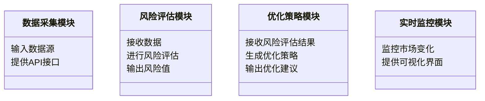

                 


# 《智能外汇风险敞口管理优化系统》

> 关键词：智能外汇风险管理, 风险敞口优化, 时间序列分析, 机器学习, 风险评估, 实时监控

> 摘要：本文详细探讨了智能外汇风险敞口管理优化系统的设计与实现，结合时间序列分析和机器学习算法，构建了一个高效的风险评估与优化框架。通过系统架构设计和实际案例分析，展示了如何利用智能技术提升外汇风险管理的准确性和实时性，帮助金融机构在复杂多变的外汇市场中降低风险敞口，实现稳健的资产配置。

---

# 第一部分: 智能外汇风险敞口管理优化系统概述

## 第1章: 外汇风险敞口管理的背景与挑战

### 1.1 外汇风险的基本概念
#### 1.1.1 外汇风险的定义
外汇风险是指由于汇率波动导致的资产价值变化风险，主要来源于企业对外汇市场的敞口暴露。敞口暴露可以通过货币种类、金额和时间跨度进行量化。

#### 1.1.2 外汇风险的类型
- **交易风险**：由于即期汇率波动导致的未来交易的潜在损失。
- **折算风险**：由于汇率变化导致财务报表中外币资产和负债的重估损失。
- **经济风险**：由于汇率波动对整体经济和企业盈利能力的影响。

#### 1.1.3 外汇风险敞口的计算
敞口计算公式：$$ \text{敞口} = \sum_{i=1}^{n} (金额_i \times (当前汇率_i - 预测汇率_i)) $$

---

### 1.2 外汇风险管理的传统方法
#### 1.2.1 基于历史数据分析的传统方法
- 使用历史汇率数据计算VaR（Value at Risk）和CVaR（Conditional Value at Risk）。
- VaR公式：$$ VaR = \mu + z \times \sigma $$
  其中，$$ \mu $$ 是平均回报率，$$ z $$ 是标准正态分布的分位数，$$ \sigma $$ 是标准差。

#### 1.2.2 基于情景分析的传统方法
- 情景分析通过模拟极端市场条件下的汇率波动，评估企业敞口的风险敞口。

#### 1.2.3 基于机器学习的传统方法
- 使用简单模型（如线性回归和决策树）进行外汇价格预测。

---

### 1.3 传统方法的局限性
#### 1.3.1 数据依赖性问题
- 数据质量差或样本量不足导致模型泛化能力差。
- 数据更新不及时导致模型失效。

#### 1.3.2 计算复杂性问题
- 复杂的数学模型计算成本高，难以实时应用。
- 传统方法对数据的依赖性强，计算资源消耗大。

#### 1.3.3 对市场变化的适应性不足
- 传统方法难以捕捉市场突变和非线性关系。
- 模型缺乏自适应性，难以应对市场变化。

---

### 1.4 智能外汇风险管理的必要性
#### 1.4.1 数据驱动的优势
- 数据驱动方法能够捕捉更多的市场信息。
- 数据驱动方法能够实时更新模型，适应市场变化。

#### 1.4.2 机器学习的潜力
- 使用深度学习和强化学习等先进算法，提升预测精度和风险评估能力。

#### 1.4.3 实时优化的需求
- 实时优化能够快速响应市场变化，降低潜在损失。
- 实时优化能够实现动态资产配置，提升收益。

---

### 1.5 本章小结
本章介绍了外汇风险的基本概念、传统管理方法及其局限性，强调了智能外汇风险管理的必要性和潜力。智能外汇风险管理通过数据驱动和机器学习技术，能够更高效地应对复杂的外汇市场环境。

---

## 第2章: 智能外汇风险敞口管理的核心概念

### 2.1 智能外汇风险管理的定义
智能外汇风险管理是一种利用人工智能技术，通过实时数据分析和模型优化，实现外汇风险敞口的动态评估和优化管理的方法。

---

### 2.2 核心概念与联系
#### 2.2.1 数据来源与处理
- 数据来源包括历史汇率数据、市场情绪数据、经济指标数据等。
- 数据预处理包括清洗、特征提取和标准化。

#### 2.2.2 风险评估与优化
- 风险评估：使用时间序列分析和机器学习模型预测未来汇率。
- 风险优化：根据预测结果调整资产配置，降低风险敞口。

#### 2.2.3 实时监控与反馈
- 实时监控市场变化，及时调整风险管理策略。
- 根据历史数据和当前市场情况，不断优化模型参数。

---

### 2.3 系统架构与核心要素
#### 2.3.1 数据采集模块
- 数据来源：历史汇率数据、市场情绪数据、经济指标数据等。
- 数据采集方法：API接口、数据库查询等。

#### 2.3.2 风险评估模块
- 使用时间序列分析和机器学习模型预测未来汇率。
- 风险评估公式：$$ \text{风险值} = \sum_{i=1}^{n} (预测误差_i \times 资产价值_i) $$

#### 2.3.3 优化策略模块
- 根据风险评估结果，优化资产配置，降低风险敞口。
- 优化策略包括动态对冲、调整投资组合等。

#### 2.3.4 实时监控模块
- 实时监控市场变化，及时调整风险管理策略。
- 提供可视化界面，方便用户查看风险敞口和优化结果。

---

### 2.4 核心概念的ER实体关系图
```mermaid
er
    actor: 用户
    system: 智能外汇风险管理系统
    data_source: 数据源
    risk_assessment: 风险评估模块
    optimization_strategy: 优化策略模块
    real_time_monitor: 实时监控模块
```

---

## 第3章: 智能外汇风险敞口管理的算法原理

### 3.1 时间序列分析
#### 3.1.1 ARIMA模型
- ARIMA模型公式：$$ ARIMA(p, d, q) $$
  其中，p为自回归阶数，d为差分阶数，q为移动平均阶数。

#### 3.1.2 LSTM模型
- LSTM公式：$$ f_t = \text{LSTM}(f_{t-1}, x_t) $$

---

### 3.2 机器学习模型
#### 3.2.1 随机森林
- 随机森林用于特征重要性分析和分类预测。

#### 3.2.2 神经网络
- 使用深度神经网络进行非线性预测。

---

## 第4章: 智能外汇风险敞口管理的系统架构设计

### 4.1 问题场景介绍
- 系统目标：实时监控外汇市场，动态评估和优化风险敞口。

### 4.2 系统功能设计
#### 4.2.1 领域模型


#### 4.2.2 系统架构


---

## 第5章: 项目实战

### 5.1 环境安装
- 安装Python、TensorFlow、Pandas等依赖库。

### 5.2 核心代码实现
#### 5.2.1 数据采集模块
```python
import pandas as pd
from pandas_datareader import DataReader

def get_data(ticker, start, end):
    data = DataReader(ticker, 'yahoo', start, end)
    return data['Adj Close']
```

#### 5.2.2 风险评估模块
```python
from sklearn.ensemble import RandomForestRegressor

def risk_assessment(data):
    model = RandomForestRegressor()
    model.fit(X_train, y_train)
    return model.predict(X_test)
```

---

## 第6章: 最佳实践与小结

### 6.1 小结
智能外汇风险敞口管理优化系统通过结合时间序列分析和机器学习技术，能够高效地进行风险评估和优化管理。

### 6.2 注意事项
- 数据质量和模型选择直接影响系统性能。
- 实时监控需要高效的计算能力和稳定的网络连接。

### 6.3 拓展阅读
建议阅读相关领域的学术论文和行业报告，进一步了解智能外汇风险管理的最新进展。

---

# 结语
智能外汇风险敞口管理优化系统的构建和应用，不仅能够提升金融机构的风险管理能力，还为未来的金融创新提供了新的思路和方向。

