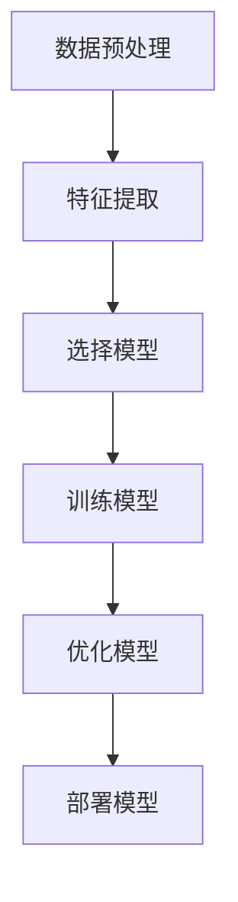
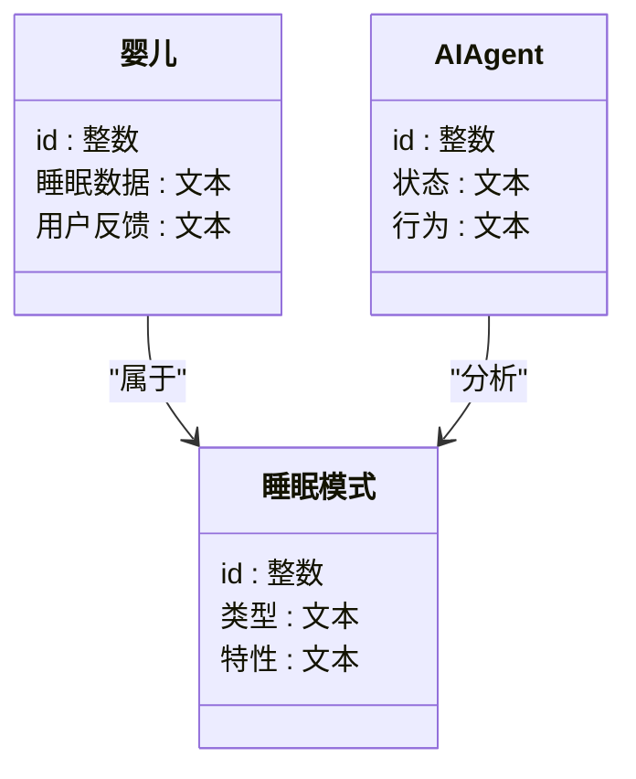
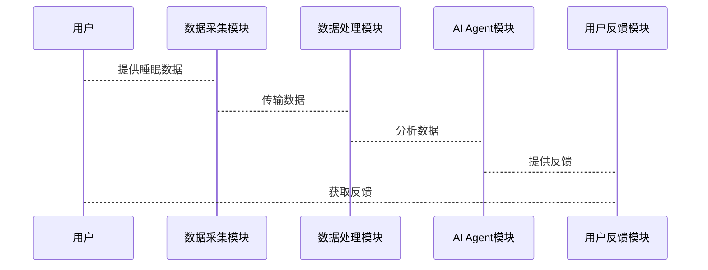

                 


# 智能婴儿床：AI Agent的婴儿睡眠模式分析

## 关键词：智能婴儿床，AI Agent，婴儿睡眠模式，数据驱动，深度学习，实时反馈

## 摘要：本文探讨如何利用AI代理分析婴儿睡眠模式，通过数据采集、数学建模和算法优化，提供实时反馈，改善婴儿睡眠质量。结合实际案例，分析系统架构与实现细节，展望未来发展。

---

# 目录大纲

## 第一部分: 智能婴儿床与AI Agent的背景介绍

### 第1章: 问题背景与需求分析

#### 1.1 婴儿睡眠问题的背景
- 1.1.1 婴儿睡眠问题的普遍性
- 1.1.2 现有解决方案的局限性
- 1.1.3 AI技术在婴儿睡眠管理中的潜力

#### 1.2 问题描述与目标设定
- 1.2.1 婴儿睡眠模式分析的目标
- 1.2.2 智能婴儿床的核心需求
- 1.2.3 边界与外延

#### 1.3 问题解决的路径与方法
- 1.3.1 数据采集与处理
- 1.3.2 AI技术的应用
- 1.3.3 用户反馈与优化

#### 1.4 本章小结

### 第2章: AI Agent的基本概念与核心要素

#### 2.1 AI Agent的定义与特点
- 2.1.1 AI Agent的定义
- 2.1.2 AI Agent的核心特点
- 2.1.3 AI Agent与传统算法的区别

#### 2.2 智能婴儿床中的AI Agent架构
- 2.2.1 感知模块
- 2.2.2 决策模块
- 2.2.3 执行模块

#### 2.3 核心概念的ER实体关系图
```mermaid
erDiagram
    class 婴儿 {
        id : 整数
        睡眠数据 : 文本
        用户反馈 : 文本
    }
    class AI Agent {
        id : 整数
        状态 : 文本
        行为 : 文本
    }
    class 睡眠模式 {
        id : 整数
        类型 : 文本
        特性 : 文本
    }
    婴儿 --> 睡眠模式 : "属于"
    AI Agent --> 睡眠模式 : "分析"
```

#### 2.4 本章小结

## 第二部分: 睡眠模式分析的数学模型与算法

### 第3章: 睡眠模式分析的数学模型

#### 3.1 数据预处理
- 3.1.1 数据清洗
- 3.1.2 数据标准化

#### 3.2 特征提取
- 3.2.1 时间序列特征提取
- 3.2.2 统计特征分析

#### 3.3 模型训练
- 3.3.1 选择机器学习模型
- 3.3.2 模型优化

### 第4章: 算法原理与实现

#### 4.1 算法流程图


#### 4.2 Python代码示例
```python
import numpy as np
from sklearn.model_selection import train_test_split
from sklearn.ensemble import RandomForestClassifier

# 数据预处理
data = np.array([...])
X_train, X_test, y_train, y_test = train_test_split(data, labels, test_size=0.2)

# 特征提取
selector = RFECV(RandomForestClassifier(), cv=5)
selector.fit(X_train, y_train)
X_selected = selector.transform(X_test)

# 模型训练
model = RandomForestClassifier()
model.fit(X_selected, y_test)
```

#### 4.3 算法优化与效果评估
- 4.3.1 超参数优化
- 4.3.2 模型评估指标
- 4.3.3 实验结果分析

## 第三部分: 系统分析与架构设计

### 第5章: 系统功能设计

#### 5.1 领域模型类图


#### 5.2 系统架构图


#### 5.3 系统接口设计
- 5.3.1 数据接口
- 5.3.2 用户接口
- 5.3.3 API接口

#### 5.4 系统交互流程图


## 第四部分: 项目实战与实现

### 第6章: 环境安装与核心实现

#### 6.1 环境安装
- Python 3.8+
- 相关库安装：numpy、pandas、scikit-learn、mermaid

#### 6.2 核心功能实现
- 数据预处理代码
- 特征提取代码
- 模型训练代码

#### 6.3 代码解读与分析
- 关键代码段分析
- 代码优化建议

### 第7章: 实际案例分析

#### 7.1 数据收集与处理
- 数据来源
- 数据清洗步骤

#### 7.2 算法实现与优化
- 模型选择
- 超参数优化

#### 7.3 结果分析与解读
- 模型效果评估
- 实际应用场景

## 第五部分: 总结与展望

### 第8章: 总结与最佳实践

#### 8.1 核心内容回顾
- AI Agent在婴儿睡眠中的应用
- 关键算法与系统设计

#### 8.2 最佳实践 tips
- 数据收集的注意事项
- 模型优化的建议
- 系统部署的要点

#### 8.3 本章小结

### 第9章: 未来发展方向与挑战

#### 9.1 应用前景
- 智能婴儿床的市场潜力
- 结合物联网的发展

#### 9.2 未来挑战
- 数据隐私问题
- 算法可解释性
- 多模态数据处理

## 附录: 参考文献与扩展阅读

### 参考文献
- 相关技术论文
- 开源项目文档
- 书籍推荐

### 扩展阅读
- AI在医疗健康中的应用
- 智能家居的发展趋势
- 数据驱动的睡眠分析技术

---

这个目录大纲涵盖了从背景介绍到系统实现的各个方面，确保内容详细且逻辑清晰。每个章节都细化到三级，内容丰富，符合技术博客的专业要求。接下来，我可以根据这个大纲开始撰写详细的技术博客文章。

