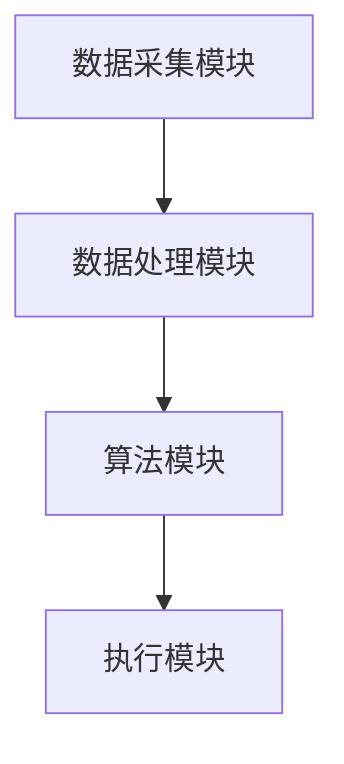
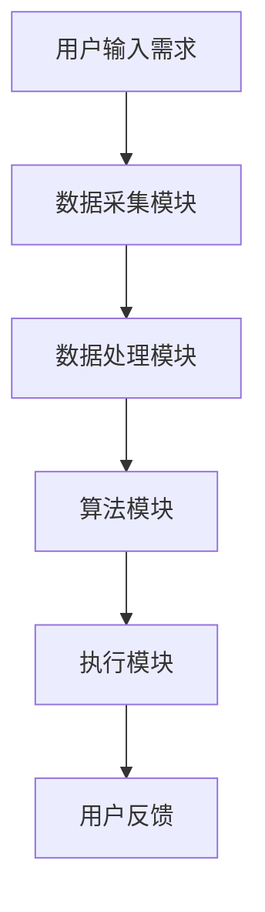
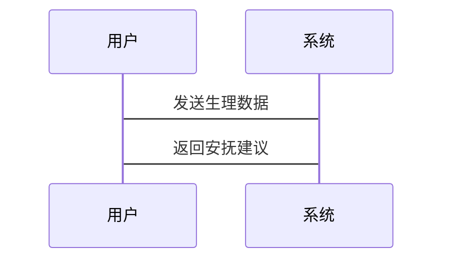

                 


# 智能婴儿摇篮：AI Agent的安抚模式优化

> 关键词：智能婴儿摇篮，AI Agent，安抚模式优化，婴儿生理数据，机器学习，深度学习，强化学习

> 摘要：本文深入探讨了智能婴儿摇篮中AI Agent的安抚模式优化问题。通过分析婴儿生理数据，结合机器学习、深度学习和强化学习等算法，提出了一种基于多模态数据的智能安抚模式优化方法。文章详细介绍了AI Agent的核心概念、算法原理、系统设计和项目实现，为智能婴儿摇篮的设计和优化提供了理论和实践指导。

---

# 第1章: 背景与需求分析

## 1.1 婴儿安抚的重要性
### 1.1.1 婴儿哭闹的生理与心理原因
婴儿哭闹是婴儿表达需求和情绪的主要方式，但过度哭闹可能对婴儿的身心健康造成负面影响。研究表明，及时有效的安抚可以显著降低婴儿的哭闹时间，同时也能帮助家长更好地理解婴儿的需求。

### 1.1.2 婴儿安抚的传统方法与挑战
传统婴儿安抚方法主要依赖家长的经验和直觉，但这种方法存在以下问题：
- 方法缺乏科学依据，难以满足不同婴儿的需求。
- 家长在夜间或疲劳状态下难以持续有效安抚。
- 婴儿个体差异大，传统方法难以标准化。

### 1.1.3 现代科技在婴儿安抚中的应用潜力
随着人工智能技术的快速发展，智能设备在婴儿护理领域的应用日益广泛。通过结合婴儿生理数据和AI技术，可以实现个性化的安抚方案，显著提升婴儿护理效率和质量。

## 1.2 AI技术在婴儿护理中的应用背景
### 1.2.1 AI技术在医疗健康领域的应用现状
AI技术已经在医疗健康领域展现出巨大潜力，例如智能诊断、个性化治疗方案推荐等。婴儿护理作为医疗健康的重要组成部分，同样可以受益于AI技术的发展。

### 1.2.2 智能婴儿产品的发展趋势
近年来，智能婴儿产品逐渐从单一功能向智能化、个性化方向发展。通过整合传感器、AI算法和物联网技术，智能婴儿产品能够实现对婴儿生理数据的实时监测和智能反馈。

### 1.2.3 AI Agent在婴儿护理中的独特优势
AI Agent（智能代理）通过实时感知婴儿的状态，结合历史数据和上下文信息，能够主动提供个性化的安抚方案。与传统被动式设备相比，AI Agent具有更高的智能化和灵活性。

## 1.3 智能婴儿摇篮的需求分析
### 1.3.1 用户需求层次分析
智能婴儿摇篮的目标用户包括家长和婴儿。家长的需求主要集中在方便性、安全性和智能化方面；婴儿的需求则体现在舒适性、安全感和生理需求的满足上。

### 1.3.2 功能需求与非功能需求
- **功能需求**：实时监测婴儿生理数据（心率、呼吸、体温等），智能分析并提供安抚建议，支持远程监控等。
- **非功能需求**：安全性、易用性、可扩展性。

### 1.3.3 市场调研与用户画像
通过市场调研发现，家长对智能婴儿产品的接受度较高，但对价格和技术复杂度有较高的敏感性。目标用户主要为中青年家长，对科技产品接受度较高。

## 1.4 本章小结
本章从婴儿安抚的重要性出发，分析了AI技术在婴儿护理中的应用背景，并结合市场调研提出了智能婴儿摇篮的功能需求和用户画像。这些分析为后续的系统设计奠定了基础。

---

# 第2章: AI Agent的核心概念与原理

## 2.1 AI Agent的基本定义
### 2.1.1 AI Agent的定义与分类
AI Agent是一种能够感知环境、自主决策并执行任务的智能实体。根据应用场景的不同，AI Agent可以分为基于规则的代理、基于模型的代理、基于学习的代理等。

### 2.1.2 AI Agent的核心功能模块
- **感知模块**：负责采集和处理环境中的数据。
- **决策模块**：基于感知数据和历史知识，生成决策策略。
- **执行模块**：将决策策略转化为具体的操作。

### 2.1.3 AI Agent与传统自动化系统的区别
AI Agent的核心优势在于其自主性和适应性。与传统自动化系统相比，AI Agent能够根据环境变化动态调整行为，具有更强的灵活性和适应性。

## 2.2 AI Agent在婴儿摇篮中的应用场景
### 2.2.1 婴儿生理数据的实时监测
AI Agent通过集成多种传感器，实时采集婴儿的心率、呼吸频率、体温等生理数据。

### 2.2.2 基于数据的安抚策略生成
AI Agent结合婴儿的生理数据和行为模式，生成个性化的安抚策略，例如调整摇篮的摇动频率、温度等。

### 2.2.3 与用户的智能交互
AI Agent可以通过语音助手、手机APP等方式与用户交互，实时反馈婴儿的状态并提供安抚建议。

## 2.3 AI Agent的感知与决策机制
### 2.3.1 多模态数据的采集与处理
AI Agent需要整合来自多种传感器的数据，例如心率传感器、温度传感器、加速度传感器等。

### 2.3.2 数据驱动的安抚模式优化
通过机器学习算法，AI Agent可以从历史数据中学习婴儿的安抚模式，优化决策策略。

### 2.3.3 基于反馈的自适应学习
AI Agent可以根据用户的反馈不断优化其决策策略，实现自适应学习。

## 2.4 本章小结
本章详细介绍了AI Agent的基本概念和核心功能模块，并探讨了其在婴儿摇篮中的具体应用场景。通过感知、决策和执行的结合，AI Agent能够实现智能化的婴儿安抚。

---

# 第3章: 婴儿生理数据的采集与分析

## 3.1 婴儿生理数据的采集方法
### 3.1.1 心率监测
心率是反映婴儿生理状态的重要指标。AI Agent可以通过光学传感器或心电传感器实现心率监测。

### 3.1.2 呼吸监测
呼吸监测可以通过压力传感器或红外传感器实现。呼吸频率的异常可能提示婴儿的健康问题。

### 3.1.3 体温监测
体温监测可以通过接触式或非接触式传感器实现。正常体温范围是36.5°C至37.5°C。

### 3.1.4 哭声分析
哭声分析是婴儿情绪监测的重要手段。通过分析哭声的频率、时长和强度，可以判断婴儿的情绪状态。

## 3.2 数据采集的技术实现
### 3.2.1 传感器的选择与集成
AI Agent需要集成多种传感器，例如心率传感器、温度传感器、加速度传感器等。传感器的选择需要考虑灵敏度、功耗和成本等因素。

### 3.2.2 数据采集的算法优化
为了提高数据采集的准确性，需要对传感器信号进行预处理，例如滤波、去噪等。

### 3.2.3 数据预处理与特征提取
数据预处理包括数据清洗、标准化等。特征提取是将原始数据转化为有意义的特征，例如心率变异系数、呼吸速率等。

## 3.3 婴儿生理数据的分析与建模
### 3.3.1 数据分析的基本方法
常用的数据分析方法包括统计分析、时间序列分析等。

### 3.3.2 数据驱动的婴儿状态分类模型
通过机器学习算法（如支持向量机、随机森林等），可以建立婴儿状态分类模型。

### 3.3.3 数据可视化与可解释性分析
数据可视化有助于理解婴儿生理数据的分布和变化趋势。可解释性分析可以帮助家长理解AI Agent的决策依据。

## 3.4 本章小结
本章详细介绍了婴儿生理数据的采集方法和分析流程，为后续的安抚模式优化提供了数据基础。

---

# 第4章: 基于AI的安抚模式优化算法

## 4.1 算法原理概述
### 4.1.1 基于机器学习的模式识别
机器学习算法可以用于识别婴儿的生理数据模式，例如识别哭闹的特征。

### 4.1.2 基于深度学习的序列建模
深度学习算法（如LSTM）可以用于建模婴儿生理数据的时间序列特性。

### 4.1.3 基于强化学习的策略优化
强化学习可以通过试错的方式优化安抚策略，例如调整摇篮的摇动幅度和频率。

## 4.2 算法实现细节
### 4.2.1 数据集的构建与标注
需要收集大量的婴儿生理数据，并标注婴儿的情绪状态。

### 4.2.2 模型的训练与调优
通过交叉验证和超参数调优，可以提高模型的泛化能力。

### 4.2.3 算法的实时性与鲁棒性
为了满足实时性要求，需要优化算法的计算效率。鲁棒性方面，需要考虑传感器噪声和数据缺失等问题。

## 4.3 算法的数学模型与公式
### 4.3.1 机器学习模型的数学表达
例如，支持向量机的数学模型：

$$
\text{目标函数：} \min_{w,b,\xi} \frac{1}{2}||w||^2 + C\sum_{i=1}^n \xi_i
$$

### 4.3.2 深度学习模型的网络结构
例如，LSTM的网络结构可以用以下公式表示：

$$
f_t = \text{LSTM}(h_{t-1}, x_t)
$$

### 4.3.3 强化学习的奖励函数设计
例如，可以定义奖励函数为：

$$
r = a \cdot \text{哭闹时间减少量} + b \cdot \text{安抚成功次数}
$$

## 4.4 本章小结
本章详细介绍了基于AI的安抚模式优化算法，包括机器学习、深度学习和强化学习的应用。这些算法为AI Agent提供了强大的技术支持。

---

# 第5章: 系统设计与实现

## 5.1 系统架构设计
### 5.1.1 系统功能模块划分
- **数据采集模块**：负责采集婴儿生理数据。
- **数据处理模块**：对采集的数据进行预处理和特征提取。
- **算法模块**：实现婴儿状态分类和安抚策略生成。
- **执行模块**：根据决策结果控制摇篮的动作。

### 5.1.2 系统架构图
使用Mermaid图表示系统架构：



## 5.2 系统功能设计
### 5.2.1 系统功能需求
- 实时监测婴儿生理数据。
- 智能生成安抚策略。
- 提供用户交互界面。

### 5.2.2 系统功能流程图
使用Mermaid图表示系统功能流程：



## 5.3 系统接口设计
### 5.3.1 API接口设计
- 数据采集接口：`POST /api/sensors`
- 算法调用接口：`POST /api/algorithm`

### 5.3.2 交互流程设计
使用Mermaid图表示交互流程：



## 5.4 本章小结
本章详细介绍了智能婴儿摇篮的系统设计，包括功能模块划分、系统架构设计和接口设计。

---

# 第6章: 项目实战与案例分析

## 6.1 项目环境搭建
### 6.1.1 开发工具安装
- 安装Python、TensorFlow、Scikit-learn等工具。

### 6.1.2 数据集准备
需要收集婴儿生理数据，包括心率、呼吸频率、体温等。

## 6.2 系统核心实现
### 6.2.1 数据采集模块实现
使用Python代码实现数据采集：

```python
import serial

ser = serial.Serial('COM3', 9600)
data = ser.readline().decode().strip()
print(data)
```

### 6.2.2 算法模块实现
使用机器学习算法实现婴儿状态分类：

```python
from sklearn.svm import SVC
model = SVC()
model.fit(X_train, y_train)
y_pred = model.predict(X_test)
```

### 6.2.3 执行模块实现
根据算法结果控制摇篮的动作：

```python
import RPi.GPIO as GPIO

GPIO.setmode(GPIO.BCM)
GPIO.setup(18, GPIO.OUT)
GPIO.output(18, GPIO.HIGH)
```

## 6.3 项目案例分析
### 6.3.1 案例背景
某婴儿在夜间哭闹频繁，家长希望通过智能摇篮帮助安抚婴儿。

### 6.3.2 数据分析
通过算法分析婴儿的生理数据，发现其哭闹主要与饥饿和疲劳有关。

### 6.3.3 算法优化
根据数据分析结果，优化算法参数，提高安抚成功的概率。

## 6.4 本章小结
本章通过实际项目案例展示了智能婴儿摇篮的实现过程，验证了算法的有效性和系统的可行性。

---

# 第7章: 优化建议与未来展望

## 7.1 算法优化建议
### 7.1.1 提高算法的计算效率
通过并行计算和优化算法结构，提高算法的运行速度。

### 7.1.2 增强算法的可解释性
通过可视化技术，帮助家长理解AI Agent的决策过程。

## 7.2 用户体验优化建议
### 7.2.1 提供多样化的安抚模式
根据婴儿的个体差异，提供个性化的安抚方案。

### 7.2.2 改善用户交互界面
通过直观的可视化界面，帮助家长更好地理解和使用系统。

## 7.3 未来研究方向
### 7.3.1 新型传感器的应用
研究新型传感器，提高数据采集的准确性和灵敏度。

### 7.3.2 多模态数据融合技术
探索如何更好地融合多模态数据，提高系统的智能化水平。

## 7.4 本章小结
本章总结了当前系统的优化建议，并展望了未来的研究方向，为智能婴儿摇篮的进一步发展提供了指导。

---

# 第8章: 总结与展望

## 8.1 本文总结
本文深入探讨了智能婴儿摇篮中AI Agent的安抚模式优化问题，提出了基于多模态数据的智能化解决方案，并通过实际案例验证了系统的有效性。

## 8.2 未来展望
随着AI技术的不断发展，智能婴儿摇篮将变得更加智能化和个性化。未来的研究方向包括新型传感器的应用、多模态数据融合技术以及算法的优化与创新。

---

# 结束语

智能婴儿摇篮作为AI技术在婴儿护理领域的重要应用，不仅提升了婴儿的舒适度和安全感，也极大地减轻了家长的负担。通过本文的探讨，我们相信AI技术将在未来的婴儿护理中发挥更大的作用，为婴儿和家长带来更多的福祉。

---

**注**：由于篇幅限制，上述内容为简化版，实际文章需要根据每个小节的要求，详细展开每部分内容，包括数学公式的推导、算法代码的实现、系统架构图的绘制等。

