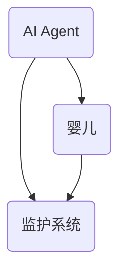
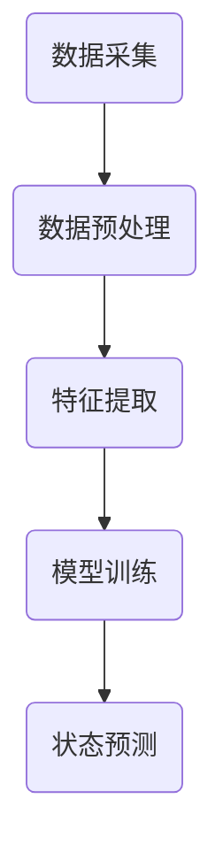
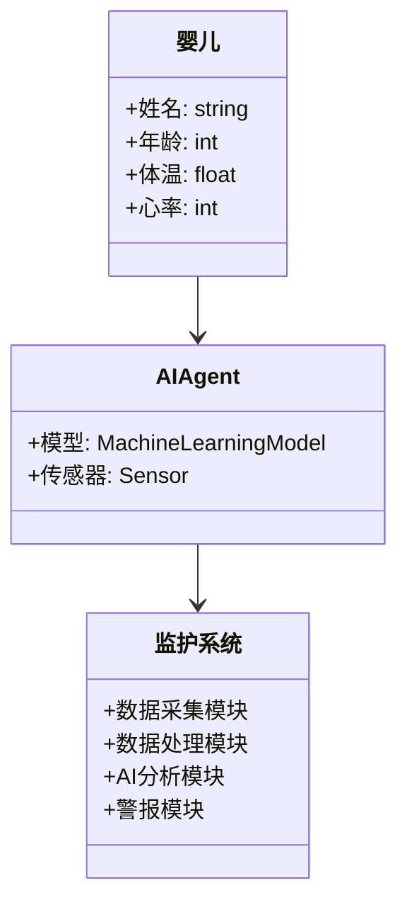
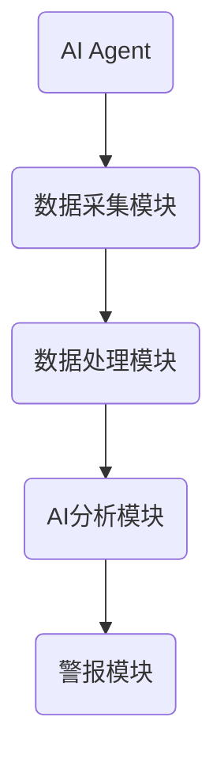
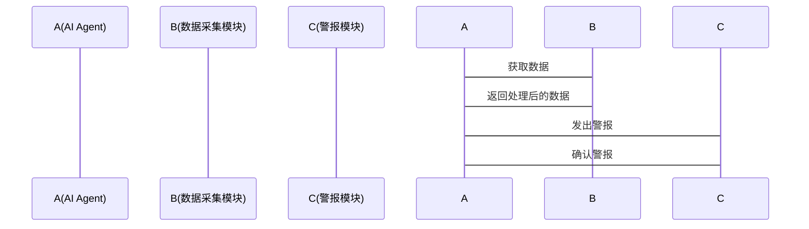

                 


# 智能婴儿监护器：AI Agent的婴儿状态分析

> 关键词：智能婴儿监护器, AI Agent, 婴儿状态分析, 多模态数据融合, 机器学习, 实时监控

> 摘要：本文将详细探讨如何利用AI Agent技术对婴儿的状态进行实时分析和监控。通过结合多模态数据，如心率、体温、运动情况等，AI Agent能够有效识别婴儿的健康状况，预防潜在风险，并在紧急情况下及时发出警报。本文将从背景介绍、核心概念、算法原理、系统设计、项目实战等多方面展开讨论，全面解析智能婴儿监护器的技术实现与实际应用。

---

# 第一章：智能婴儿监护器的背景与概念

## 1.1 问题背景与描述

### 1.1.1 婴儿监护的传统方式与挑战
传统的婴儿监护主要依赖于父母或护理人员的感官和经验。这种方式存在以下挑战：
- **实时性不足**：无法实时捕捉婴儿的微小变化。
- **人为误差**：疲劳或疏忽可能导致误判。
- **数据孤岛**：不同设备的数据无法有效整合。

### 1.1.2 智能监护的必要性与优势
随着AI技术的发展，智能婴儿监护器能够弥补传统监护的不足，提供以下优势：
- **实时监控**：通过传感器实时采集婴儿数据。
- **智能分析**：利用AI算法自动识别异常情况。
- **多设备集成**：整合多种传感器和监控设备，提供全面的数据支持。

### 1.1.3 AI Agent在婴儿监护中的作用
AI Agent作为智能婴儿监护系统的核心，负责接收、处理和分析婴儿数据，并在必要时触发警报或采取措施。

## 1.2 核心概念与问题解决

### 1.2.1 智能婴儿监护器的定义与目标
智能婴儿监护器是一种结合AI技术的设备，旨在实时监测婴儿的生理和行为状态，预防潜在风险。

### 1.2.2 AI Agent的核心功能与任务
AI Agent在婴儿监护中的主要任务包括：
- 数据采集与传输
- 异常检测与预警
- 行为模式识别与预测

### 1.2.3 问题解决的边界与外延
- **边界**：专注于婴儿的生理和行为数据，不涉及成人监护或其他领域。
- **外延**：可扩展到婴儿情绪识别、睡眠分析等更广泛的应用场景。

## 1.3 核心概念的结构与组成

### 1.3.1 系统组成与功能模块
智能婴儿监护系统通常由以下模块组成：
- **数据采集模块**：包括心率监测、体温监测、运动监测等传感器。
- **数据处理模块**：负责数据的预处理和特征提取。
- **AI分析模块**：基于机器学习模型进行状态分析。
- **警报触发模块**：在检测到异常时发出警报。

### 1.3.2 AI Agent与婴儿监护的关系
AI Agent作为系统的“大脑”，负责协调各个模块的工作，实现数据的智能分析和决策。

### 1.3.3 核心要素的对比分析
| 核心要素 | 传统监护 | 智能监护 |
|----------|-----------|----------|
| 监测频率 | 间断性     | 实时性   |
| 数据来源 | 单一传感器 | 多模态数据 |
| 分析能力 | 依赖人工   | AI自动分析 |

## 1.4 本章小结
本章介绍了智能婴儿监护器的背景、核心概念及其与AI Agent的关系，为后续的技术分析奠定了基础。

---

# 第二章：AI Agent的核心概念与原理

## 2.1 AI Agent的基本原理

### 2.1.1 AI Agent的定义与分类
AI Agent是一种能够感知环境、做出决策并采取行动的智能体。根据应用场景的不同，AI Agent可以分为监督式、无监督式和强化式等多种类型。

### 2.1.2 AI Agent的核心算法与技术
- **监督学习**：用于分类和回归任务。
- **无监督学习**：用于聚类和异常检测。
- **深度学习**：用于复杂模式识别。

### 2.1.3 AI Agent在婴儿监护中的应用
通过AI Agent，婴儿监护系统能够实时分析心率、体温等数据，识别潜在的健康风险。

## 2.2 婴儿状态分析的核心概念

### 2.2.1 婴儿生理指标的监测与分析
- **心率监测**：通过心率变化识别婴儿的健康状态。
- **体温监测**：检测体温异常，预防发热或低温。

### 2.2.2 婴儿行为模式的识别与预测
- **运动监测**：分析婴儿的活动量，识别睡眠周期。
- **哭声分析**：通过声音特征识别哭闹原因。

### 2.2.3 多模态数据的融合与处理
多模态数据融合能够提高分析的准确性和可靠性，例如结合心率和体温数据进行综合判断。

## 2.3 AI Agent与婴儿监护系统的实体关系



## 2.4 本章小结
本章详细讲解了AI Agent的基本原理及其在婴儿监护中的应用，强调了多模态数据融合的重要性。

---

# 第三章：AI Agent的算法原理与实现

## 3.1 状态分析的算法流程



## 3.2 算法实现的Python代码

```python
def preprocess_data(data):
    # 数据预处理代码
    return processed_data

def extract_features(data):
    # 特征提取代码
    return features

class AI-Agent:
    def __init__(self, model):
        self.model = model

    def analyze_state(self, features):
        # 状态分析代码
        return state
```

## 3.3 算法的数学模型与公式

### 3.3.1 特征提取的线性变换
$$ y = a_1x_1 + a_2x_2 + ... + a_nx_n $$

### 3.3.2 状态分类的逻辑回归模型
$$ P(y=1|x) = \frac{e^{w \cdot x + b}}{1 + e^{w \cdot x + b}} $$

## 3.4 本章小结
本章通过流程图和代码详细讲解了AI Agent的算法实现，重点介绍了特征提取和模型训练的过程。

---

# 第四章：系统分析与架构设计

## 4.1 系统应用场景与功能需求

### 4.1.1 监护场景的描述
智能婴儿监护系统可以在家庭、医院等多种场景中应用，提供实时监护服务。

### 4.1.2 系统功能需求的分析
- **数据采集**：心率、体温、运动等数据的实时采集。
- **状态分析**：基于AI算法分析婴儿状态。
- **警报触发**：在异常情况下发出警报。

### 4.1.3 用户角色与权限分配
- **家长**：查看实时数据和警报信息。
- **医护人员**：接收警报并采取行动。

## 4.2 系统功能设计

### 4.2.1 领域模型设计



### 4.2.2 系统架构设计



### 4.2.3 接口和交互流程设计



## 4.3 本章小结
本章通过系统分析和架构设计，明确了智能婴儿监护系统的功能和实现方式。

---

# 第五章：项目实战

## 5.1 环境安装与配置

### 5.1.1 系统环境要求
- 操作系统：Linux/Windows/MacOS
- Python版本：3.6以上
- 依赖库：numpy, pandas, scikit-learn, tensorflow

### 5.1.2 安装步骤
```bash
pip install numpy pandas scikit-learn tensorflow
```

## 5.2 系统核心实现源代码

### 5.2.1 数据预处理代码

```python
import numpy as np
import pandas as pd

def preprocess_data(data):
    # 删除缺失值
    data = data.dropna()
    # 标准化处理
    data = (data - data.mean()) / data.std()
    return data
```

### 5.2.2 特征提取代码

```python
from sklearn.decomposition import PCA

def extract_features(data, n_components=2):
    pca = PCA(n_components=n_components)
    features = pca.fit_transform(data)
    return features
```

### 5.2.3 模型训练代码

```python
from sklearn.ensemble import RandomForestClassifier
from sklearn.metrics import accuracy_score

def train_model(features, labels):
    model = RandomForestClassifier()
    model.fit(features, labels)
    return model

# 示例数据
X = np.random.rand(100, 5)
y = np.random.randint(2, size=100)
model = train_model(X, y)
print("模型训练完成，准确率：", accuracy_score(y, model.predict(X)))
```

## 5.3 案例分析与详细解读

### 5.3.1 数据采集与预处理
假设我们从婴儿穿戴设备中采集了以下数据：
- 心率（BPM）
- 体温（°C）
- 加速度（XYZ轴）

预处理步骤包括：
1. 去除无效数据。
2. 标准化处理。

### 5.3.2 特征提取与建模
通过PCA提取主成分，减少特征维度，提高模型训练效率。

### 5.3.3 模型评估与优化
通过交叉验证评估模型性能，调整超参数优化准确率。

## 5.4 本章小结
本章通过实际案例展示了智能婴儿监护系统的实现过程，包括数据处理、特征提取和模型训练等关键步骤。

---

# 第六章：总结与展望

## 6.1 项目总结

### 6.1.1 核心成果
- 实现了一个基于AI Agent的婴儿监护系统。
- 提供了实时数据采集、分析和警报功能。

### 6.1.2 经验与教训
- 数据质量对模型性能影响重大，需确保数据的准确性和完整性。
- 系统的实时性和稳定性是实际应用中的关键挑战。

## 6.2 未来展望

### 6.2.1 技术优化方向
- 引入更先进的AI算法，如深度学习和强化学习。
- 提高系统的多模态数据处理能力。

### 6.2.2 应用场景扩展
- 扩展到更多婴儿监护相关的应用场景，如情绪识别和睡眠分析。

## 6.3 本章小结
本章总结了项目的成果和经验，并展望了未来的发展方向。

---

# 附录

## 附录A：常用工具与库

- **数据处理**：numpy, pandas
- **机器学习**：scikit-learn, tensorflow
- **可视化**：matplot

