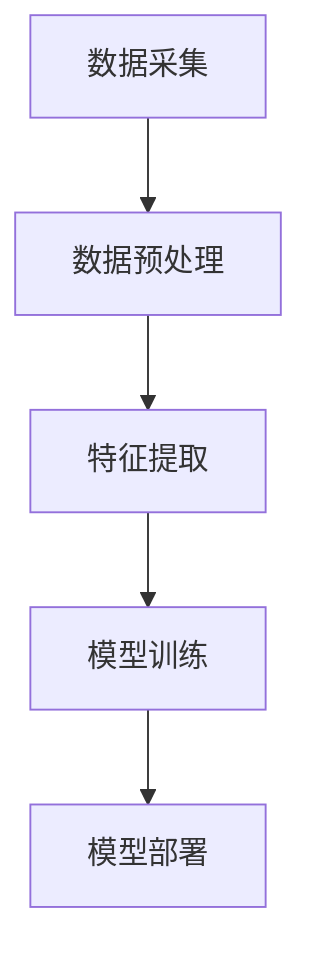
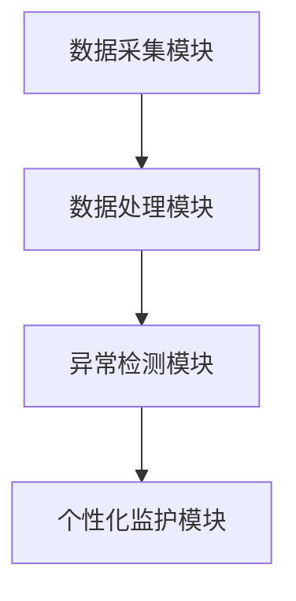

                 


# 智能婴儿监护器：AI Agent的早期发展追踪

> 关键词：智能婴儿监护器, AI Agent, 早期发展追踪, 多模态数据, 个性化监护方案, 异常检测

> 摘要：智能婴儿监护器通过AI Agent技术，实现对婴儿生理数据的实时采集、分析和异常检测，提供个性化的监护方案。本文系统阐述了AI Agent在婴儿监护中的核心概念、算法原理、系统架构，并通过实战案例分析，深入探讨了智能婴儿监护器的实现细节与实际应用。

---

# 第1章: 智能婴儿监护器的背景与需求

## 1.1 婴儿监护的现状与挑战

### 1.1.1 婴儿监护的传统方式
传统婴儿监护主要依赖父母或护理人员的感官和经验，存在效率低、误判率高、实时性差等问题。

### 1.1.2 现代婴儿监护的主要问题
随着婴儿健康问题的复杂化，传统监护方式难以满足需求，亟需智能化解决方案。

### 1.1.3 AI技术在婴儿监护中的潜力
AI技术可以通过实时数据采集、智能分析和决策，显著提升婴儿监护的效率和准确性。

## 1.2 AI Agent的核心概念

### 1.2.1 什么是AI Agent
AI Agent是一种能够感知环境、做出决策并采取行动的智能实体。

### 1.2.2 AI Agent的基本属性与特征
- **自主性**：无需外部干预，自主完成任务。
- **反应性**：能实时感知环境变化并做出反应。
- **主动性**：主动采取行动以实现目标。
- **社交能力**：能与其他系统或人类交互协作。

### 1.2.3 AI Agent在婴儿监护中的应用
AI Agent可以实时监测婴儿的生理数据，识别异常情况并发出警报。

## 1.3 智能婴儿监护器的定义与目标

### 1.3.1 智能婴儿监护器的定义
智能婴儿监护器是一种结合AI Agent技术的设备，用于实时监测婴儿的生理数据并提供智能化的监护服务。

### 1.3.2 监护的主要目标
- 实时监测婴儿的体温、心率、呼吸频率等生理指标。
- 识别潜在的健康问题并及时发出警报。
- 提供个性化的监护方案。

### 1.3.3 监护系统的边界与外延
- **边界**：仅关注婴儿的生理数据和健康状况。
- **外延**：可扩展至婴儿的行为分析、情绪识别等领域。

## 1.4 本章小结
本章介绍了智能婴儿监护器的背景、AI Agent的核心概念以及监护系统的定义和目标，为后续章节奠定了基础。

---

# 第2章: AI Agent与婴儿监护的核心概念

## 2.1 AI Agent的基本原理

### 2.1.1 感知模块
AI Agent通过传感器或其他数据源感知环境。

### 2.1.2 决策模块
基于感知数据，AI Agent利用算法做出决策。

### 2.1.3 执行模块
根据决策结果，AI Agent采取行动。

## 2.2 婴儿监护的核心要素

### 2.2.1 婴儿生理数据采集
通过传感器采集婴儿的体温、心率等数据。

### 2.2.2 数据分析与异常检测
利用算法分析数据，识别异常情况。

### 2.2.3 个性化监护方案
根据婴儿的个体差异，制定个性化的监护计划。

## 2.3 AI Agent与婴儿监护的关联

### 2.3.1 数据流分析
AI Agent实时接收并处理婴儿的生理数据。

### 2.3.2 智能决策机制
AI Agent基于历史数据和实时数据，做出最优决策。

### 2.3.3 人机交互方式
AI Agent通过人机交互界面与用户进行信息传递。

## 2.4 核心概念对比分析

### 2.4.1 AI Agent与传统传感器对比
| 特性         | AI Agent                     | 传统传感器                   |
|--------------|------------------------------|------------------------------|
| 功能         | 实时感知、智能分析、自主决策 | 数据采集                      |
| 优势         | 高效性、准确性、主动性       | 成本低、简单易用               |

### 2.4.2 婴儿监护与其他健康监测系统的区别
- 婴儿监护专注于婴儿的生理数据和健康状况。
- 其他系统可能关注更广泛的人群或疾病。

### 2.4.3 系统架构的优缺点分析
- **优点**：模块化设计，便于扩展和维护。
- **缺点**：初期开发成本较高，需要复杂的数据处理。

## 2.5 本章小结
本章详细讲解了AI Agent的基本原理及其在婴儿监护中的应用，分析了系统架构的优缺点。

---

# 第3章: AI Agent在婴儿监护中的算法原理

## 3.1 数据采集与预处理

### 3.1.1 多模态数据采集
- 采集婴儿的体温、心率、呼吸频率等多模态数据。

### 3.1.2 数据清洗与标准化
- 清洗噪声数据，标准化数据格式。

### 3.1.3 数据特征提取
- 提取关键特征，如心率变异性的分析。

## 3.2 异常检测算法

### 3.2.1 基于机器学习的异常检测
- 使用支持向量机（SVM）或随机森林（RF）进行异常检测。

### 3.2.2 基于深度学习的异常检测
- 使用LSTM网络捕捉时间序列数据中的异常模式。

### 3.2.3 混合模型的应用
- 结合传统机器学习和深度学习的优势，构建混合模型。

## 3.3 个性化监护方案生成

### 3.3.1 基于规则的决策
- 根据预设规则进行简单决策。

### 3.3.2 基于机器学习的个性化推荐
- 使用协同过滤或聚类算法推荐个性化监护方案。

### 3.3.3 动态调整机制
- 根据实时数据动态调整监护方案。

## 3.4 算法实现与优化

### 3.4.1 算法实现流程


### 3.4.2 算法优化策略
- 参数调优、模型压缩、并行计算等。

## 3.5 本章小结
本章详细讲解了AI Agent在婴儿监护中的算法实现和优化策略。

---

# 第4章: 智能婴儿监护系统的架构设计

## 4.1 系统整体架构

### 4.1.1 分层架构设计
- 数据采集层、数据处理层、应用层。

### 4.1.2 微服务架构设计
- 数据采集服务、数据处理服务、用户界面服务。

### 4.1.3 可扩展性设计
- 支持模块化扩展和功能升级。

## 4.2 核心模块设计

### 4.2.1 数据采集模块
- 通过传感器采集婴儿的生理数据。

### 4.2.2 数据分析模块
- 对数据进行实时分析和异常检测。

### 4.2.3 个性化监护模块
- 根据分析结果制定个性化监护方案。

## 4.3 系统架构图



## 4.4 本章小结
本章详细讲解了智能婴儿监护系统的架构设计和各模块的功能。

---

# 第5章: 项目实战

## 5.1 环境搭建

### 5.1.1 开发工具安装
- 安装Python、TensorFlow、Keras等工具。

### 5.1.2 数据集准备
- 下载或采集婴儿生理数据。

## 5.2 核心代码实现

### 5.2.1 数据采集与预处理
```python
import numpy as np
import pandas as pd

# 数据采集
data = pd.read_csv('baby_data.csv')

# 数据清洗
data.dropna(inplace=True)

# 特征提取
features = data[['heart_rate', 'temperature']]
```

### 5.2.2 异常检测算法实现
```python
from sklearn.

