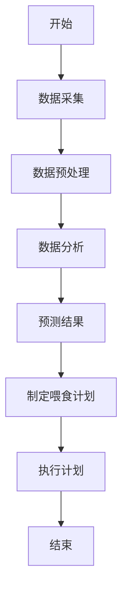
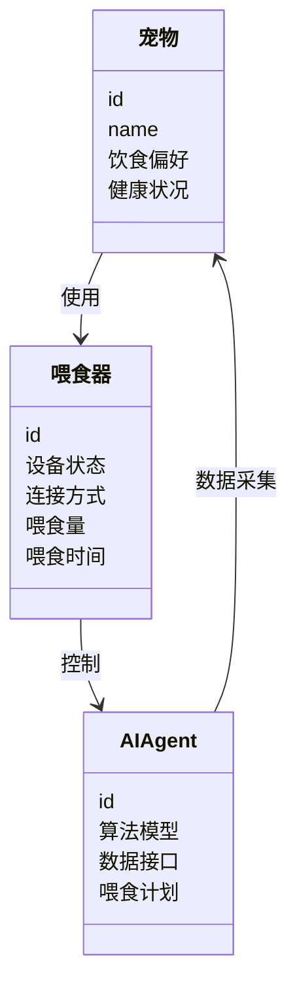
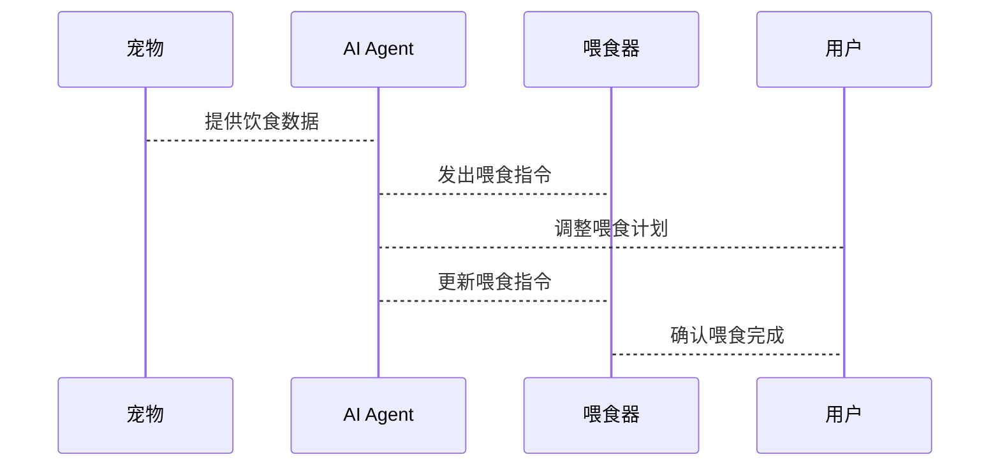

                 


# 智能宠物喂食器：AI Agent的宠物饮食管理

## 关键词：
智能宠物喂食器, AI Agent, 物联网技术, 算法原理, 系统架构设计, 项目实战

## 摘要：
本文详细介绍了一种基于AI Agent的智能宠物喂食器系统，从问题背景到系统设计，再到实际实现，全面阐述了如何利用AI技术和物联网技术实现宠物的智能化喂食管理。文章通过分析核心概念、算法原理、系统架构、项目实战和最佳实践，为读者提供了一套完整的解决方案。

---

## 第一部分: 背景介绍

### 第1章: 智能宠物喂食器的背景与问题分析

#### 1.1 问题背景
- **1.1.1 宠物喂食问题的现状**
  - 宠物喂食管理的痛点：传统喂食器的功能单一，无法满足个性化需求。
  - 宠物主人的喂食管理难题：喂食时间不规律、喂食量不科学、缺乏健康数据分析。
  - 宠物健康问题的复杂性：不同宠物有不同的饮食需求，健康问题与饮食密切相关。

- **1.1.2 AI Agent在宠物喂食管理中的潜力**
  - AI Agent的核心优势：实时数据分析、个性化推荐、远程控制。
  - AI Agent如何解决喂食问题：通过数据分析制定科学喂食计划，实时监控宠物健康状况，自动调整喂食策略。

- **1.1.3 智能喂食器的市场需求**
  - 市场需求增长：宠物数量增加，宠物主人对智能化设备的需求上升。
  - 技术进步推动：物联网和AI技术的发展为智能喂食器提供了技术支持。
  - 用户痛点驱动：宠物主人希望简化喂食管理，提升宠物健康。

#### 1.2 问题描述
- **1.2.1 宠物喂食管理的核心问题**
  - 喂食时间不规律：可能导致宠物肥胖或营养不良。
  - 喂食量不科学：不同宠物有不同的饮食需求，传统喂食器无法满足个性化需求。
  - 健康数据缺乏：无法根据宠物的健康状况调整喂食计划。

- **1.2.2 现有喂食器的局限性**
  - 功能单一：只能设置固定喂食时间，无法根据宠物健康状况调整。
  - 缺乏数据分析能力：无法提供科学的喂食建议。
  - 远程控制能力有限：无法通过手机或其他设备远程调整喂食计划。

- **1.2.3 AI Agent如何解决喂食管理问题**
  - 实时数据分析：通过AI算法分析宠物的健康数据，制定科学的喂食计划。
  - 个性化推荐：根据宠物的饮食偏好和健康状况，推荐合适的喂食时间和数量。
  - 远程控制：通过手机或其他设备远程控制喂食器，实时调整喂食计划。

#### 1.3 问题解决
- **1.3.1 AI Agent在宠物喂食管理中的作用**
  - 数据采集：通过传感器采集宠物的饮食数据。
  - 数据分析：利用AI算法分析数据，制定科学的喂食计划。
  - 自动控制：根据分析结果，自动调整喂食器的工作状态。

- **1.3.2 智能宠物喂食器的解决方案框架**
  - 系统架构：包括传感器、AI算法、物联网设备和用户界面。
  - 核心功能：数据采集、数据分析、自动控制、用户交互。

- **1.3.3 系统设计的目标与关键指标**
  - 目标：实现智能化、个性化、远程化的宠物喂食管理。
  - 关键指标：喂食准确性、数据处理速度、用户体验。

#### 1.4 边界与外延
- **1.4.1 系统的边界定义**
  - 系统的输入：宠物的饮食数据、用户输入的喂食计划。
  - 系统的输出：喂食时间、喂食量、健康建议。

- **1.4.2 系统的外延与扩展可能性**
  - 系统的扩展：增加更多的传感器，如宠物活动量传感器，进一步优化喂食计划。
  - 系统的集成：与其他智能设备（如智能门禁、智能灯泡）联动，打造智能家居生态系统。

- **1.4.3 与其他智能设备的协同工作**
  - 与智能门禁联动：当宠物需要喂食时，自动开门让宠物进入喂食区域。
  - 与智能灯泡联动：在喂食时间开启灯光，提醒宠物进食。

#### 1.5 概念结构与核心要素
- **1.5.1 系统的核心要素组成**
  - 传感器：采集宠物的饮食数据。
  - AI算法：分析数据，制定喂食计划。
  - 物联网设备：执行喂食计划，实现远程控制。
  - 用户界面：展示喂食计划和健康建议，用户可以通过界面调整喂食计划。

- **1.5.2 各要素之间的关系**
  - 传感器采集数据，传输到AI算法进行分析，生成喂食指令，物联网设备执行指令，用户通过界面查看数据和调整计划。

- **1.5.3 系统的整体架构**
  - 分层架构：数据采集层、数据处理层、控制层、用户界面层。

---

## 第二部分: 核心概念与联系

### 第2章: 核心概念与联系

#### 2.1 AI Agent的核心原理
- **2.1.1 AI Agent的基本概念**
  - AI Agent：一种能够感知环境、自主决策、执行任务的智能体。
  - 核心功能：数据采集、数据分析、决策制定、执行任务。

- **2.1.2 AI Agent的核心算法**
  - 机器学习算法：用于数据分析和预测。
  - 规划算法：用于制定喂食计划。
  - 自然语言处理：用于解析用户的指令。

- **2.1.3 AI Agent在宠物喂食管理中的具体应用**
  - 数据分析：分析宠物的饮食数据，制定科学的喂食计划。
  - 自动控制：根据分析结果，自动调整喂食器的工作状态。
  - 用户交互：通过自然语言处理技术，与用户进行交流，理解用户的喂食需求。

#### 2.2 物联网技术在智能喂食器中的应用
- **2.2.1 物联网技术的基本原理**
  - 物联网：通过传感器、通信技术、云端计算实现设备的智能化管理。
  - 核心组件：传感器、通信模块、云端计算、用户界面。

- **2.2.2 物联网在智能喂食器中的具体实现**
  - 传感器：采集宠物的饮食数据。
  - 通信模块：将数据传输到云端，或者接收用户的指令。
  - 云端计算：处理数据，制定喂食计划。
  - 用户界面：展示数据和喂食计划，用户可以通过界面调整喂食器的工作状态。

- **2.2.3 物联网与AI Agent的结合**
  - 物联网设备采集数据，AI Agent分析数据，制定喂食计划，物联网设备执行计划。

#### 2.3 核心概念的ER实体关系图
```mermaid
er
    entity 宠物 {
        id
        name
        饮食偏好
    }
    entity 喂食器 {
        id
        设备状态
        连接方式
    }
    entity AI Agent {
        id
        算法模型
        数据接口
    }
    宠物 -- 喂食器: 使用
    喂食器 -- AI Agent: 控制
    AI Agent -- 宠物: 数据采集
```

---

## 第三部分: 算法原理讲解

### 第3章: 算法原理讲解

#### 3.1 算法原理概述
- **3.1.1 AI Agent的核心算法**
  - 机器学习算法：用于数据分析和预测。
  - 规划算法：用于制定喂食计划。
  - 自然语言处理：用于解析用户的指令。

- **3.1.2 算法的基本原理**
  - 机器学习算法：通过训练数据，学习宠物的饮食习惯和健康状况，预测合适的喂食时间和数量。
  - 规划算法：根据预测结果，制定喂食计划。
  - 自然语言处理：解析用户的指令，生成相应的喂食指令。

- **3.1.3 算法的实现步骤**
  1. 数据采集：通过传感器采集宠物的饮食数据。
  2. 数据预处理：清洗数据，提取有用的信息。
  3. 数据分析：利用机器学习算法，分析数据，预测合适的喂食时间和数量。
  4. 喂食计划制定：根据预测结果，制定喂食计划。
  5. 执行计划：通过物联网设备，执行喂食计划。

#### 3.2 算法流程图


#### 3.3 算法的数学模型和公式
- **3.3.1 数据分析模型**
  - 线性回归模型：用于预测喂食量。
    $$ y = \beta_0 + \beta_1 x + \epsilon $$
    其中，y是喂食量，x是时间，β₀和β₁是回归系数，ε是误差项。

- **3.3.2 数据分析算法**
  - K近邻算法：用于分类宠物的健康状况。
    $$ 根据距离最近的K个样本，进行投票分类 $$

- **3.3.3 规划算法**
  - Dijkstra算法：用于路径规划，确保喂食计划的最优性。
    $$ 算法步骤：
    1. 初始化优先队列，将起点加入队列。
    2. 取出队列中距离最短的节点，标记为已访问。
    3. 更新与该节点相邻的节点的距离。
    4. 重复步骤2和3，直到队列为空。 $$

---

## 第四部分: 系统分析与架构设计

### 第4章: 系统分析与架构设计

#### 4.1 项目介绍
- **4.1.1 项目目标**
  - 实现智能化、个性化、远程化的宠物喂食管理。
  - 提供科学的喂食建议，提升宠物健康。

- **4.1.2 项目范围**
  - 系统包括传感器、AI算法、物联网设备和用户界面。
  - 系统支持远程控制，用户可以通过手机或其他设备调整喂食计划。

#### 4.2 系统功能设计
- **4.2.1 领域模型**


- **4.2.2 系统架构设计**


- **4.2.3 接口设计**
  - 数据接口：AI Agent与喂食器之间的数据传输接口。
  - 用户接口：用户通过手机或其他设备与系统交互的接口。

- **4.2.4 交互序列图**


---

## 第五部分: 项目实战

### 第5章: 项目实战

#### 5.1 环境安装
- **5.1.1 开发环境**
  - Python 3.8+
  - AI框架：TensorFlow或PyTorch
  - 物联网开发平台：AWS IoT或阿里云IoT

#### 5.2 核心代码实现
- **5.2.1 数据采集代码**
```python
import serial

ser = serial.Serial('COM3', 9600)
data = ser.readline().decode().strip()
print(data)
```

- **5.2.2 数据分析代码**
```python
import pandas as pd
from sklearn.linear_model import LinearRegression

# 数据预处理
data = pd.read_csv('feeding_data.csv')
X = data[['time']]
y = data['amount']

# 训练模型
model = LinearRegression()
model.fit(X, y)

# 预测喂食量
new_time = [[10]]
predicted_amount = model.predict(new_time)
print(predicted_amount)
```

- **5.2.3 系统控制代码**
```python
import requests

url = 'http://localhost:8080/feeding'
payload = {'amount': predicted_amount[0], 'time': new_time[0]}
response = requests.post(url, json=payload)
print(response.text)
```

#### 5.3 代码解读与分析
- **5.3.1 数据采集代码**
  - 使用串口通信，读取喂食器的数据。
  - 数据包括喂食时间、喂食量、设备状态等。

- **5.3.2 数据分析代码**
  - 使用线性回归模型，预测喂食量。
  - 根据时间变量，预测合适的喂食量。

- **5.3.3 系统控制代码**
  - 通过HTTP POST请求，将预测的喂食量发送到喂食器。
  - 系统根据预测结果，调整喂食器的工作状态。

#### 5.4 实际案例分析
- **5.4.1 案例背景**
  - 宠物：一只成年猫，体重4kg，每天需要喂食两次，每次50g。

- **5.4.2 数据分析**
  - 数据采集：记录宠物的饮食数据，包括喂食时间、喂食量、活动量等。
  - 数据分析：使用线性回归模型，预测合适的喂食量。

- **5.4.3 系统控制**
  - 根据预测结果，自动调整喂食器的工作状态，确保宠物按时按量进食。

#### 5.5 项目总结
- **5.5.1 项目成果**
  - 成功实现智能化、个性化、远程化的宠物喂食管理。
  - 提供科学的喂食建议，提升宠物健康。

- **5.5.2 项目经验**
  - 数据采集是关键，需要确保数据的准确性和完整性。
  - 算法选择要根据实际需求，线性回归模型适用于简单的预测任务。
  - 系统设计要注重模块化，方便后续的扩展和维护。

---

## 第六部分: 最佳实践

### 第6章: 最佳实践

#### 6.1 小结
- **系统设计**
  - 采用分层架构，确保系统的可扩展性和可维护性。
  - 各模块之间通过标准接口进行通信，方便后续的开发和维护。

#### 6.2 注意事项
- **数据安全**
  - 确保宠物数据的安全，防止数据泄露。
  - 采用加密技术，保护用户的隐私。

- **系统稳定性**
  - 系统要具备容错能力，确保在异常情况下能够正常运行。
  - 定期进行系统维护，防止设备故障。

#### 6.3 拓展阅读
- **推荐书籍**
  - 《机器学习实战》
  - 《物联网开发入门与实战》
  - 《AI Agent原理与应用》

- **推荐博客**
  - TensorFlow中文社区
  - 阿里云IoT开发博客
  - 知乎：人工智能专栏

---

## 总结

本文详细介绍了基于AI Agent的智能宠物喂食器系统，从问题背景到系统设计，再到实际实现，全面阐述了如何利用AI技术和物联网技术实现宠物的智能化喂食管理。通过本文的学习，读者可以掌握系统的整体架构、核心算法和实现细节，为后续的开发和研究提供参考。

