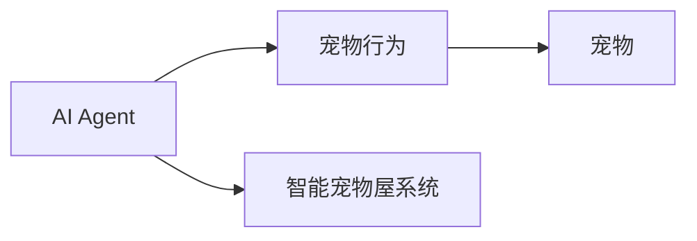
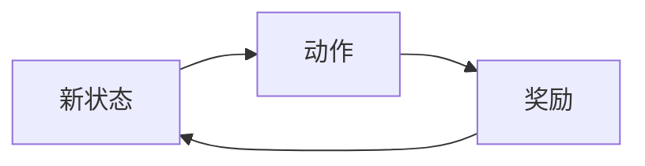
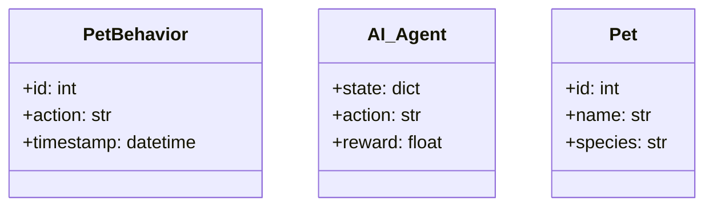
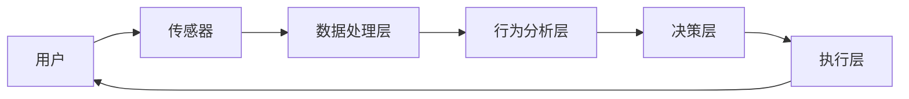
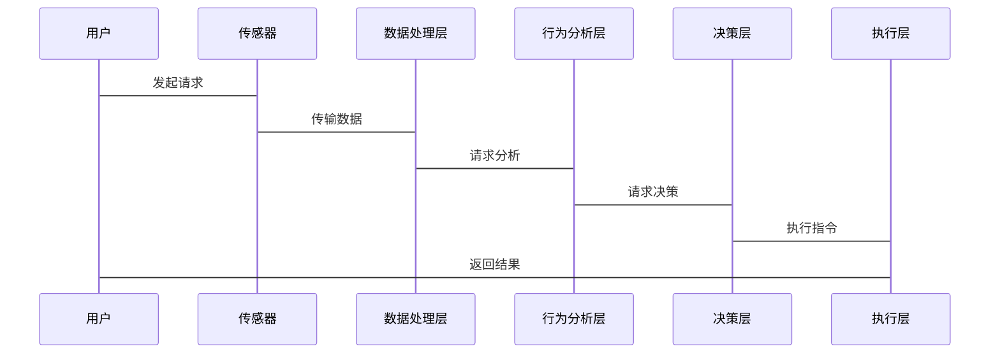

                 


# 智能宠物屋：AI Agent的宠物行为分析

> 关键词：AI Agent, 宠物行为分析, 智能宠物屋, 强化学习, 系统架构, Python实现

> 摘要：本文深入探讨了AI Agent在智能宠物屋中的应用，分析了宠物行为分析的核心原理，并通过系统架构设计和项目实战，展示了如何利用AI技术实现对宠物行为的智能化分析与管理。

---

# 第1章: 智能宠物屋与AI Agent的背景介绍

## 1.1 智能宠物屋的定义与背景

### 1.1.1 智能宠物屋的概念
智能宠物屋是一种结合物联网、人工智能和大数据分析的智能设备，旨在通过AI技术实时监测和分析宠物的行为，为宠物主人提供智能化的养宠体验。

### 1.1.2 AI Agent的基本概念
AI Agent（人工智能代理）是指能够感知环境、自主决策并执行任务的智能实体。它能够通过传感器获取数据，利用算法进行分析，并根据结果采取相应的行动。

### 1.1.3 宠物行为分析的背景与意义
随着宠物成为人们生活中重要的伴侣，宠物主人越来越关注宠物的健康与行为。通过AI技术对宠物行为进行分析，可以帮助主人更好地理解宠物的需求，预防健康问题，并提升养宠体验。

## 1.2 智能宠物屋的核心概念

### 1.2.1 AI Agent在智能宠物屋中的角色
AI Agent在智能宠物屋中主要负责数据采集、行为分析、决策制定和执行反馈。

### 1.2.2 宠物行为分析的核心要素
宠物行为分析包括对宠物的活动、情绪、健康状态等多个维度的监测与分析。

### 1.2.3 智能宠物屋的系统架构
智能宠物屋的系统架构包括数据采集层、数据处理层、行为分析层和执行层。

---

# 第2章: AI Agent与宠物行为分析的核心概念

## 2.1 AI Agent的基本原理

### 2.1.1 AI Agent的定义与分类
AI Agent可以分为简单反射型Agent、基于模型的反应式Agent、目标驱动型Agent和实用驱动型Agent。

### 2.1.2 AI Agent的核心功能
AI Agent的核心功能包括感知、决策、执行和反馈。

### 2.1.3 AI Agent与传统算法的区别
AI Agent的核心区别在于其自主性和适应性，能够根据环境变化动态调整行为。

## 2.2 宠物行为分析的原理

### 2.2.1 宠物行为分析的定义
宠物行为分析是指通过传感器和算法对宠物的行为进行监测、识别和理解。

### 2.2.2 宠物行为分析的关键技术
宠物行为分析的关键技术包括传感器数据采集、特征提取、行为识别和行为预测。

### 2.2.3 宠物行为分析的应用场景
宠物行为分析可以应用于宠物健康管理、行为矫正和养宠体验提升等多个场景。

## 2.3 AI Agent与宠物行为分析的结合

### 2.3.1 AI Agent在宠物行为分析中的作用
AI Agent通过实时监测宠物的行为数据，利用算法进行分析，并为宠物主人提供个性化的养宠建议。

### 2.3.2 宠物行为分析对AI Agent的反馈机制
宠物行为分析的结果可以为AI Agent提供反馈，帮助其优化决策策略。

### 2.3.3 两者结合的系统架构


---

# 第3章: AI Agent与宠物行为分析的算法原理

## 3.1 AI Agent的核心算法

### 3.1.1 强化学习算法


```python
class AI_Agent:
    def __init__(self, state_space, action_space):
        self.state_space = state_space
        self.action_space = action_space
        self.reward_memory = []
```

## 3.2 宠物行为分析的算法

### 3.2.1 监督学习算法


```python
def behavior_analysis_model(input_data):
    # 简单的监督学习模型示例
    return prediction
```

---

# 第4章: 智能宠物屋中的AI Agent与宠物行为分析的系统架构

## 4.1 系统功能设计

### 4.1.1 领域模型


## 4.2 系统架构设计

### 4.2.1 系统架构图


## 4.3 接口设计与交互流程

### 4.3.1 接口设计
- 数据采集接口：用于获取宠物的行为数据。
- 行为分析接口：用于对宠物行为进行分类和识别。
- 决策接口：用于根据分析结果生成指令。

### 4.3.2 交互流程


---

# 第5章: 项目实战

## 5.1 环境安装

### 5.1.1 Python环境安装
```bash
python --version
pip install numpy matplotlib scikit-learn
```

## 5.2 核心代码实现

### 5.2.1 行为分析模型
```python
import numpy as np
from sklearn import svm

# 示例代码：行为分类模型
model = svm.SVC()
model.fit(X_train, y_train)
y_pred = model.predict(X_test)
```

### 5.2.2 AI Agent实现
```python
class PetBehaviorAgent:
    def __init__(self, sensors):
        self.sensors = sensors
        self.data = []

    def collect_data(self):
        # 从传感器获取数据
        new_data = self.sensors.get_data()
        self.data.append(new_data)

    def analyze_behavior(self):
        # 简单的行为分析示例
        return "resting" if len(self.data) > 10 else "active"
```

## 5.3 案例分析

### 5.3.1 案例背景
假设我们有一个智能宠物屋，内置了多种传感器，用于监测宠物的活动情况。

### 5.3.2 数据分析
通过传感器数据，AI Agent可以识别宠物的活动状态，如休息、玩耍、进食等。

### 5.3.3 决策与反馈
根据宠物的行为分析结果，AI Agent可以自动调整宠物屋的环境，例如调节温度、播放音乐等。

---

# 第6章: 最佳实践与总结

## 6.1 最佳实践

### 6.1.1 数据采集
确保传感器数据的准确性和完整性。

### 6.1.2 模型优化
根据实际需求，不断优化AI Agent的行为分析模型。

### 6.1.3 系统维护
定期更新系统软件，确保设备的正常运行。

## 6.2 总结

AI Agent在智能宠物屋中的应用为宠物主人提供了极大的便利，同时也为宠物行为研究提供了新的思路。通过不断的技术创新，未来的智能宠物屋将更加智能化和人性化。

---

# 结语

AI Agent与宠物行为分析的结合，不仅提升了养宠体验，也为宠物健康管理开辟了新的可能性。希望本文的内容能够为读者提供有价值的参考和启发。

