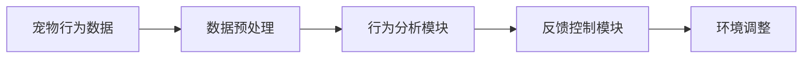

                 


# 智能宠物屋：AI Agent的宠物行为分析与训练

> 关键词：AI Agent，宠物行为分析，智能宠物屋，深度学习，计算机视觉，自然语言处理

> 摘要：本文深入探讨了AI Agent在宠物行为分析与训练中的应用，从理论基础到算法实现，再到系统架构设计，结合实际案例，全面解析了智能宠物屋的核心技术与实现方法。

---

## 第一部分：智能宠物屋与AI Agent概述

### 第1章：智能宠物屋的概念与应用

#### 1.1 AI Agent的基本概念

##### 1.1.1 什么是AI Agent
AI Agent（人工智能代理）是一种能够感知环境、自主决策并执行任务的智能实体。它通过传感器获取信息，利用算法进行分析和推理，并通过执行器与环境交互。AI Agent可以是软件程序，也可以是硬件设备，广泛应用于自动驾驶、智能助手、机器人等领域。

##### 1.1.2 AI Agent的核心特征
- **自主性**：能够在没有外部干预的情况下自主运行。
- **反应性**：能够实时感知环境并做出反应。
- **学习能力**：通过数据和经验不断优化自身行为。
- **社交能力**：能够与其他AI Agent或人类进行有效交互。

##### 1.1.3 智能宠物屋的定义与目标
智能宠物屋是一种结合AI技术的智能设备，旨在通过AI Agent实现对宠物行为的实时监测、分析和训练。其目标是帮助宠物主人更好地理解宠物的行为，改善宠物的行为习惯，甚至预防潜在的健康问题。

---

#### 1.2 宠物行为分析的背景与意义

##### 1.2.1 宠物行为分析的背景
随着宠物在家庭中的地位日益重要，宠物行为分析的需求也不断增加。通过AI技术，宠物主人可以更科学地了解宠物的心理状态和行为模式。

##### 1.2.2 宠物行为分析的意义
- **提升宠物健康**：通过分析宠物的行为，及时发现异常，预防疾病。
- **改善宠物行为**：通过训练，纠正宠物的不良习惯。
- **提升用户体验**：让宠物主人更轻松地管理宠物。

##### 1.2.3 智能宠物屋的应用价值
智能宠物屋通过AI Agent实现宠物行为的实时监测和分析，为宠物主人提供科学的建议和解决方案。它不仅可以帮助宠物主人更好地照顾宠物，还能为宠物行为研究提供大量数据支持。

---

## 第二部分：宠物行为分析的核心概念

### 第2章：宠物行为分析的原理

#### 2.1 宠物行为分析的原理

##### 2.1.1 数据采集与处理
宠物行为分析的第一步是数据采集，主要通过摄像头、传感器等设备获取宠物的行为数据，包括图像、声音、运动轨迹等。

##### 2.1.2 特征提取与行为分类
通过深度学习模型（如卷积神经网络CNN）提取宠物行为的特征，然后利用分类算法（如支持向量机SVM）对行为进行分类。

##### 2.1.3 行为预测与训练
基于历史数据，预测宠物未来的行为，并通过反馈机制优化AI Agent的行为训练策略。

---

#### 2.2 AI Agent与宠物行为分析的联系

##### 2.2.1 AI Agent在宠物行为分析中的角色
AI Agent负责数据的采集、处理、分析和反馈，是智能宠物屋的核心组件。

##### 2.2.2 宠物行为分析对AI Agent的促进作用
通过分析宠物行为数据，可以不断优化AI Agent的算法模型，提升其自主决策能力。

---

## 第三部分：宠物行为分析的算法原理

### 第3章：基于深度学习的宠物行为分析

#### 3.1 卷积神经网络（CNN）在图像处理中的应用

##### 3.1.1 CNN的基本结构
- **卷积层**：提取图像的局部特征。
- **池化层**：降低计算复杂度，提取特征的全局信息。
- **全连接层**：将特征映射到输出类别。

##### 3.1.2 CNN在宠物图像分类中的应用
通过CNN可以实现宠物种类的分类、行为识别等功能。

##### 3.1.3 图像识别与行为分类的流程图


---

#### 3.2 循环神经网络（RNN）在时间序列分析中的应用

##### 3.2.1 RNN的基本结构
- **输入层**：接收时间序列数据。
- **隐藏层**：处理序列信息，提取特征。
- **输出层**：预测下一个行为。

##### 3.2.2 RNN在宠物行为预测中的应用
通过RNN可以分析宠物行为的时间序列数据，预测其未来的动作。

---

#### 3.3 算法实现的数学模型

##### 3.3.1 卷积层的数学表达
$$ y = \sum_{i=1}^{n} w_i x_i + b $$

##### 3.3.2 激活函数的选择
$$ f(x) = \max(0, x) $$

---

## 第四部分：系统分析与架构设计

### 第4章：智能宠物屋的系统架构设计

#### 4.1 问题场景介绍
智能宠物屋需要实时监测宠物的行为，分析其情绪和健康状态，并提供相应的反馈。

#### 4.2 系统功能设计
- **数据采集**：摄像头、麦克风等设备采集宠物的行为数据。
- **行为分析**：通过AI算法分析宠物的行为。
- **反馈控制**：根据分析结果，控制环境（如温度、光线）或与宠物互动。

#### 4.3 系统架构设计


---

## 第五部分：项目实战

### 第5章：智能宠物屋的实现

#### 5.1 环境安装
- 安装Python、TensorFlow、OpenCV等开发工具。

#### 5.2 系统核心实现源代码
```python
import torch
import torch.nn as nn

class PetBehaviorClassifier(nn.Module):
    def __init__(self):
        super(PetBehaviorClassifier, self).__init__()
        self.conv1 = nn.Conv2d(3, 6, 5)
        self.pool = nn.MaxPool2d(2, 2)
        self.fc = nn.Linear(6 * 5 * 5, 10)
```

#### 5.3 代码应用解读与分析
- **数据预处理**：对输入图像进行归一化处理。
- **模型训练**：使用预处理后的数据训练模型。
- **模型预测**：利用训练好的模型对新数据进行分类。

#### 5.4 实际案例分析
通过实际案例分析，展示智能宠物屋在宠物行为分析中的实际应用效果。

#### 5.5 项目小结
总结项目实现的关键点和经验教训。

---

## 第六部分：最佳实践

### 第6章：总结与展望

#### 6.1 小结
本文详细介绍了AI Agent在宠物行为分析与训练中的应用，从理论到实践，全面解析了智能宠物屋的核心技术。

#### 6.2 注意事项
- 数据质量对模型性能影响重大。
- 需要结合实际场景进行模型优化。

#### 6.3 拓展阅读
建议读者进一步阅读相关领域的最新研究成果，如强化学习在宠物行为训练中的应用。

---

以上为《智能宠物屋：AI Agent的宠物行为分析与训练》的技术博客目录大纲。通过本文，读者可以系统地了解AI Agent在宠物行为分析中的应用，并掌握相关的实现方法。

