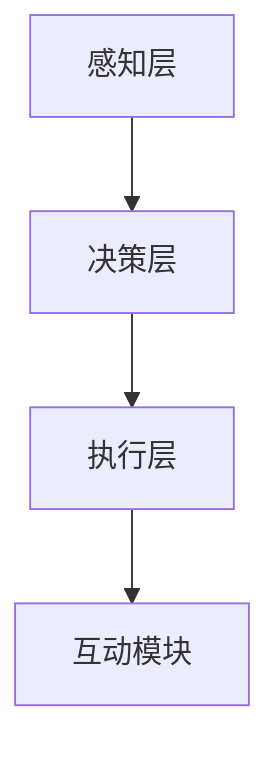
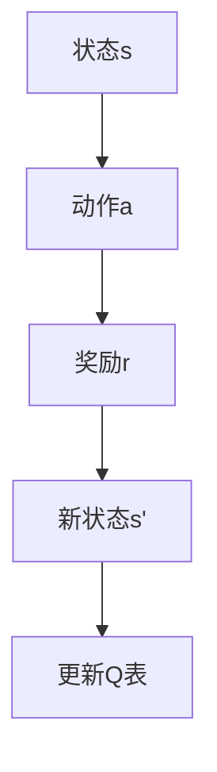
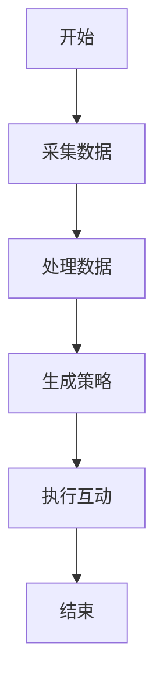

                 


# 智能宠物玩具：AI Agent的互动模式自适应

## 关键词：
智能宠物玩具, AI Agent, 互动模式, 自适应算法, 强化学习, 系统架构

## 摘要：
本文探讨智能宠物玩具中AI Agent的互动模式自适应技术，从背景到实现，详细解析AI Agent如何通过感知与决策机制、强化学习算法等实现自适应互动。文章包括背景介绍、核心概念、算法原理、系统架构、项目实战和总结，旨在为开发者和研究者提供深入的技术见解。

---

## 第一部分：智能宠物玩具与AI Agent概述

### 第1章：智能宠物玩具的背景与现状

#### 1.1 智能宠物玩具的定义与分类

##### 1.1.1 智能宠物玩具的定义
智能宠物玩具是指通过AI技术实现互动的宠物玩具，能够感知宠物行为并自适应调整互动模式，提升宠物的娱乐和训练效果。

##### 1.1.2 智能宠物玩具的分类
- **按功能分类**：
  - 娱乐类：通过游戏互动提升宠物娱乐性。
  - 训练类：辅助宠物训练特定行为。
- **按技术分类**：
  - 基于传感器的互动玩具。
  - 基于视觉识别的互动玩具。
- **按宠物类型分类**：
  - 猫咪玩具。
  - 狗狗玩具。

##### 1.1.3 智能宠物玩具的发展历程
从机械玩具到AI驱动的互动玩具，智能宠物玩具经历了从简单娱乐到复杂自适应的演变，结合AI技术，成为现代宠物护理的重要工具。

#### 1.2 AI Agent的基本概念

##### 1.2.1 AI Agent的定义
AI Agent（智能体）是指在环境中能够感知并自主决策以实现目标的实体。在智能宠物玩具中，AI Agent负责处理宠物行为数据，调整互动策略。

##### 1.2.2 AI Agent的核心特征
- **自主性**：无需外部干预，自主决策。
- **反应性**：实时感知环境并做出反应。
- **学习能力**：通过数据优化互动策略。
- **适应性**：根据宠物行为调整互动模式。

##### 1.2.3 AI Agent在智能宠物玩具中的应用
- **互动模式自适应**：根据宠物情绪和行为调整互动方式。
- **行为分析**：通过传感器和摄像头收集数据，分析宠物偏好。
- **动态反馈**：实时给予宠物反馈，增强互动体验。

#### 1.3 智能宠物玩具与AI Agent的结合

##### 1.3.1 智能宠物玩具中AI Agent的功能
- **感知宠物行为**：通过传感器和摄像头获取宠物的行为数据。
- **分析数据**：利用AI算法分析数据，识别宠物偏好。
- **调整互动策略**：根据分析结果，调整互动模式，如游戏节奏或奖励方式。

##### 1.3.2 AI Agent如何实现互动模式自适应
- **数据采集**：传感器收集宠物的运动、声音等数据。
- **数据处理**：AI Agent分析数据，识别宠物情绪和行为。
- **策略调整**：根据识别结果，动态调整互动模式，如加快游戏节奏或增加奖励频率。

##### 1.3.3 智能宠物玩具的市场现状与未来趋势
当前市场以娱乐类为主，未来将向多功能、智能化方向发展，AI Agent将更广泛地应用于宠物训练和健康管理。

---

## 第二部分：AI Agent的核心技术

### 第2章：AI Agent的感知与决策机制

#### 2.1 感知模块

##### 2.1.1 感知模块的功能与实现
感知模块负责采集宠物的行为数据，包括动作、声音、位置等。

##### 2.1.2 基于传感器的数据采集
- **传感器类型**：加速度传感器、麦克风、摄像头。
- **数据采集方法**：实时采集宠物的运动数据和声音数据。
- **数据预处理**：去噪、特征提取。

##### 2.1.3 数据的预处理与特征提取
- **数据预处理**：去除背景噪声，提取关键特征。
- **特征提取**：识别宠物的特定动作和声音。

#### 2.2 决策模块

##### 2.2.1 决策算法的选择与实现
- **规则驱动**：基于预设规则进行决策。
- **强化学习**：通过奖励机制优化决策策略。

##### 2.2.2 基于规则的决策系统
- **规则定义**：根据宠物行为定义决策规则，如“当宠物表现出兴趣，加快互动节奏”。
- **规则执行**：根据规则生成互动指令。

##### 2.2.3 基于强化学习的决策系统
- **算法选择**：使用Q-learning算法，宠物的积极反馈作为奖励，优化互动策略。
- **状态空间**：宠物行为、环境状态。
- **动作空间**：互动方式，如“摇晃玩具”、“发出声音”。

#### 2.3 系统架构设计

##### 2.3.1 系统功能设计
- **感知层**：传感器采集数据。
- **决策层**：AI Agent分析数据并生成指令。
- **执行层**：驱动器执行互动动作。

##### 2.3.2 系统架构图


##### 2.3.3 接口设计
- **输入接口**：传感器数据输入。
- **输出接口**：驱动器指令输出。

##### 2.3.4 交互流程
- **数据采集**：传感器采集宠物数据。
- **数据处理**：AI Agent分析数据。
- **决策生成**：生成互动策略。
- **执行指令**：驱动器执行互动动作。

---

## 第三部分：算法与系统实现

### 第3章：强化学习算法实现

#### 3.1 强化学习算法的数学模型

##### 3.1.1 Q-learning算法
- **公式**：
  $$ Q(s, a) = Q(s, a) + \alpha (r + \max_{a'} Q(s', a') - Q(s, a)) $$
  其中，$\alpha$ 是学习率，$r$ 是奖励，$s$ 是当前状态，$a$ 是当前动作，$s'$ 是下一个状态。

##### 3.1.2 算法流程


#### 3.2 算法实现

##### 3.2.1 Python代码实现
```python
import numpy as np

class QLearning:
    def __init__(self, state_space, action_space, alpha=0.1, gamma=0.9):
        self.state_space = state_space
        self.action_space = action_space
        self.Q = np.zeros((state_space, action_space))
        self.alpha = alpha
        self.gamma = gamma

    def choose_action(self, state):
        if np.random.random() < 0.9:  # 探索率
            return np.argmax(self.Q[state, :])
        else:
            return np.random.randint(self.action_space)

    def update_Q(self, state, action, reward, next_state):
        self.Q[state, action] += self.alpha * (reward + self.gamma * np.max(self.Q[next_state, :]) - self.Q[state, action])
```

##### 3.2.2 算法实现的详细解读
- **初始化Q表**：记录状态-动作对的Q值。
- **选择动作**：根据当前状态选择动作，使用贪心策略。
- **更新Q值**：根据奖励和下一个状态更新Q值，优化策略。

#### 3.3 算法优化

##### 3.3.1 探索与利用的平衡
- **探索率**：平衡探索新策略和利用已知好策略。
- **策略优化**：动态调整探索率，初始高探索，后期注重利用。

##### 3.3.2 奖励机制的设计
- **即时奖励**：给予及时反馈，如宠物表现出兴趣时给予奖励。
- **延迟奖励**：长期行为的奖励，如完成特定任务后奖励。

##### 3.3.3 状态空间的划分
- **状态定义**：宠物的行为、情绪等。
- **状态转移**：当前状态到下一个状态的转移概率。

---

## 第四部分：系统架构设计

### 第4章：系统分析与架构设计方案

#### 4.1 项目介绍

##### 4.1.1 项目目标
开发一款能够自适应互动的智能宠物玩具，提升宠物互动体验。

##### 4.1.2 项目需求
- 实时采集宠物行为数据。
- 分析数据并生成互动策略。
- 执行互动指令。

#### 4.2 系统功能设计

##### 4.2.1 功能模块
- **数据采集模块**：采集宠物行为数据。
- **数据处理模块**：分析数据，生成互动策略。
- **互动执行模块**：驱动玩具执行互动指令。

##### 4.2.2 功能流程


#### 4.3 系统架构设计

##### 4.3.1 系统架构图


##### 4.3.2 接口设计
- **输入接口**：传感器数据输入。
- **输出接口**：驱动器指令输出。

##### 4.3.3 交互流程
- **数据采集**：传感器采集数据。
- **数据处理**：AI Agent分析数据。
- **决策生成**：生成互动策略。
- **执行指令**：驱动器执行互动动作。

---

## 第五部分：项目实战

### 第5章：项目实战

#### 5.1 环境搭建与代码实现

##### 5.1.1 环境安装
- **Python**：安装Python 3.x。
- **库安装**：安装numpy、scikit-learn、tensorflow等。

##### 5.1.2 核心代码实现
- **数据采集模块**：使用传感器采集数据。
- **数据处理模块**：分析数据，生成互动策略。
- **互动执行模块**：驱动玩具执行互动指令。

##### 5.1.3 代码实现
```python
import numpy as np

class PetToy:
    def __init__(self):
        self传感器 = 传感器()
        self.AI-Agent = AIAgent()

    def start(self):
        while True:
            data = self.传感器采集数据()
            action = self.AI-Agent决策(data)
            self执行动作(action)
```

#### 5.2 代码应用解读与分析

##### 5.2.1 代码解读
- **数据采集**：传感器采集宠物行为数据。
- **AI-Agent决策**：AI Agent分析数据，生成互动策略。
- **执行动作**：驱动器执行互动指令。

##### 5.2.2 算法优化
- **优化策略**：动态调整互动模式。
- **性能提升**：优化算法，提高决策效率。

#### 5.3 实际案例分析与详细讲解

##### 5.3.1 案例分析
- **案例一**：猫咪互动玩具。
- **案例二**：狗狗训练玩具。

##### 5.3.2 详细讲解
- **案例分析**：分析互动效果，优化互动策略。
- **效果评估**：评估互动效果，优化系统性能。

#### 5.4 项目小结

##### 5.4.1 项目总结
- **项目成果**：成功开发智能宠物玩具，实现自适应互动。
- **经验总结**：优化算法，提升互动效果。
- **改进建议**：结合更多传感器，提升互动体验。

---

## 第六部分：总结与展望

### 第6章：总结与展望

#### 6.1 总结
智能宠物玩具通过AI Agent实现互动模式自适应，提升了宠物的互动体验。本文详细介绍了技术背景、核心概念、算法实现、系统架构和项目实战。

#### 6.2 未来展望
未来将向多功能、智能化方向发展，AI Agent将更广泛地应用于宠物训练和健康管理。

---

## 结语

智能宠物玩具的互动模式自适应技术结合了AI Agent的感知与决策机制，通过强化学习算法和系统架构设计，实现个性化的互动体验。本文为开发者和研究者提供了深入的技术见解，未来将有更多创新应用。

---

**致谢**
感谢读者的耐心阅读，希望本文对您有所帮助。如需进一步探讨，欢迎留言交流。

