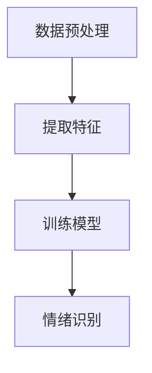
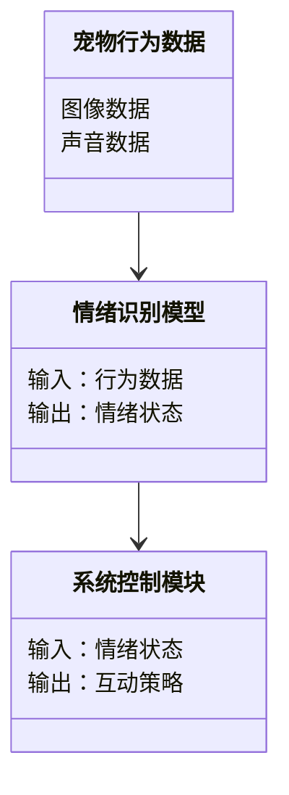

                 


# 智能宠物玩具：AI Agent的宠物情绪识别

> 关键词：人工智能、宠物情绪识别、智能玩具、AI Agent、机器学习、情感计算

> 摘要：本文探讨如何利用人工智能技术实现宠物情绪识别，并设计智能宠物玩具。通过分析宠物行为与情绪的关系，介绍AI Agent的核心概念，详细讲解算法原理和系统架构，结合项目实战和最佳实践，为智能宠物玩具的开发提供理论和技术支持。

---

## 目录

1. [背景介绍与核心概念](#背景介绍与核心概念)
2. [宠物情绪识别的核心概念与联系](#宠物情绪识别的核心概念与联系)
3. [算法原理](#算法原理)
4. [系统分析与架构设计方案](#系统分析与架构设计方案)
5. [项目实战](#项目实战)
6. [最佳实践](#最佳实践)

---

## 1. 背景介绍与核心概念

### 1.1 宠物情绪识别的背景与意义

宠物作为人类生活中重要的伙伴，其情绪变化直接影响着主人与宠物之间的互动质量。传统上，宠物情绪的识别主要依赖于主人的经验和观察，这种方式存在主观性和不准确性。随着人工智能技术的快速发展，利用AI Agent实现宠物情绪识别成为可能，这不仅能够提升宠物的情绪管理能力，还能为宠物玩具的设计提供科学依据。

### 1.2 智能宠物玩具的定义与特点

智能宠物玩具是指通过传感器、AI算法等技术手段，能够感知宠物行为并做出反馈的玩具。其特点包括：
- **互动性**：能够与宠物进行实时互动。
- **智能化**：通过AI算法识别宠物情绪并调整互动方式。
- **可定制化**：可以根据不同宠物的特点提供个性化服务。

### 1.3 AI Agent在宠物情绪识别中的作用

AI Agent是一种能够感知环境、做出决策并执行任务的智能体。在宠物情绪识别中，AI Agent可以通过分析宠物的行为数据（如动作、声音、体温等）来识别其情绪状态，并根据情绪反馈调整互动策略。

---

## 2. 宠物情绪识别的核心概念与联系

### 2.1 宠物行为与情绪的关系

宠物的情绪可以通过其行为表现出来，例如：
- **快乐**：宠物会表现出活泼好动、摇尾巴等行为。
- **焦虑**：宠物可能会表现出躲藏、呜咽等行为。
- **愤怒**：宠物可能会表现出攻击性行为。

#### 行为分类表

| 行为类型   | 情绪状态 |
|------------|----------|
| 跳跃       | 快乐     |
| 藏起来     | 焦虑     |
| 吼叫       | 愤怒     |

### 2.2 宠物情绪识别的核心要素

情绪识别的核心要素包括：
1. **数据采集**：通过传感器获取宠物的行为数据，如动作、声音、心率等。
2. **特征提取**：将采集到的数据转化为有用的特征向量。
3. **模型训练**：利用机器学习算法训练情绪识别模型。

#### ER实体关系图

```mermaid
erd
    宠物-情绪识别系统
    宠物
    情绪状态
    行为数据
    特征向量
```

---

## 3. 算法原理

### 3.1 情绪识别算法选择

常用的算法包括卷积神经网络（CNN）和循环神经网络（RNN）。这里以CNN为例进行讲解。

#### 算法流程图



### 3.2 算法实现代码

```python
import tensorflow as tf
from tensorflow.keras import layers

# 数据预处理
def preprocess(data):
    # 假设data为图像数据
    return data / 255.0

# 模型定义
model = tf.keras.Sequential([
    layers.Conv2D(32, (3,3), activation='relu', input_shape=(64,64,3)),
    layers.MaxPooling2D((2,2)),
    layers.Flatten(),
    layers.Dense(128, activation='relu'),
    layers.Dense(5, activation='softmax')
])

# 模型训练
model.compile(optimizer='adam', loss='sparse_categorical_crossentropy', metrics=['accuracy'])
model.fit(preprocess(train_data), train_labels, epochs=10, batch_size=32)
```

### 3.3 数学公式

损失函数：
$$ L = -\sum_{i=1}^{n} y_i \log(p_i) $$

优化器：
$$ \theta = \theta - \eta \frac{\partial L}{\partial \theta} $$

---

## 4. 系统分析与架构设计方案

### 4.1 项目场景介绍

设计一个智能宠物玩具系统，能够通过摄像头和麦克风采集宠物的行为数据，并通过AI算法识别宠物的情绪，从而调整玩具的互动方式。

#### 领域模型



#### 系统架构图


---

## 5. 项目实战

### 5.1 环境安装

需要安装以下库：
- TensorFlow
- OpenCV
- NumPy

### 5.2 核心代码实现

```python
import cv2
import numpy as np

def capture_image():
    cap = cv2.VideoCapture(0)
    ret, frame = cap.read()
    if ret:
        return frame
    else:
        return None

def main():
    image = capture_image()
    if image is not None:
        # 进行图像处理
        processed_image = preprocess(image)
        # 进行情绪识别
        emotion = predict_emotion(processed_image)
        print(f"识别到的情绪：{emotion}")

if __name__ == "__main__":
    main()
```

### 5.3 代码解读与分析

- `capture_image()`函数用于捕获摄像头图像。
- `preprocess()`函数对图像进行预处理。
- `predict_emotion()`函数调用预训练的情绪识别模型进行预测。

### 5.4 实际案例分析

通过实际案例分析，说明系统如何识别宠物情绪并调整互动策略，例如当识别到宠物感到焦虑时，系统可以降低玩具的互动强度。

### 5.5 项目总结

总结项目实现的关键点和需要注意的问题，例如数据采集的准确性、模型的泛化能力等。

---

## 6. 最佳实践

### 6.1 小结

本文详细介绍了智能宠物玩具的设计与实现过程，从背景分析到算法实现，再到系统架构设计，为读者提供了全面的技术指导。

### 6.2 注意事项

- 数据采集时需要注意光线和角度的控制。
- 模型训练时需要选择合适的超参数。

### 6.3 拓展阅读

建议读者进一步学习情感计算和强化学习的相关知识，以提升宠物情绪识别的准确性。

---

通过本文的讲解，读者可以掌握智能宠物玩具的设计方法，并将其应用到实际项目中，为宠物与人类的互动带来更多的乐趣和便利。

