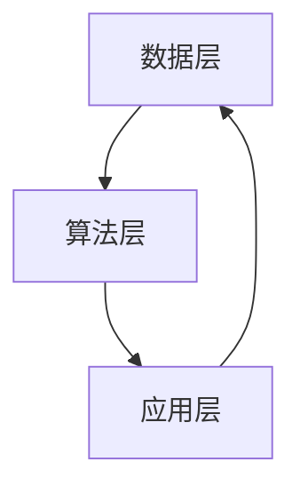

                 


# 智能宠物玩具：AI Agent的宠物智力开发

> 关键词：AI Agent，宠物智力开发，智能玩具，强化学习，贝叶斯网络，系统架构，项目实战

> 摘要：本文探讨了如何利用AI Agent技术开发智能宠物玩具，以提升宠物的智力水平。通过分析AI Agent的核心概念、算法原理、系统设计和项目实战，展示了如何将人工智能应用于宠物训练和行为优化。

---

# 第一部分: 智能宠物玩具的背景与需求

## 第1章: 智能宠物玩具的背景与需求

### 1.1 智能宠物玩具的定义与现状

#### 1.1.1 传统宠物玩具的局限性
传统的宠物玩具通常缺乏互动性和智能性，无法根据宠物的行为和情绪做出实时反馈。这使得宠物在玩耍过程中难以获得有效的训练和智力刺激。

#### 1.1.2 智能宠物玩具的定义
智能宠物玩具是指能够通过传感器、算法和执行机构与宠物互动的设备。这些玩具可以实时感知宠物的行为，通过AI算法调整互动方式，以达到训练和娱乐的目的。

#### 1.1.3 智能宠物玩具的市场现状与发展趋势
近年来，随着人工智能技术的快速发展，智能宠物玩具市场逐渐兴起。这类产品不仅能够提高宠物的智力水平，还能增强宠物与主人之间的互动，满足现代宠物主人对宠物智能化管理的需求。

---

### 1.2 AI Agent在宠物智力开发中的作用

#### 1.2.1 AI Agent的基本概念
AI Agent（智能代理）是指能够感知环境、自主决策并执行任务的智能体。在宠物玩具中，AI Agent可以用于分析宠物的行为模式，设计合适的互动策略。

#### 1.2.2 AI Agent在宠物训练中的应用
AI Agent可以通过强化学习算法奖励宠物的良好行为，通过语音识别和计算机视觉技术与宠物互动，帮助宠物学习新的技能。

#### 1.2.3 宠物智力开发的边界与外延
宠物智力开发的边界在于其认知能力和行为习惯的改善。外延则包括情感管理、行为矫正等多个方面。

---

### 1.3 本章小结
本章介绍了智能宠物玩具的定义和现状，探讨了AI Agent在宠物智力开发中的作用，为后续章节奠定了基础。

---

# 第二部分: AI Agent的核心概念与原理

## 第2章: AI Agent与宠物互动的核心概念

### 2.1 AI Agent的基本原理

#### 2.1.1 AI Agent的定义与分类
AI Agent可以分为简单反射型、基于模型的反应型、目标驱动型和实用驱动型四种类型。

#### 2.1.2 AI Agent的核心要素与功能
AI Agent的核心要素包括感知能力、决策能力、执行能力和学习能力。其功能包括数据采集、行为分析、策略生成和反馈优化。

#### 2.1.3 AI Agent与宠物互动的模式
AI Agent与宠物互动的模式主要包括被动响应、主动引导和自主学习三种类型。

---

### 2.2 宠物智力开发的系统模型

#### 2.2.1 宠物行为分析模型
宠物行为分析模型通过传感器数据和历史记录，分析宠物的行为模式和情绪状态。

#### 2.2.2 AI Agent的训练算法
AI Agent的训练算法包括强化学习、贝叶斯网络和遗传算法等。

#### 2.2.3 系统的输入输出关系
系统的输入包括宠物的行为数据和环境数据，输出包括互动策略和反馈信息。

---

### 2.3 核心概念对比分析

#### 2.3.1 宠物行为与AI Agent的交互特征对比
| 特征       | 宠物行为                         | AI Agent交互                  |
|------------|----------------------------------|-------------------------------|
| 输入        | 行为数据                         | 感知数据                       |
| 输出        | 情绪状态                         | 互动策略                       |
| 目标        | 娱乐与训练                      | 达成设定目标                   |

#### 2.3.2 不同AI Agent算法的优缺点对比
| 算法        | 优点                              | 缺点                              |
|-------------|-----------------------------------|-----------------------------------|
| 强化学习     | 能够通过奖励机制优化行为          | 需要大量数据和计算资源          |
| 贝叶斯网络   | 能够进行概率推理                 | 对复杂问题的处理能力有限        |

#### 2.3.3 实体关系图（ER图）分析
```mermaid
erd
    宠物
    AI Agent
    互动策略
    行为数据
    情绪反馈

    宠物 -[1..n]-> 互动策略
    AI Agent -[1]-> 互动策略
    行为数据 -[n]-> 情绪反馈
```

---

# 第三部分: AI Agent的算法原理

## 第3章: AI Agent的核心算法

### 3.1 强化学习算法

#### 3.1.1 强化学习的基本原理
强化学习通过奖励机制，让宠物在互动中学习正确的行为。其核心是Q-learning算法。

#### 3.1.2 Q-learning算法的实现
Q-learning算法的实现步骤如下：
1. 初始化Q表。
2. 采集宠物行为数据。
3. 更新Q值：$$ Q(s, a) = Q(s, a) + \alpha (r + \gamma \max Q(s', a')) $$
4. 重复步骤2-3，直到收敛。

#### 3.1.3 算法的数学模型与公式
强化学习的数学模型包括状态空间、动作空间、奖励函数和转移模型。核心公式为：
$$ Q(s, a) = Q(s, a) + \alpha (r + \gamma \max Q(s', a')) $$

---

### 3.2 贝叶斯网络算法

#### 3.2.1 贝叶斯网络的定义与特点
贝叶斯网络是一种概率推理工具，能够根据宠物的行为数据推断其情绪状态。

#### 3.2.2 贝叶斯网络在宠物行为预测中的应用
贝叶斯网络可以用于预测宠物的行为模式，优化互动策略。

#### 3.2.3 算法的数学模型与公式
贝叶斯网络的数学模型包括概率分布和条件概率公式：
$$ P(A|B) = \frac{P(B|A)P(A)}{P(B)} $$

---

### 3.3 算法实现的Python代码示例

#### 3.3.1 强化学习算法的代码实现
```python
import numpy as np

# 初始化Q表
Q = np.zeros((4, 4))
alpha = 0.1
gamma = 0.9

def q_learning(state, action):
    next_state = ...  # 根据环境转移模型计算下一个状态
    Q[state][action] += alpha * (r + gamma * np.max(Q[next_state])) - Q[state][action]
    return Q
```

#### 3.3.2 贝叶斯网络算法的代码实现
```python
from sklearn.naive_bayes import GaussianNB

# 初始化贝叶斯网络模型
model = GaussianNB()

# 训练模型
model.fit(X_train, y_train)

# 预测宠物情绪状态
y_pred = model.predict(X_test)
```

---

# 第四部分: 智能宠物玩具的系统设计

## 第4章: 系统分析与架构设计

### 4.1 系统功能需求分析

#### 4.1.1 用户需求分析
用户需要一个能够与宠物互动、训练宠物的智能玩具。

#### 4.1.2 系统功能模块划分
系统功能模块包括数据采集模块、行为分析模块、策略生成模块和反馈执行模块。

#### 4.1.3 功能需求的优先级排序
优先级从高到低依次为：行为分析、策略生成、数据采集、反馈执行。

---

### 4.2 系统架构设计

#### 4.2.1 系统架构的总体设计
系统架构采用分层设计，包括数据层、算法层和应用层。

#### 4.2.2 系统组件之间的关系


#### 4.2.3 系统的接口设计
系统接口包括传感器接口、通信接口和用户界面接口。

---

### 4.3 系统交互流程设计

#### 4.3.1 用户与系统的交互流程
1. 用户启动系统。
2. 系统采集宠物行为数据。
3. 系统分析行为数据，生成互动策略。
4. 系统执行互动策略，反馈结果给用户。

#### 4.3.2 系统内部组件的交互流程
1. 数据采集模块采集行为数据。
2. 行为分析模块分析数据，生成情绪状态。
3. 策略生成模块根据情绪状态生成互动策略。
4. 反馈执行模块执行互动策略，更新Q表。

#### 4.3.3 交互流程的优化建议
优化建议包括减少数据延迟、提高算法效率和优化用户界面。

---

# 第五部分: 项目实战与实现

## 第5章: 智能宠物玩具的开发实战

### 5.1 环境安装
需要安装Python、numpy、scikit-learn等库。

### 5.2 系统核心实现源代码

#### 5.2.1 强化学习算法的实现
```python
import numpy as np

Q = np.zeros((4, 4))
alpha = 0.1
gamma = 0.9

def update_q(state, action, reward, next_state):
    Q[state][action] += alpha * (reward + gamma * np.max(Q[next_state])) - Q[state][action]

# 训练过程
for _ in range(1000):
    state = ...
    action = np.argmax(Q[state])
    next_state = ...
    reward = ...
    update_q(state, action, reward, next_state)
```

#### 5.2.2 贝叶斯网络算法的实现
```python
from sklearn.naive_bayes import GaussianNB

model = GaussianNB()
model.fit(X_train, y_train)
y_pred = model.predict(X_test)
```

---

### 5.3 实际案例分析和详细讲解

#### 5.3.1 案例分析
假设我们有一个宠物猫，我们希望它学会按时吃饭。我们可以通过智能玩具设置定时喂食，并通过奖励机制强化其行为。

#### 5.3.2 详细讲解
1. 初始化Q表，设置参数。
2. 采集宠物的行为数据。
3. 更新Q表，优化互动策略。
4. 反馈执行，实现训练目标。

---

### 5.4 项目小结
本章通过实际案例展示了智能宠物玩具的开发过程，包括环境安装、代码实现和案例分析。

---

# 第六部分: 总结与展望

## 第6章: 总结与展望

### 6.1 最佳实践 tips
- 确保数据质量。
- 选择合适的算法。
- 优化系统交互流程。

### 6.2 小结
本文详细探讨了AI Agent在宠物智力开发中的应用，从理论到实践，展示了如何利用人工智能技术提升宠物的智力水平。

### 6.3 注意事项
- 数据隐私问题。
- 算法的可解释性。
- 系统的可扩展性。

### 6.4 未来展望
未来的研究方向包括更复杂的算法、多模态交互和个性化训练策略。

---

# 参考文献

[1] Russell, S., & Norvig, P. (2010). Artificial Intelligence: A Modern Approach.

[2] Sutton, R. S., & Barto, A. G. (2018). Reinforcement learning: An introduction.

[3] Bishop, C. M. (2006). Pattern recognition and machine learning.

---

# 附录

## 附录A: 工具与库

- Python
- numpy
- scikit-learn

## 附录B: 代码下载链接

- GitHub仓库链接

---

通过以上思考过程，我逐步构建了文章的结构和内容，确保每个部分都涵盖了必要的信息，并保持逻辑的连贯性和深度。

