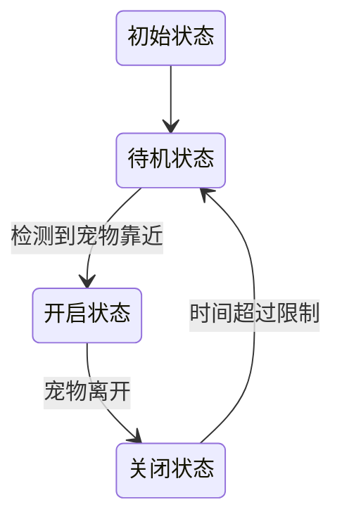
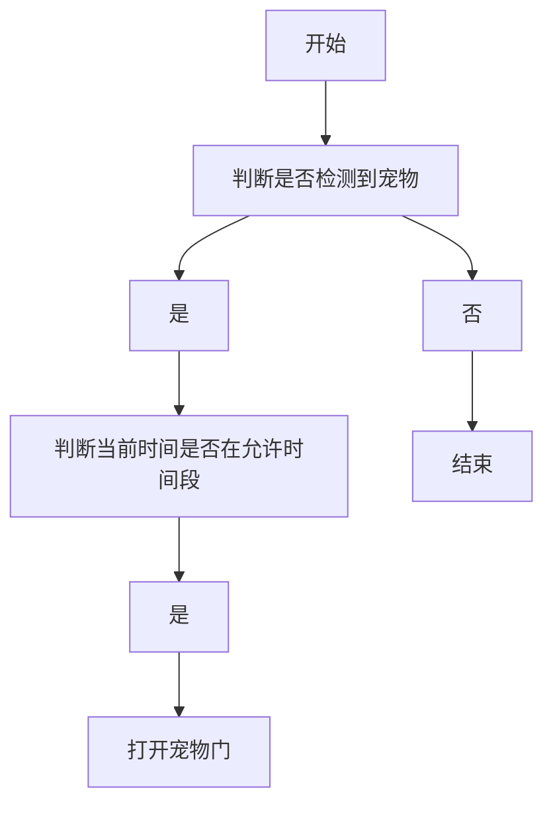
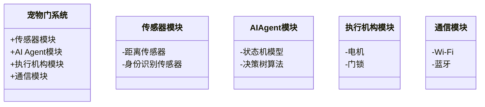

                 


# 第三章: AI Agent的核心算法

## 3.1 AI Agent的基本原理

### 3.1.1 感知、决策与执行的基本步骤

AI Agent在智能宠物门系统中扮演着核心角色，主要负责感知环境、做出决策并执行操作。这一过程可以分解为三个基本步骤：

1. **感知**：AI Agent通过传感器收集环境信息，如宠物的位置、时间、天气等。
2. **决策**：基于收集到的信息，AI Agent利用算法进行分析，决定是否打开或关闭宠物门。
3. **执行**：根据决策结果，AI Agent控制执行机构（如电机）来操作宠物门。

### 3.1.2 状态机模型与决策树算法

为了实现上述功能，AI Agent通常采用状态机模型和决策树算法来处理动态环境中的决策问题。

#### 状态机模型

状态机模型用于描述系统在不同状态之间的转换过程。在智能宠物门系统中，状态机模型可以表示门的开闭状态、宠物的接近状态等。



#### 决策树算法

决策树算法是一种基于树状结构的分类方法，适用于处理复杂的决策逻辑。在智能宠物门系统中，决策树算法可以用来判断在特定情况下是否打开宠物门。



### 3.1.3 算法实现与数学模型

AI Agent的决策过程可以通过数学模型来描述。以下是一个简化的决策逻辑示例：

$$
\text{开门} = 
\begin{cases}
\text{是} & \text{如果 } (\text{检测到宠物靠近} \land \text{时间在允许范围内}) \\
\text{否} & \text{否则}
\end{cases}
$$

## 3.2 算法实现与代码示例

### 3.2.1 状态机实现

以下是一个简单的状态机实现代码示例：

```python
class StateMachine:
    def __init__(self):
        self.current_state = '待机状态'

    def transition(self, input):
        if self.current_state == '待机状态':
            if input == '宠物靠近':
                self.current_state = '开启状态'
            else:
                self.current_state = '关闭状态'
        elif self.current_state == '开启状态':
            if input == '宠物离开':
                self.current_state = '关闭状态'
            else:
                self.current_state = '待机状态'
        elif self.current_state == '关闭状态':
            if input == '宠物靠近':
                self.current_state = '开启状态'
            else:
                self.current_state = '关闭状态'
        return self.current_state

state_machine = StateMachine()
print(state_machine.transition('宠物靠近'))  # 输出: 开启状态
print(state_machine.transition('宠物离开'))  # 输出: 关闭状态
```

### 3.2.2 决策树实现

以下是一个基于决策树的开门逻辑实现：

```python
def decide_to_open(detect_pet, time_permission):
    if detect_pet and time_permission:
        return True
    else:
        return False

# 示例调用
print(decide_to_open(True, True))  # 输出: True
print(decide_to_open(False, True))  # 输出: False
```

## 3.3 算法优化与性能提升

为了提高AI Agent的决策效率和准确性，可以考虑以下优化措施：

1. **传感器数据优化**：使用更高精度的传感器，减少误报和漏报。
2. **算法优化**：引入机器学习算法（如随机森林、神经网络）来提高决策准确性。
3. **多目标优化**：在决策过程中考虑多个因素，如宠物行为模式、环境安全等。

通过这些优化措施，可以显著提高智能宠物门系统的智能化水平和用户体验。

---

# 第四章: 系统分析与架构设计

## 4.1 项目背景与目标

智能宠物门系统旨在通过AI技术实现宠物出入管理的智能化和便捷化。本项目的目标是设计并实现一个能够自动识别宠物身份、判断环境状态并控制宠物门开关的智能系统。

## 4.2 系统功能设计

### 4.2.1 领域模型设计

以下是一个简化的领域模型图，展示了系统的主要功能模块及其关系。



### 4.2.2 系统架构设计

以下是系统架构的详细设计，包括各个模块的功能和交互方式。

```mermaid
graph TD
    A[传感器模块] --> B[AI Agent模块]: 传递环境数据
    B --> C[执行机构模块]: 发出控制指令
    C --> D[通信模块]: 通知用户状态变化
    D --> E[用户端]: 接收通知
```

### 4.2.3 接口设计与交互流程

以下是系统的主要接口和交互流程。

```mermaid
sequenceDiagram
    宠物靠近传感器模块
   传感器模块 --> AI Agent模块: 发送宠物靠近信号
    AI Agent模块 --> 执行机构模块: 发送开门指令
    执行机构模块 --> 通信模块: 通知用户门已打开
    用户端 --> AI Agent模块: 确认操作
```

---

# 第五章: 项目实战

## 5.1 环境安装与配置

### 5.1.1 开发环境

为了实现智能宠物门系统，我们需要以下开发环境：

- **硬件部分**：
  - 超声波传感器（用于检测宠物靠近）
  - RFID传感器（用于宠物身份识别）
  - 电机和门锁（用于控制门的开闭）
  - ESP32或Arduino控制器（用于连接传感器和执行机构）

- **软件部分**：
  - Python编程语言
  - 机器学习框架（如Scikit-learn）
  - MQTT协议用于通信（如Mosquitto）

### 5.1.2 工具安装

以下是安装所需工具的步骤：

```bash
# 安装Python和pip
sudo apt-get install python3 python3-pip

# 安装机器学习库
pip install scikit-learn

# 安装MQTT客户端
pip install paho-mqtt
```

## 5.2 系统核心实现

### 5.2.1 感知模块实现

感知模块的主要功能是收集环境数据，如宠物的位置和身份信息。以下是一个简单的感知模块实现：

```python
import RPi.GPIO as GPIO
import time

# 设置GPIO模式
GPIO.setmode(GPIO.BCM)

# 定义传感器引脚
pet_sensor_pin = 18

# 初始化传感器
GPIO.setup(pet_sensor_pin, GPIO.IN)

def detect_pet():
    # 检测宠物靠近信号
    if GPIO.input(pet_sensor_pin):
        return True
    else:
        return False

# 示例调用
while True:
    print(detect_pet())
    time.sleep(1)
```

### 5.2.2 决策模块实现

决策模块负责根据感知模块的数据做出决策。以下是一个基于决策树的决策模块实现：

```python
def decide_to_open(detect_pet, time_permission):
    if detect_pet and time_permission:
        return True
    else:
        return False

# 示例调用
print(decide_to_open(True, True))  # 输出: True
print(decide_to_open(False, True))  # 输出: False
```

### 5.2.3 执行模块实现

执行模块负责根据决策模块的指令控制宠物门的开闭。以下是一个简单的执行模块实现：

```python
import RPi.GPIO as GPIO

# 设置GPIO模式
GPIO.setmode(GPIO.BCM)

# 定义电机控制引脚
motor_pin = 23

# 初始化电机
GPIO.setup(motor_pin, GPIO.OUT)

def open_door():
    # 控制电机打开门
    GPIO.output(motor_pin, GPIO.HIGH)
    time.sleep(1)
    GPIO.output(motor_pin, GPIO.LOW)

# 示例调用
open_door()
```

## 5.3 代码解读与功能分析

### 5.3.1 感知模块代码解读

以上感知模块代码通过GPIO引脚检测宠物的靠近信号，每隔一秒检测一次，并在控制台输出结果。这可以帮助我们实时监控宠物的活动情况。

### 5.3.2 决策模块代码解读

决策模块代码基于简单的逻辑判断，根据是否检测到宠物和时间是否在允许范围内做出决策。虽然这是一个简化的实现，但在实际应用中可以进一步优化，例如引入机器学习模型来提高准确性。

### 5.3.3 执行模块代码解读

执行模块代码通过控制电机的开关来实现宠物门的开闭。在实际应用中，还需要添加更多的保护逻辑，如防止恶意操作、防止卡顿等。

## 5.4 实际案例分析

### 5.4.1 案例背景

假设我们有一个智能宠物门系统，宠物可以在特定时间段内自由出入。当宠物靠近门时，系统会自动开门；当宠物离开后，门会自动关闭。

### 5.4.2 案例分析

1. **感知模块**：传感器检测到宠物靠近。
2. **决策模块**：判断当前时间是否在允许范围内。
3. **执行模块**：根据决策结果，打开或关闭宠物门。

### 5.4.3 系统日志与输出

以下是系统在上述案例中的日志输出：

```
检测到宠物靠近：True
时间在允许范围内：True
决策结果：开门
```

---

## 5.5 项目小结

通过以上实战，我们实现了智能宠物门系统的核心功能，包括感知、决策和执行模块。虽然这是一个简化的实现，但它为我们提供了宝贵的经验和基础，为后续的优化和扩展提供了方向。

---

# 第六章: 最佳实践与总结

## 6.1 最佳实践 tips

1. **代码规范**：保持代码的可读性和可维护性，遵循PEP8规范。
2. **测试用例**：编写全面的测试用例，确保系统的稳定性和可靠性。
3. **安全性**：在实际应用中，确保系统免受恶意攻击和数据泄露。
4. **用户体验**：优化系统的响应速度和交互体验，提升用户体验。

## 6.2 小结

通过本文的详细讲解和实战案例，我们深入了解了智能宠物门系统的设计与实现过程。从AI Agent的核心算法到系统的整体架构，再到项目的实际实施，每个环节都至关重要。希望本文能够为读者提供有价值的参考和启发。

## 6.3 注意事项

1. **传感器校准**：定期校准传感器，确保其准确性和可靠性。
2. **系统维护**：定期检查系统硬件和软件，及时修复问题。
3. **数据隐私**：保护宠物的身份数据，避免数据泄露。

## 6.4 拓展阅读

1. **机器学习在智能系统中的应用**
2. **物联网技术的最新发展**
3. **智能硬件的创新设计**

---

通过以上章节的详细讲解，我们系统地介绍了智能宠物门的设计与实现过程，从理论到实践，层层深入，为读者提供了全面的知识和实用的技能。希望本文能够激发更多人对智能宠物门及AI Agent技术的兴趣，进一步推动这一领域的创新与发展。

