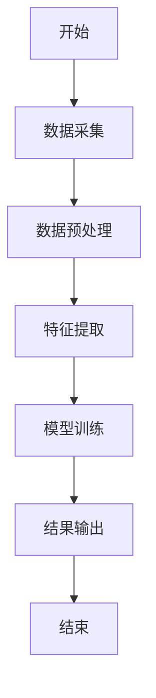
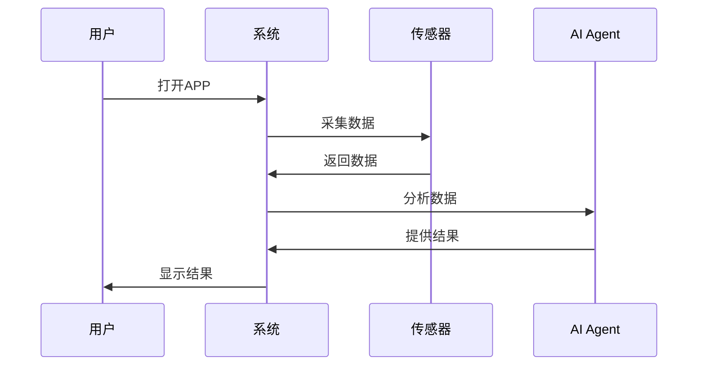

                 


# 智能宠物项圈：AI Agent的宠物行为分析

## 关键词：智能宠物项圈，AI Agent，宠物行为分析，物联网，机器学习

## 摘要：  
智能宠物项圈通过集成AI Agent技术，能够实时采集和分析宠物的行为数据，为宠物主人提供科学的养宠建议。本文从背景、核心概念、算法原理、系统架构到项目实战，详细阐述了智能宠物项圈的设计与实现，探讨了其在宠物健康管理中的应用潜力。

---

# 第1章: 智能宠物项圈的背景与问题背景

## 1.1 问题背景与问题描述  
### 1.1.1 宠物行为分析的现状与挑战  
宠物作为人类的伙伴，其行为往往受到情绪、健康状况和环境的影响。传统的宠物行为观察依赖于主人的经验和直觉，存在主观性和片面性。随着宠物健康管理需求的增加，如何科学、系统地分析宠物行为成为亟待解决的问题。  

### 1.1.2 智能宠物项圈的出现与意义  
智能宠物项圈通过集成传感器和AI技术，能够实时采集宠物的运动数据、心率、体温等信息，并结合行为分析算法，为宠物主人提供精准的行为解读和健康建议。这种智能化的解决方案不仅提升了宠物健康管理的效率，还为宠物行为研究提供了新的数据来源。  

### 1.1.3 AI Agent在宠物行为分析中的作用  
AI Agent（智能代理）通过实时数据处理、模式识别和决策支持，帮助宠物项圈实现行为分析的自动化和智能化。AI Agent能够根据宠物的行为数据，识别异常行为并给出相应的建议，从而提升宠物健康管理水平。  

## 1.2 问题解决与边界定义  
### 1.2.1 智能宠物项圈的功能边界  
智能宠物项圈的主要功能包括：  
1. 数据采集：心率、体温、运动轨迹、加速度等。  
2. 行为分析：识别宠物的活动状态（如行走、休息、玩耍）。  
3. 异常检测：发现异常行为（如过度运动、静止时间过长）。  
4. 通知与建议：通过APP提醒主人宠物的健康状况。  

### 1.2.2 AI Agent在宠物行为分析中的边界  
AI Agent的主要功能包括：  
1. 数据处理：对传感器数据进行清洗和特征提取。  
2. 模型训练：基于历史数据训练行为识别模型。  
3. 实时分析：对实时数据进行行为分类和异常检测。  

### 1.2.3 系统的外延与限制  
智能宠物项圈的外延包括与手机APP、云端数据平台的集成。系统的限制包括数据采集精度、模型识别准确率以及电池续航能力等。  

## 1.3 核心概念与核心要素  
### 1.3.1 智能宠物项圈的核心要素  
- 传感器模块：采集宠物的生理和行为数据。  
- AI Agent：实现数据处理和行为分析。  
- 通信模块：与手机APP和云端平台交互。  

### 1.3.2 AI Agent的核心功能  
- 数据处理：清洗、特征提取、模型训练。  
- 行为识别：基于机器学习或深度学习算法。  
- 决策支持：提供行为解读和健康建议。  

### 1.3.3 系统的整体架构与组成  
智能宠物项圈系统包括硬件部分（传感器、通信模块）和软件部分（AI Agent、手机APP、云端平台）。  

## 1.4 本章小结  
本章介绍了智能宠物项圈的背景和问题背景，阐述了AI Agent在宠物行为分析中的作用，并明确了系统的功能边界和核心要素。  

---

# 第2章: AI Agent的核心原理与技术特征  

## 2.1 AI Agent的基本原理  
### 2.1.1 AI Agent的定义与分类  
AI Agent是一种能够感知环境并采取行动以实现目标的智能实体。根据功能不同，AI Agent可以分为简单反射型、基于模型的反应型、目标驱动型和实用驱动型等。  

### 2.1.2 AI Agent的核心算法与技术  
- 数据处理：基于时间序列的特征提取。  
- 行为识别：基于机器学习的分类算法（如随机森林、支持向量机）。  
- 决策支持：基于规则的决策树或基于深度学习的模型（如LSTM）。  

### 2.1.3 AI Agent在宠物行为分析中的应用  
AI Agent通过实时分析宠物的行为数据，识别其健康状况和情绪变化，为宠物主人提供科学的养宠建议。  

## 2.2 核心技术特征对比  
以下是几种常用技术的对比：  

| 技术特征       | 数据采集       | 数据处理       | 行为分析       |
|----------------|----------------|----------------|----------------|
| 传感器精度     | 高             | 中             | 中             |
| 数据处理速度   | 快             | 快             | 较慢           |
| 模型复杂度     | 低             | 中             | 高             |

## 2.3 ER实体关系图  
```mermaid
er
actor: 用户
actor: 宠物
actor: 系统
```

## 2.4 本章小结  
本章详细介绍了AI Agent的核心原理和关键技术特征，通过对比分析，明确了不同技术在宠物行为分析中的应用和优劣。  

---

# 第3章: 数据采集与行为分析算法  

## 3.1 数据采集算法  
### 3.1.1 传感器数据采集流程  
智能宠物项圈通过集成多种传感器（如加速度计、心率传感器）采集宠物的行为数据。  

### 3.1.2 数据预处理与特征提取  
数据预处理包括去除噪声、数据平滑等。特征提取包括加速度的均值、方差、峰峰值等。  

### 3.1.3 数据存储与管理  
数据存储采用本地存储和云端存储结合的方式，便于后续分析和管理。  

## 3.2 行为分析算法  
### 3.2.1 时间序列分析算法  
时间序列分析用于识别宠物的行为模式，公式如下：  
$$ y_t = \alpha y_{t-1} + \beta x_t + \epsilon_t $$  

### 3.2.2 机器学习分类算法  
随机森林和SVM是常用的分类算法，用于识别宠物的行为类别（如行走、休息）。  

### 3.2.3 基于深度学习的行为识别  
使用LSTM网络进行时间序列建模，能够捕捉复杂的时序特征。  

## 3.3 算法流程图  


## 3.4 本章小结  
本章详细介绍了数据采集和行为分析的算法，通过流程图和数学模型，明确了各步骤的实现细节。  

---

# 第4章: 系统分析与架构设计  

## 4.1 问题场景介绍  
智能宠物项圈的使用场景包括家庭养宠、宠物健康管理等。  

## 4.2 系统功能设计  
系统功能包括数据采集、行为分析、通知提醒等。  

## 4.3 系统架构设计  


## 4.4 系统接口设计  
系统接口包括传感器接口、通信接口和用户界面接口。  

## 4.5 系统交互流程图  


## 4.6 本章小结  
本章通过系统架构图和交互流程图，详细描述了智能宠物项圈的系统设计和实现流程。  

---

# 第5章: 项目实战  

## 5.1 环境安装与配置  
需要安装Python、传感器库、机器学习库（如Scikit-learn、Keras）。  

## 5.2 系统核心实现源代码  
```python
import numpy as np
from sklearn.ensemble import RandomForestClassifier

# 数据预处理
data = np.array([...])
X = data[:, :-1]
y = data[:, -1]

# 模型训练
model = RandomForestClassifier()
model.fit(X, y)

# 预测
new_data = np.array([...])
prediction = model.predict(new_data)
```

## 5.3 代码应用解读与分析  
代码实现包括数据预处理、模型训练和结果预测。  

## 5.4 实际案例分析与详细解读  
通过实际案例分析，验证系统的有效性。  

## 5.5 本章小结  
本章通过实战项目，详细介绍了系统的实现过程和代码细节。  

---

# 第6章: 最佳实践与小结  

## 6.1 小结  
智能宠物项圈通过AI Agent技术实现了宠物行为的智能化分析，为宠物健康管理提供了新的解决方案。  

## 6.2 注意事项  
- 数据采集的准确性影响模型的性能。  
- 模型的可解释性需要进一步提升。  
- 系统的安全性和隐私保护需要加强。  

## 6.3 拓展阅读  
建议阅读相关领域的最新论文和技术报告，了解AI Agent和物联网技术的最新进展。  

## 6.4 本章小结  
本章总结了智能宠物项圈项目的最佳实践经验和注意事项，并为读者提供了进一步学习的方向。  

---

# 结语  
智能宠物项圈结合了AI Agent和物联网技术，为宠物行为分析提供了全新的解决方案。未来，随着技术的不断进步，智能宠物项圈将在宠物健康管理中发挥更大的作用。  

--- 

希望这篇文章能够为您提供清晰的思路和详细的实现方案。

