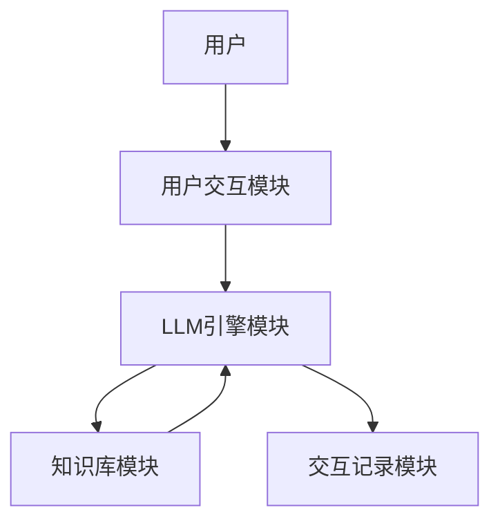
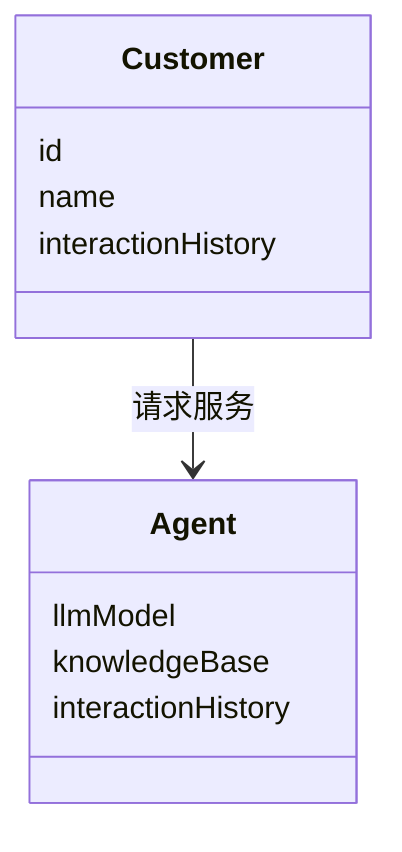
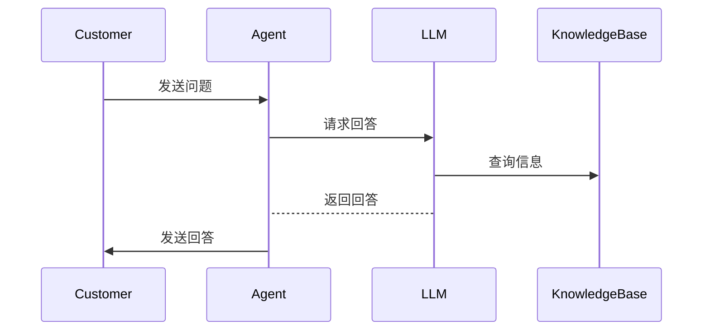

                 


# 智能客户服务AI Agent：LLM驱动的全天候支持系统

> 关键词：智能客服、AI Agent、大语言模型、LLM、24/7支持、自然语言处理

> 摘要：本文探讨了基于大语言模型（LLM）的智能客户服务AI Agent系统，分析了传统客户服务的痛点，详细讲解了LLM在智能客服中的应用原理，系统架构设计，以及实际项目实现。通过案例分析和最佳实践，展示了如何构建一个高效、智能的全天候客户服务系统。

---

## 第一部分：背景与概念

### 第1章：智能客户服务AI Agent的背景与问题背景

#### 1.1 问题背景

- **1.1.1 传统客户服务的痛点**
  - 客服人员数量不足，无法满足24/7需求。
  - 人工客服效率低，客户等待时间长。
  - 服务质量不稳定，依赖个人能力。

- **1.1.2 AI技术在客户服务中的应用潜力**
  - AI可以提供24/7不间断服务。
  - 提高响应速度和准确性。
  - 降低企业运营成本。

- **1.1.3 大语言模型（LLM）的兴起与优势**
  - LLM具备强大的自然语言理解能力。
  - 可以处理复杂对话，提供个性化服务。
  - 通过持续学习，不断优化服务质量。

#### 1.2 问题描述

- **1.2.1 客户服务需求的多样化**
  - 客户问题复杂化，需要多领域知识支持。
  - 不同客户群体的需求差异大。

- **1.2.2 24/7全天候支持的挑战**
  - 传统客服无法实现全天候服务。
  - 需要强大的技术支持和资源分配。

- **1.2.3 传统客服系统的局限性**
  - 依赖人工操作，效率低。
  - 知识库更新缓慢，难以应对新问题。

#### 1.3 问题解决与边界

- **1.3.1 AI Agent的解决方案**
  - 利用LLM实现智能对话。
  - 通过自动化流程提高效率。
  - 提供个性化服务，增强客户体验。

- **1.3.2 边界与外延**
  - 限定在客户服务领域，不涉及其他业务。
  - 仅处理文本交互，不涉及语音或视频。

- **1.3.3 核心要素与组成**
  - LLM模型：提供对话能力。
  - 知识库：存储产品信息和常见问题。
  - 交互界面：客户与AI Agent的接口。

#### 1.4 本章小结

- 本章介绍了传统客户服务的痛点，分析了AI技术的应用潜力，特别是LLM的优势。并提出了AI Agent的解决方案，明确了系统的边界和组成。

---

### 第2章：智能客户服务AI Agent的核心概念

#### 2.1 大语言模型（LLM）的定义与特点

- **2.1.1 LLM的定义**
  - LLM是一种基于深度学习的自然语言处理模型。
  - 具备大规模参数和多层神经网络结构。

- **2.1.2 LLM的核心特点**
  - 强大的上下文理解能力。
  - 可以生成自然流畅的文本。
  - 支持多语言和多任务处理。

- **2.1.3 LLM与传统NLP模型的区别**
  - LLM参数规模更大，能力更强。
  - 传统NLP模型通常针对特定任务设计。

#### 2.2 智能客户服务AI Agent的原理

- **2.2.1 自然语言处理（NLP）基础**
  - NLP是AI Agent的核心技术。
  - 包括文本分词、句法分析、语义理解等。

- **2.2.2 大语言模型的训练与优化**
  - 基于大量数据的监督微调。
  - 通过强化学习优化模型性能。

- **2.2.3 AI Agent的交互机制**
  - 用户输入问题，AI Agent解析并生成回答。
  - 支持多轮对话，保持上下文连贯。

#### 2.3 核心概念对比表

| 对比维度         | LLM                     | 传统NLP模型         |
|------------------|-------------------------|---------------------|
| 参数规模         | 大规模（ billions）     | 小规模（ millions） |
| 任务处理能力     | 支持多种任务，灵活      | 专用任务，固定      |
| 性能             | 更高，生成更自然        | 较低，生成较机械      |

#### 2.4 ER实体关系图

```mermaid
erd
  Customer: 客户
  Agent: AI Agent
  KnowledgeBase: 知识库
  Interaction: 交互记录
  Customer --> Interaction: 发起请求
  Agent --> Interaction: 响应请求
  Agent --> KnowledgeBase: 查询信息
  Interaction --> KnowledgeBase: 更新记录
```

---

## 第三部分：系统架构与算法原理

### 第3章：大语言模型驱动的智能客户服务系统

#### 3.1 系统架构设计

- **3.1.1 系统功能模块划分**
  - 用户交互模块：处理客户输入。
  - LLM引擎模块：生成回答。
  - 知识库模块：存储和检索信息。

- **3.1.2 系统架构图展示**



- **3.1.3 系统架构图的解释**
  - 用户通过交互模块发送请求。
  - 引擎模块调用LLM生成回答。
  - 查询知识库获取支持。
  - 记录模块保存交互历史。

#### 3.2 系统功能设计

- **3.2.1 领域模型设计**



- **3.2.2 功能模块实现**
  - 用户身份验证：确保安全。
  - 问题分类：自动识别问题类型。
  - 自动回复：生成回答并返回。

- **3.2.3 功能模块之间的关系**
  - 用户交互模块与LLM引擎模块双向调用。
  - 知识库模块作为数据支持。

#### 3.3 系统接口设计

- **3.3.1 API接口设计**
  - RESTful API：支持JSON格式请求。
  - 输入接口：`POST /api/query`。
  - 输出接口：`GET /api/response`.

- **3.3.2 接口交互流程**
  - 用户发送请求，系统解析。
  - 引擎调用LLM生成回答。
  - 返回结果给用户。

- **3.3.3 接口设计的注意事项**
  - 确保API安全，防止恶意攻击。
  - 支持错误处理和重试机制。

#### 3.4 系统交互流程图



---

## 第四部分：项目实战

### 第4章：大语言模型驱动的智能客户服务系统实现

#### 4.1 环境安装与配置

- **4.1.1 开发环境的选择**
  - Python 3.8及以上版本。
  - 安装必要的依赖库：`transformers`, `torch`, `fastapi`.

- **4.1.2 依赖库的安装**
  ```bash
  pip install transformers torch fastapi uvicorn
  ```

- **4.1.3 环境配置的注意事项**
  - 确保GPU支持，加速训练。
  - 配置API服务器，设置端口和IP。

#### 4.2 系统核心实现

- **4.2.1 LLM模型的加载与调用**
  ```python
  from transformers import AutoModelForCausalLM, AutoTokenizer

  model_name = "gpt2"
  model = AutoModelForCausalLM.from_pretrained(model_name)
  tokenizer = AutoTokenizer.from_pretrained(model_name)
  ```

- **4.2.2 AI Agent的交互逻辑实现**
  ```python
  def generate_response(prompt):
      inputs = tokenizer.encode(prompt, return_tensors="pt")
      outputs = model.generate(inputs, max_length=100, num_beams=5, temperature=0.7)
      response = tokenizer.decode(outputs[0], skip_special_tokens=True)
      return response
  ```

- **4.2.3 系统功能模块的实现**
  - 知识库模块：存储产品信息。
  - 交互记录模块：保存历史对话。
  - API接口模块：提供RESTful服务。

#### 4.3 代码应用解读与分析

- **4.3.1 知识库模块**
  ```python
  def get_info(query):
      # 查询知识库，返回相关信息
      pass
  ```

- **4.3.2 交互记录模块**
  ```python
  def save_interaction(user_id, query, response):
      # 保存交互记录
      pass
  ```

- **4.3.3 API接口模块**
  ```python
  from fastapi import FastAPI

  app = FastAPI()

  @app.post("/api/query")
  async def query(prompt: str):
      return {"response": generate_response(prompt)}
  ```

---

## 第五部分：总结与展望

### 第5章：总结与展望

#### 5.1 最佳实践与小结

- 确保模型的可解释性，避免黑箱操作。
- 定期更新知识库，保持信息准确。
- 支持多语言和多渠道的交互。

#### 5.2 注意事项与未来展望

- 注意数据隐私和安全问题。
- 未来可以结合图像识别，提供更丰富的服务。
- 持续优化模型，提升对话质量。

---

## 附录

- **附录A：相关术语解释**
  - LLM：大语言模型。
  - NLP：自然语言处理。
  - API：应用程序编程接口。

- **附录B：代码示例**
  ```python
  # FastAPI服务器启动
  uvicorn main:app --reload
  ```

---

通过以上结构，本文详细介绍了智能客户服务AI Agent的背景、核心概念、系统架构和项目实现，为读者提供了一个全面的技术视角。

