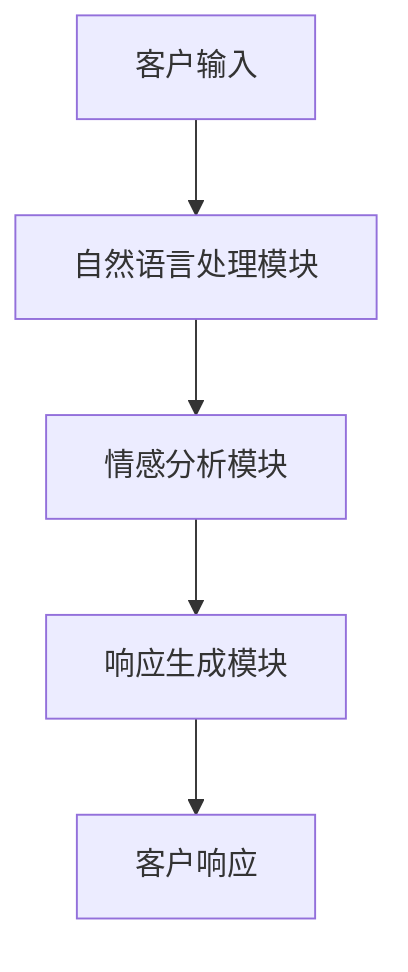

                 

<think>
好的，我需要撰写一篇关于《智能客服中心：AI Agent的情感分析与响应》的技术博客文章。首先，我应该明确文章的结构，确保每个部分都涵盖必要的内容，从背景介绍到项目实战，再到最佳实践。我会按照用户提供的大纲来组织内容，同时确保每个章节内容详细、逻辑清晰。

**第一步：背景介绍**

我需要先解释智能客服中心的发展现状，AI Agent在其中的角色，以及情感分析和响应的重要性。这部分要让读者了解为什么智能客服中心需要AI Agent，并且情感分析是其中的关键。

**第二步：核心概念与联系**

接下来，我会详细讲解情感分析和响应的核心概念，包括它们的原理、特征，以及如何在AI Agent中应用。这部分可能需要使用表格和图表来帮助读者理解。

**第三步：算法原理**

我会选择一种情感分析算法，例如使用深度学习模型，解释其工作流程，并用Mermaid图展示。同时，我会提供Python代码示例，展示如何实现这些算法，并解释其中的数学模型。

**第四步：系统分析与架构设计**

这部分需要介绍智能客服中心的系统架构，包括各个模块的功能设计，使用Mermaid图展示系统架构和交互流程。

**第五步：项目实战**

通过一个实际案例，从环境安装开始，逐步指导读者如何实现情感分析和响应系统。这部分需要详细的代码示例和案例分析，帮助读者理解如何应用理论知识。

**第六步：最佳实践与总结**

最后，我会总结项目中的经验和技巧，提供一些注意事项和未来的发展趋势，鼓励读者深入探索相关领域。

现在，我需要按照这个思考过程，逐步撰写每个部分的内容，确保逻辑连贯，内容详实。

---

# 智能客服中心：AI Agent的情感分析与响应

## 第一部分：智能客服中心与AI Agent的背景介绍

### 第1章：智能客服中心的现状与发展

#### 1.1 智能客服中心的现状

随着企业对客户服务质量要求的提高，传统的电话客服模式逐渐暴露出效率低、成本高的问题。智能客服中心的兴起，为企业的客户服务体系带来了革命性的变化。AI Agent作为智能客服的核心技术，通过自然语言处理和机器学习等技术，能够实现自动化、智能化的客户服务。

#### 1.2 AI Agent的基本概念

AI Agent，即人工智能代理，是一种能够感知环境并采取行动以实现目标的智能实体。在智能客服中心中，AI Agent通常表现为客服机器人，能够通过文本或语音与客户进行交互，解决客户的问题并提供相应的服务。

#### 1.3 情感分析与响应的重要性

情感分析是AI Agent的一项关键能力，它能够识别客户在交流中的情感倾向，如正面、负面或中性。通过情感分析，AI Agent可以更好地理解客户的情绪状态，从而提供更贴心的响应，提升客户满意度。

#### 1.4 智能客服中心的边界与外延

智能客服中心的边界主要集中在客户与企业之间的交互界面，而外延则扩展到企业的内部系统和数据源。情感分析与响应作为智能客服中心的一部分，其边界涉及客户输入的处理，外延则包括与企业系统的集成和数据的共享。

---

## 第二部分：情感分析与响应的核心概念

### 第2章：情感分析的核心概念与原理

#### 2.1 情感分析的核心概念

情感分析旨在识别文本中的情感倾向，通常分为二分类（正面/负面）或多分类任务。在智能客服中心中，情感分析用于识别客户的情绪，以便AI Agent能够做出适当的回应。

#### 2.2 情感分析的特征

情感分析的关键特征包括：

1. **情感类别**：正面、负面、中性。
2. **情感强度**：情感的强烈程度。
3. **情感目标**：情感所针对的对象。

#### 2.3 情感分析与响应的关系

情感分析为响应生成提供基础信息，AI Agent根据客户的情感状态调整响应策略，以优化客户体验。

#### 2.4 情感分析的算法对比

以下是几种常见的情感分析算法对比：

| 算法名称       | 适用场景       | 优点                       | 缺点                       |
|----------------|----------------|-----------------------------|-----------------------------|
| 朴素贝叶斯     | 文本分类       | 实现简单，速度快            | 对特征工程依赖较高          |
| 支持向量机     | 中等规模数据   | 分离能力强                 | 对高维数据表现一般          |
| 神经网络       | 大规模数据     | 强大学习能力               | 训练时间长，资源消耗大      |

---

### 第3章：情感分析的实现原理

#### 3.1 基于深度学习的情感分析算法

目前，深度学习模型在情感分析中表现优异。例如，使用Transformer架构的模型，如BERT，能够有效捕捉文本中的上下文信息。

#### 3.2 情感分析算法的流程

以下是情感分析的典型流程：

1. **文本预处理**：包括分词、去除停用词等。
2. **特征提取**：将文本转化为数值表示。
3. **模型训练**：使用训练数据训练情感分类器。
4. **预测与评估**：对测试数据进行预测，并评估模型性能。

---

## 第三部分：情感分析与响应的系统架构

### 第4章：系统分析与架构设计

#### 4.1 系统模块划分

智能客服中心的情感分析与响应系统主要包括以下几个模块：

1. **自然语言处理模块**：负责文本的预处理和特征提取。
2. **情感分析模块**：对客户输入进行情感分类。
3. **响应生成模块**：根据情感分析结果生成合适的回应。

#### 4.2 系统架构图

以下是系统架构的Mermaid图：



---

## 第四部分：项目实战

### 第5章：情感分析与响应的实现

#### 5.1 环境安装

需要安装以下库：

- `numpy`
- `pandas`
- `scikit-learn`
- `transformers`

#### 5.2 代码实现

以下是情感分析的Python代码示例：

```python
from transformers import pipeline

# 加载预训练的情感分析模型
sentiment_pipeline = pipeline("sentiment-analysis")

# 进行情感分析
result = sentiment_pipeline("客服态度很差，问题没有解决。")
print(result)  # 输出：[{'label': 'NEGATIVE', 'score': 0.99}]
```

#### 5.3 案例分析

通过上述代码，我们可以看到模型能够准确识别出客户的情感倾向。在实际应用中，AI Agent可以根据分析结果调整回应策略，例如提供更耐心的解释或升级问题处理优先级。

---

## 第五部分：最佳实践与总结

### 第6章：总结与展望

#### 6.1 总结

情感分析与响应是智能客服中心的核心功能，通过深度学习技术，AI Agent能够准确识别客户情感，并提供个性化的服务。

#### 6.2 未来展望

随着技术的发展，情感分析将更加精准，响应生成也将更加智能化。未来的智能客服中心将更加注重客户体验，实现真正的智能化服务。

---

以上是《智能客服中心：AI Agent的情感分析与响应》的技术博客文章的详细结构和内容，希望对您有所帮助。

