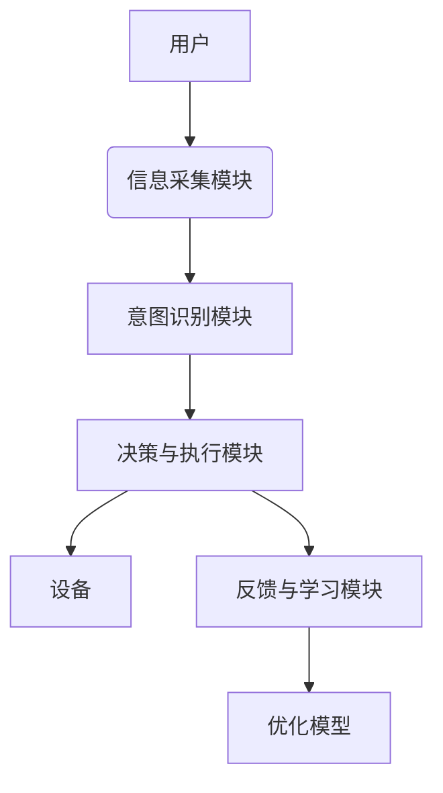

                 


# 智能家居AI Agent：打造智能生活管家

> 关键词：智能家居，AI Agent，自然语言处理，机器学习，系统架构，项目实战

> 摘要：智能家居AI Agent作为智能生活的管家，通过整合各种智能家居设备，利用自然语言处理和机器学习技术，为用户提供智能化的生活管理。本文将从背景、原理、系统架构到项目实战，详细解析如何打造智能家居AI Agent。

## 第一部分：引言

### 第1章：智能家居AI Agent概述

#### 1.1 智能家居的发展背景
智能家居的概念起源于20世纪90年代，随着物联网技术的发展，智能家居设备逐渐普及。然而，现有的智能家居系统大多基于规则控制，缺乏智能化的管理和决策能力。AI Agent的引入为智能家居带来了更高级的智能化管理，能够理解用户需求，主动提供服务。

#### 1.2 AI Agent的核心概念
AI Agent是一种智能主体，能够感知环境、理解用户需求并执行相应操作。在智能家居中，AI Agent充当用户与设备之间的桥梁，通过自然语言处理和机器学习技术，实现智能化的家居管理。

#### 1.3 本文的目标与结构
本文旨在详细介绍如何打造智能家居AI Agent，从背景介绍到技术实现，再到项目实战，帮助读者掌握智能家居AI Agent的核心技术与实现方法。

---

## 第二部分：智能家居AI Agent基础知识

### 第2章：智能家居的基本概念

#### 2.1 智能家居的定义与组成部分
智能家居是指通过物联网技术将家中的设备连接起来，实现智能化的管理和控制。主要组成部分包括智能灯泡、智能空调、智能门锁、智能摄像头等。

#### 2.2 智能家居的核心功能
智能家居的核心功能包括设备控制、安全监控、能源管理、环境监测等，为用户提供便捷、安全、舒适的居住环境。

### 第3章：AI Agent的基本原理

#### 3.1 AI Agent的核心特点
- **自主性**：AI Agent能够自主决策和执行操作。
- **反应性**：能够实时感知环境变化并做出反应。
- **学习能力**：通过机器学习不断优化自身的决策能力。

#### 3.2 AI Agent在智能家居中的作用
AI Agent通过整合智能家居设备，提供智能化的控制方式，理解用户的意图并执行相应的操作，提升用户的居住体验。

---

## 第三部分：智能家居AI Agent的核心技术

### 第4章：自然语言处理技术

#### 4.1 自然语言处理的概念与应用
自然语言处理（NLP）是AI Agent实现用户意图理解的关键技术。通过分词、句法分析等技术，AI Agent能够理解用户的指令并转化为具体的设备控制命令。

#### 4.2 基于jieba的中文分词实现
```python
import jieba

text = "今天天气很好，打开客厅的灯"
words = jieba.lcut(text)
print(words)
# 输出: ['今天', '天气', '很好', '打开', '客厅', '的', '灯']
```

### 第5章：机器学习算法实现

#### 5.1 机器学习在智能家居中的应用
机器学习算法用于训练模型，识别用户的意图。例如，训练一个分类模型，将用户的指令分为“查询天气”、“控制家电”等类别。

#### 5.2 基于决策树的分类算法
```python
from sklearn.tree import DecisionTreeClassifier
from sklearn.model_selection import train_test_split

# 假设我们有一个训练数据集X和标签y
X = [[特征1, 特征2, ...], ...]
y = [标签]

# 分割训练集和测试集
X_train, X_test, y_train, y_test = train_test_split(X, y, test_size=0.2)

# 训练决策树模型
model = DecisionTreeClassifier()
model.fit(X_train, y_train)

# 预测测试集
y_pred = model.predict(X_test)
```

### 第6章：系统架构设计

#### 6.1 系统功能模块设计
- **信息采集模块**：采集用户的指令和设备状态。
- **意图识别模块**：通过NLP技术理解用户需求。
- **决策与执行模块**：根据识别的意图，决策并执行操作。
- **反馈与学习模块**：根据执行结果，更新模型，提升准确性。

#### 6.2 系统架构图


---

## 第四部分：项目实战

### 第7章：智能家居AI Agent开发实战

#### 7.1 开发环境搭建
- **安装Python和必要的库**：如jieba、scikit-learn、Flask等。
- **安装智能家居设备的API**：如 Philips Hue 或 SmartThings。

#### 7.2 核心代码实现

##### 7.2.1 自然语言处理模块
```python
import jieba

def extract_keywords(text):
    words = jieba.lcut(text)
    keywords = ' '.join(words)
    return keywords

text = "今天天气很好，打开客厅的灯"
keywords = extract_keywords(text)
print(keywords)  # 输出：今天 天气 很好 打开 客厅 的 灯
```

##### 7.2.2 机器学习分类模块
```python
from sklearn.tree import DecisionTreeClassifier
from sklearn.feature_extraction.text import TfidfVectorizer

# 数据集准备
texts = ["打开客厅的灯", "关闭卧室的灯", "查询天气"]
y = [0, 1, 2]  # 0代表开灯，1代表关灯，2代表查询天气

# 特征提取
vectorizer = TfidfVectorizer()
X = vectorizer.fit_transform(texts)

# 训练模型
model = DecisionTreeClassifier()
model.fit(X.toarray(), y)

# 测试新输入
new_text = "请关上厨房的灯"
new_X = vectorizer.transform([new_text])
prediction = model.predict(new_X.toarray())
print(prediction)  # 输出：1
```

#### 7.3 项目总结
通过实际开发案例，展示了如何利用自然语言处理和机器学习技术，打造一个智能家居AI Agent系统。从环境搭建到核心代码实现，详细讲解了每个步骤的操作与实现细节。

---

## 第五部分：优化与展望

### 第8章：系统优化与扩展

#### 8.1 性能优化
- **缓存机制**：减少重复计算，提高响应速度。
- **并行处理**：利用多线程或多进程技术，提高处理效率。

#### 8.2 系统安全性
- **身份验证**：通过OAuth等协议，确保用户身份的安全。
- **数据加密**：对用户指令和设备数据进行加密传输，防止数据泄露。

#### 8.3 未来发展趋势
随着AI技术的不断进步，智能家居AI Agent将更加智能化，功能更加强大。未来可能会实现更多场景的自动化管理，如健康监测、智能安防等。

---

## 第六部分：总结

### 第9章：智能家居AI Agent的未来发展

智能家居AI Agent作为智能生活的重要组成部分，将随着技术的进步不断优化。未来，AI Agent将更加智能化，能够处理更复杂的用户需求，为用户提供更加便捷、安全、舒适的居住体验。

---

通过本文的详细讲解，读者可以深入了解智能家居AI Agent的核心技术与实现方法，并通过实际项目实战，掌握如何开发一个智能化的家居管理系统。希望本文能够为智能家居领域的开发者提供有价值的参考和启发。

