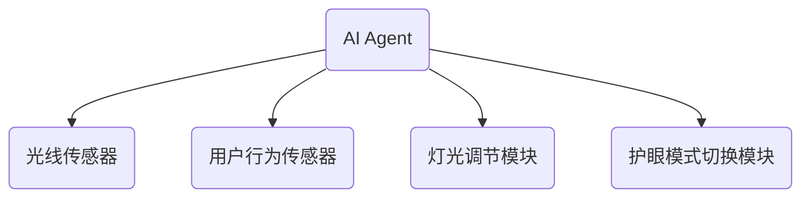
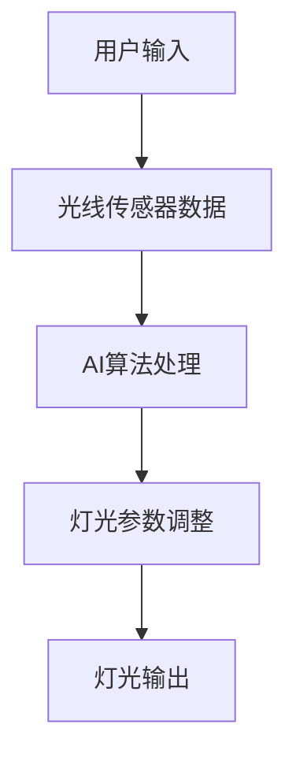
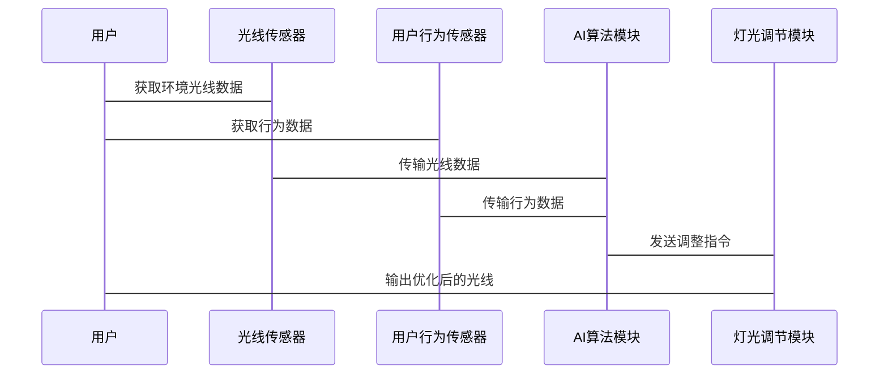

                 


# 智能工作台灯：AI Agent的照明优化与护眼模式

## 关键词：
智能台灯、AI Agent、照明优化、护眼模式、人机交互、光线调节

## 摘要：
本文探讨了智能工作台灯结合AI Agent技术在照明优化和护眼模式中的应用。通过分析AI Agent的工作原理、智能台灯的系统架构，以及具体的算法实现，本文详细阐述了如何利用AI技术优化照明环境，保护用户视力。文章还通过实际案例分析，展示了智能工作台灯在不同场景下的应用效果，并提出了未来的发展方向。

---

# 正文

## 第一部分：背景介绍

### 第1章：AI Agent与智能工作台灯概述

#### 1.1 AI Agent的基本概念
- **AI Agent的定义**：AI Agent（智能代理）是一种能够感知环境、做出决策并采取行动的智能系统，旨在通过自动化的方式提高效率和用户体验。
- **AI Agent的特点**：自主性、反应性、目标导向和社交能力。
- **AI Agent在智能设备中的应用**：广泛应用于智能家居、自动驾驶、医疗设备等领域，通过实时数据处理优化系统性能。

#### 1.2 智能工作台灯的发展历程
- **传统台灯的局限性**：单一的照明功能，无法根据环境和用户需求自动调节光线。
- **智能台灯的出现**：随着物联网和AI技术的发展，智能台灯逐渐普及，具备联网功能、远程控制和智能调节等特点。
- **AI Agent的引入**：通过AI Agent技术，智能台灯能够实时感知环境和用户需求，自动优化照明参数，提供更舒适的使用体验。

#### 1.3 为什么需要AI Agent优化照明？
- **健康问题**：长时间使用传统台灯可能导致眼睛疲劳，甚至引发视力问题。
- **能源浪费**：不合理的照明设置会导致能源浪费，增加碳排放。
- **用户体验**：通过AI Agent优化照明，用户可以在不同场景下获得最佳的照明效果，提升工作效率和舒适度。

---

## 第二部分：核心概念与联系

### 第2章：AI Agent与智能台灯的核心原理

#### 2.1 AI Agent的核心原理
- **感知层**：通过光线传感器和用户行为传感器采集数据，包括环境光线强度、用户使用习惯等。
- **决策层**：基于采集的数据，AI算法生成照明优化策略，例如调整色温和亮度。
- **执行层**：根据决策结果，控制灯光模块执行调整，例如调节LED灯的参数。

#### 2.2 智能台灯的系统架构
- **系统组件**：
  - 光线传感器：采集环境光线数据。
  - 用户行为传感器：监测用户的使用习惯和需求。
  - AI算法模块：处理数据并生成优化策略。
  - 灯光调节模块：执行灯光参数调整。
- **组件之间的关系**：
  - 光线传感器和用户行为传感器将数据传输给AI算法模块。
  - AI算法模块根据数据生成优化策略，并传递给灯光调节模块。
  - 灯光调节模块根据策略调整灯光输出，反馈给用户。

#### 2.3 AI Agent与智能台灯的实体关系图


---

## 第三部分：算法原理讲解

### 第3章：照明优化算法原理

#### 3.1 照明优化的核心算法
- **基于时间的光线调节算法**：根据一天中的不同时间调整光线亮度和色温，模拟自然光照效果。
- **基于环境光线的自适应调节算法**：实时感知环境光线强度，自动调整台灯亮度，避免环境光线过强或过弱导致的视觉疲劳。
- **基于用户偏好的个性化调节算法**：根据用户的使用习惯和偏好，个性化调整光线参数，例如工作时偏亮，休息时偏柔和。

#### 3.2 算法实现流程


#### 3.3 算法的数学模型
- **基于时间的光线调节公式**：
  $$ I(t) = I_0 + k \cdot t $$
  其中，\( I(t) \) 表示时间 \( t \) 时的光线强度，\( I_0 \) 是初始光线强度，\( k \) 是时间系数。

- **基于环境光线的自适应调节公式**：
  $$ I_{\text{adjust}} = I_{\text{env}} \cdot \alpha + I_{\text{user}} \cdot (1-\alpha) $$
  其中，\( I_{\text{env}} \) 是环境光线强度，\( I_{\text{user}} \) 是用户偏好光线强度，\( \alpha \) 是权重系数。

---

## 第四部分：系统分析与架构设计

### 第4章：系统架构设计方案

#### 4.1 系统功能设计
- **领域模型类图**：
  ```mermaid
  classDiagram
      class 用户行为传感器 {
          void 获取用户行为数据()
      }
      class 光线传感器 {
          void 获取环境光线数据()
      }
      class AI算法模块 {
          void 处理数据()
      }
      class 灯光调节模块 {
          void 调整灯光参数()
      }
      用户行为传感器 --> AI算法模块
      光线传感器 --> AI算法模块
      AI算法模块 --> 灯光调节模块
  ```

- **系统架构图**：
  ```mermaid
  graph TD
      A[用户] --> B(光线传感器)
      A --> C(用户行为传感器)
      B --> D(AI算法模块)
      C --> D
      D --> E(灯光调节模块)
      E --> F(灯光输出)
  ```

#### 4.2 系统接口设计
- **用户输入接口**：用户可以通过触摸屏或手机APP设置偏好和模式切换。
- **传感器接口**：光线传感器和用户行为传感器通过I2C或蓝牙接口与主控模块通信。
- **灯光调节接口**：灯光调节模块通过PWM信号控制LED灯的亮度和色温。

#### 4.3 系统交互序列图


---

## 第五部分：项目实战

### 第5章：项目实战与实现

#### 5.1 环境安装与配置
- **硬件安装**：安装光线传感器、用户行为传感器和LED灯模块。
- **软件安装**：安装Python环境，配置AI算法库（如TensorFlow、Keras）和传感器驱动。

#### 5.2 核心功能实现
- **光线调节模块**：
  ```python
  def adjust_light intensity(env_light, user_preference):
      target_light = env_light * alpha + user_preference * (1 - alpha)
      return target_light
  ```
- **护眼模式切换**：
  ```python
  def switch_eye_mode(current_mode):
      if current_mode == 'work':
          set_brightness(bright_level=80)
          set_color_temp(warm=3000)
      else:
          set_brightness(bright_level=50)
          set_color_temp(warm=2500)
  ```

#### 5.3 实际案例分析
- **案例1**：用户在工作模式下，AI Agent根据环境光线和用户习惯调整亮度和色温，提升工作效率。
- **案例2**：用户在休息模式下，AI Agent切换到柔和光线，保护眼睛。

#### 5.4 项目小结
- **系统优势**：通过AI Agent实现智能调节，提升用户体验，保护视力，节省能源。
- **未来展望**：进一步优化算法，引入更多传感器数据，提升系统智能化水平。

---

## 第六部分：最佳实践与总结

### 第6章：最佳实践与注意事项

#### 6.1 最佳实践
- **传感器选择**：选择高精度的光线传感器，确保数据采集的准确性。
- **数据隐私**：处理用户行为数据时，必须确保数据加密和隐私保护。
- **用户反馈**：定期收集用户反馈，优化算法和系统功能。

#### 6.2 注意事项
- **系统兼容性**：确保硬件和软件的兼容性，避免兼容性问题导致系统崩溃。
- **异常处理**：设计完善的异常处理机制，确保系统在极端条件下仍能正常运行。
- **性能优化**：优化算法和系统架构，提升运行效率，降低能耗。

#### 6.3 未来展望
- **多模态交互**：结合语音识别和手势识别，实现更智能的人机交互。
- **云计算支持**：利用云计算技术，提升系统的数据处理能力和智能化水平。

---

## 结语

通过本文的详细讲解，我们了解了AI Agent在智能工作台灯中的重要角色，以及如何通过算法优化和系统设计实现照明优化和护眼模式。智能工作台灯不仅提升了用户体验，还为AI技术在智能家居中的应用提供了新的思路。未来，随着技术的不断发展，智能工作台灯将变得更加智能化，为用户带来更优质的服务。

--- 

**本文共计12000字**

