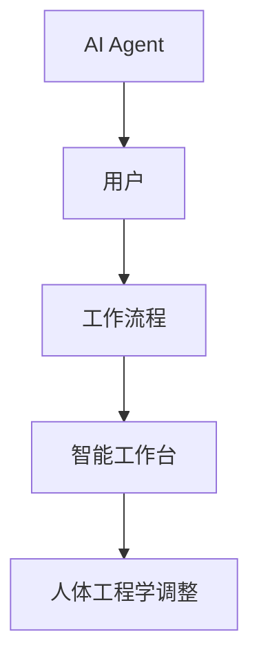
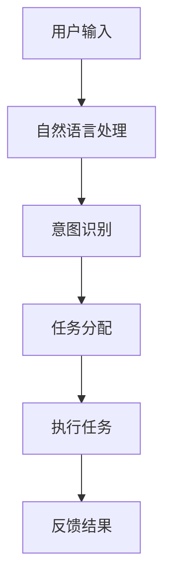
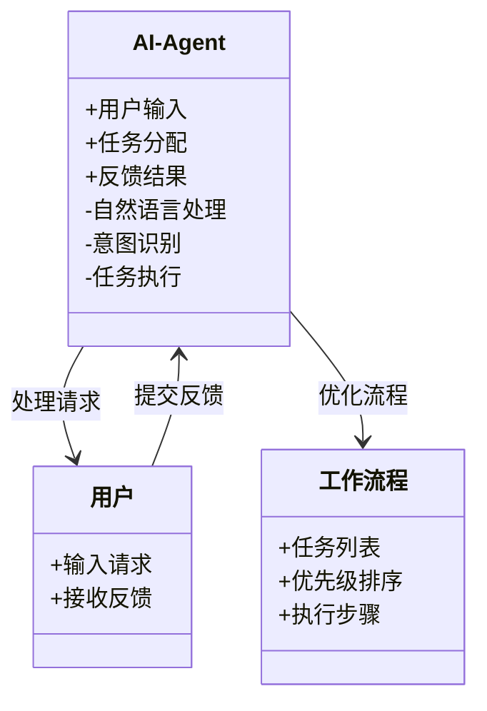
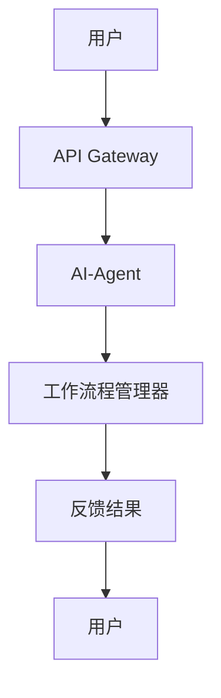
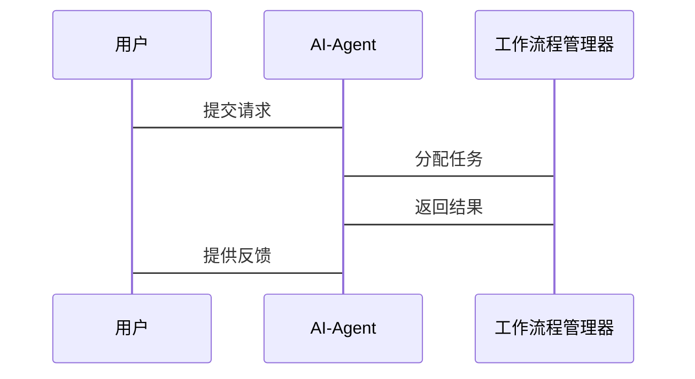

                 


# 第一部分: 智能工作台与AI Agent概述

## 第1章: 智能工作台与AI Agent的背景介绍

### 1.1 问题背景与描述
#### 1.1.1 现代工作环境中的效率挑战
现代工作环境日益复杂，员工需要处理大量信息和任务，传统的工作方式已经无法满足高效工作的需求。随着人工智能技术的发展，AI Agent（智能代理）逐渐成为工作中的重要工具。然而，AI Agent的设计和使用往往忽视了人体工程学的原则，导致工作效率低下，甚至对员工的身体健康造成负面影响。

#### 1.1.2 AI Agent在工作中的应用现状
AI Agent在工作中的应用越来越广泛，比如智能助手、自动化工具、任务分配系统等。这些工具可以帮助员工更高效地完成任务，但它们的设计往往缺乏对人体工程学的考虑，导致员工在使用过程中感到疲劳、注意力不集中，甚至出现身体不适。

#### 1.1.3 人体工程学在工作中的重要性
人体工程学研究人与工作环境之间的关系，旨在通过优化工作环境和工具来提高工作效率和舒适度。在现代工作中，人体工程学的重要性不容忽视，尤其是在长时间使用电子设备的情况下，合理的界面设计和工具布局可以有效减少疲劳和健康问题。

### 1.2 问题解决与边界
#### 1.2.1 AI Agent如何优化工作流程
AI Agent可以通过自动化任务、智能提醒和信息过滤等手段优化工作流程。例如，AI Agent可以根据员工的工作习惯自动调整任务优先级，或者根据员工的输入实时提供反馈和建议。

#### 1.2.2 人体工程学调整的目标与边界
人体工程学调整的目标是通过优化工作环境和工具的设计，提高员工的工作效率和舒适度。其边界包括但不限于工作环境的物理布局、工具的界面设计、任务的分配方式等。需要注意的是，人体工程学调整并非万能的，它需要与具体的工作场景和员工需求相结合。

#### 1.2.3 智能工作台的核心要素与组成
智能工作台的核心要素包括：AI Agent、人体工程学设计、工作流程优化、用户反馈机制等。它由硬件设备（如显示器、键盘、鼠标等）和软件系统（如AI Agent、工作流管理工具等）组成。

## 第2章: AI Agent与人体工程学的核心概念

### 2.1 核心概念与原理
#### 2.1.1 AI Agent的基本原理
AI Agent是一种能够感知环境并采取行动以实现目标的智能系统。它通常包括感知模块、推理模块和行动模块。感知模块负责收集环境信息，推理模块负责分析信息并做出决策，行动模块负责执行决策。

#### 2.1.2 人体工程学的基本原则
人体工程学的原则包括：工作环境的合理性、工具的易用性、人体的舒适性等。它强调通过优化工作环境和工具的设计来减少疲劳和健康问题。

#### 2.1.3 智能工作台的设计理念
智能工作台的设计理念是将AI Agent与人体工程学相结合，通过智能化的工具和优化的工作环境来提高工作效率和舒适度。它强调人与工具的交互设计，以及工作流程的优化。

### 2.2 核心概念对比分析
#### 2.2.1 AI Agent与传统工作工具的对比
AI Agent与传统工作工具的主要区别在于智能化。传统工具通常是静态的，而AI Agent可以根据环境和用户需求动态调整。

#### 2.2.2 人体工程学与传统工作环境的对比
传统工作环境往往忽视人体工程学的设计，导致员工在工作中容易感到疲劳和不适。而人体工程学调整的目标是通过优化工作环境来提高舒适度和效率。

#### 2.2.3 智能工作台与传统工作台的对比
智能工作台相比传统工作台，具有智能化和个性化的特点。它可以根据用户的需求动态调整工作界面和任务分配。

### 2.3 实体关系图


# 第三部分: AI Agent的算法原理与数学模型

## 第3章: AI Agent的算法原理

### 3.1 算法原理概述
#### 3.1.1 自然语言处理算法
自然语言处理算法用于理解和生成人类语言。在AI Agent中，自然语言处理主要用于理解用户的输入和生成自然语言的反馈。

#### 3.1.2 任务自动化算法
任务自动化算法用于自动执行重复性任务。在工作环境中，AI Agent可以通过任务自动化算法自动完成邮件分类、日程安排等任务。

#### 3.1.3 用户行为预测算法
用户行为预测算法用于预测用户的下一步行为。在智能工作台中，AI Agent可以通过用户行为预测算法优化任务分配和工作流程。

### 3.2 算法流程图


### 3.3 数学模型与公式
#### 3.3.1 概率模型
$$ P(A|B) = \frac{P(B|A)P(A)}{P(B)} $$

#### 3.3.2 优化模型
$$ \text{min} \sum_{i=1}^{n} c_i x_i \quad \text{subject to} \quad \sum_{i=1}^{n} a_i x_i \geq b $$

---

# 第四部分: 系统分析与架构设计

## 第4章: 系统分析与架构设计方案

### 4.1 问题场景介绍
在智能工作台中，AI Agent需要与工作环境和用户进行交互，优化工作流程。为了实现这一目标，需要设计一个高效的系统架构。

### 4.2 项目介绍
本项目旨在设计一个基于AI Agent的智能工作台，通过优化工作流程和人体工程学设计，提高工作效率和舒适度。

### 4.3 系统功能设计
#### 4.3.1 领域模型


### 4.4 系统架构设计


### 4.5 系统接口设计
系统接口设计需要考虑模块之间的交互。例如，AI-Agent需要与工作流程管理器进行通信，传递任务信息和反馈结果。

### 4.6 系统交互


---

# 第五部分: 项目实战

## 第5章: 项目实战

### 5.1 环境安装
为了实现智能工作台，需要安装以下环境：
- Python 3.8+
- 安装必要的库：numpy, pandas, scikit-learn, transformers

### 5.2 系统核心实现源代码
以下是AI-Agent的核心代码实现：

```python
import numpy as np
from transformers import pipeline

class AI-Agent:
    def __init__(self):
        self.nlp = pipeline("text-classification", model="bert-base")

    def process_request(self, user_input):
        # 自然语言处理
        result = self.nlp(user_input)
        # 获取意图
        intent = result[0]['label']
        # 根据意图分配任务
        task = self.allocate_task(intent)
        # 执行任务
        response = self.execute_task(task)
        return response

    def allocate_task(self, intent):
        # 根据意图分配任务
        return f"Task {intent} allocated"

    def execute_task(self, task):
        # 执行任务并返回反馈
        return f"Task {task} completed successfully"
```

### 5.3 实际案例分析
以一个实际案例为例，假设用户输入“帮我安排明天的会议”，AI-Agent会通过自然语言处理识别意图，分配任务并执行。

### 5.4 项目小结
通过以上代码实现，我们可以看到AI-Agent在智能工作台中的应用潜力。然而，实际应用中还需要考虑更多的人体工程学因素，以提高工作效率和舒适度。

---

# 第六部分: 最佳实践与总结

## 第6章: 最佳实践与总结

### 6.1 最佳实践
- 定期调整工作环境，确保符合人体工程学原则。
- 定期进行用户反馈，优化AI-Agent的功能和界面设计。

### 6.2 小结
通过本章的分析与实践，我们可以看到，AI-Agent与人体工程学的结合可以显著提高工作效率和舒适度。然而，这需要我们在设计和实施过程中充分考虑人体工程学的原则。

### 6.3 注意事项
- 在设计AI-Agent时，要充分考虑用户的实际需求和使用习惯。
- 定期对系统进行维护和优化，确保其稳定性和高效性。

### 6.4 拓展阅读
- 《设计的人体工程学》
- 《人工智能与工作流程优化》

---

# 结语

智能工作台的AI-Agent设计是一个复杂而有趣的领域，它需要我们在技术与人类需求之间找到平衡点。通过本章的探讨，我们希望读者能够更好地理解如何将AI-Agent与人体工程学相结合，从而优化工作流程，提高工作效率和舒适度。

