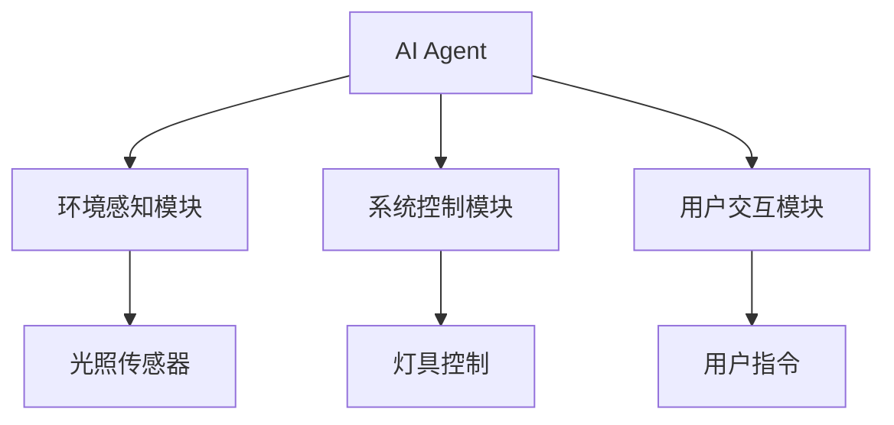
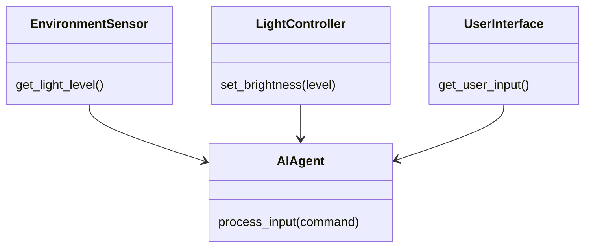
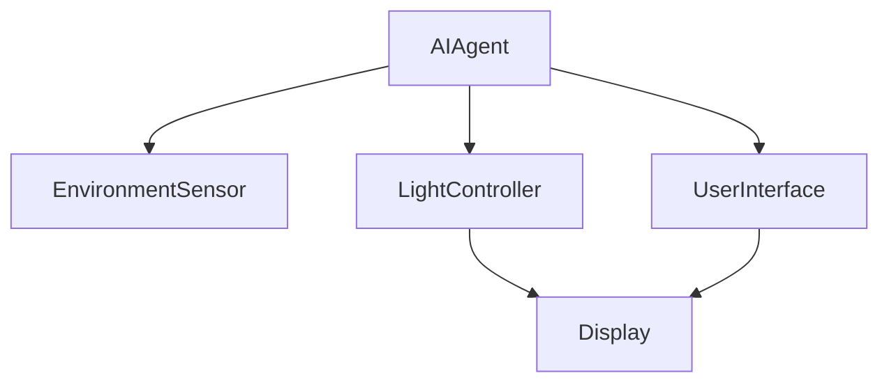
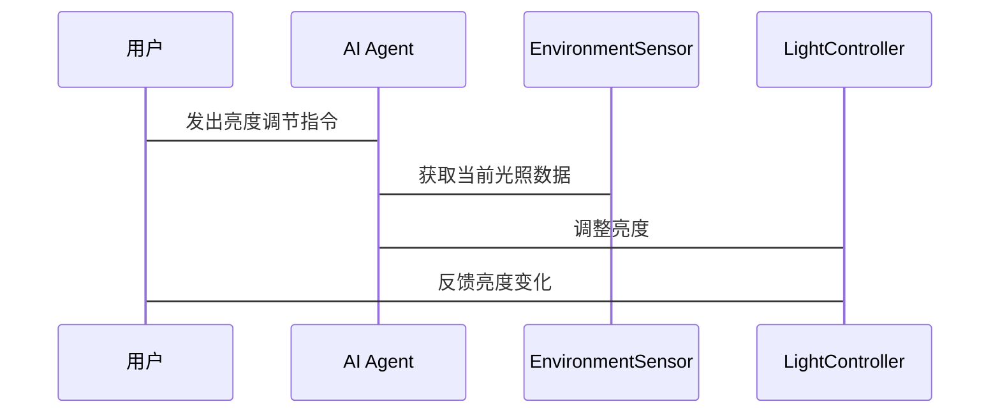

                 


# 智能工作灯：AI Agent的照明优化系统

## 关键词：
智能工作灯、AI Agent、照明优化、系统设计、算法原理、项目实战

## 摘要：
本文深入探讨了智能工作灯结合AI Agent的照明优化系统，从问题背景、核心概念到算法实现，系统分析与架构设计，以及项目实战，全面解析了智能工作灯的原理与实现。文章详细阐述了AI Agent在照明优化中的应用，通过数学模型、算法流程和系统架构的设计，展示了智能工作灯如何实现高效、节能、智能的照明控制。文章还通过实际案例分析，验证了系统的可行性和优化效果。

---

# 第一部分: 智能工作灯与AI Agent的背景与概念

# 第1章: 背景介绍
## 1.1 问题背景
### 1.1.1 照明系统优化的必要性
现代社会对能源效率的要求不断提高，传统照明系统能耗高、智能化程度低，无法满足用户对智能化、个性化照明的需求。

### 1.1.2 AI技术在照明系统中的应用潜力
人工智能技术的快速发展为照明系统的智能化提供了新的可能性，特别是AI Agent（智能体）能够通过感知环境、推理和决策，实现智能控制。

### 1.1.3 当前照明系统的主要挑战
传统照明系统存在能耗高、控制方式单一、用户交互性差等问题，亟需通过智能化技术进行优化。

## 1.2 问题描述
### 1.2.1 照明系统能耗问题
照明系统的能耗占建筑物总能耗的很大比例，如何降低能耗是照明优化的重要目标。

### 1.2.2 照明系统的智能化需求
用户对个性化、智能化的照明需求不断增加，传统照明系统无法满足这些需求。

### 1.2.3 用户对智能照明的期待
用户希望照明系统能够根据环境和需求自动调节，提供更舒适、更节能的照明体验。

## 1.3 问题解决
### 1.3.1 AI Agent在照明优化中的作用
AI Agent通过感知环境、推理和决策，能够实现智能的照明控制，满足用户需求并降低能耗。

### 1.3.2 智能工作灯的核心功能
智能工作灯结合AI Agent，能够根据环境光照、用户需求和能耗目标，智能调节照明亮度和色温。

### 1.3.3 系统实现的可行性分析
通过AI技术与物联网技术的结合，智能工作灯的实现是技术上可行的，能够满足实际应用需求。

## 1.4 边界与外延
### 1.4.1 系统边界定义
智能工作灯系统的核心功能包括环境感知、智能控制和用户交互，与其他系统的接口通过标准协议实现。

### 1.4.2 系统外延与扩展性
系统可以扩展至多设备联动、用户行为分析、能源管理等功能，形成完整的智能照明生态系统。

### 1.4.3 与其他系统的接口关系
智能工作灯系统可以通过Wi-Fi、蓝牙等协议与其他智能家居设备联动，形成更大的智能生态系统。

## 1.5 核心概念组成
### 1.5.1 AI Agent的定义与特征
AI Agent是一种能够感知环境、推理和决策的智能体，具有主动性、适应性和学习能力。

### 1.5.2 智能工作灯的功能模块
智能工作灯包括环境感知模块、系统控制模块和用户交互模块，分别负责数据采集、决策控制和用户交互。

### 1.5.3 系统的核心要素分析
系统的核心要素包括传感器、灯具、AI算法、用户需求和能耗目标，通过这些要素的协同工作实现智能控制。

---

# 第2章: 核心概念与联系
## 2.1 AI Agent的核心原理
### 2.1.1 AI Agent的基本原理
AI Agent通过感知环境数据，利用知识图谱和推理机制进行决策，并通过执行模块实现目标。

### 2.1.2 知识图谱与推理机制
知识图谱用于表示环境和用户需求的知识，推理机制通过逻辑推理和上下文分析做出决策。

### 2.1.3 自然语言处理在AI Agent中的应用
通过自然语言处理技术，AI Agent能够理解用户的语音或文本指令，并生成相应的控制指令。

## 2.2 智能工作灯的功能模块
### 2.2.1 环境感知模块
环境感知模块通过光照传感器采集环境光照数据，并通过AI算法分析环境变化。

### 2.2.2 系统控制模块
系统控制模块根据环境数据和用户需求，通过灯具控制模块调节照明亮度和色温。

### 2.2.3 用户交互模块
用户交互模块通过触摸屏或语音助手与用户进行交互，接收用户的指令并反馈系统状态。

## 2.3 核心概念对比
### 2.3.1 AI Agent与传统控制系统的对比
AI Agent具有主动性、适应性和学习能力，能够根据环境变化自主决策，而传统控制系统需要手动调整。

### 2.3.2 智能工作灯与普通照明设备的对比
智能工作灯具有智能化的控制功能，能够根据环境和用户需求自动调节，而普通照明设备仅能手动控制。

### 2.3.3 系统功能与用户需求的对比
系统功能需要满足用户的个性化需求，同时兼顾节能和舒适性。

## 2.4 实体关系图


---

# 第3章: 算法原理讲解
## 3.1 AI Agent的算法流程
### 3.1.1 数据采集与处理
AI Agent通过环境感知模块采集光照数据，并通过预处理模块去除噪声，提取有用信息。

### 3.1.2 知识表示与推理
通过知识图谱表示环境和用户需求的知识，利用逻辑推理和上下文分析做出决策。

### 3.1.3 决策与执行
根据推理结果生成控制指令，并通过系统控制模块执行，同时反馈执行结果。

## 3.2 算法实现
### 3.2.1 环境感知算法
```python
# 光照传感器数据采集
def get_light_level():
    # 模拟传感器数据
    return random.uniform(0, 100)
```

### 3.2.2 系统控制算法
```python
# 照明亮度调节算法
def adjust_brightness(target_level):
    current_level = get_light_level()
    while abs(current_level - target_level) > 5:
        current_level += 1
        time.sleep(0.1)
    return current_level
```

### 3.2.3 用户交互算法
```python
# 语音交互算法
def process_voice_command(command):
    # 分析用户指令
    if "increase brightness" in command:
        adjust_brightness(10)
    elif "decrease brightness" in command:
        adjust_brightness(-10)
```

## 3.3 数学模型与公式
### 3.3.1 照度计算公式
$$ I = I_0 \times e^{-k \times d} $$
其中，\( I \) 是当前照度，\( I_0 \) 是初始照度，\( k \) 是衰减系数，\( d \) 是距离。

### 3.3.2 节能优化公式
$$ E = \sum_{i=1}^{n} (P_i \times t_i) $$
其中，\( E \) 是总能耗，\( P_i \) 是第 \( i \) 个设备的功率，\( t_i \) 是运行时间。

### 3.3.3 系统响应时间模型
$$ T = \sum_{i=1}^{m} t_i $$
其中，\( T \) 是系统响应时间，\( t_i \) 是每个模块的响应时间。

---

# 第4章: 系统分析与架构设计
## 4.1 问题场景介绍
智能工作灯系统需要在办公室、家庭等多种场景中实现智能照明控制，满足用户的个性化需求并降低能耗。

## 4.2 系统功能设计
### 4.2.1 功能需求分析
系统需要实现环境感知、智能控制、用户交互等功能。

### 4.2.2 领域模型设计


### 4.2.3 系统架构设计


### 4.2.4 接口设计
系统通过标准接口与灯具、传感器和其他设备通信，支持多种协议如Wi-Fi、蓝牙和ZigBee。

### 4.2.5 交互流程


---

# 第5章: 项目实战
## 5.1 环境安装
### 5.1.1 硬件安装
安装光照传感器、灯具和控制模块，确保设备正常工作。

### 5.1.2 软件安装
安装AI Agent和用户交互界面，配置系统参数。

## 5.2 系统核心实现
### 5.2.1 核心代码实现
```python
class AIAgent:
    def __init__(self):
        self.sensor = EnvironmentSensor()
        self.controller = LightController()
        self.interface = UserInterface()

    def process_command(self, command):
        if command == "increase":
            self.controller.set_brightness(10)
        elif command == "decrease":
            self.controller.set_brightness(-10)
```

### 5.2.2 代码应用解读与分析
AI Agent通过传感器获取环境数据，并根据用户指令调整灯具亮度，实现智能控制。

## 5.3 实际案例分析
通过实际案例分析，验证系统在不同场景下的优化效果，如办公室环境中的节能效果和用户体验提升。

## 5.4 项目小结
通过项目实战，验证了智能工作灯系统的可行性和优化效果，为后续优化提供了参考。

---

# 第6章: 应用与优化
## 6.1 应用场景分析
智能工作灯系统可以应用于家庭、办公室、公共场所等多种场景，满足不同用户的需求。

## 6.2 系统优化建议
通过优化AI算法、增加设备联动、提升用户交互体验等方式进一步优化系统性能。

## 6.3 最佳实践 tips
- 定期更新AI算法模型，提升系统智能性。
- 优化系统响应时间，提升用户体验。
- 加强设备联动，实现更复杂的智能控制。

## 6.4 小结
智能工作灯结合AI Agent的照明优化系统在实际应用中展现了广阔的应用前景，通过持续优化和创新，将进一步提升系统的智能化水平和用户体验。

---

# 第7章: 总结与展望
## 7.1 全文总结
本文详细探讨了智能工作灯结合AI Agent的照明优化系统，从背景、核心概念到算法实现，系统分析与架构设计，以及项目实战，全面解析了智能工作灯的原理与实现。

## 7.2 未来展望
未来，随着AI技术的不断发展，智能工作灯系统将更加智能化、个性化，能够实现更复杂的智能控制和优化，为用户带来更好的照明体验。

--- 

# 附录
## 附录A: 相关技术术语解释
## 附录B: 系统架构设计图
## 附录C: 项目代码示例

