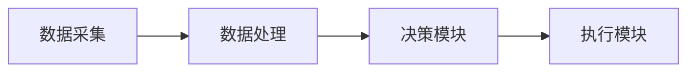

                 


# 智能工作站：AI Agent的效率优化助手

> 关键词：AI Agent, 智能工作站, 效率优化, 系统架构, 项目实战

> 摘要：本文探讨了AI Agent在智能工作站中的应用，详细介绍了AI Agent的核心概念、算法原理、系统架构及项目实战。通过深入分析，展示了如何利用AI技术提升工作效率，并提供了实际案例和最佳实践。

---

## 第1章: AI Agent的基本概念与背景

### 1.1 AI Agent的定义与特点

AI Agent（人工智能代理）是一种能够感知环境、自主决策并执行任务的智能实体。它通过传感器获取信息，利用算法进行分析，并通过执行器完成目标。

**特点：**

- **自主性**：无需外部干预，自主完成任务。
- **反应性**：实时感知环境变化并做出反应。
- **目标导向**：以明确的目标为导向，优化决策。

### 1.2 AI Agent在智能工作站中的应用

智能工作站通过AI Agent实现自动化、智能化的效率优化。AI Agent能够处理复杂任务，如数据分析、流程优化和资源调度。

**应用场景：**

- **自动化处理**：自动完成重复性任务，如数据录入、邮件分发。
- **智能决策支持**：基于数据提供决策建议。
- **资源优化**：动态分配资源，提高效率。

---

## 第2章: 智能工作站的背景与需求

### 2.1 工作效率提升的必要性

现代工作环境复杂多变，提高效率成为关键。AI Agent通过自动化和智能化手段，帮助用户在复杂任务中节省时间。

**挑战：**

- **信息过载**：海量数据难以处理。
- **效率瓶颈**：重复性任务耗时耗力。
- **决策难度**：复杂决策需要快速响应。

### 2.2 AI技术在效率优化中的作用

AI技术通过数据处理、模式识别和预测分析，为效率优化提供支持。

**优势：**

- **数据处理**：高效处理和分析大量数据。
- **模式识别**：发现数据中的隐藏规律。
- **预测分析**：预测未来趋势，辅助决策。

---

## 第3章: AI Agent的核心概念与工作原理

### 3.1 AI Agent的核心概念

AI Agent的工作流程包括感知、决策和执行三个阶段。

**感知层**：通过传感器获取环境信息。
**决策层**：基于感知信息进行分析和决策。
**执行层**：通过执行器完成任务。

### 3.2 AI Agent的工作流程

AI Agent的工作流程可以表示为一个循环：感知 → 决策 → 执行 → 反馈。


---

## 第4章: AI Agent的算法原理

### 4.1 感知算法

感知算法用于从环境中获取信息。

**信息提取算法**：从数据中提取有用信息。
**数据分析算法**：对数据进行统计分析。

### 4.2 决策算法

决策算法基于感知信息进行优化。

**优化算法**：寻找最优解。
**预测算法**：预测未来趋势。

### 4.3 执行算法

执行算法将决策转化为具体行动。

**自动化执行算法**：自动完成任务。
**调整优化算法**：动态调整执行策略。

---

## 第5章: AI Agent的数学模型与公式

### 5.1 感知模型

**数据预处理公式**：
$$
x' = \frac{x - \mu}{\sigma}
$$
其中，$\mu$ 是均值，$\sigma$ 是标准差。

**特征提取公式**：
$$
f(x) = \sum_{i=1}^{n} w_i x_i
$$

### 5.2 决策模型

**优化目标函数**：
$$
\min_{x} f(x) + \lambda g(x)
$$

**预测模型公式**：
$$
y = \theta x + \epsilon
$$

---

## 第6章: 智能工作站的系统架构

### 6.1 系统功能模块

**数据采集模块**：获取环境数据。
**数据处理模块**：处理和分析数据。
**决策模块**：制定决策。
**执行模块**：执行任务。

### 6.2 系统架构设计



---

## 第7章: 项目实战

### 7.1 环境安装

安装Python和相关库：
```bash
pip install numpy pandas scikit-learn
```

### 7.2 核心代码实现

```python
import numpy as np
from sklearn import linear_model

# 数据预处理
def preprocess(data):
    mu = np.mean(data)
    sigma = np.std(data)
    return (data - mu) / sigma

# 决策算法
def decision_algorithm(data):
    model = linear_model.LinearRegression()
    model.fit(data)
    return model.predict(data)
```

### 7.3 案例分析

通过案例分析，验证AI Agent在智能工作站中的实际效果。例如，通过数据分析优化资源分配，提升效率。

---

## 第8章: 最佳实践

### 8.1 小结

本文详细介绍了AI Agent在智能工作站中的应用，从理论到实践，全面探讨了其在效率优化中的作用。

### 8.2 注意事项

- **数据质量**：确保数据准确可靠。
- **算法选择**：根据需求选择合适的算法。
- **系统维护**：定期更新和优化系统。

### 8.3 拓展阅读

- 推荐阅读《人工智能：一种现代的方法》和《机器学习实战》。

---

通过本文的分析，读者可以全面理解AI Agent在智能工作站中的应用，并将其应用于实际工作中，提升效率和决策能力。

