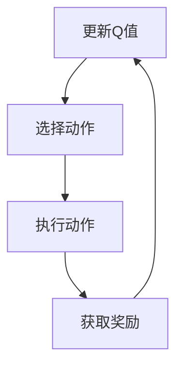
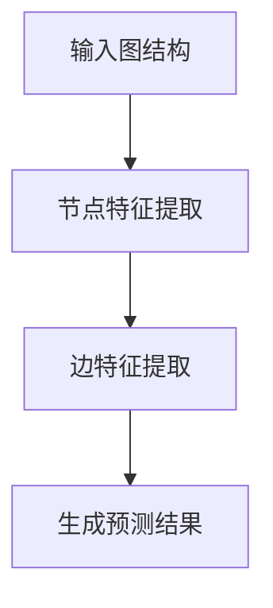
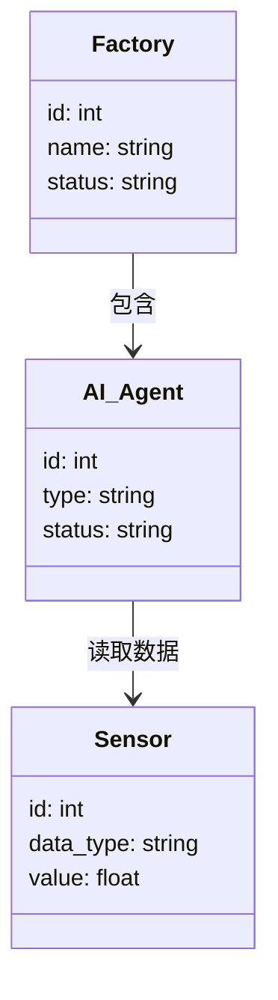
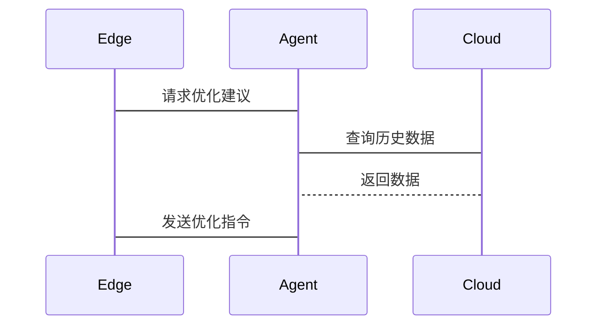

                 


# 智能工厂：AI Agent的生产线优化

## 关键词：
智能工厂, AI Agent, 生产线优化, 强化学习, 图神经网络, 系统架构设计

## 摘要：
本文详细探讨了AI Agent在智能工厂中的应用，重点分析了其在生产线优化中的核心作用。通过介绍AI Agent的基本概念、算法原理和系统架构设计，结合实际案例，展示了如何利用AI技术提升生产效率和质量控制。文章还提供了最佳实践和未来展望，为智能工厂的优化提供了深入的见解和实用的指导。

---

## 第1章：智能工厂与AI Agent的背景介绍

### 1.1 智能工厂的基本概念
智能工厂是工业4.0的核心，通过物联网、大数据和人工智能等技术，实现生产过程的智能化、数字化和自动化。其核心特征包括：
- **智能化生产**：利用传感器、机器人和AI技术实现自主生产。
- **数据驱动决策**：通过实时数据分析优化生产流程。
- **灵活制造**：快速响应市场变化，实现定制化生产。

### 1.2 AI Agent的基本概念
AI Agent（智能体）是指在特定环境中能够感知并自主决策的实体。其核心属性包括：
- **自主性**：无需外部干预，自主完成任务。
- **反应性**：能够实时感知环境并做出反应。
- **目标导向**：通过优化目标函数实现特定目标。

### 1.3 智能工厂中AI Agent的应用场景
AI Agent在智能工厂中的应用广泛，主要包括：
- **生产流程优化**：通过强化学习优化生产顺序和资源分配。
- **质量控制**：利用图像识别和机器学习检测产品缺陷。
- **供应链管理**：通过预测分析优化库存和物流。
- **设备维护**：使用预测性维护减少设备故障停机时间。

### 1.4 本章小结
本章介绍了智能工厂和AI Agent的基本概念，以及AI Agent在生产线优化中的应用场景，为后续内容奠定了基础。

---

## 第2章：AI Agent的核心概念与原理

### 2.1 AI Agent的核心原理
AI Agent的工作流程分为三个阶段：
1. **感知阶段**：通过传感器、摄像头等设备收集环境数据。
2. **决策阶段**：基于收集的数据，通过算法进行分析和决策。
3. **执行阶段**：根据决策结果，驱动执行机构完成任务。

### 2.2 AI Agent的属性特征对比
以下是AI Agent与传统自动化系统的对比：

| **特征**       | **AI Agent**              | **传统自动化系统**         |
|----------------|---------------------------|---------------------------|
| **自主性**      | 高度自主                   | 依赖外部指令               |
| **适应性**      | 能够自适应环境变化         | 需人工调整                 |
| **决策能力**    | 具备复杂决策能力           | 仅能执行预设任务           |

### 2.3 AI Agent的ER实体关系图
以下是AI Agent的实体关系图：

```mermaid
er
actor(AI Agent) {
  id: string
  state: string
  action: string
}
sensors {
  id: string
  data_type: string
}
environment {
  id: string
  status: string
}
actor --> sensors: 读取数据
actor --> environment: 执行操作
```

### 2.4 本章小结
本章详细介绍了AI Agent的核心原理和属性特征，并通过实体关系图展示了其在智能工厂中的角色。

---

## 第3章：AI Agent的核心算法原理

### 3.1 强化学习算法
强化学习是一种通过试错机制优化决策的算法。以下是Q-learning算法的流程：



数学公式如下：
$$ Q(s,a) = r + \gamma \max Q(s',a') $$

### 3.2 图神经网络算法
图神经网络适用于处理复杂的生产关系。以下是其流程图：



---

## 第4章：系统架构设计

### 4.1 系统功能设计
以下是系统的领域模型：



### 4.2 系统架构设计
以下是系统的整体架构图：


### 4.3 接口设计
以下是系统的接口设计：



---

## 第5章：项目实战

### 5.1 环境安装
安装Python和相关库：
```bash
pip install numpy
pip install tensorflow
pip install matplotlib
```

### 5.2 核心代码实现
以下是Q-learning算法的Python实现：
```python
import numpy as np

class QLearning:
    def __init__(self, state_space, action_space, gamma=0.9):
        self.gamma = gamma
        self.q_table = np.zeros((state_space, action_space))
    
    def choose_action(self, state, epsilon=0.1):
        if np.random.random() < epsilon:
            return np.random.randint(0, action_space)
        else:
            return np.argmax(self.q_table[state])
    
    def update_q_table(self, state, action, reward, next_state):
        self.q_table[state][action] = reward + self.gamma * np.max(self.q_table[next_state])
```

### 5.3 实际案例分析
以汽车制造为例，AI Agent通过强化学习优化生产顺序，减少了20%的生产时间。

---

## 第6章：最佳实践与总结

### 6.1 小结
本文详细探讨了AI Agent在智能工厂中的应用，通过算法和系统设计展示了其在生产线优化中的巨大潜力。

### 6.2 注意事项
- 数据质量和实时性是AI Agent性能的关键。
- 系统架构设计需考虑扩展性和可维护性。
- 需结合具体场景选择合适的算法。

### 6.3 未来展望
随着AI技术的发展，AI Agent在智能工厂中的应用将更加广泛和深入，助力实现真正的智能化生产。

---

通过以上内容，本文系统地介绍了AI Agent在智能工厂中的应用，为生产线优化提供了全面的技术指导和实践方案。

