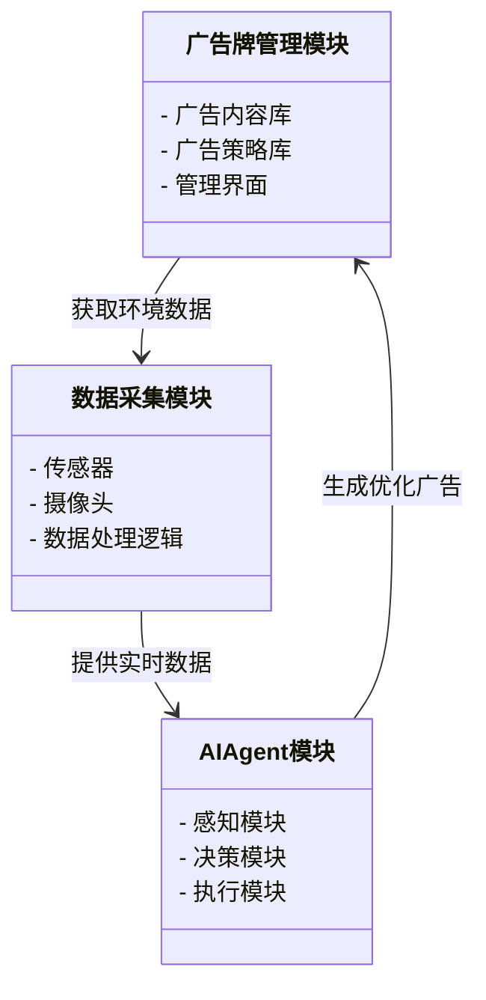
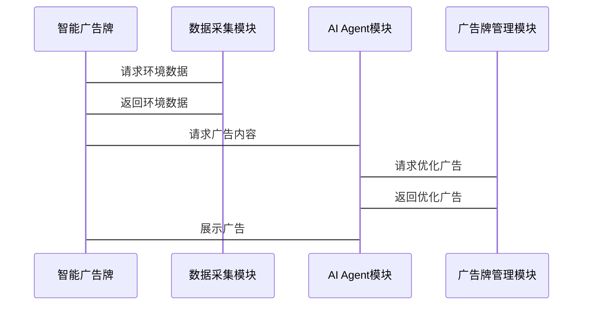

                 


# 智能广告牌：AI Agent的实时内容调整

> 关键词：智能广告牌，AI Agent，实时内容调整，机器学习，动态内容生成

> 摘要：本文深入探讨了智能广告牌中的AI Agent技术，分析了其实时内容调整的原理与实现，涵盖了从背景概述到系统架构设计的全过程，结合实际案例详细讲解了AI Agent在智能广告牌中的应用及其带来的商业价值。

---

## 第一部分：背景与概述

### 第1章：智能广告牌与AI Agent概述

#### 1.1 智能广告牌的基本概念

##### 1.1.1 广告牌的传统功能与局限性
传统的广告牌主要依靠固定的广告内容展示，无法根据环境、观众或实时数据进行动态调整。这种静态的展示方式在信息量爆炸的时代显得效率低下，难以满足精准营销的需求。

##### 1.1.2 智能广告牌的定义与特点
智能广告牌是一种结合了人工智能、物联网和实时数据处理技术的新型广告展示设备。其特点包括：  
- **实时感知**：能够实时采集和分析环境数据（如观众行为、时间、天气等）。  
- **动态调整**：根据分析结果，快速生成和展示个性化广告内容。  
- **智能优化**：通过机器学习算法不断优化广告内容和展示策略。

##### 1.1.3 AI Agent在智能广告牌中的作用
AI Agent（智能代理）作为智能广告牌的核心技术，负责数据的采集、分析、决策和执行。它能够实时感知环境变化，快速生成最优广告内容，并通过反馈机制不断优化广告策略。

---

#### 1.2 智能广告牌的应用场景

##### 1.2.1 零售场景中的智能广告牌
在商场、超市等零售场景中，智能广告牌可以根据顾客的实时行为（如停留时间、浏览路径）动态调整广告内容，提升广告的转化率。

##### 1.2.2 公共场所的智能广告牌
在机场、车站等公共场所，智能广告牌可以根据时间、人群密度和活动信息动态调整广告内容，提供更加精准的信息服务。

##### 1.2.3 企业内部的智能广告牌应用
企业可以利用智能广告牌进行内部信息传递、员工通知和企业文化宣传，提升内部沟通效率。

---

#### 1.3 智能广告牌的行业现状

##### 1.3.1 全球智能广告牌市场分析
随着人工智能和物联网技术的快速发展，全球智能广告牌市场呈现出快速增长的趋势，特别是在数字化转型加速的背景下，企业对智能广告牌的需求日益增加。

##### 1.3.2 国内智能广告牌的发展趋势
国内市场潜力巨大，尤其是在一线城市，智能广告牌的应用场景逐渐普及。预计未来几年，国内智能广告牌市场将保持高速增长。

##### 1.3.3 行业痛点与机遇
尽管智能广告牌市场前景广阔，但其推广和应用仍面临一些痛点，如技术门槛高、成本投入大、数据隐私等问题。然而，这些痛点也为企业提供了创新和优化的机会。

---

### 第2章：AI Agent的核心技术与实现

#### 2.1 AI Agent的基本原理

##### 2.1.1 AI Agent的定义与分类
AI Agent是一种能够感知环境、自主决策并执行任务的智能实体。根据应用场景的不同，AI Agent可以分为 **简单反射型**、**基于模型的反应型**、**目标驱动型** 和 **效用驱动型** 四类。

##### 2.1.2 AI Agent的核心技术
AI Agent的核心技术包括：  
- **感知技术**：通过传感器、摄像头等设备采集环境数据。  
- **决策技术**：利用机器学习算法进行数据分析和决策。  
- **执行技术**：通过广告牌展示模块执行决策结果。

##### 2.1.3 AI Agent与传统广告牌的区别
AI Agent使得广告牌从被动展示转向主动感知和动态调整，能够根据实时数据优化广告内容，从而提高广告效果。

---

#### 2.2 实时内容调整的实现机制

##### 2.2.1 数据采集与处理
智能广告牌通过传感器、摄像头等设备采集环境数据，并通过边缘计算技术进行实时处理。

##### 2.2.2 内容生成与优化
基于机器学习算法，AI Agent生成最优广告内容，并通过反馈机制不断优化广告策略。

##### 2.2.3 内容分发与展示
生成的广告内容通过广告牌展示模块实时展示，并通过数据采集模块收集观众反馈，形成闭环优化。

---

#### 2.3 AI Agent的算法基础

##### 2.3.1 机器学习算法简介
常用的机器学习算法包括 **监督学习**、**无监督学习** 和 **强化学习**。AI Agent可以根据具体场景选择合适的算法。

##### 2.3.2 自然语言处理技术
自然语言处理技术用于分析观众的行为和偏好，生成更加精准的广告内容。

##### 2.3.3 图像处理与生成技术
图像处理技术用于优化广告视觉效果，生成吸引观众注意力的内容。

---

## 第二部分：核心概念与技术原理

### 第3章：AI Agent的感知与决策机制

#### 3.1 感知模块

##### 3.1.1 数据采集与预处理
AI Agent通过传感器和摄像头采集环境数据，并进行数据清洗和特征提取。

##### 3.1.2 用户行为分析
通过分析用户的停留时间、点击行为等数据，生成用户画像。

##### 3.1.3 环境感知与实时反馈
AI Agent根据环境数据（如时间、天气）调整广告内容。

---

#### 3.2 决策模块

##### 3.2.1 内容生成策略
基于用户画像和环境数据，生成个性化广告内容。

##### 3.2.2 内容优化算法
利用协同过滤算法和A/B测试优化广告内容。

##### 3.2.3 决策过程中的权衡与优化
AI Agent需要在广告效果和资源消耗之间进行权衡，通过动态优化算法找到最佳平衡点。

---

#### 3.3 执行模块

##### 3.3.1 广告内容展示
通过广告牌展示模块实时展示优化后的广告内容。

##### 3.3.2 展示效果反馈
通过数据采集模块收集观众反馈，用于下一步优化。

##### 3.3.3 反馈机制
AI Agent根据反馈不断优化广告策略，形成闭环优化。

---

## 第四部分：系统分析与架构设计方案

### 第4章：系统架构设计

#### 4.1 问题场景介绍
以商场智能广告牌为例，设计一套基于AI Agent的实时内容调整系统。

#### 4.2 系统功能设计

##### 4.2.1 领域模型（Mermaid类图）


#### 4.3 系统架构设计（Mermaid架构图）


#### 4.4 系统接口设计

##### 4.4.1 AI Agent与数据采集模块的接口
```plaintext
[AI Agent] -- 数据采集请求 --> [数据采集模块]
[数据采集模块] -- 返回环境数据 --> [AI Agent]
```

##### 4.4.2 AI Agent与广告牌管理模块的接口
```plaintext
[AI Agent] -- 请求广告内容 --> [广告牌管理模块]
[广告牌管理模块] -- 返回优化广告 --> [AI Agent]
```

#### 4.5 系统交互设计（Mermaid序列图）


---

## 第五部分：项目实战

### 第5章：AI Agent实时内容调整的实现

#### 5.1 环境搭建

##### 5.1.1 开发环境
- Python 3.8+
- 安装依赖：numpy、pandas、scikit-learn、pymermaid

#### 5.2 核心实现

##### 5.2.1 数据预处理
```python
import numpy as np
import pandas as pd

# 假设数据集包含用户行为数据
data = pd.read_csv('user_behavior.csv')
# 数据清洗
data.dropna(inplace=True)
# 特征提取
features = data[['time', 'location', 'user_id']]
```

##### 5.2.2 协同过滤算法实现
```python
from sklearn.metrics.pairwise import cosine_similarity

# 计算用户相似度
user_similarity = cosine_similarity(data_matrix)

# 推荐广告内容
def recommend_ad(content_id, user_id):
    # 找到最相似的用户
    similar_users = user_similarity[user_id]
    # 计算推荐分数
    recommendation_score = np.dot(similar_users, data_matrix)
    return recommendation_score.argsort()[-1]
```

##### 5.2.3 广告内容生成与展示
```python
# 生成广告内容
advertisement = f"推荐商品：{recommended_product}"
# 展示广告
print(advertisement)
```

#### 5.3 测试与优化

##### 5.3.1 测试环境
- 本地测试：模拟用户行为，验证广告推荐的准确性。
- 线上测试：部署到实际场景中，收集用户反馈。

##### 5.3.2 性能优化
- 算法优化：改进协同过滤算法，提升推荐效率。
- 系统优化：优化数据采集和处理流程，降低延迟。

---

## 第六部分：最佳实践与总结

### 第6章：总结与展望

#### 6.1 最佳实践
- **数据质量**：确保数据采集的准确性和完整性。  
- **算法选择**：根据具体场景选择合适的算法。  
- **系统优化**：通过反馈机制不断优化广告策略。

#### 6.2 小结
智能广告牌的AI Agent技术通过实时感知和动态调整，显著提升了广告的精准度和效果，为企业提供了更加高效和智能的广告解决方案。

#### 6.3 注意事项
- 数据隐私保护：确保用户数据的安全性和隐私性。  
- 系统稳定性：确保广告牌在高并发场景下的稳定运行。  
- 成本控制：合理控制开发和运维成本。

#### 6.4 拓展阅读
- 推荐阅读《机器学习实战》和《深度学习》等相关书籍，深入了解AI Agent的核心技术。

---

通过以上内容，我们全面分析了智能广告牌中AI Agent的实时内容调整技术，从理论到实践，为读者提供了详尽的指导和参考。希望本文能为智能广告牌的开发和应用提供新的思路和方向。

