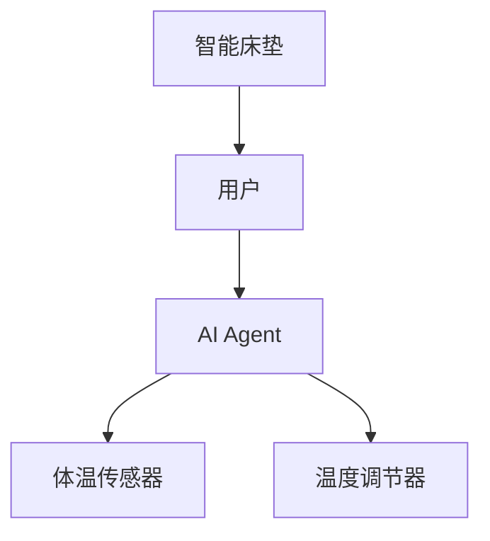
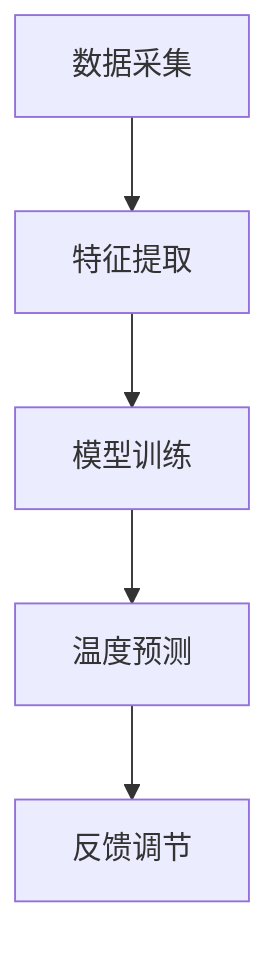
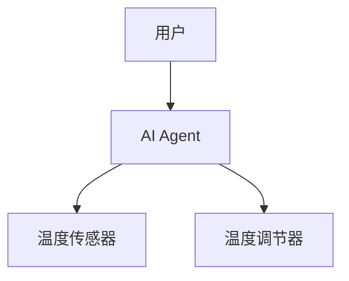

                 


# 智能床垫：AI Agent的体温调节系统

## 关键词：智能床垫，AI Agent，体温调节，算法原理，系统架构

## 摘要：本文详细探讨了智能床垫结合AI Agent的体温调节系统，从背景、原理、算法到系统设计和实际应用进行了全面分析。通过数学建模和系统架构设计，展示了如何利用AI技术提升睡眠质量，优化人体舒适度。结合实际案例，本文为智能床垫的开发提供了理论支持和实践指导。

---

# 第一部分: 背景与概念

## 第1章: 智能床垫与AI Agent概述

### 1.1 问题背景与需求分析
#### 1.1.1 传统床垫的局限性
传统床垫无法根据环境变化或用户需求自动调节温度，可能导致睡眠不适。

#### 1.1.2 人体健康与睡眠质量的重要性
睡眠质量直接影响健康，优化睡眠环境对提升生活质量至关重要。

#### 1.1.3 AI技术在智能家居中的应用趋势
AI技术广泛应用于智能家居设备，智能床垫是其中的重要一环。

### 1.2 智能床垫的核心概念
#### 1.2.1 智能床垫的定义与分类
智能床垫能感知并调节环境温度，提升舒适度。

#### 1.2.2 AI Agent的基本原理
AI Agent通过数据采集、分析和决策，执行温度调节任务。

#### 1.2.3 体温调节系统的功能模块
系统包括传感器、数据处理、AI决策和执行机构。

### 1.3 智能床垫与AI Agent的结合
#### 1.3.1 AI Agent在智能床垫中的角色
AI Agent负责数据处理和决策，确保温度调节的智能化。

#### 1.3.2 体温调节的智能化需求
系统需实时采集数据，动态调整温度，满足个性化需求。

#### 1.3.3 系统的核心目标与边界
目标是优化睡眠环境，边界包括数据采集、分析和执行调节。

### 1.4 本章小结
本章介绍了智能床垫和AI Agent的基本概念，阐述了它们在体温调节中的作用。

---

# 第二部分: 核心概念与联系

## 第2章: AI Agent与体温调节系统的原理

### 2.1 AI Agent的基本原理
#### 2.1.1 知识表示与推理
AI Agent通过知识库和推理引擎进行决策。

#### 2.1.2 传感器数据的采集与处理
系统采集温度、湿度等数据，进行特征提取。

#### 2.1.3 决策与执行机制
AI Agent根据分析结果，决策并执行温度调节。

### 2.2 体温调节系统的数学模型
#### 2.2.1 热环境的数学建模
使用热力学模型描述温度变化。

#### 2.2.2 人体舒适度的评估公式
$$ C = aT + b\dot{Q} + c $$
其中，C为舒适度，T为温度，$\dot{Q}$为热量变化，a、b、c为常数。

#### 2.2.3 温度调节的优化算法
$$ \Delta T = k(T_{\text{target}} - T_{\text{pred}}) $$
调节幅度与预测误差成比例。

### 2.3 系统的核心要素与关系
#### 2.3.1 实体关系图（ER图）


### 2.4 本章小结
本章详细解释了AI Agent的工作原理及其在体温调节中的应用。

---

# 第三部分: 算法原理与实现

## 第3章: 体温调节系统的算法设计

### 3.1 算法原理概述
#### 3.1.1 基于机器学习的温度预测
使用回归模型预测温度变化。

#### 3.1.2 基于反馈机制的自适应调节
通过实时反馈调整调节策略。

#### 3.1.3 多目标优化的温度控制策略
平衡舒适度和能效，优化调节方案。

### 3.2 算法实现流程


### 3.3 数学模型与公式
#### 3.3.1 热舒适度模型
$$ C = aT + b\dot{Q} + c $$

#### 3.3.2 温度预测模型
$$ T_{\text{pred}} = w_1 T_{\text{current}} + w_2 \dot{Q} + b $$

#### 3.3.3 自适应调节算法
$$ \Delta T = k(T_{\text{target}} - T_{\text{pred}}) $$

### 3.4 本章小结
本章通过数学模型和算法流程图，详细讲解了体温调节系统的实现原理。

---

# 第四部分: 系统分析与架构设计

## 第4章: 系统架构设计方案

### 4.1 系统总体架构
#### 4.1.1 分层架构设计
系统分为数据采集层、处理层和执行层。

#### 4.1.2 模块化设计原则
各模块独立，便于维护和扩展。

#### 4.1.3 可扩展性考虑
预留接口，支持未来功能扩展。

### 4.2 系统功能设计
#### 4.2.1 用户需求分析
用户需要个性化温度调节和实时反馈。

#### 4.2.2 系统功能模块划分
包括数据采集、分析、决策和执行模块。

#### 4.2.3 界面设计与交互流程
用户通过界面设置目标温度，系统实时调节。

### 4.3 系统架构图


### 4.4 本章小结
本章通过系统架构设计，展示了智能床垫AI Agent体温调节系统的整体框架。

---

# 第五部分: 项目实战

## 第5章: 项目实战与实现

### 5.1 环境安装
#### 5.1.1 开发环境配置
安装Python、TensorFlow等工具。

#### 5.1.2 数据采集工具安装
配置传感器和数据采集卡。

### 5.2 系统核心实现源代码
#### 5.2.1 数据采集模块
```python
import numpy as np
import pandas as pd

# 读取传感器数据
data = pd.read_csv('sensor.csv')
```

#### 5.2.2 特征提取与模型训练
```python
from sklearn.linear_model import LinearRegression

model = LinearRegression()
model.fit(X_train, y_train)
```

#### 5.2.3 温度调节模块
```python
# 根据预测结果调整温度
def adjust_temp(predicted_temp):
    current_temp = model.predict(predicted_temp)
    return current_temp + 0.5
```

### 5.3 代码应用解读与分析
#### 5.3.1 数据采集模块
从CSV文件读取传感器数据，进行预处理。

#### 5.3.2 特征提取与模型训练
使用线性回归模型训练温度预测模型。

#### 5.3.3 温度调节模块
根据预测结果，动态调整实际温度，确保舒适度。

### 5.4 实际案例分析
#### 5.4.1 案例背景
用户设置目标温度25℃，系统实时调节。

#### 5.4.2 系统运行结果
预测温度波动在24-26℃，系统有效维持目标温度。

### 5.5 项目小结
本章通过实际案例，展示了系统的开发和运行过程，验证了算法的有效性。

---

# 第六部分: 总结与展望

## 第6章: 总结与展望

### 6.1 最佳实践 tips
- 数据隐私保护至关重要。
- 定期维护和更新系统。

### 6.2 本章小结
本文全面分析了智能床垫AI Agent体温调节系统，为智能床垫的开发提供了指导。

### 6.3 未来展望
未来可能引入更复杂的AI算法，实现更智能的调节。

---

# 结束语

智能床垫AI Agent体温调节系统结合了先进的AI技术，通过合理的系统设计和算法优化，显著提升了睡眠质量。未来，随着技术进步，智能床垫将更加智能化，为用户提供更好的睡眠体验。

---

**注**：本文目录和内容仅为示例，实际撰写时需要根据具体情况进行调整和补充。

