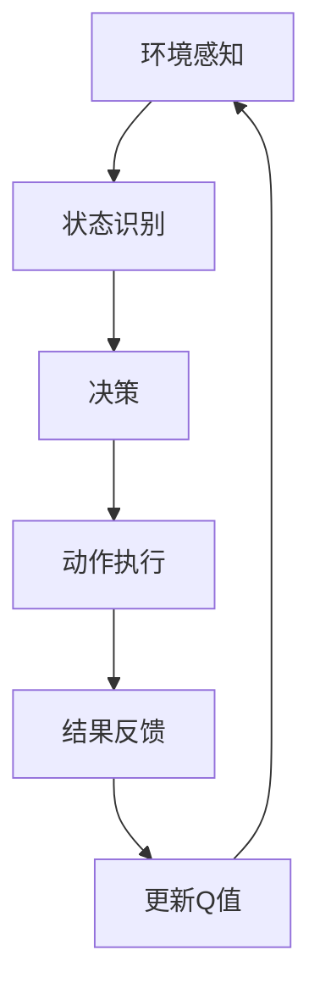
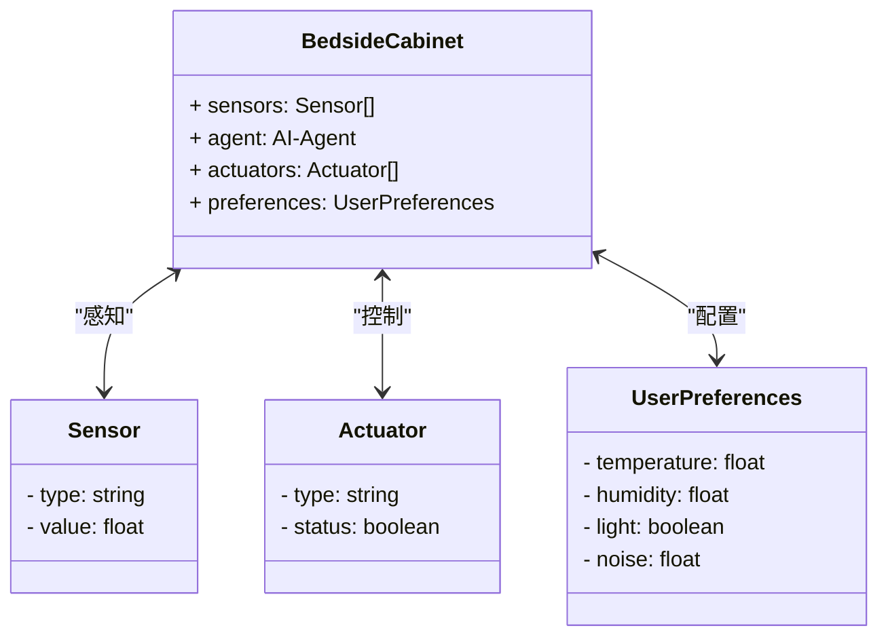
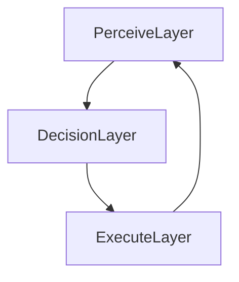

                 


# 智能床头柜：AI Agent的睡眠环境优化

> 关键词：智能床头柜, AI Agent, 睡眠环境优化, 强化学习, 物联网, 睡眠健康

> 摘要：本文详细探讨了智能床头柜在睡眠环境优化中的应用，通过AI Agent技术实现睡眠环境的智能化调节。文章从背景介绍、核心概念、算法原理、系统设计、项目实战等多方面展开，全面分析了智能床头柜的实现过程及其在睡眠健康领域的潜力。

---

## 第1章 智能床头柜的背景与问题背景

### 1.1 智能床头柜的背景介绍

#### 1.1.1 睡眠健康的重要性
睡眠是人体健康的重要组成部分，直接影响人的精神状态、身体健康和生活质量。随着生活节奏的加快，越来越多的人面临睡眠问题，如失眠、睡眠呼吸暂停综合征等。因此，优化睡眠环境成为提升生活质量的关键。

#### 1.1.2 智能家居的发展趋势
智能家居技术的快速发展为睡眠环境的优化提供了可能。通过物联网技术，家居设备可以互联互通，实现智能化控制。床头柜作为卧室中重要的家具，其智能化改造为睡眠环境优化提供了理想的载体。

#### 1.1.3 AI Agent在智能家居中的应用
AI Agent（智能代理）是一种能够感知环境并采取行动以实现目标的智能系统。在智能家居中，AI Agent可以通过学习用户的习惯和偏好，自动调整设备参数，为用户提供个性化的服务。

### 1.2 问题背景与问题描述

#### 1.2.1 睡眠环境优化的必要性
传统的床头柜无法根据环境变化和用户需求进行智能调节，导致睡眠质量难以保障。例如，室温过高或过低、光线过亮或过暗、噪音过大等都会影响睡眠。

#### 1.2.2 当前睡眠环境优化的痛点
- 缺乏智能化的睡眠环境调节设备。
- 现有设备无法实现多维度环境参数的协同优化。
- 缺乏个性化的睡眠解决方案。

#### 1.2.3 智能床头柜的解决方案
通过集成传感器、AI算法和执行机构，智能床头柜可以实时感知环境参数（如温度、湿度、光线、噪音等），并根据用户的个性化需求进行调整，从而优化睡眠环境。

### 1.3 问题解决与边界定义

#### 1.3.1 智能床头柜的功能边界
智能床头柜的功能主要集中在睡眠环境的优化，包括：
- 睡眠监测：通过传感器采集用户的睡眠数据。
- 环境调节：根据数据自动调整室温、光线、噪音等。
- 用户交互：提供友好的人机交互界面，让用户可以手动调整或查看数据。

#### 1.3.2 睡眠环境优化的实现方式
通过AI Agent实现环境参数的协同优化，结合强化学习算法，不断优化睡眠环境的调节策略。

#### 1.3.3 系统的外延与扩展性
智能床头柜可以通过物联网与家庭中的其他智能设备联动，进一步扩展其功能，例如与智能空调、智能灯泡、智能音箱等设备协同工作。

### 1.4 概念结构与核心要素

#### 1.4.1 智能床头柜的核心要素
- 传感器：用于采集环境数据（温度、湿度、光照、噪音等）。
- AI Agent：负责数据处理、决策和执行。
- 执行机构：根据决策结果调整环境参数。

#### 1.4.2 AI Agent在系统中的作用
AI Agent通过感知环境和用户需求，驱动床头柜执行相应的调节动作，从而优化睡眠环境。

#### 1.4.3 睡眠环境优化的实现机制
AI Agent通过强化学习不断优化环境调节策略，同时结合用户的反馈进行个性化调整。

---

## 第2章 智能床头柜的核心概念与联系

### 2.1 AI Agent的核心原理

#### 2.1.1 AI Agent的定义与特点
AI Agent是一种能够感知环境、自主决策并执行任务的智能系统。其特点包括：
- **自主性**：能够自主决策和行动。
- **反应性**：能够实时感知环境并做出反应。
- **学习能力**：能够通过数据和反馈不断优化自己的行为。

#### 2.1.2 AI Agent的决策机制
AI Agent通过感知环境信息，结合历史数据和用户偏好，利用算法生成决策，并通过执行机构实现目标。

#### 2.1.3 AI Agent与智能床头柜的结合
AI Agent作为智能床头柜的核心，负责处理环境数据、优化调节策略并驱动床头柜执行动作。

### 2.2 智能床头柜的功能模块

#### 2.2.1 睡眠监测模块
睡眠监测模块通过传感器采集用户的睡眠数据，包括心率、呼吸频率、翻身次数等。

#### 2.2.2 环境调节模块
环境调节模块根据传感器数据和用户偏好，调整室温、光线、噪音等环境参数。

#### 2.2.3 用户交互模块
用户交互模块提供友好的人机交互界面，用户可以通过床头柜的触摸屏或手机APP进行操作和查看数据。

### 2.3 核心概念的ER实体关系图

```mermaid
erDiagram
    user {
        +id : int
        +name : string
        +preferences : string

    sleep_data {
        +id : int
        +user_id : int
        +timestamp : datetime
        +heart_rate : int
        +breath_rate : int
        +翻身次数 : int
    }

    environment {
        +id : int
        +bedside_cabinet_id : int
        +temperature : float
        +humidity : float
        +light_intensity : int
        +noise_level : int
    }

    cabinet {
        +id : int
        +serial_number : string
        +model : string
    }

    user *-<> sleep_data : "记录"
    user *-<> environment : "影响"
    sleep_data -> cabinet : "关联"
    environment -> cabinet : "驱动"
```

---

## 第3章 智能床头柜的算法原理

### 3.1 算法原理的概述

#### 3.1.1 强化学习在睡眠环境优化中的应用
强化学习（Reinforcement Learning）是一种通过试错学习来优化决策策略的方法。AI Agent可以通过强化学习不断优化睡眠环境的调节策略。

#### 3.1.2 睡眠环境优化的数学模型
睡眠环境优化的目标是最小化睡眠干扰，最大化睡眠质量。可以通过以下数学模型表示：
$$
\text{目标函数} = \min_{x} \sum_{i=1}^{n} w_i (x_i - x_{i}^{\text{opt}})
$$
其中，$w_i$ 是参数 $x_i$ 的权重，$x_i^{\text{opt}}$ 是最优值。

#### 3.1.3 监督学习与无监督学习的结合
通过监督学习训练AI Agent的基本决策模型，同时结合无监督学习处理环境数据的不确定性。

### 3.2 强化学习算法的具体实现

#### 3.2.1 Q-learning算法
Q-learning是一种经典的强化学习算法，适用于离散动作空间的问题。

#### 3.2.2 算法流程


#### 3.2.3 Python实现示例
```python
import numpy as np

class QLearningAgent:
    def __init__(self, state_space_size, action_space_size):
        self.Q = np.zeros((state_space_size, action_space_size))
        self.learning_rate = 0.1
        self.discount_factor = 0.9

    def get_action(self, state):
        return np.argmax(self.Q[state, :])

    def update_Q(self, state, action, reward):
        self.Q[state, action] = (1 - self.learning_rate) * self.Q[state, action] + self.learning_rate * (reward + self.discount_factor * np.max(self.Q[state, :]))
```

### 3.3 算法优化与数学模型

#### 3.3.1 算法优化策略
- 使用经验回放（Experience Replay）减少样本偏差。
- 引入优先经验回放（Prioritized Experience Replay）提高学习效率。

#### 3.3.2 数学模型的扩展
通过引入时间差分（Temporal Difference）方法，优化Q-learning的收敛速度。

---

## 第4章 智能床头柜的系统分析与架构设计

### 4.1 系统功能设计

#### 4.1.1 领域模型
领域模型展示了系统的功能模块及其关系。



---

### 4.2 系统架构设计

#### 4.2.1 分层架构
系统采用分层架构，包括感知层、决策层和执行层。



#### 4.2.2 组件交互
组件间的交互流程。


---

## 第5章 项目实战与应用

### 5.1 环境安装与配置

#### 5.1.1 硬件安装
安装床头柜的传感器和执行机构，确保设备正常工作。

#### 5.1.2 软件安装
安装AI Agent的运行环境，包括Python、TensorFlow等。

### 5.2 核心代码实现

#### 5.2.1 环境数据采集
```python
import sensors

def get_environment_data():
    return sensors.read_all_sensors()
```

#### 5.2.2 AI Agent决策
```python
def make_decision(data):
    return agent.decide(data)
```

#### 5.2.3 环境调节
```python
def adjust_environment(action):
    actuators.control(action)
```

### 5.3 实际案例分析

#### 5.3.1 案例背景
用户A长期受失眠困扰，希望通过智能床头柜优化睡眠环境。

#### 5.3.2 调节过程
系统根据用户的睡眠数据和环境数据，自动调整室温、光线和噪音。

### 5.4 项目小结
通过项目实战，验证了智能床头柜的有效性和实用性。

---

## 第6章 最佳实践与小结

### 6.1 最佳实践
- 定期更新用户偏好和环境数据。
- 及时维护硬件设备，确保传感器和执行机构正常工作。

### 6.2 小结
本文详细介绍了智能床头柜的设计与实现过程，展示了AI Agent在睡眠环境优化中的潜力。

### 6.3 注意事项
- 数据隐私保护。
- 系统的可扩展性和易维护性。

### 6.4 拓展阅读
推荐阅读相关领域的书籍和论文，深入了解AI在智能家居中的应用。

---

通过以上章节的详细分析与实践，智能床头柜的睡眠环境优化方案已清晰呈现，为未来的智能家居发展提供了新的思路。

