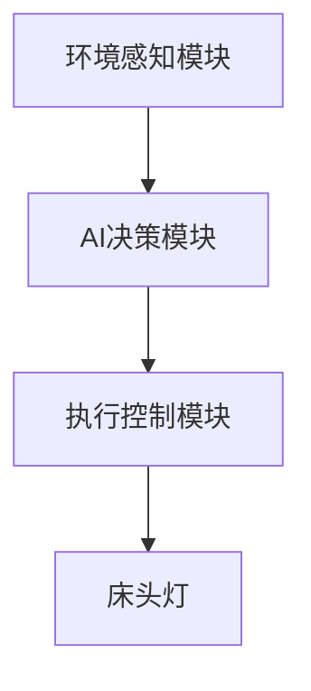
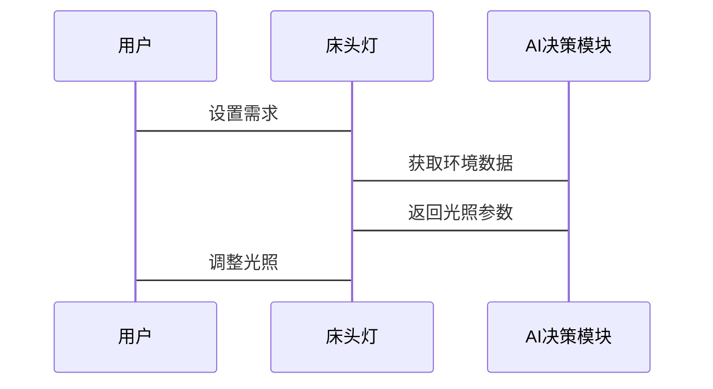

                 


# 智能床头灯：AI Agent的生理节律光照调节

## 关键词：AI Agent，生理节律，光照调节，智能床头灯，算法设计，系统架构，项目实战

## 摘要

本文深入探讨了智能床头灯在AI Agent技术下的生理节律光照调节。通过分析人体生理节律与光照调节的科学原理，结合AI Agent的核心原理，详细讲解了光照调节算法的设计与实现，以及系统的架构设计。文章通过项目实战，展示了如何通过传感器数据采集、特征提取、模型训练和控制策略实现智能床头灯的光照调节功能。同时，文章还探讨了系统的优化与扩展，展望了未来的发展方向。

---

# 第1章: 智能床头灯的背景与需求

## 1.1 生理节律与光照调节的重要性

### 1.1.1 生理节律的基本概念

人体的生理节律是指生物体内与时间相关的周期性变化，最著名的例子是昼夜节律，即24小时的生物钟。这个节律由大脑中的视交叉上核（SCN）调控，受到光照的影响。

### 1.1.2 光照对人类生理节律的影响

光照是调节生理节律的重要因素。白天充足的自然光有助于维持正常的昼夜节律，而晚上的人工光则可能干扰生物钟，影响睡眠质量。

### 1.1.3 传统光照调节的局限性

传统的床头灯通常只能提供固定的光照强度和色温，无法根据用户的生理需求进行动态调整，难以满足个性化需求。

---

## 1.2 AI Agent在智能硬件中的应用前景

### 1.2.1 AI Agent的基本概念

AI Agent是一种能够感知环境、自主决策并执行任务的智能实体。它能够通过传感器获取信息，利用算法进行分析，并根据结果采取行动。

### 1.2.2 智能床头灯的市场需求

随着人们对健康的关注增加，智能床头灯的需求逐渐增长。用户希望床头灯能够根据他们的生理需求自动调节光照，帮助改善睡眠质量。

### 1.2.3 AI技术在光照调节中的优势

AI技术能够实时分析用户的生理数据，如心率、体温和光照环境，通过动态调整光照参数提供个性化的光照方案。

---

## 1.3 本章小结

本章介绍了生理节律与光照调节的重要性，以及AI Agent在智能床头灯中的应用前景。AI Agent能够通过动态调整光照参数，满足用户的个性化需求，具有广阔的市场潜力。

---

# 第2章: 生理节律与光照调节的科学原理

## 2.1 生理节律的基本机制

### 2.1.1 生物钟的定义与功能

生物钟是指生物体内调节生理活动的内在节律系统，主要由基因控制。生物钟能够预测和适应环境的变化，如昼夜交替。

### 2.1.2 光照对生物钟的影响

光照是生物钟的主要外部调节因素。光线通过视网膜中的视杆细胞和视锥细胞传递信号，影响松果体分泌褪黑激素。

### 2.1.3 睡眠周期与光照的关系

睡眠周期包括快速眼动睡眠（REM）和非快速眼动睡眠（NREM）。光照强度和色温的变化能够影响睡眠周期的切换。

---

## 2.2 光照对人类健康的影响

### 2.2.1 光照强度与人体健康

光照强度直接影响人的视觉清晰度和情绪状态。过强的光照可能导致眼睛疲劳，过弱的光照则可能降低注意力。

### 2.2.2 光照色温与情绪调节

色温是指光的冷暖程度。高色温的光（如蓝色光）能够提高注意力，低色温的光（如红色光）则有助于放松。

### 2.2.3 不同时间段的光照需求

在早晨，人需要明亮的光来唤醒生物钟；在晚上，柔和的光有助于放松身心，准备入睡。

---

## 2.3 本章小结

本章详细讲解了生理节律的基本机制以及光照对人类健康的影响。光照不仅是视觉需求，更是调节生理节律的重要手段。

---

# 第3章: AI Agent的核心原理与技术实现

## 3.1 AI Agent的基本概念

### 3.1.1 AI Agent的定义

AI Agent是一种能够感知环境、自主决策并执行任务的智能实体。它能够通过传感器获取信息，利用算法进行分析，并根据结果采取行动。

### 3.1.2 AI Agent的核心特征

AI Agent具有自主性、反应性、目标导向性和社交能力。它能够根据环境变化自主调整行为，满足用户需求。

### 3.1.3 AI Agent与传统自动化的区别

与传统自动化相比，AI Agent具有更强的适应性和学习能力，能够根据实时数据动态调整策略。

---

## 3.2 AI Agent在智能床头灯中的应用

### 3.2.1 智能床头灯的功能需求

智能床头灯需要根据用户的生理需求动态调整光照参数，如亮度、色温和色温。

### 3.2.2 AI Agent的感知能力

AI Agent通过内置的传感器（如光照传感器、心率传感器）获取用户的生理数据和环境信息。

### 3.2.3 AI Agent的决策与执行机制

AI Agent根据获取的数据，通过算法计算出最佳的光照参数，并通过执行机构（如LED灯）调整光照。

---

## 3.3 本章小结

本章介绍了AI Agent的核心原理及其在智能床头灯中的应用。AI Agent通过感知环境和用户数据，动态调整光照参数，满足用户的个性化需求。

---

# 第4章: 光照调节算法的设计与实现

## 4.1 算法设计的基本思路

### 4.1.1 算法目标

算法的目标是根据用户的生理数据和环境信息，计算出最佳的光照参数。

### 4.1.2 算法输入与输出

- **输入**：用户的心率、体温、环境光照强度。
- **输出**：建议的光照亮度、色温。

---

## 4.2 光照调节算法的数学模型

光照调节算法的核心是根据用户生理数据和环境数据，计算出最优的光照参数。模型如下：

$$
\text{亮度} = k_1 \cdot \text{心率} + k_2 \cdot \text{体温} + k_3 \cdot \text{环境光照强度}
$$

其中，$k_1$、$k_2$、$k_3$是模型的系数，通过训练数据优化得到。

---

## 4.3 算法实现步骤

### 4.3.1 数据采集

通过传感器采集用户的心率、体温和环境光照强度。

### 4.3.2 数据预处理

对采集的数据进行归一化处理，消除噪声。

### 4.3.3 模型训练

使用机器学习算法（如支持向量机或神经网络）训练模型，优化系数。

### 4.3.4 控制策略

根据模型计算结果，调整床头灯的亮度和色温。

---

## 4.4 本章小结

本章详细讲解了光照调节算法的设计与实现。通过数学模型和算法流程图，展示了如何根据用户生理数据动态调整光照参数。

---

# 第5章: 系统架构设计与实现

## 5.1 系统架构设计

### 5.1.1 系统功能模块

- **环境感知模块**：通过传感器采集环境数据。
- **AI决策模块**：通过算法计算最优光照参数。
- **执行控制模块**：调整床头灯的光照参数。

### 5.1.2 系统架构图



---

## 5.2 系统交互设计

### 5.2.1 用户界面设计

用户可以通过床头灯的触摸屏或手机App设置个性化需求。

### 5.2.2 系统交互流程



---

## 5.3 本章小结

本章详细讲解了智能床头灯的系统架构设计与实现。通过模块化设计和系统交互流程图，展示了系统的整体架构。

---

# 第6章: 项目实战——智能床头灯的实现

## 6.1 项目环境搭建

### 6.1.1 硬件设备

- 微控制器（如Arduino或Raspberry Pi）
- 光照传感器、心率传感器
- RGB LED灯

### 6.1.2 软件工具

- Python编程语言
- TensorFlow机器学习库

---

## 6.2 系统核心实现

### 6.2.1 数据采集代码

```python
# 传感器数据采集代码
import serial

ser = serial.Serial('COM3', 9600)
data = ser.readline().decode().strip()
print(data)
```

---

### 6.2.2 模型训练代码

```python
# 简单的线性回归模型训练代码
import numpy as np
from sklearn.linear_model import LinearRegression

X = np.array([[心率], [体温], [环境光照]])
y = np.array([[亮度], [色温]])

model = LinearRegression()
model.fit(X, y)
```

---

## 6.3 功能实现与案例分析

### 6.3.1 功能实现

通过传感器采集数据，训练模型，计算出最优的光照参数，并通过床头灯执行。

### 6.3.2 案例分析

假设用户的心率为70 bpm，体温为36.5°C，环境光照强度为50 lux。模型计算出亮度为80%，色温为3000K。

---

## 6.4 本章小结

本章通过项目实战，展示了智能床头灯的实现过程。通过传感器数据采集、模型训练和系统控制，实现了动态光照调节功能。

---

# 第7章: 系统优化与功能扩展

## 7.1 系统优化

### 7.1.1 算法优化

引入更复杂的机器学习算法（如随机森林或深度学习模型）提高模型的准确率。

### 7.1.2 系统性能优化

优化传感器的采样频率和数据处理速度，降低系统的延迟。

---

## 7.2 功能扩展

### 7.2.1 与其他智能设备联动

通过智能家居系统，与智能音箱、智能门锁等设备联动，实现更复杂的场景控制。

### 7.2.2 用户个性化设置

允许用户自定义光照调节策略，满足不同用户的需求。

---

## 7.3 本章小结

本章探讨了系统的优化与功能扩展。通过算法优化和功能扩展，进一步提升了系统的智能化水平和用户体验。

---

# 第8章: 总结与展望

## 8.1 总结

本文详细讲解了智能床头灯的生理节律光照调节技术。通过AI Agent和机器学习算法，实现了动态的光照调节，满足用户的个性化需求。

## 8.2 展望

未来，随着AI技术的进步，智能床头灯将更加智能化和个性化。通过与其他智能设备的联动，实现更复杂的场景控制，为用户提供更优质的生活体验。

---

# 结语

智能床头灯作为AI技术在智能家居领域的应用之一，具有广阔的发展前景。通过本文的分析与实现，我们看到了AI技术在改善人类生活中的巨大潜力。

--- 

**本文到此结束，感谢您的阅读！**

