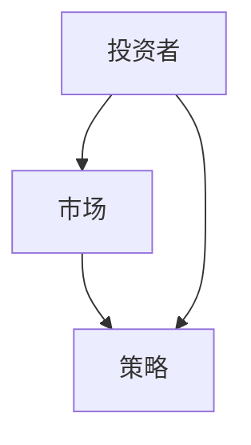
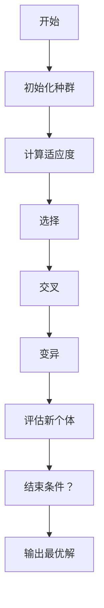

                 


# 智能投资组合再平衡策略优化

> 关键词：智能投资组合，再平衡策略，算法优化，金融建模，投资组合管理

> 摘要：本文详细探讨了智能投资组合再平衡策略的优化方法，结合数学模型、算法原理和系统设计，分析了传统再平衡策略的局限性，并提出了一种基于智能算法的优化方案。通过实际案例和代码实现，展示了如何利用技术手段提升投资组合的收益与风险比。本文适合对金融技术感兴趣的读者，特别是从事投资组合管理、量化交易和智能算法研究的读者。

---

# 第一部分: 智能投资组合再平衡策略优化的背景与核心概念

## 第1章: 智能投资组合再平衡的背景与问题描述

### 1.1 投资组合再平衡的背景介绍

#### 1.1.1 投资组合管理的基本概念
投资组合管理是金融领域的重要组成部分，旨在通过优化资产配置，实现风险控制和收益最大化。传统的投资组合管理依赖于人工判断和固定规则，但在市场波动加剧的背景下，这种模式逐渐显现出不足。

#### 1.1.2 再平衡的定义与作用
再平衡是指根据市场变化和个人投资目标的调整，定期调整投资组合中各资产的配置比例，以维持既定的投资策略。其作用包括：
- 维持目标资产配置
- 降低投资风险
- 提升收益稳定性

#### 1.1.3 传统再平衡策略的局限性
传统再平衡策略通常基于固定的时间间隔或资产比例偏离度，这种做法在市场剧烈波动时往往效果不佳。例如，当市场出现大幅回调时，传统策略可能无法及时调整，导致投资组合的损失扩大。

---

### 1.2 智能投资组合再平衡的提出

#### 1.2.1 智能投资的定义与特点
智能投资是指利用人工智能、大数据和量化分析等技术，通过算法优化投资决策的过程。其特点是高效性、数据驱动性和适应性。

#### 1.2.2 再平衡策略优化的必要性
随着市场的复杂化，传统再平衡策略已难以应对多变的市场环境。智能再平衡策略通过动态调整资产配置，能够更好地捕捉市场机会，降低投资风险。

#### 1.2.3 智能再平衡策略的核心优势
- 灵活性：能够根据市场实时变化调整配置
- 数据驱动：利用大数据和机器学习模型进行决策
- 高效性：算法优化使得再平衡过程更加迅速和精准

---

### 1.3 问题背景与目标

#### 1.3.1 投资者需求分析
投资者的核心需求是实现资产保值和增值，同时承受可接受的市场风险。然而，如何在不同市场环境下动态调整资产配置，是投资者面临的主要挑战。

#### 1.3.2 市场波动对投资组合的影响
市场波动会导致投资组合的实际收益偏离预期目标。传统再平衡策略在面对极端市场波动时，往往无法及时做出反应，导致投资组合的损失扩大。

#### 1.3.3 优化目标与边界条件
- 优化目标：最大化收益，最小化风险
- 边界条件：考虑交易成本、市场流动性、税收等因素

---

### 1.4 本章小结
本章从投资组合再平衡的背景出发，分析了传统策略的局限性，并提出了智能再平衡策略的概念和优势。明确了优化的目标和边界条件，为后续的算法设计奠定了基础。

---

## 第2章: 智能投资组合再平衡的核心概念与联系

### 2.1 核心概念原理

#### 2.1.1 投资组合优化的数学模型
投资组合优化的核心是解决一个优化问题，目标是最小化风险或最大化收益。数学模型可以表示为：
$$\min_w \sigma^2 \quad \text{subject to} \quad \mu^T w = \mu_r$$
其中，\(w\) 是权重向量，\(\sigma^2\) 是投资组合的方差，\(\mu\) 是资产的预期收益，\(\mu_r\) 是目标收益。

#### 2.1.2 再平衡策略的优化目标
再平衡策略的优化目标是在市场变化时，动态调整资产权重，以维持投资组合的收益与风险目标。

#### 2.1.3 智能算法在再平衡中的应用
智能算法（如遗传算法、粒子群优化）通过模拟生物进化或物理系统的行为，优化投资组合的配置。

---

### 2.2 核心概念对比分析

#### 2.2.1 传统再平衡与智能再平衡的对比
| 特性                | 传统再平衡          | 智能再平衡          |
|---------------------|--------------------|--------------------|
| 调整频率            | 固定周期或阈值触发  | 动态实时调整        |
| 策略灵活性          | 较低                | 较高                |
| 计算复杂度          | 较低                | 较高                |
| 适应性              | 较差                | 较好                |

#### 2.2.2 不同智能算法的特征对比
| 算法                | 遗传算法（GA）       | 粒子群优化（PSO）    |
|---------------------|--------------------|--------------------|
| 搜索空间            | 离散                | 连续                |
| 多样性              | 高                  | 中等                |
| 收敛速度            | 较慢                | 较快                |

#### 2.2.3 投资组合风险与收益的权衡分析
投资组合的收益与风险之间存在权衡关系。通过优化算法，可以在不同风险水平下找到收益最大的投资组合。

---

### 2.3 实体关系图


---

### 2.4 本章小结
本章通过对比分析，明确了智能再平衡策略的核心概念及其优势，并通过表格和图示的方式，清晰展示了不同策略和算法的特征。

---

## 第3章: 智能投资组合再平衡的算法原理

### 3.1 基于均值-方差模型的优化

#### 3.1.1 均值-方差模型的数学表达
均值-方差模型由Markowitz提出，目标是最小化投资组合的方差（即风险）：
$$\min_w \sigma^2 \quad \text{subject to} \quad \mu^T w = \mu_r$$

#### 3.1.2 算法流程图


---

### 3.2 基于遗传算法的优化

#### 3.2.1 遗传算法的基本原理
遗传算法是一种模拟生物进化的优化算法，主要包括选择、交叉和变异三个步骤。

#### 3.2.2 算法流程图


#### 3.2.3 Python代码实现
```python
import numpy as np
from sklearn.datasets import make_sparesparse
import matplotlib.pyplot as plt

# 生成随机数据
X, y = make_sparesparse(n_samples=100, n_features=2, random_state=42)
X = X.toarray()

# 计算协方差矩阵
cov_matrix = np.cov(X.T)

# 简单的遗传算法实现
class GeneticAlgorithm:
    def __init__(self, population_size, mutation_rate, crossover_rate):
        self.population_size = population_size
        self.mutation_rate = mutation_rate
        self.crossover_rate = crossover_rate
    
    def initialize_population(self):
        return np.random.rand(self.population_size, 2)
    
    def compute_fitness(self, population, cov_matrix):
        # 计算每个个体的方差
        variances = []
        for ind in population:
            var = np.dot(ind, np.dot(cov_matrix, ind))
            variances.append(var)
        return variances
    
    def selection(self, population, fitness, k=2):
        # 轮盘赌选择
        total_fitness = sum(fitness)
        probabilities = [f/total_fitness for f in fitness]
        selected_indices = []
        for _ in range(len(population)):
            r = np.random.uniform(0, 1)
            for i, p in enumerate(probabilities):
                if r < p:
                    selected_indices.append(i)
                    break
        return selected_indices[:k]
    
    def crossover(self, parent1, parent2, rate):
        if np.random.random() < rate:
            return (parent1 + parent2)/2, (parent1 + parent2)/2
        else:
            return parent1, parent2
    
    def mutate(self, individual, rate):
        if np.random.random() < rate:
            return np.random.rand(len(individual))
        else:
            return individual
    
    def evolve(self, population, cov_matrix):
        fitness = self.compute_fitness(population, cov_matrix)
        selected_indices = self.selection(population, fitness)
        new_population = []
        for i in range(len(selected_indices)//2):
            parent1 = population[selected_indices[2*i]]
            parent2 = population[selected_indices[2*i + 1]]
            child1, child2 = self.crossover(parent1, parent2, self.crossover_rate)
            child1 = self.mutate(child1, self.mutation_rate)
            child2 = self.mutate(child2, self.mutation_rate)
            new_population.append(child1)
            new_population.append(child2)
        return np.array(new

