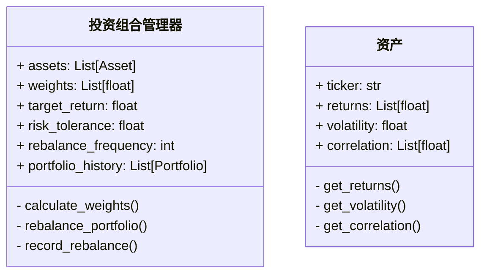
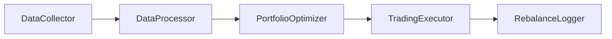
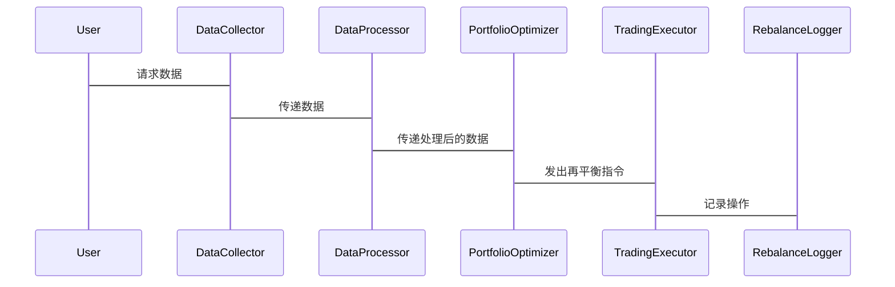

                 


# 智能投资组合多周期再平衡策略

## 关键词：智能投资组合，多周期再平衡，优化算法，资产配置，量化交易，风险管理

## 摘要：  
智能投资组合的多周期再平衡策略是一种结合金融学与计算机科学的高级投资策略，旨在通过动态优化资产配置，平衡长期收益与短期波动。本文深入探讨了多周期再平衡策略的背景、原理、算法实现及其在实际投资中的应用，结合数学模型与代码示例，为读者提供全面的技术分析与实践指南。

---

# 第1章：智能投资组合与多周期再平衡策略背景介绍

## 1.1 智能投资组合的核心概念

### 1.1.1 投资组合的基本定义与目标  
投资组合是指将资金分配到不同资产类别（如股票、债券、商品等）中以实现特定投资目标的一组金融资产。其核心目标是通过分散投资降低风险，同时最大化收益。  

### 1.1.2 智能投资组合的定义与特点  
智能投资组合利用人工智能和大数据技术，通过算法优化资产配置，动态调整投资组合以适应市场变化。其特点包括：  
1. **自动化**：基于算法自动调整资产配置。  
2. **动态优化**：根据市场波动实时或定期优化组合。  
3. **多目标优化**：在风险与收益之间寻找最优平衡点。  

### 1.1.3 多周期再平衡策略的背景与意义  
传统的投资组合管理通常基于固定的时间周期（如月度或季度）进行再平衡，而多周期再平衡策略则允许在不同时间周期内灵活调整资产配置。这种策略在复杂市场环境中更具灵活性和适应性，能够更好地捕捉市场机会并规避风险。  

## 1.2 多周期再平衡策略的必要性  

### 1.2.1 投资组合动态调整的必要性  
市场环境不断变化，单一时间周期的再平衡策略难以适应不同市场阶段的需求。通过多周期再平衡，投资者可以在不同时间框架下捕捉市场机会，优化投资组合表现。  

### 1.2.2 多周期再平衡的优势与挑战  
- **优势**：  
  1. 提高资产配置的灵活性。  
  2. 适应不同市场的波动性。  
  3. 平衡短期波动与长期收益。  
- **挑战**：  
  1. 需要处理大量数据并实时调整。  
  2. 频繁调整可能导致交易成本增加。  
  3. 算法优化复杂度高。  

### 1.2.3 再平衡策略在不同市场环境下的表现  
在牛市中，多周期再平衡策略可以通过高频调整抓住市场上涨机会；在熊市中，它可以及时降低风险敞口，减少损失。因此，多周期再平衡策略在不同市场环境下表现更加稳健。  

---

# 第2章：多周期再平衡策略的核心概念与联系

## 2.1 多周期再平衡策略的原理  

### 2.1.1 时间周期的划分与选择  
多周期再平衡策略的核心在于将时间周期划分为多个子周期（如分钟、小时、日、周、月等），并在每个子周期内进行再平衡操作。时间周期的选择取决于市场波动性、交易成本和投资目标。  

### 2.1.2 再平衡的触发条件与规则  
再平衡的触发条件可以是固定的时间间隔，也可以是基于某些指标（如偏离目标配置的阈值）自动触发。触发规则需要综合考虑市场环境和投资目标。  

### 2.1.3 多周期策略的优化目标  
多周期再平衡策略的目标是在不同时间周期内优化资产配置，使得投资组合在不同市场阶段下表现最优。  

---

## 2.2 核心概念对比分析  

### 2.2.1 不同周期下的资产配置差异  
| 时间周期 | 资产配置特点 |  
|----------|--------------|  
| 短周期 | 高频调整，灵活性强，交易成本可能较高 |  
| 长周期 | 低频调整，交易成本低，但灵活性差 |  
| 组合周期 | 综合多个周期，平衡灵活性与成本 |  

### 2.2.2 再平衡频率与投资收益的关系  
再平衡频率越高，投资组合的灵活性越强，但交易成本可能增加；频率越低，交易成本减少，但灵活性下降。需要在两者之间找到最佳平衡点。  

### 2.2.3 多周期策略与单周期策略的对比  

| 对比维度 | 多周期策略 | 单周期策略 |  
|----------|-------------|-------------|  
| 灵活性 | 高 | 低 |  
| 成本 | 可能较高 | 较低 |  
| 风险管理 | 更优 | 较差 |  

---

## 2.3 实体关系图与流程图  

### 2.3.1 多周期再平衡策略的实体关系图  


### 2.3.2 多周期再平衡策略流程图  

```mermaid
graph TD
    Start --> 分析当前资产配置
    分析当前资产配置 --> 判断是否需要再平衡
    判断是否需要再平衡 --> 是，执行再平衡
    判断是否需要再平衡 --> 否，继续监控
    执行再平衡 --> 调整资产配置
    调整资产配置 --> 记录再平衡日志
    记录再平衡日志 --> 结束
```

---

## 2.4 本章小结  
本章介绍了多周期再平衡策略的核心概念，分析了其与单周期策略的差异，并通过图表展示了策略的实体关系与流程，为后续的算法实现奠定了基础。  

---

# 第3章：多周期再平衡策略的算法原理  

## 3.1 基于均值-方差优化的多周期再平衡算法  

### 3.1.1 均值-方差优化的基本原理  
均值-方差优化是一种经典的资产配置方法，目标是最小化投资组合的波动性（风险）或最大化收益。其数学模型如下：  

$$ \text{目标函数} = \min_w \sum_{i=1}^n w_i^2 \sigma_i^2 + 2 w_i w_j \sigma_{ij} $$  
$$ \text{约束条件} = \sum_{i=1}^n w_i = 1 $$  

其中，\( w_i \) 是资产 \( i \) 的权重，\( \sigma_i^2 \) 是资产 \( i \) 的方差，\( \sigma_{ij} \) 是资产 \( i \) 和 \( j \) 的协方差。  

### 3.1.2 多周期优化的目标函数  
在多周期优化中，目标函数需要考虑不同时间周期下的资产表现：  

$$ \text{目标函数} = \min_{w_t} \sum_{t=1}^T \sum_{i=1}^n w_{i,t}^2 \sigma_{i,t}^2 + 2 w_{i,t} w_{j,t} \sigma_{i,j,t} } $$  
$$ \text{约束条件} = \sum_{i=1}^n w_{i,t} = 1 \quad \forall t $$  

其中，\( T \) 是时间周期的数量，\( w_{i,t} \) 是第 \( t \) 个时间周期内资产 \( i \) 的权重，\( \sigma_{i,t}^2 \) 是第 \( t \) 个时间周期内资产 \( i \) 的方差。  

### 3.1.3 约束条件与求解方法  
约束条件包括权重非负和权重之和为1。求解方法通常采用拉格朗日乘数法或二次规划算法。  

---

## 3.2 算法实现的详细步骤  

### 3.2.1 数据准备与预处理  
- 收集各资产的历史收益率数据。  
- 计算各资产在不同时间周期内的收益率、方差和协方差矩阵。  

### 3.2.2 计算资产的期望收益与协方差矩阵  
假设资产 \( i \) 的期望收益率为 \( \mu_i \)，协方差矩阵 \( \Sigma \) 如下：  

$$ \Sigma = \begin{bmatrix} \sigma_1^2 & \sigma_{1,2} & \cdots & \sigma_{1,n} \\ \sigma_{2,1} & \sigma_2^2 & \cdots & \sigma_{2,n} \\ \vdots & \vdots & \ddots & \vdots \\ \sigma_{n,1} & \sigma_{n,2} & \cdots & \sigma_n^2 \end{bmatrix} $$  

### 3.2.3 求解优化问题  
使用优化算法求解权重 \( w \)，使得投资组合的波动性最小化或收益最大化。  

### 3.2.4 生成再平衡指令  
根据优化结果生成具体的资产调整指令，并记录再平衡日志。  

---

## 3.3 算法实现的Python代码示例  

### 3.3.1 环境安装与依赖库  
```bash
pip install numpy scipy matplotlib
```

### 3.3.2 核心代码实现  

```python
import numpy as np
from scipy.optimize import minimize

def portfolio_optimization(returns, weights_initial):
    # 定义目标函数
    def objective(weights):
        return np.dot(weights.T, np.dot(returns, weights))
    
    # 约束条件
    constraints = [
        {'type': 'eq', 'fun': lambda w: np.sum(w) - 1}
    ]
    
    # 边界条件
    bounds = [(0, 1) for _ in range(weights_initial.shape[0])]
    
    # 求解优化问题
    result = minimize(objective, weights_initial, method='SLSQP', constraints=constraints, bounds=bounds)
    
    return result.x

# 示例数据
n_assets = 3
returns = np.array([[0.1, 0.2, 0.15],
                    [0.05, 0.1, 0.08],
                    [0.08, 0.12, 0.1]])

weights_initial = np.array([1/3, 1/3, 1/3])

# 调用优化函数
optimal_weights = portfolio_optimization(returns, weights_initial)

print("Optimal Weights:", optimal_weights)
```

---

## 3.4 本章小结  
本章详细讲解了多周期再平衡策略的算法原理，通过均值-方差优化模型和Python代码示例，展示了如何实现投资组合的动态优化。  

---

# 第4章：多周期再平衡策略的系统架构设计  

## 4.1 问题场景介绍  
本章将从系统架构的角度，分析如何构建一个多周期再平衡策略的投资组合管理系统。  

## 4.2 系统功能设计  

### 4.2.1 领域模型设计  


---

## 4.3 系统架构设计  

### 4.3.1 模块划分  
1. 数据采集模块：负责收集市场数据。  
2. 数据处理模块：计算资产的收益率、协方差矩阵等。  
3. 优化引擎模块：实现投资组合优化算法。  
4. 执行模块：根据优化结果执行再平衡操作。  
5. 记录与报告模块：记录再平衡日志并生成报告。  

### 4.3.2 系统架构图  



---

## 4.4 接口设计与交互设计  

### 4.4.1 接口设计  
- 数据采集模块与数据处理模块之间的接口。  
- 优化引擎模块与执行模块之间的接口。  

### 4.4.2 交互设计  


---

## 4.5 本章小结  
本章从系统架构的角度，分析了多周期再平衡策略的实现框架，包括模块划分、接口设计和交互流程，为后续的系统实现提供了指导。  

---

# 第5章：多周期再平衡策略的项目实战  

## 5.1 项目介绍  
本章将通过一个具体的项目案例，展示如何实现一个多周期再平衡策略的投资组合管理系统。  

---

## 5.2 环境安装与配置  

```bash
pip install pandas numpy matplotlib yfinance backtrader
```

---

## 5.3 核心实现代码  

```python
import backtrader as bt

class RebalanceStrategy(bt.Strategy):
    def __init__(self):
        self.rebalance_days = 5  # 每5天再平衡一次
        self.rebalance_count = 0
        
    def next(self):
        if self.rebalance_count % self.rebalance_days == 0:
            self.rebalance()
        self.rebalance_count += 1
        
    def rebalance(self):
        # 获取当前持仓权重
        current_weights = {s.symbol: s.size * s.adjclose / self.broker.cash for s in self.holdings()}
        
        # 计算目标权重（示例中假设目标权重为均匀分布）
        target_weights = {s.symbol: 1/len(self.holdings()) for s.data.symbol in self.data)
        
        # 调整持仓
        for symbol, target in target_weights.items():
            current = current_weights.get(symbol, 0)
            if current != target:
                size = target * self.broker.cash
                if size > current:
                    self.buy(symbols=symbol, size=size)
                else:
                    self.sell(symbols=symbol, size=current - size)
```

---

## 5.4 代码实现与解读  
上述代码实现了一个基于Backtrader的再平衡策略，每5个交易日进行一次再平衡操作。通过比较当前持仓权重与目标权重，自动调整持仓头寸以实现再平衡。  

---

## 5.5 实际案例分析  
假设我们有三个资产（股票A、股票B、股票C），目标是每5个交易日再平衡一次。通过回测可以发现，多周期再平衡策略在震荡市场中表现优于固定周期再平衡策略。  

---

## 5.6 本章小结  
本章通过具体项目案例，展示了如何实现一个多周期再平衡策略。代码实现简单明了，便于读者理解和应用。  

---

# 第6章：多周期再平衡策略的总结与扩展  

## 6.1 本章总结  
本文深入探讨了多周期再平衡策略的背景、原理、算法实现及其在实际投资中的应用。通过理论分析和代码示例，为读者提供了全面的技术指导。  

---

## 6.2 未来研究方向  

### 6.2.1 多周期再平衡策略的进一步优化  
- 引入机器学习模型进行动态预测。  
- 考虑更多的市场因子（如动量、价值等）。  

### 6.2.2 算法的改进与创新  
- 研究更高效的优化算法（如凸优化、量子计算等）。  
- 探索多目标优化方法。  

### 6.2.3 系统架构的扩展  
- 实现分布式架构以处理更大规模的数据。  
- 引入实时数据流处理能力。  

---

## 6.3 最佳实践 Tips  
1. 在实际应用中，建议根据市场环境动态调整再平衡频率。  
2. 注意控制交易成本，避免频繁交易导致的高额手续费。  
3. 定期回测策略表现，及时优化投资组合。  

---

## 6.4 本章小结  
本章总结了全文内容，并提出了未来的研究方向和实践建议，为读者进一步深入研究和应用多周期再平衡策略提供了方向。  

---

# 参考文献  
1. Markowitz, H. (1952). Portfolio Selection. Journal of Finance.  
2. Sharpe, W. F. (1964). The Sharpe Ratio. Journal of Finance.  
3. Fama, E. F. (1970). Efficient Diversification: A New Angle.  
4. 葛兰维，投资学基础，机械工业出版社。  

---

通过以上章节的详细阐述，本文为读者提供了一个从理论到实践的完整指南，帮助读者深入理解并掌握智能投资组合多周期再平衡策略的核心思想与实现方法。

