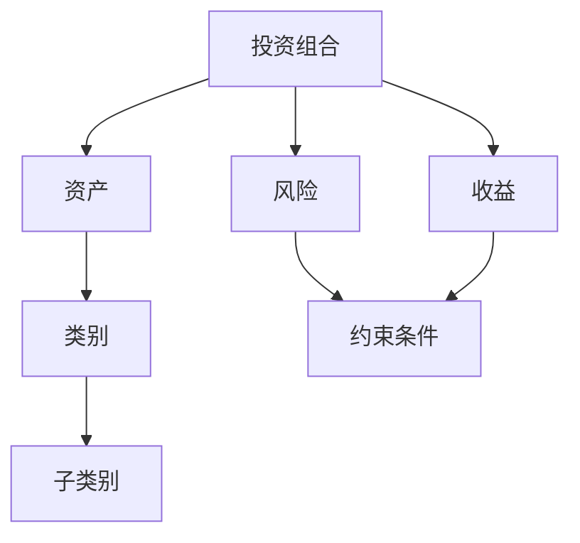
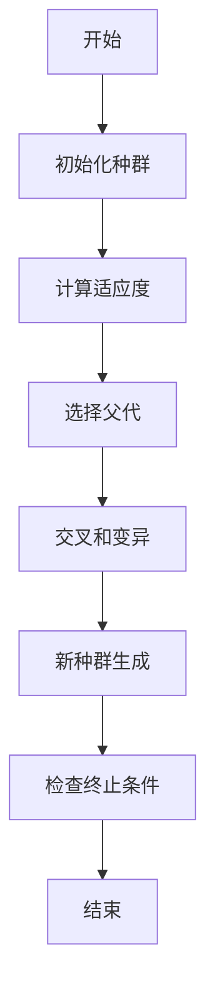

                 


# 智能投资组合多目标优化模型

## 关键词：智能投资组合，多目标优化，投资组合优化，粒子群优化，遗传算法

## 摘要：智能投资组合多目标优化模型是一种结合了人工智能算法的现代投资组合优化方法，旨在在多个目标之间找到最优平衡。通过多目标优化算法，该模型能够同时考虑收益、风险、流动性等多个因素，为投资者提供更科学、更高效的资产配置方案。本文将深入探讨智能投资组合多目标优化模型的背景、核心概念、算法原理、系统架构以及实际应用，帮助读者全面理解并掌握这一前沿技术。

---

## 第一部分：智能投资组合多目标优化模型概述

### 第1章：智能投资组合与多目标优化模型背景

#### 1.1 投资组合优化的背景与意义

##### 1.1.1 投资组合优化的基本概念
投资组合优化是指通过科学的方法选择最优的资产组合，以实现特定的投资目标，如最大化收益、最小化风险或实现特定的投资策略。传统投资组合优化通常采用单目标优化方法，例如马科维茨的均值-方差模型，仅考虑收益和风险两个因素。

##### 1.1.2 多目标优化的必要性
在实际投资中，投资者往往需要在多个目标之间进行权衡，例如在高收益和低风险之间找到平衡。传统的单目标优化方法难以满足这种复杂的需求，因此多目标优化模型应运而生。多目标优化能够在多个目标之间找到帕累托最优解，帮助投资者在复杂的市场环境中做出更优决策。

##### 1.1.3 智能投资组合的核心价值
智能投资组合通过引入人工智能和机器学习技术，能够处理海量数据，捕捉市场中的潜在规律，从而为投资组合优化提供更强大的支持。多目标优化模型能够同时优化多个目标，如收益、风险、流动性等，使投资组合更贴近实际需求。

#### 1.2 智能投资组合的定义与特点

##### 1.2.1 智能投资组合的定义
智能投资组合是指利用人工智能技术，结合多目标优化算法，动态调整资产配置，以实现投资目标的优化。它能够根据市场环境的变化和投资者的需求，自动优化投资组合。

##### 1.2.2 智能投资组合的核心特点
- **动态性**：能够实时调整资产配置，适应市场变化。
- **多目标性**：同时优化多个目标，如收益、风险、流动性等。
- **智能化**：利用人工智能技术进行数据处理和决策。

##### 1.2.3 智能投资组合与传统投资组合的区别
| 特性                | 智能投资组合                     | 传统投资组合                     |
|---------------------|----------------------------------|----------------------------------|
| 优化目标            | 多目标优化                      | 单目标优化                      |
| 是否动态调整        | 是                              | 否                              |
| 是否依赖 AI 技术     | 是                              | 否                              |

#### 1.3 多目标优化模型的背景与应用

##### 1.3.1 多目标优化的基本概念
多目标优化是指在多个目标函数的情况下，寻找最优解的过程。通常，这些目标函数之间存在冲突，因此需要找到一个帕累托最优解集。

##### 1.3.2 多目标优化在投资组合中的应用
- **资产配置优化**：同时优化收益、风险、流动性等目标。
- **风险控制**：在控制风险的前提下，最大化收益。
- **动态调整**：根据市场变化，动态优化投资组合。

##### 1.3.3 多目标优化与智能投资的结合
通过多目标优化模型，智能投资组合能够更好地应对复杂的投资环境，为投资者提供更全面的解决方案。

#### 1.4 本章小结
本章介绍了智能投资组合和多目标优化模型的背景、核心概念和特点，为后续章节的深入分析奠定了基础。

---

### 第2章：智能投资组合多目标优化模型的核心概念

#### 2.1 智能投资组合的数学模型

##### 2.1.1 投资组合的收益与风险模型
投资组合的收益可以用资产的期望收益加权平均表示，风险可以用方差或标准差表示。

##### 2.1.2 多目标优化的数学表达
多目标优化模型可以表示为：
$$
\text{minimize } f_1(x), f_2(x), \ldots, f_n(x)
$$
$$
\text{subject to } g_1(x) \leq 0, g_2(x) \leq 0, \ldots, g_m(x) \leq 0
$$
其中，$f_i(x)$ 是目标函数，$g_j(x)$ 是约束条件。

##### 2.1.3 智能投资组合的核心要素
- **资产池**：可供选择的资产集合。
- **目标函数**：收益、风险、流动性等。
- **约束条件**：如投资比例限制、风险上限等。

#### 2.2 多目标优化模型的属性特征对比

##### 2.2.1 单目标优化与多目标优化的对比
| 特性                | 单目标优化                  | 多目标优化                  |
|---------------------|-----------------------------|-----------------------------|
| 目标函数            | 单个目标函数                | 多个目标函数                |
| 解的个数            | 通常只有一个最优解          | 通常是一个解集（帕累托最优）|
| 应用场景            | 简单问题                    | 复杂问题                    |

##### 2.2.2 多目标优化模型的评价指标
- **帕累托前沿**：所有帕累托最优解的集合。
- **支配关系**：一个解支配另一个解，表示前者在所有目标上都不差于后者。

##### 2.2.3 不同优化算法的优缺点分析
| 算法名称            | 优点                          | 缺点                          |
|---------------------|----------------------------|----------------------------|
| 遗传算法            | 能够处理复杂的非线性问题      | 计算效率较低                  |
| 粒子群优化          | 收敛速度快                    | 易陷入局部最优                |
| 多目标进化算法      | 能够找到帕累托最优解          | 参数设置较为复杂              |

#### 2.3 智能投资组合的ER实体关系图


#### 2.4 本章小结
本章详细介绍了智能投资组合多目标优化模型的核心概念和相关数学模型，为后续章节的算法实现奠定了基础。

---

### 第3章：智能投资组合多目标优化模型的算法原理

#### 3.1 常见的多目标优化算法

##### 3.1.1 遗传算法（GA）
遗传算法是一种基于自然选择和遗传机制的优化算法，主要包括选择、交叉和变异三个步骤。

##### 3.1.2 粒子群优化（PSO）
粒子群优化是一种基于群体智能的优化算法，通过模拟鸟群觅食行为，寻找最优解。

##### 3.1.3 多目标进化算法（MOEA）
多目标进化算法是一种专门用于多目标优化的进化算法，能够直接生成帕累托最优解集。

#### 3.2 算法流程图


#### 3.3 算法实现的Python代码

##### 遗传算法实现
```python
def genetic_algorithm(objective_functions, constraints, population_size=100, generations=100):
    # 初始化种群
    population = initialize_population(population_size)
    
    for _ in range(generations):
        # 计算适应度
        fitness = [evaluate_fitness(individual, objective_functions, constraints) for individual in population]
        
        # 选择父代
        selected = select_parents(population, fitness)
        
        # 交叉和变异
        new_population = mutate(selected)
        
        # 更新种群
        population = new_population
    
    return population
```

##### 粒子群优化实现
```python
def particle_swarm_optimization(objective_functions, constraints, n_particles=50, max_iterations=100):
    # 初始化粒子群
    particles = initialize_swarm(n_particles)
    
    for _ in range(max_iterations):
        # 计算适应度
        fitness = [evaluate_fitness(particle, objective_functions, constraints) for particle in particles]
        
        # 更新全局最优和局部最优
        update_global_best(particles, fitness)
        update_local_best(particles)
        
        # 更新粒子位置和速度
        particles = update_positions(particles)
    
    return particles
```

#### 3.4 数学模型与公式
多目标优化模型的数学表达式可以表示为：
$$
\text{minimize } f_1(x), f_2(x), \ldots, f_n(x)
$$
$$
\text{subject to } g_1(x) \leq 0, g_2(x) \leq 0, \ldots, g_m(x) \leq 0
$$

其中，$f_i(x)$ 是目标函数，$g_j(x)$ 是约束条件。

#### 3.5 本章小结
本章详细介绍了几种常见的多目标优化算法，包括遗传算法和粒子群优化，并给出了相应的实现代码和数学模型。

---

## 总结与展望

智能投资组合多目标优化模型通过结合人工智能技术和多目标优化算法，为投资者提供了更科学、更高效的资产配置方案。本文从背景、核心概念、算法原理、系统架构和实际应用等多个方面对智能投资组合多目标优化模型进行了全面分析。

未来，随着人工智能技术的不断发展，智能投资组合多目标优化模型将在更多领域得到应用，为投资者创造更大的价值。

