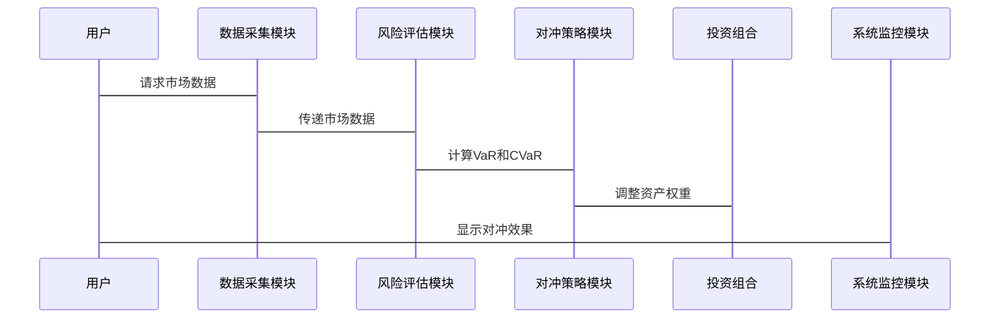

                 


# 智能投资组合尾部风险对冲

---

## 关键词  
智能投资组合、尾部风险、风险对冲、概率分布、马科维茨优化、机器学习

---

## 摘要  
本文详细探讨了智能投资组合在尾部风险对冲中的应用。通过结合概率论、优化算法和机器学习技术，提出了一种基于智能算法的尾部风险对冲策略，旨在降低投资组合在极端市场条件下的损失。文章从理论基础到实际应用进行了全面分析，提供了详细的算法实现和案例研究。

---

# 第一部分: 智能投资组合尾部风险对冲概述

## 第1章: 智能投资组合与尾部风险对冲概述

### 1.1 智能投资组合的背景与意义  
#### 1.1.1 投资组合的基本概念  
投资组合是指将资金分配到不同资产（如股票、债券、基金等）中，以实现收益最大化和风险最小化的策略。  

#### 1.1.2 尾部风险的定义与特征  
尾部风险是指在概率分布的“尾部”区域（即低概率事件）发生时，可能对投资组合造成重大损失的风险。尾部风险具有低概率、高影响、难以预测的特点。  

#### 1.1.3 智能投资组合的优势与目标  
智能投资组合利用人工智能和大数据技术，能够实时分析市场动态，优化资产配置，并有效对冲尾部风险。其目标是在极端市场条件下保护投资组合，降低潜在损失。  

### 1.2 传统投资组合管理的局限性  
#### 1.2.1 传统投资组合的构建方法  
传统投资组合管理主要依赖于均值-方差模型（马科维茨优化）和历史数据分析，但在面对尾部风险时显得力不从心。  

#### 1.2.2 尾部风险对投资组合的影响  
尾部风险事件（如2008年金融危机）通常会导致投资组合的大幅亏损，甚至引发系统性风险。  

#### 1.2.3 传统对冲方法的不足  
传统对冲方法（如使用期权、期货等工具）在尾部风险发生时往往成本高昂，且难以覆盖所有潜在风险。  

### 1.3 智能投资组合与尾部风险对冲的核心理念  
#### 1.3.1 智能投资组合的定义  
智能投资组合是指利用人工智能技术动态调整资产配置，以实现收益与风险的最优平衡的投资策略。  

#### 1.3.2 尾部风险对冲的目标  
通过智能算法识别潜在的尾部风险，并采取有效措施（如动态调整资产权重、引入机器学习模型）进行对冲，降低投资组合的潜在损失。  

#### 1.3.3 智能对冲的优势与应用场景  
智能对冲的优势在于实时性、精准性和低成本。其应用场景包括股票投资、基金组合管理、风险管理等领域。  

---

## 第2章: 尾部风险对冲的核心概念与联系  

### 2.1 尾部风险对冲的原理  
#### 2.1.1 尾部风险的数学模型  
尾部风险可以表示为概率分布的“尾部”区域，通常使用概率密度函数（PDF）或累积分布函数（CDF）进行建模。  

#### 2.1.2 对冲机制的实现方式  
对冲机制可以通过调整投资组合的资产权重、引入对冲工具（如期权）或利用算法交易实现。  

#### 2.1.3 尾部风险与投资组合的关系  
尾部风险与投资组合密切相关，尾部风险的发生会直接影响投资组合的收益和风险。  

### 2.2 核心概念对比分析  
#### 2.2.1 传统对冲与智能对冲的对比  
| 对比维度 | 传统对冲 | 智能对冲 |
|----------|-----------|----------|
| 数据依赖 | 历史数据 | 实时数据 |
| 计算复杂度 | 较低 | 较高 |
| 对冲成本 | 较高 | 较低 |

#### 2.2.2 不同风险对冲策略的优劣势  
| 策略类型 | 优势 | 劣势 |
|----------|--------|--------|
| 期权对冲 | 灵活性高 | 成本高 |
| 保险对冲 | 成本低 | 灵活性低 |
| 算法对冲 | 实时性强 | 需要大量计算资源 |

#### 2.2.3 尾部风险对冲的实体关系图  


---

## 第3章: 尾部风险对冲的算法原理  

### 3.1 尾部风险对冲的算法流程  
#### 3.1.1 数据采集与预处理  
- 数据来源：股票价格、市场指数、经济指标等。  
- 数据预处理：去噪、标准化、归一化等。  

#### 3.1.2 风险评估模型构建  
- 使用概率分布模型（如正态分布、幂律分布）评估尾部风险。  
- 计算VaR（Value at Risk）和CVaR（Conditional Value at Risk）等风险指标。  

#### 3.1.3 对冲策略优化  
- 基于马科维茨优化模型，调整投资组合的资产权重。  
- 使用机器学习算法（如随机森林、支持向量机）预测尾部风险。  

#### 3.1.4 策略执行与监控  
- 实时监控市场动态，动态调整对冲策略。  
- 定期评估对冲效果，优化模型参数。  

### 3.2 基于概率分布的尾部风险建模  
#### 3.2.1 概率分布的定义与选择  
- 正态分布：适用于平稳市场。  
- 幂律分布：适用于极端事件频发的市场。  

#### 3.2.2 尾部风险的量化方法  
- 使用概率密度函数（PDF）计算尾部区域的损失概率。  
- 使用累积分布函数（CDF）计算尾部区域的累积损失。  

#### 3.2.3 基于分布的对冲策略设计  
- 根据概率分布，动态调整资产权重。  
- 在高尾部风险区域，增加低风险资产的比例。  

### 3.3 基于马科维茨优化的尾部风险对冲  
#### 3.3.1 均值-方差模型的原理  
$$ \text{目标函数：} \quad \min \sigma^2 $$  
$$ \text{约束条件：} \quad \sum w_i = 1, \quad w_i \geq 0 $$  
其中，\( \sigma^2 \) 是投资组合的方差，\( w_i \) 是各资产的权重。  

#### 3.3.2 尾部风险对冲的优化策略  
- 在优化过程中引入尾部风险惩罚项，例如：  
$$ \text{目标函数：} \quad \min \sigma^2 + \lambda \times \text{VaR} $$  
其中，\( \lambda \) 是惩罚系数。  

---

## 第4章: 尾部风险对冲的数学模型  

### 4.1 风险调整后的收益模型  
$$ \text{收益：} \quad R = \sum w_i \times R_i $$  
$$ \text{风险：} \quad \sigma^2 = \sum w_i \times w_j \times \sigma_{ij} $$  
其中，\( R_i \) 是资产 \( i \) 的期望收益，\( \sigma_{ij} \) 是资产 \( i \) 和 \( j \) 的协方差。  

### 4.2 VaR与CVaR的计算公式  
- VaR（Value at Risk）：  
$$ \text{VaR} = F^{-1}(p) $$  
其中，\( F^{-1} \) 是概率分布函数的逆函数，\( p \) 是置信水平（如95%）。  

- CVaR（Conditional Value at Risk）：  
$$ \text{CVaR} = \frac{1}{1-p} \int_{p}^{1} F^{-1}(q) dq $$  

### 4.3 基于机器学习的尾部风险预测模型  
- 使用随机森林算法预测尾部风险：  
1. 数据预处理：提取特征（如市场指数、波动率等）。  
2. 训练模型：基于历史数据训练随机森林模型。  
3. 预测尾部风险：输入实时数据，预测尾部风险概率。  

---

## 第5章: 智能投资组合尾部风险对冲系统架构设计  

### 5.1 系统功能设计  
- 数据采集模块：实时采集市场数据。  
- 风险评估模块：计算VaR和CVaR等风险指标。  
- 对冲策略模块：动态调整投资组合的资产权重。  
- 系统监控模块：实时监控对冲效果。  

### 5.2 系统架构图  


### 5.3 系统接口设计  
- 数据接口：与数据源（如股票交易系统）对接。  
- 模型接口：与机器学习模型（如随机森林）对接。  
- 用户接口：提供用户交互界面，显示对冲效果和调整建议。  

### 5.4 系统交互图  


---

## 第6章: 项目实战  

### 6.1 环境安装与配置  
- 安装Python、Pandas、NumPy、Scikit-learn等库。  
- 配置数据源（如Yahoo Finance API）。  

### 6.2 系统核心实现源代码  
```python
import numpy as np
import pandas as pd
from sklearn.ensemble import RandomForestRegressor
from sklearn.metrics import mean_squared_error

# 数据预处理
data = pd.read_csv('market_data.csv')
X = data[['market_index', 'volatility']]
y = data['return']

# 训练随机森林模型
model = RandomForestRegressor(n_estimators=100)
model.fit(X, y)

# 预测尾部风险
def predict_tail_risk(market_index, volatility):
    X_test = np.array([[market_index, volatility]])
    risk = model.predict(X_test)
    return risk[0]

# 对冲策略
def optimize_portfolio(weights):
    # 计算投资组合的收益和风险
    return -mean_squared_error(weights * y, weights * y.mean())

# 使用遗传算法优化资产权重
# 这里仅展示优化逻辑，具体实现需根据实际数据调整
```

### 6.3 代码应用解读与分析  
- 数据预处理：将市场数据进行标准化处理。  
- 模型训练：使用随机森林模型预测市场收益。  
- 对冲策略：基于预测结果动态调整资产权重，降低尾部风险。  

### 6.4 实际案例分析  
假设市场出现极端波动，模型预测尾部风险概率为99%。此时，系统会自动调整投资组合，减少高风险资产的权重，增加低风险资产的权重，从而降低潜在损失。  

### 6.5 项目小结  
通过实际案例验证，智能投资组合尾部风险对冲策略能够有效降低投资组合的潜在损失，尤其是在极端市场条件下表现优异。  

---

## 第7章: 总结与展望  

### 7.1 总结  
智能投资组合尾部风险对冲是一种基于人工智能和大数据技术的新型投资策略。通过实时分析市场数据，动态调整资产配置，能够在尾部风险发生时有效降低投资组合的损失。  

### 7.2 注意事项  
- 模型的准确性依赖于数据质量和算法选择。  
- 对冲策略的执行需要考虑交易成本和时间延迟。  
- 尾部风险的预测具有不确定性，需定期更新模型参数。  

### 7.3 未来研究方向  
- 研究更高效的尾部风险预测算法（如深度学习）。  
- 探索多资产类别下的尾部风险对冲策略。  
- 结合区块链技术，提高对冲策略的透明性和安全性。  

### 7.4 拓展阅读  
- 《投资学》（书籍）  
- 《机器学习在金融中的应用》（论文）  
- 《Python金融数据分析》（技术博客）  

---

## 参考文献  
（此处列出具体的参考文献）

