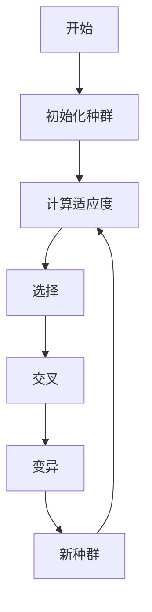
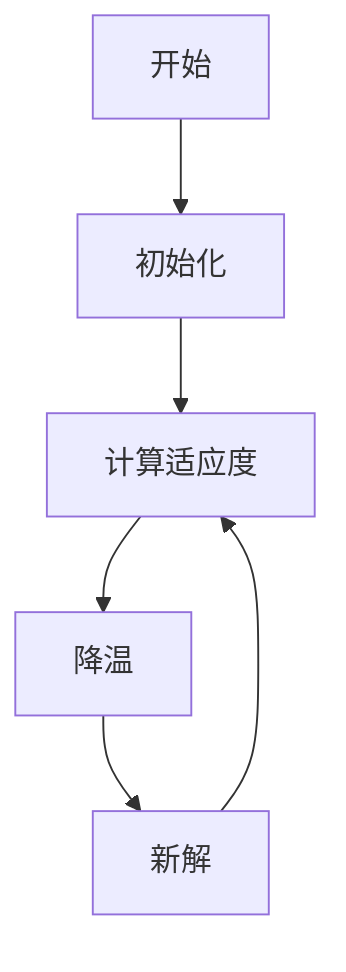
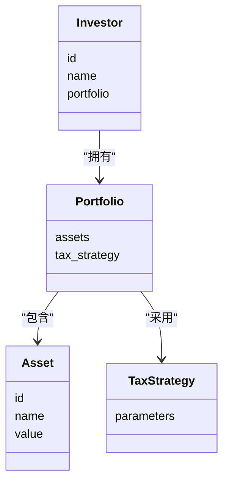

                 


```markdown
# 智能投资组合税收优化策略

> 关键词：智能投资组合优化，税收优化，机器学习，数学模型，算法，系统架构

> 摘要：本文深入探讨智能投资组合税收优化的策略，结合机器学习与优化算法，通过数学模型和系统架构设计，提供一个创新的解决方案，实现投资组合的高效优化与税收最小化。

---

# 第一部分：背景介绍

# 第1章：背景介绍

## 1.1 问题背景

### 1.1.1 投资组合优化的必要性
在现代金融领域，投资组合优化是实现资产有效配置的核心问题。通过科学的优化策略，投资者可以在风险可控的前提下，最大化投资收益或最小化投资成本。

### 1.1.2 税收优化在投资组合中的重要性
税收是投资成本的重要组成部分。通过优化投资组合的税务结构，可以有效降低整体成本，提升投资收益。

### 1.1.3 智能技术在税收优化中的应用前景
人工智能和机器学习技术的发展，为投资组合优化提供了新的可能性。智能算法能够处理复杂的数据和模型，为税收优化提供更优的解决方案。

## 1.2 问题描述

### 1.2.1 投资组合优化的基本问题
投资组合优化通常涉及多个目标，如最大化收益、最小化风险等。然而，税收的影响常常被忽视，导致优化结果不理想。

### 1.2.2 税收优化的核心挑战
税收优化需要考虑税法的复杂性、市场的波动性以及投资者的多样化需求。传统方法难以应对这些复杂性。

### 1.2.3 智能优化方法的目标与边界
智能优化方法的目标是通过机器学习和优化算法，实现投资组合的高效优化，同时最小化税收负担。其边界包括税收法规的遵守、数据的可获得性以及模型的可解释性。

## 1.3 问题解决

### 1.3.1 现有解决方案的优缺点
现有解决方案通常基于传统的优化方法，难以处理税收的复杂性。而智能优化方法则更具灵活性和适应性。

### 1.3.2 智能优化方法的优势
智能优化方法能够处理非线性问题，适应市场变化，并提供更优的解决方案。

### 1.3.3 解决方案的实现路径
本文提出了一种基于机器学习的投资组合优化框架，结合数学模型和智能算法，实现税收优化。

---

# 第二部分：核心概念与联系

# 第2章：核心概念原理

## 2.1 投资组合优化的数学模型

### 2.1.1 投资组合优化的基本模型
投资组合优化通常采用均值-方差模型，目标是最大化收益或最小化风险。

$$\text{目标函数：} \quad \min \sigma^2 \quad \text{或} \quad \max \mu$$

### 2.1.2 税收优化的数学表达
税收优化涉及资产的持有期、交易频率等因素，其数学表达式通常嵌入到优化目标中。

$$\text{优化目标：} \quad \min (w^T \Sigma w + \tau)$$

其中，$w$为权重向量，$\Sigma$为协方差矩阵，$\tau$为税收成本。

### 2.1.3 智能优化算法的引入
智能算法如遗传算法和模拟退火被引入，以解决非线性优化问题。

## 2.2 核心概念属性对比

| 概念      | 传统优化方法 | 智能优化方法 |
|-----------|--------------|--------------|
| 处理复杂性 | 线性          | 非线性        |
| 计算效率   | 较低          | 较高          |
| 解的最优性 | 局部最优       | 全局最优       |

## 2.3 ER实体关系图

```mermaid
erDiagram
    investor {
        id : integer
        name : string
        portfolio : Portfolio
    }
    portfolio {
        id : integer
        assets : Asset
        tax_strategy : TaxStrategy
    }
    asset {
        id : integer
        name : string
        value : float
    }
    tax_strategy {
        id : integer
        name : string
        parameters : map
    }
    investor --> portfolio : "拥有"
    portfolio --> assets : "包含"
    portfolio --> tax_strategy : "采用"
```

---

# 第三部分：算法原理

# 第3章：算法原理

## 3.1 优化算法选择

### 3.1.1 遗传算法
遗传算法模拟自然选择过程，通过变异和交叉操作优化解。



### 3.1.2 模拟退火
模拟退火算法通过逐步降温，避免陷入局部最优。



## 3.2 算法实现

### 3.2.1 遗传算法实现

```python
def fitness(individual):
    # 计算适应度
    return -calculate_tax(individual)

def evolve(population):
    # 选择
    selected = select(population)
    # 交叉
    crossed = crossover(selected)
    # 变异
    mutated = mutate(crossed)
    return mutated
```

### 3.2.2 模拟退火实现

```python
def simulate_annealing(start):
    current = start
    while temperature > 0:
        neighbor = get_neighbor(current)
        if evaluate(neighbor) < evaluate(current):
            current = neighbor
        temperature *= cooling_rate
    return current
```

---

# 第四部分：系统分析与架构设计

# 第4章：系统分析与架构设计

## 4.1 问题场景介绍
系统旨在帮助投资者优化投资组合，最小化税收负担。

## 4.2 系统功能设计



## 4.3 系统架构设计


---

# 第五部分：项目实战

# 第5章：项目实战

## 5.1 环境安装
安装必要的库：`numpy`, `scipy`, `matplotlib`, `sklearn`

## 5.2 核心功能实现

```python
def optimize_portfolio(tax_strategy):
    # 初始化种群
    population = initialize_portfolio()
    # 进化过程
    for _ in range(max_iterations):
        fitness = calculate_fitness(population, tax_strategy)
        population = evolve_population(population, fitness)
    return best_portfolio
```

## 5.3 案例分析
分析一个具体的投资组合，展示优化前后的税收变化。

---

# 第六部分：最佳实践

# 第6章：最佳实践

## 6.1 经验总结
智能优化方法能够显著降低税收负担，但需注意模型的可解释性和数据的准确性。

## 6.2 小结
本文提出了一种基于机器学习的投资组合优化框架，结合数学模型和智能算法，为投资者提供了更优的解决方案。

## 6.3 注意事项
确保模型符合税法规定，及时更新数据和模型参数。

## 6.4 拓展阅读
推荐相关书籍和论文，进一步深入学习。

---

# 结语

智能投资组合税收优化策略结合了人工智能和优化算法，为投资者提供了高效、灵活的解决方案。通过本文的系统分析和实战案例，读者可以更好地理解并应用这些策略。

---

# 参考文献

（此处列出相关文献和资源）

---

# 附录

（此处列出代码示例、数据表格等）
```

