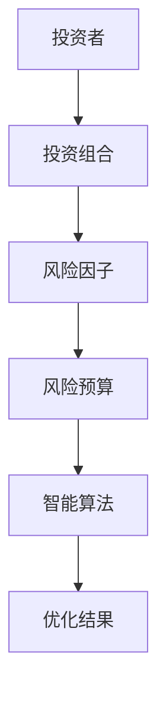
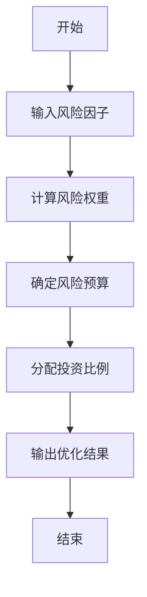
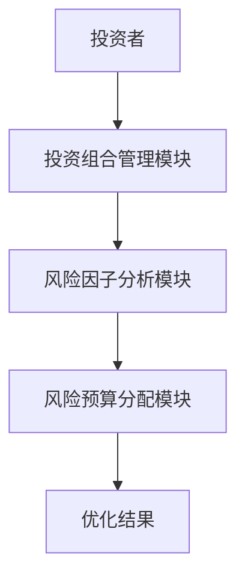
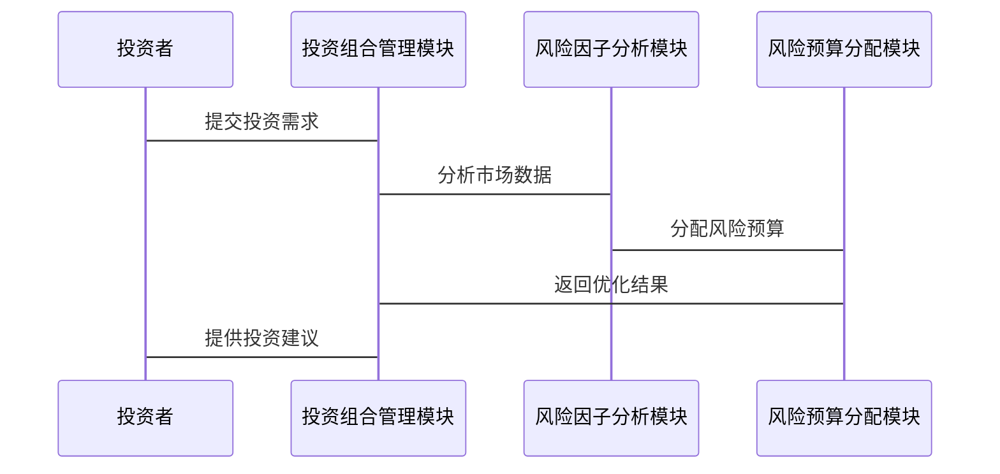

                 


# 智能投资组合风险预算分配模型

## 关键词
智能投资组合、风险预算分配、机器学习、数学模型、金融优化

## 摘要
智能投资组合风险预算分配模型是一种结合机器学习和优化算法的金融工具，用于在复杂市场环境中有效分配和管理投资组合的风险预算。本文将从模型的背景、核心概念、算法原理、系统设计、项目实战等方面进行详细讲解，帮助读者全面理解并掌握该模型的构建与应用。

---

# 第一部分: 背景与概念

## 第1章: 投资组合风险预算分配模型的背景与概念

### 1.1 投资组合风险预算分配模型的背景

#### 1.1.1 传统投资组合管理的局限性
传统的投资组合管理方法依赖于历史数据分析和静态模型，难以适应市场波动和复杂的投资环境。例如，固定比例分配策略在市场剧烈波动时可能导致风险超限或收益不足。

#### 1.1.2 风险预算分配的重要性
风险预算是投资者在特定风险承受能力下分配资金以实现收益最大化的关键步骤。合理的风险预算分配能够平衡风险与收益，避免过度冒险或保守。

#### 1.1.3 智能投资组合的兴起
随着大数据和人工智能技术的发展，智能投资组合逐渐取代传统方法。智能算法能够实时分析市场数据，动态调整投资组合，提高收益并降低风险。

### 1.2 智能投资组合风险预算分配模型的定义

#### 1.2.1 模型的基本概念
智能投资组合风险预算分配模型是通过智能算法和数学优化方法，动态分配投资组合中各资产的风险预算，以实现风险控制和收益最大化。

#### 1.2.2 模型的核心目标
1. 实现风险预算的动态分配。
2. 优化投资组合的收益与风险比。
3. 提高投资决策的实时性和准确性。

#### 1.2.3 模型的适用范围
适用于股票、债券、基金等多种金融资产的投资组合管理，尤其在市场波动剧烈时表现优异。

### 1.3 模型的核心要素与组成

#### 1.3.1 风险因子的识别
风险因子是影响投资组合风险的主要因素，包括市场波动、利率变化、通货膨胀等。

#### 1.3.2 风险预算的分配逻辑
根据投资者的风险承受能力和市场环境，智能算法动态调整各风险因子的风险预算。

#### 1.3.3 智能算法的应用
采用机器学习算法（如聚类、回归）和优化算法（如线性规划、非线性规划）进行风险预算分配。

---

## 第2章: 智能投资组合风险预算分配模型的核心概念与联系

### 2.1 核心概念原理

#### 2.1.1 风险因子分析
通过分析市场数据，识别影响投资组合风险的主要因子，并评估其对整体风险的影响程度。

#### 2.1.2 风险预算分配的数学模型
基于风险因子和历史数据，建立数学模型，计算各风险因子的风险预算分配比例。

#### 2.1.3 智能算法的实现机制
利用机器学习算法对市场数据进行建模，优化风险预算分配策略。

### 2.2 核心概念属性对比表格

| 概念       | 属性                           |
|------------|--------------------------------|
| 风险因子   | 股市波动、利率变化、通货膨胀等 |
| 风险预算   | 预定的最大风险承受值           |
| 智能算法   | 机器学习、优化算法等           |

### 2.3 ER实体关系图



---

## 第3章: 智能投资组合风险预算分配模型的算法原理

### 3.1 算法原理概述

#### 3.1.1 风险预算分配的基本逻辑
1. 输入市场数据和风险因子。
2. 计算各风险因子的风险权重。
3. 分配投资比例，优化收益与风险比。

#### 3.1.2 智能算法的核心步骤
1. 数据预处理：清洗和归一化市场数据。
2. 模型训练：利用机器学习算法训练风险预测模型。
3. 风险预算分配：根据预测结果动态调整风险预算。

#### 3.1.3 算法的优化与改进
通过参数调整和模型优化，提高算法的准确性和实时性。

### 3.2 算法流程图



### 3.3 算法实现代码

```python
def risk_budget_allocation(risk_factors, budget):
    # 计算风险权重
    risk_weights = {factor: budget / len(risk_factors) for factor in risk_factors}
    return risk_weights
```

### 3.4 数学模型与公式

#### 3.4.1 风险预算分配的基本公式
$$ \text{风险权重} = \frac{\text{风险预算}}{\text{风险因子数量}} $$

#### 3.4.2 风险预算分配的优化模型
$$ \text{目标函数} = \min \sum_{i=1}^{n} w_i \times r_i $$
$$ \text{约束条件} = \sum_{i=1}^{n} w_i = 1 $$

#### 3.4.3 实例分析
假设风险因子为3个，风险预算是10%，则每个风险因子的风险权重为：
$$ \text{风险权重} = \frac{10\%}{3} \approx 3.33\% $$

---

## 第4章: 智能投资组合风险预算分配模型的数学模型与公式

### 4.1 数学模型概述

#### 4.1.1 风险预算分配的基本公式
$$ \text{风险权重} = \frac{\text{风险预算}}{\text{风险因子数量}} $$

### 4.2 风险预算分配的优化模型

#### 4.2.1 目标函数
$$ \text{目标函数} = \min \sum_{i=1}^{n} w_i \times r_i $$

#### 4.2.2 约束条件
$$ \sum_{i=1}^{n} w_i = 1 $$

### 4.3 实例分析

假设风险因子为3个，风险预算是10%，则每个风险因子的风险权重为：
$$ \text{风险权重} = \frac{10\%}{3} \approx 3.33\% $$

---

## 第5章: 系统分析与架构设计方案

### 5.1 问题场景介绍

### 5.2 项目介绍

### 5.3 系统功能设计

#### 5.3.1 领域模型


#### 5.3.2 系统架构设计


#### 5.3.3 系统接口设计


### 5.4 项目实战

#### 5.4.1 环境安装
```bash
pip install numpy pandas scikit-learn
```

#### 5.4.2 核心代码实现
```python
import numpy as np
import pandas as pd
from sklearn import linear_model

def calculate_risk_factors(data):
    # 数据预处理
    data = data.dropna()
    data = (data - data.mean()) / data.std()
    return data

def allocate_risk_budget(risk_factors, budget):
    # 计算风险权重
    risk_weights = {factor: budget / len(risk_factors) for factor in risk_factors}
    return risk_weights

# 示例数据
data = pd.DataFrame({
    'Market_Return': [0.05, 0.06, 0.04, 0.07, 0.05],
    'Interest_Rate': [0.03, 0.04, 0.03, 0.05, 0.04],
    'Inflation': [0.02, 0.03, 0.02, 0.04, 0.03]
})

# 计算风险权重
weights = allocate_risk_budget(['Market_Return', 'Interest_Rate', 'Inflation'], 0.1)
print(weights)
```

---

## 第6章: 总结与展望

### 6.1 最佳实践 tips
1. 定期更新模型参数，适应市场变化。
2. 结合实际需求调整算法，优化性能。
3. 注意数据质量和实时性，确保模型的有效性。

### 6.2 小结
智能投资组合风险预算分配模型通过智能算法和数学优化，帮助投资者在复杂市场环境中实现风险控制和收益最大化。

### 6.3 注意事项
1. 数据来源和质量直接影响模型效果，需谨慎选择。
2. 模型参数调整需根据实际需求进行，避免过度优化。
3. 风险预算分配需结合投资者的风险偏好，避免单一化。

### 6.4 拓展阅读
建议阅读相关领域的经典文献，深入了解智能投资组合管理和风险预算分配的最新研究。

---

通过以上内容，您已经全面了解了智能投资组合风险预算分配模型的背景、核心概念、算法原理、系统设计和项目实战。希望本文能为您提供有价值的参考和启发，帮助您更好地理解和应用该模型。

