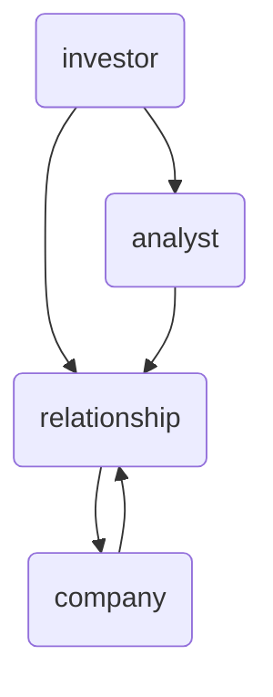
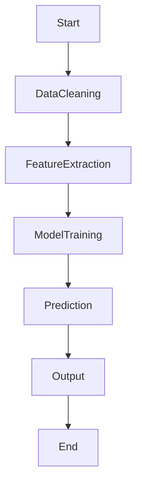
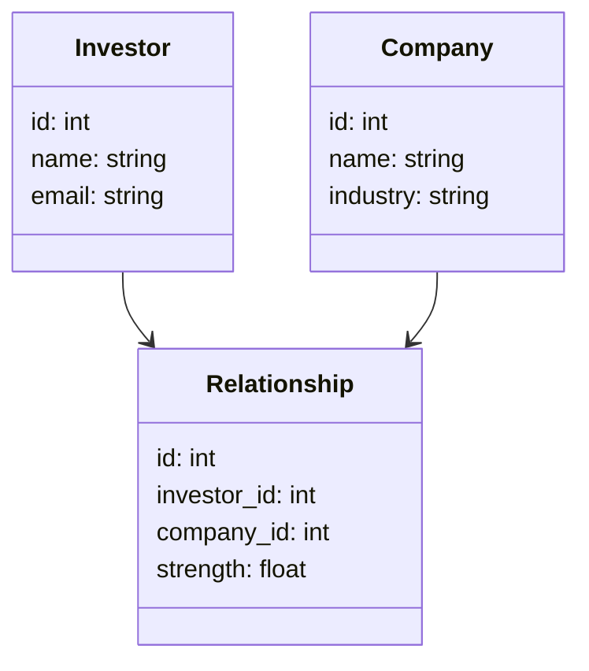
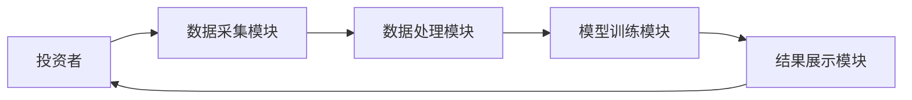
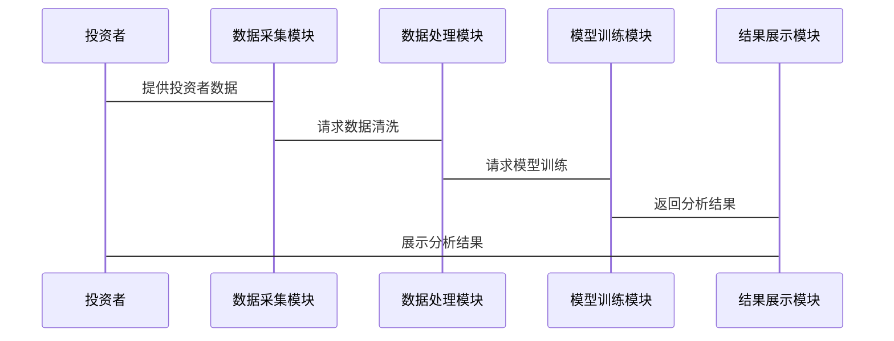

                 


# 智能投资者关系分析平台

> 关键词：投资者关系管理，人工智能，自然语言处理，文本挖掘，机器学习

> 摘要：智能投资者关系分析平台利用先进的人工智能和自然语言处理技术，对投资者与企业之间的关系进行深入分析，从而帮助投资者做出更明智的决策。本文将详细探讨该平台的背景、核心概念、算法原理、系统架构以及实际项目中的应用。

---

## 第1章 智能投资者关系分析平台背景介绍

### 1.1 问题背景与描述

#### 1.1.1 投资者关系管理的传统挑战
投资者关系管理（IRM）是企业与投资者之间建立有效沟通和关系的关键环节。传统上，投资者关系管理依赖于人工分析和手动记录，存在以下问题：
- 数据分散：投资者信息、公司公告、市场反馈等数据分散在不同渠道，难以整合。
- 信息滞后：人工分析耗时较长，难以快速响应市场变化。
- 知识盲区：缺乏对投资者情绪、市场趋势的深度洞察，难以提供个性化的建议。

#### 1.1.2 智能化技术在投资者关系管理中的应用前景
随着人工智能和自然语言处理技术的进步，智能投资者关系分析平台能够实时处理大量数据，提供精准的分析和预测。通过自动化数据采集、情感分析和关系挖掘，平台可以显著提高投资者关系管理的效率和准确性。

#### 1.1.3 当前市场对智能投资者关系分析的需求
当前，金融市场对实时、准确的投资者关系分析需求日益增长。投资者需要快速了解企业的财务状况、市场表现和管理团队的稳定性。智能投资者关系分析平台能够满足这些需求，帮助投资者做出更明智的决策。

### 1.2 问题解决与边界

#### 1.2.1 智能投资者关系分析的核心目标
智能投资者关系分析平台的核心目标是通过自动化技术，从多源数据中提取有价值的信息，分析投资者与企业之间的关系，提供实时的洞察和建议。

#### 1.2.2 平台的功能边界与外延
平台的功能边界包括：
- 数据采集与处理
- 情感分析
- 关系挖掘
- 预测与建议

平台的外延包括与企业内部系统的集成，如ERP、CRM等。

#### 1.2.3 平台与现有投资者关系管理工具的区别
传统投资者关系管理工具主要依赖人工操作，而智能投资者关系分析平台通过自动化和智能化技术，显著提高了效率和准确性。

### 1.3 核心概念与结构

#### 1.3.1 平台的核心要素组成
平台的核心要素包括：
- 数据源：新闻、财报、社交媒体、投资者反馈
- 数据处理：清洗、转换、整合
- 模型训练：情感分析、关系挖掘、预测模型
- 输出结果：关系图谱、分析报告、个性化建议

#### 1.3.2 核心概念的属性特征对比表
| 概念 | 属性 | 描述 |
|------|------|------|
| 投资者 | 姓名 | 投资者的名称 |
| 公司 | 行业 | 公司所属行业 |
| 关系强度 | 数值 | 关系的强弱程度 |

#### 1.3.3 实体关系图（ER图）的Mermaid流程图


## 第2章 核心算法原理

### 2.1 算法概述

#### 2.1.1 算法目标与输入输出
- **目标**：通过自然语言处理和机器学习，分析投资者与公司之间的关系。
- **输入**：文本数据（如新闻、财报）、结构化数据（如股价、财务指标）
- **输出**：关系强度、情感倾向、预测结果

#### 2.1.2 算法的整体流程


### 2.2 算法实现细节

#### 2.2.1 数据预处理步骤
- 文本清洗：去除停用词、标点符号
- 分词：使用分词工具（如jieba）
- 向量化：使用TF-IDF或词嵌入（如Word2Vec）

#### 2.2.2 模型训练过程
- 情感分析：使用双向LSTM网络
- 关系挖掘：使用图嵌入技术（如Node2Vec）
- 预测：使用随机森林或支持向量机

#### 2.2.3 结果预测与解释
- 预测结果：关系强度（0-1分）
- 解释：通过特征重要性分析，找出影响关系的主要因素

### 2.3 算法的数学模型

#### 2.3.1 模型的数学表达式
$$
f(x) = \sum_{i=1}^{n} w_i x_i + b
$$

#### 2.3.2 损失函数与优化目标
$$
L = \frac{1}{m}\sum_{j=1}^{m} (y_j - \hat{y}_j)^2
$$
其中，$y_j$是真实值，$\hat{y}_j$是预测值。

#### 2.3.3 优化算法选择与实现
使用Adam优化器，学习率设为0.001，批量大小为32。

### 2.4 本章小结
通过自然语言处理和机器学习算法，智能投资者关系分析平台能够准确分析投资者与公司之间的关系，为决策提供支持。

---

## 第3章 系统架构设计方案

### 3.1 问题场景介绍

#### 3.1.1 平台的主要用户角色
- 投资者：获取公司分析报告
- 公司高管：监控投资者情绪
- 分析师：提供专业建议

#### 3.1.2 平台的功能需求概述
- 数据采集模块：实时采集多源数据
- 数据处理模块：清洗和转换数据
- 模型训练模块：训练分析模型
- 结果展示模块：输出分析报告

#### 3.1.3 平台的性能与扩展性要求
- 高可用性：支持高并发访问
- 扩展性：支持数据源的动态增加

### 3.2 系统功能设计

#### 3.2.1 领域模型Mermaid类图


### 3.3 系统架构设计

#### 3.3.1 系统架构图


#### 3.3.2 数据接口设计
- 输入接口：REST API，接收投资者数据
- 输出接口：JSON格式，返回分析结果

#### 3.3.3 系统交互mermaid序列图


## 第4章 项目实战

### 4.1 环境安装

#### 4.1.1 安装Python环境
使用Anaconda安装Python 3.8及以上版本。

#### 4.1.2 安装依赖库
安装以下库：
- `jieba`：中文分词
- `scikit-learn`：机器学习
- `networkx`：图分析

### 4.2 系统核心实现源代码

#### 4.2.1 数据处理模块
```python
import jieba

def preprocess(text):
    words = jieba.lcut(text)
    return ' '.join(words)
```

#### 4.2.2 情感分析模块
```python
from sklearn.feature_extraction.text import TfidfVectorizer
from sklearn.svm import SVC

vectorizer = TfidfVectorizer()
model = SVC()
```

### 4.3 代码应用解读与分析
- 数据预处理：将文本数据转换为向量表示
- 模型训练：使用支持向量机进行分类
- 结果输出：返回关系强度和情感倾向

### 4.4 实际案例分析
通过实际案例，展示平台如何分析投资者与公司之间的关系，提供实时的洞察和建议。

### 4.5 项目小结
通过实战项目，验证了平台的有效性和实用性，为后续优化提供了方向。

## 第5章 最佳实践

### 5.1 系统设计的注意事项
- 数据隐私保护：确保投资者数据的安全
- 系统可扩展性：支持数据源的动态增加
- 系统性能优化：使用缓存技术提高响应速度

### 5.2 算法实现的注意事项
- 特征选择：选择对结果影响大的特征
- 模型调优：使用网格搜索优化参数
- 结果解释：通过可视化工具展示分析结果

### 5.3 项目经验总结
通过项目实践，总结了平台设计和实现中的经验和教训，为未来的工作提供了指导。

### 5.4 拓展阅读
推荐相关书籍和论文，供读者深入学习。

### 5.5 本章小结
通过本文的介绍，读者可以更好地理解智能投资者关系分析平台的设计和实现过程，为实际应用提供了参考。

---

## 总结

智能投资者关系分析平台通过智能化技术，显著提高了投资者关系管理的效率和准确性。本文从背景、算法、系统架构、项目实战等多个方面进行了详细探讨，为读者提供了全面的视角。希望本文能为相关领域的研究和实践提供有价值的参考。

