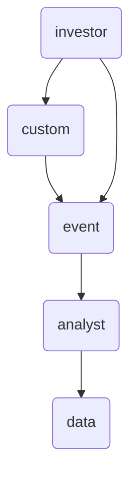

                 


# 智能投资者关系管理系统

## 关键词：
- 投资者关系管理、人工智能、系统架构、自然语言处理、机器学习

## 摘要：
本文系统性地介绍了智能投资者关系管理系统的构建与实现，涵盖从背景分析、核心概念、算法原理、系统架构到项目实战的全生命周期。文章首先分析了传统投资者关系管理的痛点与智能化转型的必要性，随后深入探讨了智能投资者关系管理的核心概念与技术实现，包括自然语言处理与机器学习算法的原理与应用。接着，通过系统架构设计与项目实战，展示了如何将理论付诸实践，最后总结了系统的优化与维护策略，为读者提供了一份全面的技术指南。

---

## 目录

### 第一章：背景介绍

#### 1.1 问题背景
- 1.1.1 投资者关系管理的传统模式
- 1.1.2 当前投资者关系管理的痛点
- 1.1.3 智能化转型的必要性

#### 1.2 问题描述
- 1.2.1 数据处理的复杂性
- 1.2.2 信息传递的延迟
- 1.2.3 个性化服务的缺失

#### 1.3 问题解决
- 1.3.1 引入人工智能技术
- 1.3.2 数据分析与预测的应用
- 1.3.3 提高服务效率与准确性

#### 1.4 边界与外延
- 1.4.1 系统功能的边界
- 1.4.2 与其他系统的交互
- 1.4.3 未来扩展的可能性

#### 1.5 核心要素组成
- 1.5.1 数据采集模块
- 1.5.2 智能分析引擎
- 1.5.3 用户交互界面

---

### 第二章：智能投资者关系管理的核心概念

#### 2.1 核心概念原理
- 2.1.1 投资者关系管理的智能化
- 2.1.2 数据驱动的决策支持
- 2.1.3 自然语言处理与投资者互动

#### 2.2 核心概念对比表
| **传统投资者关系管理** | **智能投资者关系管理** |
|--------------------------|--------------------------|
| 手动数据整理与分析      | 自动化数据采集与分析    |
| 低效的投资者沟通          | 智能化的投资者互动      |
| 依赖人工判断              | 基于AI的预测与建议      |

#### 2.3 ER实体关系图


---

### 第三章：算法原理

#### 3.1 自然语言处理（NLP）
- 3.1.1 分词与实体识别
- 3.1.2 情感分析（Sentiment Analysis）
  - 算法流程图
  ```mermaid
  graph TD
      S(sentiment) --> P(process)
      P --> O(outcome)
  ```
  - 示例代码：
  ```python
  from textblob import TextBlob
  def sentiment_analysis(text):
      blob = TextBlob(text)
      return blob.sentiment.polarity
  ```

#### 3.2 机器学习算法
- 3.2.1 基于监督学习的分类
  - 数学模型：$f(x) = w \cdot x + b$
  - 分类函数示例：
  ```python
  def classify(document, weights, bias):
      return sigmoid(weights.dot(document) + bias)
  ```

#### 3.3 分析结果的应用
- 3.3.1 投资者情绪预测
- 3.3.2 关键事件识别与优先级排序

---

### 第四章：系统分析与架构设计

#### 4.1 问题场景介绍
- 投资者互动频繁，数据量大
- 需要实时分析投资者反馈
- 系统需支持多语言与多平台交互

#### 4.2 系统功能设计
- 4.2.1 领域模型类图
  ```mermaid
  classDiagram
      class Investor {
          id: int
          name: str
          contact: str
      }
      class Event {
          id: int
          type: str
          timestamp: datetime
      }
      class Analysis {
          id: int
          sentiment: float
          category: str
      }
      Investor --> Event
      Event --> Analysis
  ```

#### 4.3 系统架构设计
- 4.3.1 架构图
  ```mermaid
  graph TD
      UI --> API Gateway
      API Gateway --> Service1
      Service1 --> Database
      Service2 --> Database
  ```

#### 4.4 系统接口设计
- RESTful API 示例：
  ```json
  POST /api/v1/analyze
  {
      "text": "投资者对新政策表示担忧"
  }
  ```

#### 4.5 系统交互流程
- 4.5.1 投资者提交反馈
- 4.5.2 系统分析并分类
- 4.5.3 结果展示给投资者

---

### 第五章：项目实战

#### 5.1 环境安装
- Python 3.8+
- 安装依赖：
  ```bash
  pip install textblob
  pip install spacy
  ```

#### 5.2 核心功能实现
- 情感分析代码：
  ```python
  from textblob import TextBlob
  def analyze_sentiment(text):
      blob = TextBlob(text)
      return blob.sentiment
  ```

#### 5.3 实际案例分析
- 案例：投资者反馈“新产品令人失望”，系统分析并分类为“负面情绪”。

#### 5.4 代码解读
- 分析流程：
  ```python
  def process_feedback(feedback_text):
      sentiment = analyze_sentiment(feedback_text)
      categorize(sentiment.polarity)
  ```

---

### 第六章：优化与维护

#### 6.1 性能优化
- 使用分布式计算加速分析
- 优化NLP模型减少延迟

#### 6.2 安全性
- 数据加密存储
- 权限控制访问

#### 6.3 可扩展性
- 支持多语言处理
- 灵活的模块化设计

#### 6.4 维护策略
- 定期模型再训练
- 监控系统稳定性

#### 6.5 最佳实践
- 数据隐私保护
- 系统日志监控

---

### 第七章：附录与参考文献

#### 7.1 附录
- 术语表
- 配置文件示例

#### 7.2 参考文献
- 引用的论文、技术文档

---

## 总结
智能投资者关系管理系统通过结合人工智能技术，显著提升了投资者管理的效率与准确性。本文从背景分析到系统实现，全面阐述了该系统的构建过程，并通过实际案例展示了其应用场景。未来，随着AI技术的不断进步，智能投资者关系管理系统将发挥更大的作用，为投资者与企业之间架起一座高效沟通的桥梁。

