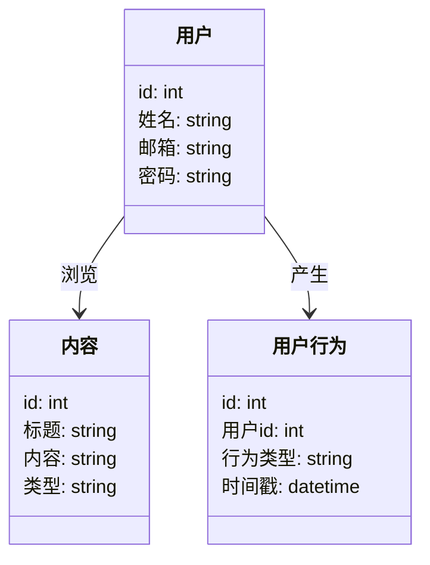
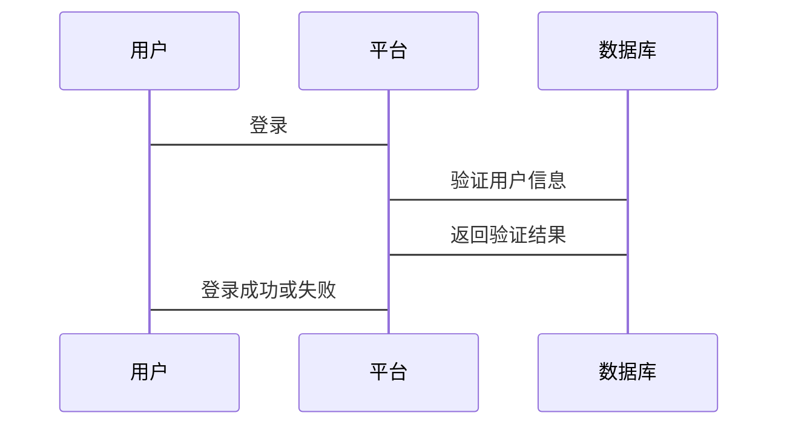

                 


# 智能投资者教育平台开发

> 关键词：智能投资者教育平台，人工智能，自然语言处理，机器学习，系统架构设计，投资者教育

> 摘要：智能投资者教育平台是利用人工智能技术为投资者提供个性化学习路径和投资建议的平台，本文详细介绍了平台的背景、核心概念、算法原理、系统架构设计、项目实战及最佳实践。

---

# 第一部分: 智能投资者教育平台开发背景与核心概念

## 第1章: 智能投资者教育平台的背景与意义

### 1.1 投资者教育的重要性

#### 1.1.1 投资者教育的定义与作用

投资者教育是指通过系统化的方式，帮助投资者提升金融知识、风险意识和投资技能。其作用在于帮助投资者做出理性决策，避免盲目投资和非理性行为。

#### 1.1.2 当前投资者教育的挑战

- **信息过载**：金融市场信息繁杂，投资者难以筛选和理解。
- **个性化需求**：不同投资者的风险承受能力、投资目标和知识水平差异大。
- **信任缺失**：传统投资者教育方式缺乏互动性和个性化，投资者难以建立信任。

#### 1.1.3 智能化投资者教育的必要性

通过智能化技术，投资者教育可以实现个性化、实时化和互动化，满足不同投资者的需求，提升教育效果。

---

### 1.2 智能投资者教育平台的定义与特点

#### 1.2.1 智能投资者教育平台的定义

智能投资者教育平台是基于人工智能技术，结合金融知识和用户行为数据，为投资者提供个性化学习和投资建议的在线平台。

#### 1.2.2 平台的核心功能与优势

- **个性化学习路径**：根据用户的知识水平和投资目标，推荐适合的学习内容。
- **智能投资建议**：基于市场数据和用户需求，提供个性化的投资策略。
- **风险评估与预警**：通过用户行为和市场数据，评估投资风险并及时预警。

#### 1.2.3 与传统投资者教育的区别

| 特性                | 传统投资者教育      | 智能投资者教育平台 |
|---------------------|---------------------|--------------------|
| 个性化              | 较低               | 高                 |
| 实时性              | 较低               | 高                 |
| 互动性              | 较低               | 高                 |
| 内容丰富性          | 有限               | 丰富               |

---

### 1.3 平台的用户群体与市场需求

#### 1.3.1 用户群体分析

- **初级投资者**：缺乏金融知识，需要基础教育。
- **中级投资者**：有一定经验，需要进阶知识。
- **高级投资者**：需要个性化策略和高端服务。

#### 1.3.2 市场需求与发展趋势

- **市场需求**：投资者对个性化、智能化教育的需求日益增长。
- **发展趋势**：人工智能技术的应用将推动投资者教育进入智能化、个性化阶段。

#### 1.3.3 平台的商业化潜力

- **订阅模式**：提供付费会员服务。
- **广告与推荐**：通过精准推荐获取收益。
- **定制化服务**：为机构客户提供定制化解决方案。

---

## 第2章: 智能投资者教育平台的核心概念

### 2.1 技术基础

#### 2.1.1 人工智能在投资者教育中的应用

- **自然语言处理（NLP）**：用于处理和分析金融文本，如新闻、报告等。
- **机器学习**：用于预测市场趋势和用户行为分析。

#### 2.1.2 自然语言处理与知识图谱

- **知识图谱**：构建金融领域的知识图谱，帮助用户快速理解复杂概念。
- **问答系统**：通过NLP技术实现智能问答，解答投资者问题。

#### 2.1.3 数据挖掘与用户行为分析

- **数据挖掘**：从用户行为数据中提取有价值的信息，优化平台功能。
- **用户画像**：通过数据分析构建用户画像，实现精准推荐。

---

### 2.2 数据与内容

#### 2.2.1 投资知识库的构建

- **知识库设计**：构建包含金融术语、投资策略等内容的知识库。
- **内容组织**：通过分类和标签化管理内容，方便检索和推荐。

#### 2.2.2 多模态内容的处理与生成

- **多模态数据**：包括文本、图像、视频等多种形式的数据。
- **内容生成**：利用生成式AI技术，自动生成个性化学习内容。

#### 2.2.3 数据的采集与清洗

- **数据采集**：从多种来源采集数据，如新闻、社交媒体等。
- **数据清洗**：去除噪音数据，确保数据质量。

---

### 2.3 平台功能模块

#### 2.3.1 个性化学习路径

- **学习模块**：根据用户知识水平推荐学习内容。
- **进度跟踪**：记录用户学习进度，提供反馈。

#### 2.3.2 智能投资建议

- **投资策略推荐**：基于市场数据和用户需求，推荐投资策略。
- **实时市场数据**：整合实时市场数据，提供动态建议。

#### 2.3.3 风险评估与预警

- **风险评估**：通过用户行为和市场数据评估投资风险。
- **预警机制**：当风险超过阈值时，及时发出预警。

---

## 第3章: 智能投资者教育平台的技术基础

### 3.1 人工智能与机器学习

#### 3.1.1 机器学习算法在投资者教育中的应用

- **监督学习**：用于分类问题，如用户分类和市场趋势预测。
- **无监督学习**：用于聚类分析，如用户分群和内容推荐。

#### 3.1.2 深度学习模型的构建

- **神经网络模型**：用于自然语言处理和图像识别。
- **模型训练**：利用大量数据训练模型，提升准确性。

#### 3.1.3 自然语言处理技术

- **文本分类**：用于分类金融新闻和文档。
- **文本生成**：用于生成个性化学习内容。

---

### 3.2 数据分析与挖掘

#### 3.2.1 数据预处理与特征工程

- **数据清洗**：去除无效数据，填补缺失值。
- **特征提取**：从数据中提取有意义的特征，用于模型训练。

#### 3.2.2 用户行为分析

- **行为建模**：通过用户行为数据构建用户画像。
- **行为预测**：预测用户的下一步行为，优化推荐策略。

#### 3.2.3 数据可视化

- **数据仪表盘**：展示用户行为和市场数据。
- **可视化工具**：如Tableau和Power BI。

---

# 第四部分: 系统分析与架构设计方案

## 第4章: 系统分析与架构设计方案

### 4.1 问题场景介绍

- **目标**：构建一个高效、可扩展的智能投资者教育平台。
- **用户角色**：投资者、平台管理员、内容创作者。
- **核心需求**：个性化学习、智能推荐、实时数据处理。

### 4.2 项目介绍

- **项目目标**：开发一个基于人工智能的投资者教育平台，提供个性化学习和投资建议。
- **项目范围**：包括前端界面、后端服务、数据存储和算法模型。
- **项目团队**：包括数据科学家、软件开发人员和金融专家。

---

### 4.3 系统功能设计

#### 4.3.1 领域模型



---

#### 4.3.2 系统架构设计

```mermaid
docker {
    service 计算机 {
        图灵奖得主
    }
    service 专家 {
        软件架构师
    }
    service 工程师 {
        程序员
    }
}
```

---

#### 4.3.3 系统接口设计

- **API接口**：RESTful API，用于前后端交互。
- **数据接口**：与第三方数据源（如金融数据库）对接。

#### 4.3.4 系统交互设计



---

## 第5章: 项目实战

### 5.1 环境安装

- **开发环境**：Python 3.8及以上，安装必要的库如TensorFlow、PyTorch。
- **运行环境**：云服务器，如AWS或阿里云。

### 5.2 核心代码实现

#### 5.2.1 个性化学习路径推荐算法

```python
import numpy as np
from sklearn.metrics.pairwise import cosine_similarity

# 示例数据：用户行为矩阵，行表示用户，列表示内容
user_behavior_matrix = np.array([[1, 0, 1],
                                  [0, 1, 1],
                                  [1, 1, 0]])

# 计算余弦相似度
similarity_matrix = cosine_similarity(user_behavior_matrix)

# 根据相似度推荐内容
def recommend(user_id, similarity_matrix, content_ids):
    similar_users = np.argsort(similarity_matrix[user_id], axis=0)[-2:]
    recommended_contents = np.sum(user_behavior_matrix[similar_users], axis=0)
    return [content_ids[i] for i in range(len(recommended_contents)) if recommended_contents[i] > 0]

content_ids = ['基础投资', '风险管理', '股票分析']
recommendations = recommend(0, similarity_matrix, content_ids)
print("推荐内容:", recommendations)
```

---

### 5.3 功能解读与分析

- **算法选择**：使用协同过滤算法进行个性化推荐。
- **数据处理**：对用户行为数据进行清洗和特征提取。
- **模型优化**：通过交叉验证优化模型参数，提升推荐准确率。

### 5.4 实际案例分析

- **案例背景**：假设一位用户是风险厌恶型投资者，希望通过平台学习基础投资知识。
- **推荐过程**：系统分析用户行为，推荐相关课程和投资策略。

---

## 第6章: 最佳实践

### 6.1 小结

- **技术总结**：本文详细介绍了智能投资者教育平台的开发背景、核心技术和实现方案。
- **实践总结**：通过项目实战，验证了平台的可行性和实用性。

### 6.2 注意事项

- **数据隐私**：确保用户数据的安全和隐私。
- **模型更新**：定期更新模型，保持推荐准确性。

### 6.3 拓展阅读

- **推荐书籍**：《集体智慧编程》、《Python机器学习实战》。
- **在线资源**：Coursera上的人工智能和机器学习课程。

---

# 第七部分: 总结与展望

## 第7章: 总结与展望

### 7.1 总结

智能投资者教育平台通过结合人工智能技术，为投资者提供个性化的学习和投资建议，解决了传统投资者教育的诸多痛点。

### 7.2 展望

未来，随着人工智能技术的不断进步，智能投资者教育平台将更加智能化和个性化，为投资者提供更优质的服务。

---

以上是《智能投资者教育平台开发》的完整目录大纲和内容框架，涵盖了从背景分析、技术实现到项目实战的全过程。希望这篇文章能够为读者提供有价值的信息和启发。

