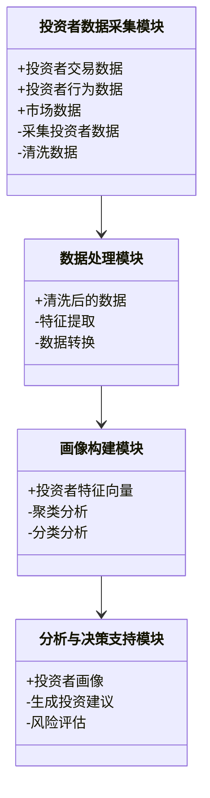
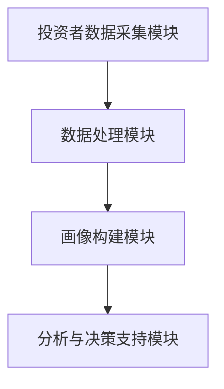
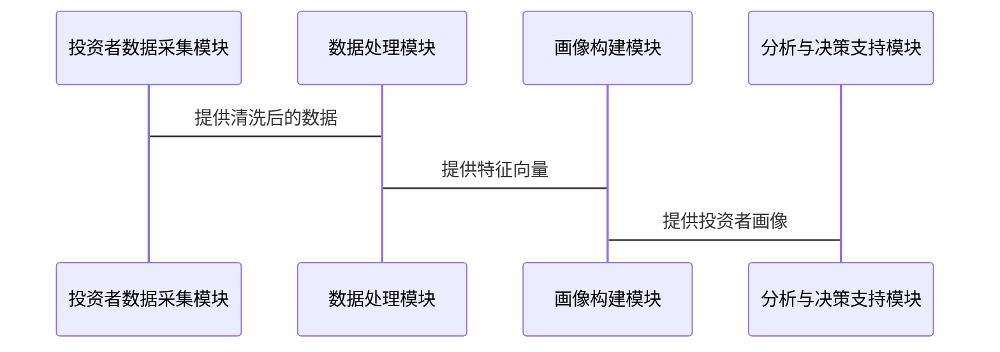

                 


# 《智能投资者画像分析平台》

---

## 关键词：
智能投资者画像、数据分析、机器学习、系统架构、Python实现

---

## 摘要：
本文详细介绍了智能投资者画像分析平台的构建过程，从背景分析到系统实现，全面阐述了投资者画像分析的核心概念、算法原理和系统架构。文章通过实际案例分析，展示了如何利用数据驱动的方法构建投资者画像，并结合Python代码实现相关算法，为金融机构提供高效的投资者分析工具。本文还总结了最佳实践，为读者提供了深入的技术见解和实用的应用指南。

---

# 第1章: 智能投资者画像分析平台的背景与核心概念

## 1.1 问题背景

### 1.1.1 投资者画像分析的重要性
投资者画像分析是金融领域的核心任务之一，通过对投资者行为、偏好和风险承受能力的分析，可以帮助金融机构更好地理解客户，制定个性化的投资策略。传统的投资者分析方法依赖人工经验，效率低下且难以覆盖大规模数据。

### 1.1.2 当前投资者分析的痛点
- 数据来源分散，难以整合。
- 分析维度有限，难以捕捉投资者的复杂行为。
- 缺乏实时性，无法快速响应市场变化。

### 1.1.3 智能化分析的必要性
随着人工智能技术的发展，智能化投资者分析平台可以高效处理海量数据，挖掘潜在规律，为金融机构提供决策支持。

## 1.2 问题描述

### 1.2.1 投资者行为分析的复杂性
投资者行为受到多种因素影响，包括市场波动、个人偏好等，需要多维度的数据分析。

### 1.2.2 数据来源的多样性
投资者数据来源广泛，包括交易记录、社交媒体、新闻等，数据整合和清洗是关键。

### 1.2.3 分析结果的实时性要求
金融市场变化迅速，投资者画像分析需要实时更新，以捕捉最新趋势。

## 1.3 问题解决

### 1.3.1 智能化分析的核心思路
利用机器学习算法对投资者数据进行建模，提取关键特征，构建投资者画像。

### 1.3.2 数据驱动的画像构建方法
通过数据清洗、特征提取和模型训练，构建投资者画像，实现精准分析。

### 1.3.3 多维度特征提取与分析
从交易数据、行为数据等多个维度提取特征，全面分析投资者行为。

## 1.4 边界与外延

### 1.4.1 投资者画像的适用范围
适用于金融机构的客户管理、风险控制和投资策略制定。

### 1.4.2 与其他分析方法的区分
与传统分析方法相比，智能化分析更加高效、精准，能够处理大规模数据。

### 1.4.3 平台功能的边界定义
平台主要提供数据采集、画像构建、分析与决策支持功能。

## 1.5 核心要素组成

### 1.5.1 数据采集模块
负责收集投资者的交易数据、行为数据等。

### 1.5.2 画像构建模块
通过算法对数据进行处理，构建投资者画像。

### 1.5.3 分析与决策支持模块
基于画像提供投资建议和风险评估。

---

# 第2章: 智能投资者画像的核心概念

## 2.1 画像分析的定义

### 2.1.1 投资者画像的定义
投资者画像是一种通过多维度数据分析构建的投资者特征描述，用于理解投资者行为和偏好。

### 2.1.2 智能化画像的核心特征
- 数据驱动
- 实时性
- 多维度分析

## 2.2 画像构建方法

### 2.2.1 数据驱动的画像构建
通过机器学习算法对数据进行建模，提取投资者特征。

### 2.2.2 多维度特征提取
从交易、行为、市场等多个维度提取特征，全面分析投资者行为。

### 2.2.3 数据清洗与预处理
对数据进行清洗和预处理，确保数据质量。

## 2.3 数据来源与整合

### 2.3.1 第三方数据源
包括交易数据、市场数据等。

### 2.3.2 用户行为数据
包括用户操作记录、点击流数据等。

### 2.3.3 市场数据整合
整合市场趋势、行业动态等数据，丰富分析维度。

## 2.4 画像分类与标签化

### 2.4.1 投资者类型分类
根据风险偏好、投资风格等将投资者分为不同类别。

### 2.4.2 标签化管理方法
通过标签化管理，实现投资者分类和精准营销。

### 2.4.3 标签体系设计
设计合理的标签体系，确保分析的准确性和可操作性。

## 2.5 画像分析

---

# 第3章: 投资者画像分析的算法原理

## 3.1 聚类分析

### 3.1.1 聚类分析的定义
聚类分析是一种无监督学习方法，用于将数据分为若干类别。

### 3.1.2 聚类算法的选择
常用K-means、DBSCAN等算法。

### 3.1.3 聚类分析的流程
数据预处理、特征提取、模型训练、结果分析。

### 3.1.4 聚类分析的实现
使用Python代码实现K-means算法，对投资者数据进行聚类分析。

## 3.2 分类算法

### 3.2.1 分类算法的定义
分类算法用于将数据分为已知类别。

### 3.2.2 分类算法的选择
常用决策树、随机森林、SVM等算法。

### 3.2.3 分类分析的流程
数据预处理、特征提取、模型训练、结果分析。

### 3.2.4 分类分析的实现
使用Python代码实现决策树算法，对投资者数据进行分类分析。

## 3.3 关联规则挖掘

### 3.3.1 关联规则挖掘的定义
关联规则挖掘用于发现数据中的关联关系。

### 3.3.2 关联规则挖掘的算法
常用Apriori、FP-Growth等算法。

### 3.3.3 关联规则挖掘的流程
数据预处理、特征提取、模型训练、结果分析。

### 3.3.4 关联规则挖掘的实现
使用Python代码实现Apriori算法，挖掘投资者数据中的关联规则。

---

# 第4章: 智能投资者画像分析平台的系统架构

## 4.1 系统功能设计

### 4.1.1 领域模型设计
通过领域模型类图展示系统功能模块之间的关系。

### 4.1.2 系统功能模块
包括数据采集、数据处理、画像构建、分析与决策支持模块。

## 4.2 系统架构设计

### 4.2.1 系统架构图
通过mermaid架构图展示系统整体架构。

### 4.2.2 模块划分
包括数据采集模块、数据处理模块、画像构建模块、分析与决策支持模块。

## 4.3 系统接口设计

### 4.3.1 接口设计
定义系统各模块之间的接口，确保模块间协同工作。

### 4.3.2 接口交互流程图
通过mermaid序列图展示系统接口交互流程。

---

# 第5章: 智能投资者画像分析平台的项目实战

## 5.1 项目环境配置

### 5.1.1 环境要求
安装Python、机器学习库（如scikit-learn、pandas）等。

### 5.1.2 数据准备
收集投资者交易数据、行为数据等。

## 5.2 核心代码实现

### 5.2.1 数据预处理代码
```python
import pandas as pd
data = pd.read_csv('investor_data.csv')
# 数据清洗
data.dropna(inplace=True)
data = data[~data.duplicated()]
```

### 5.2.2 聚类分析代码
```python
from sklearn.cluster import KMeans
model = KMeans(n_clusters=3, random_state=0)
model.fit(data[['age', 'income', 'investment_experience']])
```

### 5.2.3 分类分析代码
```python
from sklearn.tree import DecisionTreeClassifier
model = DecisionTreeClassifier()
model.fit(X_train, y_train)
```

## 5.3 功能解读

### 5.3.1 数据采集模块
负责收集投资者数据，包括交易记录、行为数据等。

### 5.3.2 画像构建模块
通过算法对数据进行处理，构建投资者画像。

### 5.3.3 分析与决策支持模块
基于画像提供投资建议和风险评估。

## 5.4 实际案例分析

### 5.4.1 案例背景
分析某金融机构的投资者数据，构建投资者画像。

### 5.4.2 案例实现
使用聚类分析对投资者进行分类，识别不同类型的投资者。

### 5.4.3 案例结果
生成投资者画像，提供个性化投资建议。

---

# 第6章: 智能投资者画像分析平台的最佳实践

## 6.1 小结

### 6.1.1 核心内容回顾
总结投资者画像分析平台的核心概念、算法原理和系统架构。

### 6.1.2 项目经验总结
总结项目实施过程中的经验和教训。

## 6.2 注意事项

### 6.2.1 数据隐私保护
注意投资者数据的隐私保护，遵守相关法律法规。

### 6.2.2 模型优化
定期优化模型，确保分析结果的准确性。

### 6.2.3 系统维护
定期维护系统，确保平台稳定运行。

## 6.3 拓展阅读

### 6.3.1 相关技术
推荐阅读关于机器学习、数据分析的相关书籍和论文。

### 6.3.2 实际应用
研究更多投资者画像分析的实际应用案例。

---

# 附录

## 附录A: Python代码实现

### A.1 数据预处理
```python
import pandas as pd
data = pd.read_csv('investor_data.csv')
data.dropna(inplace=True)
data = data[~data.duplicated()]
```

### A.2 聚类分析
```python
from sklearn.cluster import KMeans
model = KMeans(n_clusters=3, random_state=0)
model.fit(data[['age', 'income', 'investment_experience']])
```

### A.3 分类分析
```python
from sklearn.tree import DecisionTreeClassifier
model = DecisionTreeClassifier()
model.fit(X_train, y_train)
```

## 附录B: mermaid图示

### B.1 领域模型类图


### B.2 系统架构图


### B.3 系统接口交互流程图


---

# 结语

智能投资者画像分析平台的构建是一个复杂但极具价值的工程。通过本文的详细讲解，读者可以全面理解投资者画像分析的核心概念、算法原理和系统架构。实际项目中，需要结合具体需求，灵活应用相关技术，确保平台的高效性和准确性。未来，随着人工智能技术的不断发展，投资者画像分析将更加智能化、个性化，为金融机构提供更强大的决策支持。

---

