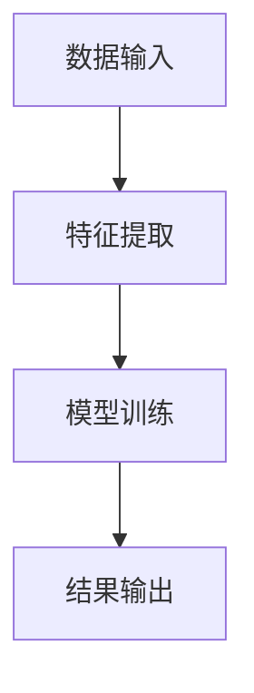
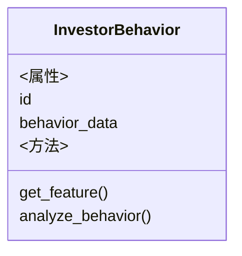
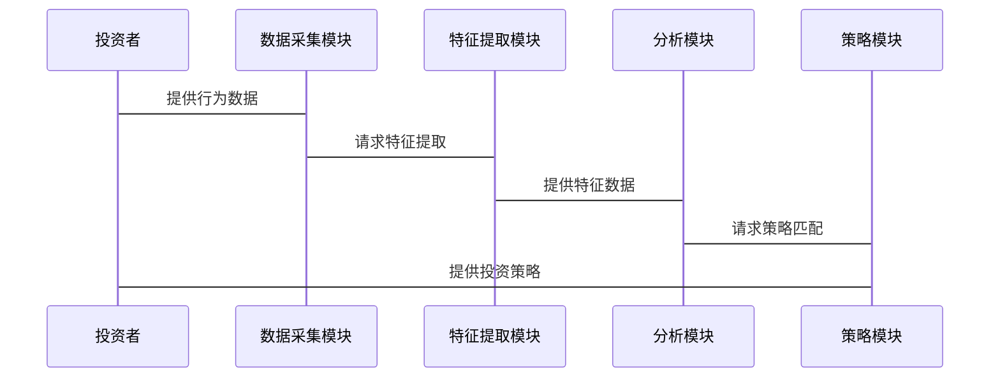

                 


# 《智能投资者行为分析与投资策略匹配》

> 关键词：智能投资者行为分析, 投资策略匹配, 行为金融学, 机器学习, 系统架构设计, 项目实战

> 摘要：智能投资者行为分析是一种新兴的投资分析方法，通过分析投资者的行为特征和心理因素，结合先进的机器学习和深度学习算法，制定个性化的投资策略。本文详细探讨了智能投资者行为分析的核心概念、算法原理、系统架构设计和实际案例分析，为投资者提供了从理论到实践的全面指导。

---

# 第1章: 智能投资者行为分析的背景与意义

## 1.1 投资者行为分析的背景

### 1.1.1 传统投资分析的局限性
传统投资分析主要依赖于市场数据和技术指标，但忽略了投资者的心理和行为因素。这种分析方法在市场波动较大或投资者情绪化时显得力不从心。

### 1.1.2 智能投资者行为分析的兴起
随着人工智能和大数据技术的发展，投资者行为分析逐渐引入智能算法，通过分析投资者的行为模式，帮助制定更精准的投资策略。

### 1.1.3 行为金融学与智能分析的结合
行为金融学揭示了投资者的心理偏差和行为特征，而智能分析则通过技术手段将这些行为特征转化为可量化的数据，为投资决策提供支持。

## 1.2 问题背景与问题描述

### 1.2.1 投资者行为的多样性与复杂性
投资者的行为受多种因素影响，包括情绪、认知偏差、市场环境等，这些因素使得投资行为难以预测。

### 1.2.2 传统投资策略的不足
传统策略往往基于市场数据和基本面分析，忽略了投资者个体差异和行为特征，导致策略在实际应用中效果有限。

### 1.2.3 智能投资者行为分析的目标与意义
通过分析投资者的行为特征，制定个性化的投资策略，提高投资决策的准确性和效率。

## 1.3 问题解决与边界

### 1.3.1 智能投资者行为分析的核心问题
如何通过技术手段分析投资者的行为特征，并将其应用于投资策略的制定。

### 1.3.2 分析的边界与外延
智能投资者行为分析主要关注个体投资者的行为，不涉及市场整体波动和宏观经济因素。

### 1.3.3 核心要素与组成结构
包括投资者行为数据采集、行为特征提取、策略匹配和效果评估四个核心要素。

## 1.4 本章小结
智能投资者行为分析通过结合行为金融学和智能技术，为投资决策提供了新的视角和方法。

---

# 第2章: 智能投资者行为分析的核心概念

## 2.1 核心概念与原理

### 2.1.1 投资者行为的定义与分类
投资者行为可以分为认知行为、情感行为和决策行为三类。

### 2.1.2 智能分析的核心原理
通过收集和分析投资者的行为数据，利用机器学习算法提取行为特征，并将其与投资策略进行匹配。

### 2.1.3 行为特征与数学模型
行为特征包括交易频率、风险偏好、情绪波动等，这些特征可以通过统计模型和机器学习模型进行量化。

## 2.2 核心概念对比表

| 对比维度 | 传统分析 | 智能分析 |
|----------|----------|----------|
| 数据来源 | 市场数据 | 行为数据 |
| 分析方法 | 统计分析 | 机器学习 |
| 策略制定 | 通用策略 | 个性化策略 |

## 2.3 ER实体关系图


## 2.4 本章小结
通过对比和图表分析，明确了智能投资者行为分析的核心概念和优势。

---

# 第3章: 投资者行为分析的算法原理

## 3.1 算法原理概述

### 3.1.1 机器学习在行为分析中的应用
常用算法包括决策树、随机森林和神经网络，用于分类和预测投资者行为。

### 3.1.2 深度学习的最新进展
深度学习在处理复杂行为模式和时间序列数据中表现优异。

### 3.1.3 自然语言处理在文本分析中的作用
通过分析投资者的评论和社交媒体数据，提取情绪和意图。

## 3.2 算法流程图


## 3.3 核心算法实现

```python
def behavior_analysis(data):
    features = extract_features(data)
    model = train_model(features)
    return predict(model, data)
```

## 3.4 数学模型与公式

### 投资者情绪指数计算
$$
\text{情绪指数} = \frac{\sum \text{积极词频}}{\sum \text{消极词频}}
$$

---

# 第4章: 系统分析与架构设计

## 4.1 系统功能设计

### 领域模型类图


## 4.2 系统架构设计

### 系统架构图


## 4.3 系统接口设计

### 系统交互序列图


---

# 第5章: 项目实战

## 5.1 环境安装

### 安装依赖
```bash
pip install numpy pandas scikit-learn
```

## 5.2 核心代码实现

```python
import numpy as np
from sklearn.tree import DecisionTreeClassifier

def extract_features(data):
    # 示例特征提取代码
    features = data[['交易频率', '风险偏好']]
    return features

def train_model(features, labels):
    model = DecisionTreeClassifier()
    model.fit(features, labels)
    return model

# 示例数据
data = {
    '交易频率': [0.5, 0.7, 0.3],
    '风险偏好': [0.8, 0.2, 0.6],
    '标签': ['高风险', '低风险', '中风险']
}

features = extract_features(data)
model = train_model(features, data['标签'])
```

## 5.3 实际案例分析

### 案例分析
通过分析某投资者的历史交易数据，提取其行为特征，并匹配相应的投资策略。

---

# 第6章: 总结与展望

## 6.1 最佳实践 tips

### 技术 tips
- 数据清洗和特征工程是关键。
- 选择合适的算法模型，避免过拟合。

### 业务 tips
- 结合市场环境和宏观经济因素。
- 定期更新模型和策略。

## 6.2 小结
智能投资者行为分析通过技术手段，为投资决策提供了新的视角和方法，帮助投资者制定更精准的投资策略。

## 6.3 注意事项
- 数据隐私和安全问题需重视。
- 模型的实时性和可解释性需优化。

## 6.4 拓展阅读
推荐阅读《机器学习实战》和《行为金融学》相关书籍。

---

通过以上章节的详细讲解，读者可以全面了解智能投资者行为分析的核心概念、算法原理和实际应用，为投资决策提供有力支持。

