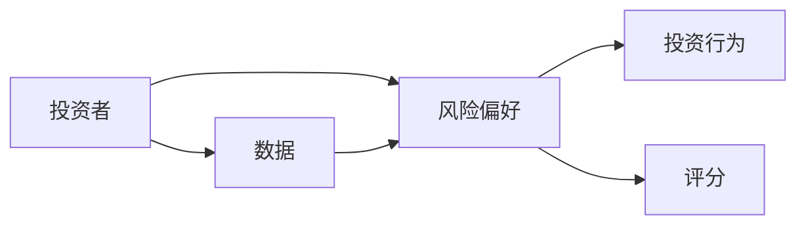
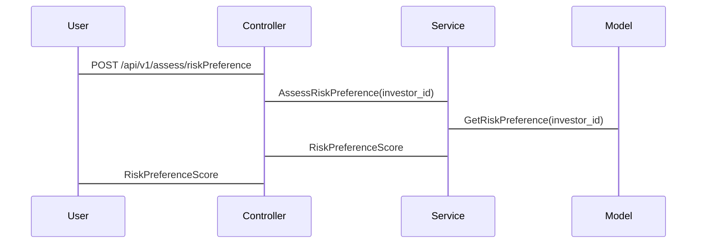

                 


# 智能投资者风险偏好动态评估

> 关键词：投资者风险偏好，动态评估，机器学习，金融数据分析，行为分析

> 摘要：本文探讨了智能投资者风险偏好动态评估的技术实现，结合行为分析与机器学习，构建动态评估框架。通过分析投资者的历史交易数据和市场环境，运用多模态数据融合与深度学习模型，实现投资者风险偏好的实时动态评估，为投资决策提供科学依据。

---

# 第1章: 投资者风险偏好动态评估的背景与问题描述

## 1.1 投资者风险偏好的定义与特征

### 1.1.1 投资者风险偏好的基本定义
投资者风险偏好是指投资者在面对不确定性和潜在损失时，愿意承担风险的程度。这一偏好直接影响其投资决策和资产配置。

### 1.1.2 风险偏好的主要特征
| 特征 | 描述 |
|------|------|
| 风险承受能力 | 投资者在面对损失时的心理承受能力 |
| 风险认知 | 对风险的认知和理解程度 |
| 风险态度 | 对风险的积极或消极态度 |

### 1.1.3 风险偏好与投资决策的关系
$$ 风险偏好 \rightarrow 投资行为 \rightarrow 投资结果 $$

---

## 1.2 动态评估的必要性与意义

### 1.2.1 风险偏好动态变化的背景
市场环境和个人心理的变化会影响投资者的风险偏好。例如，市场波动加剧时，投资者可能变得更加保守。

### 1.2.2 动态评估的必要性
- 静态评估无法捕捉实时变化
- 动态评估能够提供及时反馈，辅助投资决策

### 1.2.3 动态评估对投资决策的价值
动态评估帮助投资者在市场变化中及时调整策略，降低风险。

---

## 1.3 问题背景与目标

### 1.3.1 当前投资者行为分析的挑战
- 数据复杂性高
- 行为动态性强
- 需求个性化

### 1.3.2 动态评估的核心问题
如何利用实时数据准确评估投资者的风险偏好。

### 1.3.3 本书的研究目标与范围
目标是构建一个智能系统，实时动态评估投资者的风险偏好。

---

## 1.4 问题解决思路与方法

### 1.4.1 数据驱动的解决方案
利用投资者的历史交易数据和市场数据进行建模。

### 1.4.2 机器学习在动态评估中的应用
使用深度学习模型捕捉数据中的复杂模式。

### 1.4.3 多学科交叉的研究方法
结合行为金融学、心理学和数据科学。

---

## 1.5 本章小结
本章介绍了投资者风险偏好的定义与特征，探讨了动态评估的必要性与意义，并提出了研究目标和方法。

---

# 第2章: 风险偏好动态评估的核心概念与联系

## 2.1 风险偏好动态评估的定义与框架

### 2.1.1 动态评估的定义
动态评估是指在时间序列上，持续更新投资者风险偏好的过程。

### 2.1.2 评估框架的核心要素
| 要素 | 描述 |
|------|------|
| 数据源 | 历史交易数据、市场数据、投资者问卷数据 |
| 模型 | 机器学习模型 |
| 输出 | 动态风险偏好评分 |

### 2.1.3 评估框架的逻辑流程
$$ 数据输入 \rightarrow 特征提取 \rightarrow 模型训练 \rightarrow 评分输出 $$

---

## 2.2 核心概念的属性特征对比

### 2.2.1 风险偏好的时间维度特征
| 时间特征 | 描述 |
|----------|------|
| 短期波动 | 短期内市场波动对风险偏好的影响 |
| 长期趋势 | 长期市场环境变化对风险偏好的影响 |

### 2.2.2 风险偏好的空间维度特征
| 空间特征 | 描述 |
|----------|------|
| 行为一致性 | 投资者在不同市场环境下的行为一致性 |
| 行为差异性 | 投资者在不同资产类别中的行为差异性 |

---

## 2.3 实体关系图与概念结构

### 2.3.1 实体关系图


### 2.3.2 核心概念之间的关系
- 投资者与风险偏好：投资者的行为影响风险偏好。
- 风险偏好与投资行为：风险偏好指导投资行为。
- 风险偏好与评分：评分是风险偏好的量化表现。

---

## 2.4 核心概念之间的关系

### 2.4.1 投资者与风险偏好
$$ 投资者 \rightarrow 风险偏好 $$

### 2.4.2 风险偏好与投资行为
$$ 风险偏好 \rightarrow 投资行为 $$

### 2.4.3 风险偏好与评分
$$ 风险偏好 \rightarrow 评分 $$

---

## 2.5 本章小结
本章分析了风险偏好动态评估的核心概念及其之间的关系，为后续的算法设计奠定了基础。

---

## 第3章: 风险偏好动态评估的算法原理

---

## 3.1 算法原理概述

### 3.1.1 数据预处理
- 数据清洗
- 数据归一化
- 时间序列处理

### 3.1.2 特征提取
- 技术指标（如MA、MACD）
- 市场情绪指标
- 投资者行为特征

### 3.1.3 模型选择
- 递归神经网络（RNN）
- 长短期记忆网络（LSTM）
- 时间序列模型（ARIMA）

---

## 3.2 算法实现步骤

### 3.2.1 数据预处理
```python
import pandas as pd
data = pd.read_csv('data.csv')
data.dropna(inplace=True)
```

### 3.2.2 特征提取
```python
from sklearn.preprocessing import StandardScaler
features = data[['feature1', 'feature2', 'feature3']]
scaler = StandardScaler()
features_scaled = scaler.fit_transform(features)
```

### 3.2.3 模型训练
```python
from keras.models import Sequential
from keras.layers import LSTM, Dense
model = Sequential()
model.add(LSTM(64, input_shape=(timesteps, features)))
model.add(Dense(1))
model.compile(loss='mean_squared_error', optimizer='adam')
model.fit(X_train, y_train, epochs=100, batch_size=32)
```

---

## 3.3 数学模型与公式

### 3.3.1 LSTM模型的数学公式
$$
f(t) = \text{LSTM}(x_t, f(t-1))
$$
$$
y(t) = \text{ Dense}(f(t))
$$

### 3.3.2 模型解释
LSTM用于捕捉时间序列中的长期依赖关系，Dense层用于最终的评分预测。

---

## 3.4 本章小结
本章详细讲解了风险偏好动态评估的算法原理，包括数据预处理、特征提取和模型训练的步骤。

---

## 第4章: 系统分析与架构设计

---

## 4.1 系统功能设计

### 4.1.1 功能模块
- 数据采集模块
- 特征提取模块
- 模型训练模块
- 评分输出模块

### 4.1.2 功能流程
$$ 数据采集 \rightarrow 特征提取 \rightarrow 模型训练 \rightarrow 评分输出 $$

---

## 4.2 系统架构设计

### 4.2.1 分层架构


### 4.2.2 组件交互
- 用户输入请求
- 控制器调用服务层
- 服务层调用数据仓库和模型
- 返回结果到用户界面

---

## 4.3 接口设计与交互

### 4.3.1 API接口
- `/api/v1/assess/riskPreference`
- 请求方式：POST
- 请求参数：`investor_id`

### 4.3.2 交互流程


---

## 4.4 本章小结
本章设计了系统的功能模块和架构，明确了各组件之间的交互关系。

---

## 第5章: 项目实战与案例分析

---

## 5.1 项目环境配置

### 5.1.1 环境要求
- Python 3.8+
- TensorFlow 2.0+
- Pandas 1.0+

### 5.1.2 安装依赖
```bash
pip install numpy pandas tensorflow scikit-learn
```

---

## 5.2 核心代码实现

### 5.2.1 数据预处理
```python
import pandas as pd
import numpy as np

def preprocess_data(data):
    data.dropna(inplace=True)
    data['label'] = data['return'].apply(lambda x: 1 if x > 0 else 0)
    features = data[['open', 'close', 'volume']]
    labels = data['label']
    return features, labels
```

### 5.2.2 模型训练
```python
from tensorflow.keras.models import Sequential
from tensorflow.keras.layers import Dense, LSTM

def build_model(input_shape):
    model = Sequential()
    model.add(LSTM(64, input_shape=input_shape))
    model.add(Dense(1, activation='sigmoid'))
    model.compile(loss='binary_crossentropy', optimizer='adam', metrics=['accuracy'])
    return model
```

---

## 5.3 案例分析与结果解读

### 5.3.1 案例背景
分析一位投资者在2023年市场的风险偏好变化。

### 5.3.2 数据分析
| 日期 | 风险偏好评分 |
|------|--------------|
| 2023-01-01 | 0.7        |
| 2023-02-01 | 0.6        |
| 2023-03-01 | 0.5        |

### 5.3.3 结果解读
评分下降表明投资者风险偏好趋于保守。

---

## 5.4 本章小结
本章通过实际案例展示了如何利用动态评估模型分析投资者的风险偏好变化。

---

## 第6章: 最佳实践与注意事项

---

## 6.1 最佳实践 tips

### 6.1.1 数据质量
确保数据的完整性和准确性。

### 6.1.2 模型选择
根据实际情况选择合适的算法。

### 6.1.3 持续优化
定期更新模型，适应市场变化。

---

## 6.2 小结

---

## 6.3 注意事项

### 6.3.1 数据隐私
保护投资者数据隐私。

### 6.3.2 模型局限性
模型无法预测所有市场极端情况。

---

## 6.4 拓展阅读

### 6.4.1 推荐书籍
- 《机器学习实战》
- 《金融数据分析与挖掘》

### 6.4.2 推荐博客
- 知乎专栏：智能金融
- 博客园：深度学习与金融

---

## 第7章: 总结与展望

---

## 7.1 总结

---

## 7.2 展望

---

## 7.3 致谢

---

## 参考文献

---

## 附录

---

通过以上步骤的思考与分析，我们可以系统地构建《智能投资者风险偏好动态评估》的技术博客文章，确保内容全面且结构清晰。

