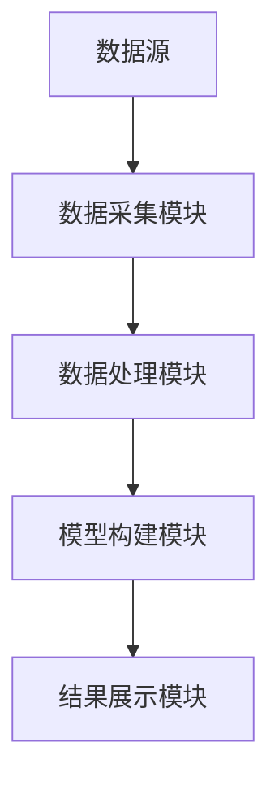
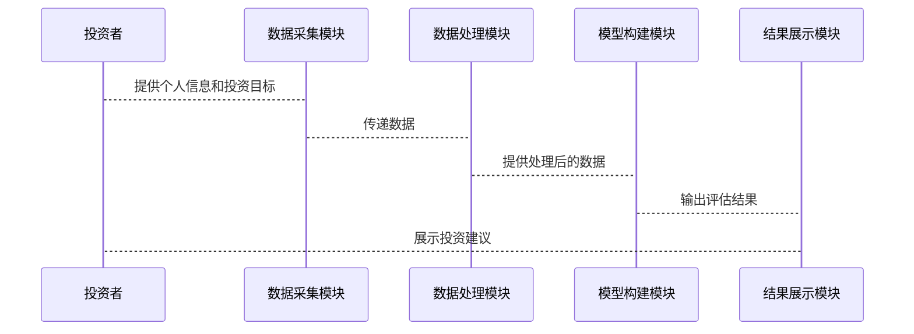

                 


# 智能投资者风险承受能力动态评估

> **关键词**：投资者风险承受能力，动态评估，人工智能，大数据，金融风险管理，投资决策

> **摘要**：本文详细探讨了智能投资者风险承受能力动态评估的核心概念、算法模型、系统架构设计以及实际应用。通过结合现代投资组合理论与人工智能技术，提出了一种基于时间序列分析和机器学习的动态评估方法，旨在帮助投资者和金融机构更准确地识别和管理投资风险。文章还提供了具体的实现案例和最佳实践建议，为读者提供了从理论到实践的全面指导。

---

# 第一部分: 智能投资者风险承受能力动态评估的背景与核心概念

## 第1章: 智能投资者风险承受能力评估的背景与问题描述

### 1.1 投资者风险承受能力的定义与重要性

#### 1.1.1 投资者风险承受能力的定义
投资者风险承受能力（Investor Risk Tolerance）是指投资者在面对市场波动和不确定性时，愿意承担风险的程度。这种能力不仅取决于投资者的财务状况，还包括其心理特征、投资目标和市场环境等因素。

#### 1.1.2 风险承受能力在投资决策中的作用
风险承受能力是投资决策的核心因素之一。它决定了投资者选择的投资组合类型、资产配置比例以及对风险和收益的平衡。例如，风险承受能力较高的投资者可能倾向于投资股票等高风险资产，而风险承受能力较低的投资者可能更倾向于债券等低风险资产。

#### 1.1.3 风险承受能力与投资收益的关系
风险承受能力与投资收益之间存在密切关系。一般来说，风险承受能力越高，潜在收益也越高，但同时伴随着更高的风险。因此，动态评估风险承受能力可以帮助投资者在不同市场环境下调整其投资策略，以实现收益与风险的最佳平衡。

---

### 1.2 动态评估的必要性与挑战

#### 1.2.1 风险承受能力的动态变化特征
投资者的风险承受能力并不是一成不变的，它会随着市场环境、个人财务状况和心理状态的变化而变化。例如，市场 crash 时，投资者的风险承受能力可能下降；而市场繁荣时，风险承受能力可能上升。

#### 1.2.2 传统静态评估方法的局限性
传统的风险承受能力评估方法通常基于静态模型，例如基于投资者的财务状况和问卷调查结果进行一次性评估。这种方法无法捕捉到市场波动和投资者行为的实时变化，导致评估结果可能过时或不准确。

#### 1.2.3 动态评估的必要性与技术挑战
动态评估能够实时跟踪和更新投资者的风险承受能力，从而提供更准确的投资建议。然而，动态评估需要处理大量的实时数据，并结合复杂的算法进行计算，这给技术实现带来了挑战。

---

### 1.3 智能投资者风险承受能力评估的背景

#### 1.3.1 金融科技的发展与投资者行为变化
随着金融科技（FinTech）的发展，投资者行为变得更加复杂和多样化。智能投顾（Robo-Advisor）等技术的应用使得投资者能够实时了解市场动态和自身风险承受能力。

#### 1.3.2 大数据与人工智能在金融领域的应用
大数据和人工智能技术为风险承受能力的动态评估提供了新的可能性。通过分析海量数据，可以发现投资者行为的规律，并构建动态模型进行实时预测。

#### 1.3.3 智能投资者评估的现状与趋势
目前，智能投资者评估主要依赖于静态模型和简单的数据分析。然而，随着技术的进步，动态评估将成为未来的主要趋势，尤其是在高频交易和个性化投资需求增加的背景下。

---

### 1.4 本章小结

#### 1.4.1 核心概念回顾
- 风险承受能力是投资者在面对风险时的决策能力。
- 动态评估能够实时捕捉投资者行为和市场变化。

#### 1.4.2 问题背景总结
- 传统静态评估方法的局限性日益明显。
- 金融科技和大数据为动态评估提供了新的技术手段。

---

## 第2章: 投资者风险承受能力的核心概念与理论基础

### 2.1 风险承受能力的构成要素

#### 2.1.1 风险认知与风险偏好
风险认知是指投资者对风险的理解和感知，而风险偏好则是投资者在面对风险时的决策倾向。例如，一些投资者可能更倾向于冒险，而另一些投资者则更倾向于保守。

#### 2.1.2 投资目标与财务状况
投资目标和财务状况是影响风险承受能力的重要因素。例如，一个有长期投资目标且财务状况稳定的投资者可能更容易承受较高的风险。

#### 2.1.3 市场环境与投资周期
市场环境和投资周期也会影响投资者的风险承受能力。例如，在经济衰退期间，投资者的风险承受能力可能下降。

---

### 2.2 风险承受能力的理论模型

#### 2.2.1 马科维茨投资组合理论
马科维茨投资组合理论（Modern Portfolio Theory, MPT）是投资学中的经典理论，强调通过资产配置来优化风险和收益。该理论认为，投资者可以通过分散投资来降低风险。

#### 2.2.2 均值-方差模型与风险承受
均值-方差模型是MPT的核心，通过计算资产组合的期望收益和方差来优化投资组合。方差反映了资产的风险，方差越小，资产的风险越低。

#### 2.2.3 基于现代投资组合理论的扩展
在动态评估中，可以结合MPT和其他理论，例如引入时间序列分析和机器学习算法，以捕捉市场波动和投资者行为的变化。

---

### 2.3 风险承受能力的评估维度

#### 2.3.1 风险承受能力的定量评估
定量评估通常基于数学模型，例如通过回归分析或时间序列分析来预测投资者的风险承受能力。

#### 2.3.2 风险承受能力的定性评估
定性评估基于投资者的行为和心理特征，例如通过问卷调查和访谈来评估投资者的风险偏好。

#### 2.3.3 综合评估模型的构建
综合评估模型通常结合定量和定性方法，以全面捕捉投资者的风险承受能力。

---

### 2.4 本章小结

#### 2.4.1 核心概念总结
- 风险承受能力由多个因素构成，包括风险认知、投资目标和市场环境。
- 理论模型如MPT为风险评估提供了基础。

#### 2.4.2 理论基础的整合
- 综合评估模型结合定量和定性方法，能够更全面地评估风险承受能力。

---

## 第3章: 风险承受能力动态评估的核心算法与数学模型

### 3.1 动态评估的算法选择

#### 3.1.1 时间序列分析与动态评估
时间序列分析是一种常用的方法，用于预测未来的市场趋势和投资者行为。例如，ARIMA模型可以用于预测市场波动。

#### 3.1.2 机器学习算法在动态评估中的应用
机器学习算法，例如支持向量机（SVM）和随机森林（Random Forest），可以用于分类和回归分析，帮助预测投资者的风险承受能力。

#### 3.1.3 基于回归分析的动态模型
回归分析是一种常用的方法，用于建立变量之间的关系。例如，可以通过回归分析来预测投资者在不同市场环境下的风险承受能力。

---

### 3.2 风险承受能力评估的数学模型

#### 3.2.1 风险承受能力的线性回归模型
线性回归模型可以用于预测投资者的风险承受能力。例如，可以将市场波动率、投资者年龄和财务状况等因素作为自变量，风险承受能力作为因变量。

$$ \text{Risk Tolerance} = \beta_0 + \beta_1 \times \text{Market Volatility} + \beta_2 \times \text{Age} + \beta_3 \times \text{Financial Status} + \epsilon $$

#### 3.2.2 基于马科维茨模型的扩展
在MPT的基础上，可以引入动态调整因素，例如时间序列分析和机器学习算法，以捕捉市场波动和投资者行为的变化。

#### 3.2.3 时间序列模型（ARIMA）的应用
ARIMA模型是一种常用的时间序列分析方法，可以用于预测市场波动和投资者行为。

$$ ARIMA(p, d, q) $$

其中，$p$ 是自回归阶数，$d$ 是差分阶数，$q$ 是移动平均阶数。

---

### 3.3 算法实现与优化

#### 3.3.1 算法实现的步骤与流程
1. 数据采集与预处理
2. 模型选择与训练
3. 模型优化与调参
4. 模型验证与测试

#### 3.3.2 算法优化与调参
通过交叉验证和网格搜索等方法，优化模型参数，以提高预测准确率。

#### 3.3.3 算法的可解释性与鲁棒性
模型的可解释性和鲁棒性是实际应用中的重要考虑因素。例如，可以通过特征重要性分析来解释模型的决策过程。

---

### 3.4 本章小结

#### 3.4.1 核心算法总结
- 时间序列分析、机器学习算法和回归分析是常用的动态评估方法。

#### 3.4.2 数学模型的应用前景
- 综合模型能够提高评估的准确性和实时性。

---

## 第4章: 风险承受能力动态评估的系统架构与设计

### 4.1 系统功能设计

#### 4.1.1 数据采集与处理模块
- 数据来源：市场数据、投资者行为数据、财务数据等。
- 数据预处理：清洗、转换和特征提取。

#### 4.1.2 风险评估模型构建模块
- 模型选择：根据数据特点选择合适的算法。
- 模型训练：基于训练数据进行模型训练。

#### 4.1.3 结果展示与决策支持模块
- 可视化展示：通过图表展示评估结果。
- 决策支持：基于评估结果提供投资建议。

---

### 4.2 系统架构设计

#### 4.2.1 系统功能模块
- 数据采集模块
- 数据处理模块
- 模型构建模块
- 结果展示模块

#### 4.2.2 系统架构图


---

### 4.3 系统接口设计

#### 4.3.1 输入接口
- 数据接口：接收市场数据和投资者行为数据。
- 用户接口：接收投资者的基本信息和投资目标。

#### 4.3.2 输出接口
- 模型输出：输出投资者的风险承受能力评估结果。
- 用户界面：展示评估结果和投资建议。

---

### 4.4 系统交互流程

#### 4.4.1 交互流程图


---

## 第5章: 项目实战

### 5.1 环境安装与数据准备

#### 5.1.1 环境安装
- 安装Python和必要的库（如Pandas、Scikit-learn、ARIMA）。

#### 5.1.2 数据准备
- 数据来源：市场数据（股票价格、指数等）和投资者行为数据。

---

### 5.2 系统核心实现源代码

#### 5.2.1 数据处理代码
```python
import pandas as pd
import numpy as np

# 数据清洗
def data_cleaning(data):
    data = data.dropna()
    return data

# 特征提取
def feature_engineering(data):
    data['Return'] = data['Close'].pct_change()
    data['Volatility'] = data['Return'].std()
    return data
```

#### 5.2.2 模型实现代码
```python
from sklearn.linear_model import LinearRegression
from sklearn.metrics import mean_squared_error

# 线性回归模型
def risk_tolerance_model(X, y):
    model = LinearRegression()
    model.fit(X, y)
    return model

# 模型预测
def predict_risk_tolerance(model, X_test):
    y_pred = model.predict(X_test)
    return y_pred
```

---

### 5.3 案例分析与结果解读

#### 5.3.1 案例分析
假设我们有一个投资者，其年龄为35岁，财务状况良好，风险偏好为中等。我们需要评估他在不同市场环境下的风险承受能力。

#### 5.3.2 结果解读
通过模型预测，投资者的风险承受能力在市场繁荣时较高，在市场衰退时较低。

---

### 5.4 本章小结

#### 5.4.1 项目总结
- 环境安装与数据准备是项目的基础。
- 模型实现与案例分析是项目的核心。

#### 5.4.2 实践中的注意事项
- 数据质量对模型性能影响重大。
- 模型需要定期更新和优化。

---

## 第6章: 总结与展望

### 6.1 本章总结

#### 6.1.1 核心内容回顾
- 投资者风险承受能力是动态变化的。
- 动态评估需要结合多种算法和模型。

#### 6.1.2 实践意义总结
- 动态评估能够帮助投资者和金融机构做出更明智的投资决策。

---

### 6.2 未来研究方向

#### 6.2.1 AI技术的进一步应用
- 引入深度学习算法，如LSTM，进行时间序列预测。

#### 6.2.2 大数据的深入挖掘
- 利用大数据技术，分析更多的投资者行为特征。

#### 6.2.3 多因素模型的优化
- 结合更多因素，如投资者情绪和市场 sentiment，优化模型。

---

## 第7章: 最佳实践与小结

### 7.1 最佳实践 tips

#### 7.1.1 数据处理
- 确保数据的完整性和准确性。
- 进行合理的特征工程。

#### 7.1.2 模型选择
- 根据数据特点选择合适的算法。
- 定期更新和优化模型。

#### 7.1.3 系统设计
- 模块化设计，便于维护和扩展。
- 确保系统的可扩展性和可维护性。

---

### 7.2 小结与注意事项

#### 7.2.1 小结
- 智能投资者风险承受能力动态评估是一个复杂但重要的任务。
- 综合运用多种技术和方法能够提高评估的准确性和实时性。

#### 7.2.2 注意事项
- 数据隐私和安全问题需要重视。
- 模型的解释性和可操作性需要兼顾。

---

### 7.3 拓展阅读

#### 7.3.1 推荐书籍
- 《投资学》（Introduction to Investment）
- 《机器学习实战》（Hands-On Machine Learning with Scikit-Learn, Keras, and TensorFlow）

#### 7.3.2 推荐论文
- "Dynamic Risk Tolerance Assessment Using Machine Learning"
- "Financial Risk Management with Big Data"

---

# 结语

智能投资者风险承受能力动态评估是一项具有重要实践意义的技术任务。通过结合现代投资组合理论、大数据和人工智能技术，我们可以更准确地评估投资者的风险承受能力，并为其提供个性化的投资建议。未来，随着技术的进步，动态评估将变得更加精准和实时，为投资者和金融机构创造更大的价值。

---

**关键词**：投资者风险承受能力，动态评估，人工智能，大数据，金融风险管理，投资决策

