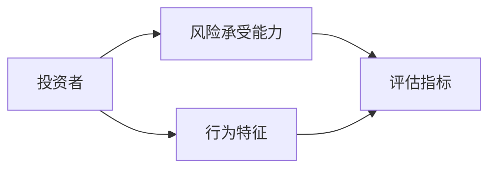

                 


# 智能投资者风险承受能力评估

**关键词**：智能投资者，风险承受能力，人工智能，金融评估，机器学习

**摘要**：本文探讨了利用人工智能技术评估投资者风险承受能力的方法，分析了核心概念、算法原理和系统设计，结合实际案例，展示了如何通过智能手段提升评估的准确性和效率。

---

# 目录大纲

## 第一部分: 智能投资者风险承受能力评估背景与基础

### 第1章: 问题背景与描述

#### 1.1 风险承受能力的核心概念
- 1.1.1 风险承受能力的定义与内涵
- 1.1.2 投资者行为分析与决策特征
- 1.1.3 风险承受能力的评估意义

#### 1.2 问题背景与现状分析
- 1.2.1 传统风险评估方法的局限性
- 1.2.2 AI技术在金融领域的应用趋势
- 1.2.3 当前市场对智能评估的需求

### 第2章: 问题解决与边界分析

#### 2.1 风险承受能力评估的数学模型
- 2.1.1 风险-收益平衡模型
- 2.1.2 投资者决策树模型
- 2.1.3 风险承受能力的量化指标

#### 2.2 问题边界与外延
- 2.2.1 风险评估的适用场景
- 2.2.2 边界条件的设定与调整
- 2.2.3 外延分析与扩展可能性

## 第二部分: 核心概念与关联分析

### 第3章: 风险承受能力的核心要素

#### 3.1 投资者行为分析模型
- 3.1.1 投资者决策风格分类
- 3.1.2 投资者情绪与行为特征
- 3.1.3 行为模型与风险评估的关系

#### 3.2 风险认知与评估模型
- 3.2.1 风险认知的层次分析
- 3.2.2 风险偏好与评估的关系
- 3.2.3 风险认知模型的构建

### 第4章: 核心概念的关联分析

#### 4.1 核心概念属性对比表
- 表4.1-1: 风险承受能力与投资者行为的核心属性对比

#### 4.2 实体关系图


## 第三部分: 算法原理与数学模型

### 第5章: 风险承受能力评估的算法原理

#### 5.1 基于机器学习的评估模型
- 5.1.1 算法选择与原理
- 5.1.2 数据预处理与特征提取
- 5.1.3 模型训练与优化

#### 5.2 数学模型与公式
- 5.2.1 风险承受能力的量化
- 例如：使用CAPM模型计算风险溢价：
  $$ E(r) = r_f + β \times (E(r_m) - r_f) $$

## 第四部分: 系统分析与架构设计

### 第6章: 问题场景与系统功能设计

#### 6.1 问题场景介绍
- 系统目标：构建智能投资者风险承受能力评估平台
- 适用场景：为投资者提供个性化的风险评估报告

#### 6.2 系统功能设计
- 领域模型类图：
```mermaid
classDiagram
class 投资者
class 风险承受能力
class 评估指标
class 行为特征
investor -> RiskCapacity: 具有
RiskCapacity -> EvaluationMetrics: 具有
investor -> BehavioralFeatures: 具有
```

#### 6.3 系统架构设计
- 架构图：


## 第五部分: 项目实战

### 第7章: 项目实现与案例分析

#### 7.1 环境安装与配置
- 安装Python、机器学习库（如scikit-learn）和数据处理工具

#### 7.2 核心功能实现
- 代码实现：投资者行为特征提取和风险评估模型训练
```python
from sklearn.tree import DecisionTreeClassifier
# 假设X为特征矩阵，y为标签
model = DecisionTreeClassifier()
model.fit(X, y)
```

#### 7.3 实际案例分析
- 通过具体案例展示模型的应用和效果评估

## 第六部分: 总结与展望

### 第8章: 最佳实践与总结

#### 8.1 注意事项
- 数据质量和模型解释性的重要性

#### 8.2 小结
- 总结全文，强调智能评估的优势

#### 8.3 扩展阅读
- 推荐相关书籍和论文，鼓励深入学习

---

通过以上大纲，我可以逐步展开各章节内容，确保逻辑清晰，技术细节到位，帮助读者全面理解智能投资者风险承受能力评估的核心原理和实际应用。

