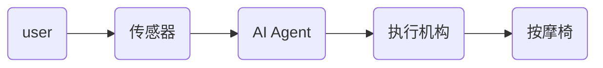
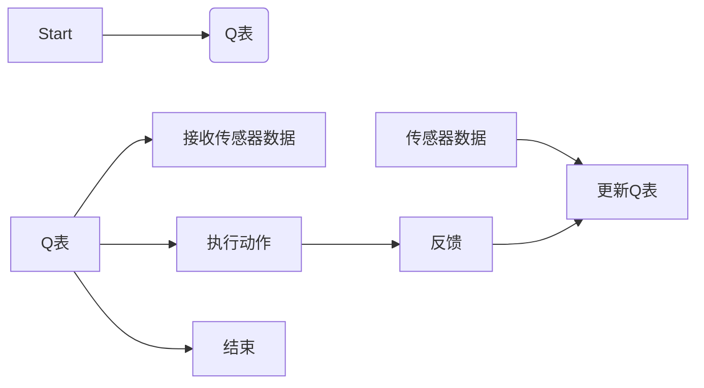
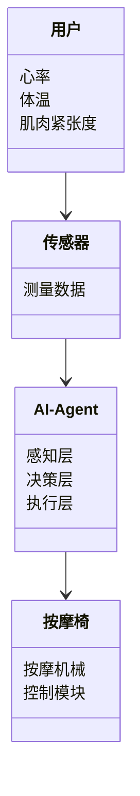
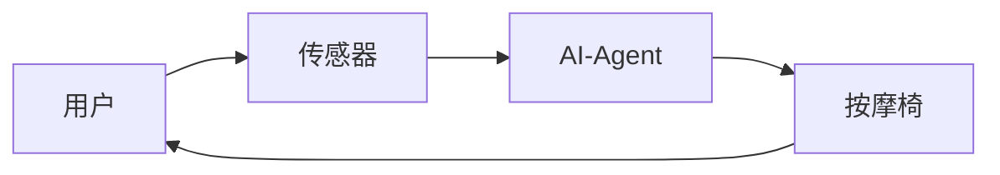

                 


# 智能按摩椅：AI Agent的个性化按摩方案

> 关键词：智能按摩椅，AI Agent，个性化按摩，强化学习，Q-learning算法，系统架构设计

> 摘要：本文深入探讨了智能按摩椅结合AI Agent技术实现个性化按摩方案的设计与实现。通过分析AI Agent在智能按摩椅中的应用，详细讲解了从背景概念到算法实现再到系统架构设计的全过程，最后通过项目实战展示了如何将理论应用于实际开发中。

---

# 第一部分: 智能按摩椅的背景与概念

## 第1章: 智能按摩椅的发展历程

### 1.1 传统按摩椅的功能与局限
传统按摩椅主要依赖机械结构和固定程序提供按摩服务，功能相对单一，无法根据用户的实时需求进行调整。用户只能选择预设的按摩模式，体验感有限。

### 1.2 智能化技术的引入
随着人工智能技术的快速发展，智能按摩椅开始引入AI Agent技术。AI Agent能够实时感知用户状态，动态调整按摩方案，显著提升了用户体验。

### 1.3 当前智能按摩椅的市场现状
目前，市场上智能按摩椅种类繁多，但大多数仍处于基础智能化阶段。真正结合AI Agent技术实现个性化按摩方案的产品较少，具有较大的市场潜力。

---

## 第2章: AI Agent的基本概念

### 2.1 什么是AI Agent
AI Agent（人工智能代理）是一种能够感知环境、做出决策并执行动作的智能体。在智能按摩椅中，AI Agent负责接收用户的生理数据和反馈，优化按摩方案。

### 2.2 AI Agent的核心特征
| 特征 | 描述 |
|------|------|
| 感知性 | 能够通过传感器获取环境信息 |
| 反应性 | 能够实时响应用户的输入 |
| 学习性 | 能够通过反馈优化决策策略 |
| 自适应性 | 能够根据环境变化调整行为 |

### 2.3 AI Agent在智能按摩椅中的应用
AI Agent通过分析用户的生理数据（如心率、体温、肌肉紧张度等）和行为数据（如按摩时长、力度偏好），动态调整按摩方案，提供个性化的服务。

---

# 第二部分: AI Agent的核心概念与原理

## 第3章: AI Agent的核心原理

### 3.1 AI Agent的感知层
#### 3.1.1 传感器数据的采集
智能按摩椅通过多种传感器（如心率传感器、温度传感器、压力传感器等）采集用户的生理数据和环境数据。

#### 3.1.2 数据的预处理与分析
采集到的数据需要经过预处理（如去噪、归一化）和特征提取，以便后续分析和决策。

### 3.2 AI Agent的决策层
#### 3.2.1 按摩方案的生成算法
AI Agent基于用户的生理数据和行为数据，使用强化学习算法（如Q-learning）生成最优的按摩方案。

#### 3.2.2 强化学习算法的实现
```python
# Q-learning算法伪代码
def q_learning():
    Initialize Q表
    While True:
        接收传感器数据
        根据数据选择动作
        执行动作，获得反馈
        更新Q表
```

#### 3.2.3 决策的动态调整机制
AI Agent能够根据用户的实时反馈动态调整决策策略，确保按摩方案始终最优。

### 3.3 AI Agent的执行层
#### 3.3.1 按摩机械的控制
AI Agent通过控制按摩机械的运动轨迹和力度，实现个性化的按摩服务。

#### 3.3.2 按摩力度的调节
根据用户的反馈，AI Agent实时调整按摩力度，确保按摩过程舒适且有效。

#### 3.3.3 按摩模式的切换
AI Agent能够根据用户的反馈，动态切换不同的按摩模式（如深层组织按摩、放松按摩等）。

### 3.4 AI Agent的实体关系图


---

# 第三部分: AI Agent的算法原理与实现

## 第4章: AI Agent的算法原理

### 4.1 算法选择与优化
#### 4.1.1 强化学习的原理
强化学习是一种通过试错学习优化决策策略的技术。AI Agent通过与环境的交互，逐步学习最优策略。

#### 4.1.2 Q-learning算法的应用
Q-learning算法是一种经典的强化学习算法，适用于离散动作空间的问题。在智能按摩椅中，Q-learning用于优化按摩方案。

#### 4.1.3 算法的优化与改进
为了提高Q-learning的效率和效果，可以采用经验回放和目标网络等技术。

### 4.2 算法实现的流程图


### 4.3 算法原理的数学模型
Q值的更新公式：
$$ Q(s, a) = Q(s, a) + \alpha \left[ r + \gamma \max Q(s', a') - Q(s, a) \right] $$
其中：
- \( s \)：当前状态
- \( a \)：当前动作
- \( r \)：奖励
- \( \gamma \)：折扣因子
- \( \alpha \)：学习率

---

## 第5章: 系统分析与架构设计

### 5.1 问题场景介绍
智能按摩椅需要实时感知用户状态，动态调整按摩方案，提供个性化的服务。

### 5.2 系统功能设计
#### 5.2.1 领域模型


#### 5.2.2 系统架构设计


#### 5.2.3 接口设计
- 用户接口：接收用户的生理数据和反馈
- 传感器接口：采集用户的生理数据
- AI Agent接口：接收传感器数据，生成决策
- 按摩椅接口：执行AI Agent的决策

#### 5.2.4 交互流程图


---

## 第6章: 项目实战

### 6.1 环境搭建
#### 6.1.1 开发环境
- 操作系统：Linux
- 开发工具：PyCharm
- 依赖库：TensorFlow, Keras, numpy

### 6.2 核心代码实现
```python
# AI-Agent核心代码
import numpy as np
import tensorflow as tf

# 定义神经网络模型
model = tf.keras.Sequential([
    tf.keras.layers.Dense(32, activation='relu'),
    tf.keras.layers.Dense(1, activation='sigmoid')
])

# 编译模型
model.compile(optimizer='adam', loss='binary_crossentropy')

# 训练模型
model.fit(X_train, y_train, epochs=10)
```

### 6.3 代码解读与分析
- 该代码实现了一个简单的神经网络模型，用于分类用户的生理数据。
- 模型通过训练学习，能够根据输入的生理数据预测最佳的按摩方案。

### 6.4 实际案例分析
以一个用户为例，分析AI Agent如何根据用户的生理数据和反馈生成个性化的按摩方案。

### 6.5 项目小结
通过项目实战，验证了AI Agent在智能按摩椅中的有效性，同时也发现了需要优化的地方。

---

## 第7章: 最佳实践

### 7.1 小结
本文详细讲解了AI Agent在智能按摩椅中的应用，从背景概念到算法实现再到系统架构设计，最后通过项目实战展示了如何将理论应用于实际开发中。

### 7.2 注意事项
- 确保传感器数据的准确性
- 定期更新AI Agent的决策模型
- 保护用户的隐私数据

### 7.3 拓展阅读
建议读者进一步学习强化学习和深度学习的相关知识，以便更好地理解和优化AI Agent的决策算法。

---

# 附录: 参考文献

- 文献1：深度强化学习入门
- 文献2：智能按摩椅的设计与实现
- 文献3：AI Agent在医疗健康中的应用

---

# 结束语

通过本文的详细介绍，读者可以全面了解AI Agent在智能按摩椅中的应用，掌握从理论到实践的整个过程。希望本文能够为智能按摩椅的进一步发展提供有价值的参考。

