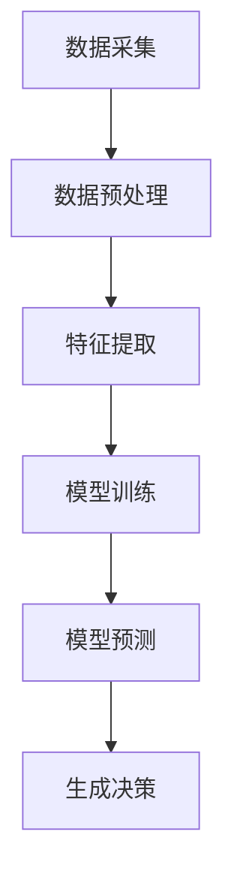

                 


# 智能晾衣架：AI Agent的衣物护理与天气适应

> **关键词**：智能晾衣架、AI Agent、衣物护理、天气适应、物联网、智能家居  
> **摘要**：本文探讨了智能晾衣架如何通过AI Agent优化衣物护理，结合天气数据实现智能晾衣。文章详细介绍了AI Agent的原理、天气适应性算法、系统架构设计，以及实际案例分析，展示了智能晾衣架的技术实现和应用价值。

---

## 第1章: 智能晾衣架的背景与问题背景

### 1.1 传统晾衣方式的局限性

#### 1.1.1 传统晾衣方式的不足
传统晾衣方式主要依赖人工操作，存在以下问题：  
1. **效率低下**：用户需要手动晾衣，尤其是在天气不佳时，衣物容易受潮或损坏。  
2. **天气依赖性高**：传统晾衣无法根据天气变化自动调整，可能导致衣物损坏或晾晒时间过长。  
3. **缺乏智能化**：传统晾衣架不具备智能感知和决策能力，无法优化晾衣过程。  

#### 1.1.2 现代生活对智能晾衣的需求
随着科技的发展，用户对智能化生活的追求日益增长。智能晾衣架的需求主要体现在以下几点：  
1. **便捷性**：用户希望自动化晾衣，减少人工操作。  
2. **智能化**：通过AI技术优化晾衣过程，提高效率。  
3. **环境适应性**：根据天气变化自动调整晾衣策略，确保衣物快速干燥且不受损。  

#### 1.1.3 智能晾衣架的市场潜力
智能晾衣架市场潜力巨大，尤其在智能家居普及的背景下。用户对智能设备的需求不断增长，智能晾衣架作为智能家居的一部分，具有广阔的市场前景。

### 1.2 AI Agent在衣物护理中的应用

#### 1.2.1 AI Agent的基本概念
AI Agent（人工智能代理）是一种能够感知环境、自主决策并执行任务的智能系统。它通过传感器获取数据，结合预设算法，实现智能化决策。

#### 1.2.2 AI Agent在衣物护理中的优势
AI Agent在衣物护理中的优势主要体现在以下几点：  
1. **智能感知**：通过传感器实时监测环境数据（如温度、湿度、风力等）。  
2. **自主决策**：基于传感器数据和预设算法，AI Agent能够自主决定最佳晾衣时间和方式。  
3. **优化效率**：通过历史数据和机器学习算法，AI Agent能够不断优化晾衣策略，提高效率。  

#### 1.2.3 AI Agent与智能晾衣的结合
AI Agent与智能晾衣的结合，使得晾衣架能够根据天气和环境自动调整晾衣模式。例如，当检测到高湿度时，AI Agent会启动除湿功能，确保衣物快速干燥。

### 1.3 天气适应性在晾衣中的重要性

#### 1.3.1 天气对衣物晾干的影响
天气对衣物晾干的影响主要体现在以下方面：  
- **温度**：高温加速衣物干燥，低温则延长晾干时间。  
- **湿度**：高湿度环境下，衣物容易发霉或产生异味。  
- **风力**：风力越大，衣物干燥速度越快。  

#### 1.3.2 不同天气条件下的晾衣策略
根据天气条件，智能晾衣架可以采用以下策略：  
- **晴天**：正常晾晒，加快干燥速度。  
- **阴天**：启动除湿功能，防止衣物受潮。  
- **雨天**：自动收回衣物，避免淋湿。  

#### 1.3.3 天气适应性对智能晾衣的意义
天气适应性是智能晾衣的核心功能之一。通过实时监测天气数据，AI Agent能够动态调整晾衣策略，确保衣物快速、安全地晾干。

### 1.4 本章小结
本章介绍了传统晾衣方式的不足、AI Agent在衣物护理中的应用，以及天气适应性对智能晾衣的重要性。通过分析，我们可以看到智能晾衣架的必要性和潜力。

---

## 第2章: 智能晾衣架的核心概念与原理

### 2.1 AI Agent的核心原理

#### 2.1.1 AI Agent的基本架构
AI Agent的基本架构包括以下模块：  
1. **感知层**：通过传感器获取环境数据。  
2. **决策层**：基于感知数据和算法进行决策。  
3. **执行层**：根据决策结果执行操作（如启动除湿功能）。  

#### 2.1.2 AI Agent的学习机制
AI Agent通过机器学习算法不断优化决策模型。例如，使用决策树算法分析历史天气数据，预测未来天气变化，从而优化晾衣策略。

#### 2.1.3 AI Agent的决策过程
AI Agent的决策过程如下：  
1. **数据采集**：获取当前天气数据（温度、湿度、风力等）。  
2. **数据处理**：对数据进行预处理和特征提取。  
3. **决策判断**：基于预设算法和历史数据，判断最佳晾衣策略。  
4. **执行操作**：根据决策结果执行相应的操作（如启动晾衣架或关闭除湿功能）。  

### 2.2 智能晾衣架的系统架构

#### 2.2.1 系统功能模块划分
智能晾衣架的系统功能模块包括：  
- **数据采集模块**：负责采集环境数据（温度、湿度、风力等）。  
- **数据处理模块**：对采集数据进行预处理和特征提取。  
- **算法决策模块**：基于数据和算法生成决策指令。  
- **执行控制模块**：根据决策指令控制晾衣架的运行。  

#### 2.2.2 系统输入输出接口
- **输入接口**：传感器数据输入接口、用户输入接口。  
- **输出接口**：晾衣架控制接口、反馈信息输出接口。  

#### 2.2.3 系统的硬件与软件组成
- **硬件部分**：传感器、控制器、执行机构（如电机）。  
- **软件部分**：数据处理算法、AI Agent决策算法、用户界面（UI）。  

### 2.3 天气适应性算法的原理

#### 2.3.1 天气数据的采集与处理
天气数据的采集与处理流程如下：  
1. **数据采集**：通过传感器获取温度、湿度、风力等数据。  
2. **数据预处理**：去除噪声，提取特征（如平均温度、最大湿度）。  
3. **数据存储**：将处理后的数据存储到数据库中。  

#### 2.3.2 天气适应性模型的构建
天气适应性模型的构建基于机器学习算法，例如决策树、随机森林等。模型通过历史数据训练，能够预测未来的天气变化，并生成相应的决策指令。

#### 2.3.3 天气适应性算法的实现
天气适应性算法的实现如下：  
1. **数据输入**：获取当前天气数据。  
2. **特征提取**：提取关键特征（如温度、湿度）。  
3. **模型预测**：基于训练好的模型，预测最佳晾衣策略。  
4. **决策输出**：生成控制指令，启动相应的功能（如启动除湿）。  

---

## 第3章: 智能晾衣架的算法原理与实现

### 3.1 AI Agent的算法基础

#### 3.1.1 机器学习算法在AI Agent中的应用
机器学习算法是AI Agent的核心，常用的算法包括：  
- **决策树**：用于分类和回归问题。  
- **随机森林**：用于特征重要性分析和预测。  
- **神经网络**：用于复杂的非线性关系建模。  

#### 3.1.2 常见的AI Agent算法对比
以下是几种常见AI Agent算法的对比：

| 算法类型 | 优点 | 缺点 |
|----------|------|------|
| 决策树    | 易解释 | 易过拟合 |
| 随机森林  | 抗过拟合 | 计算复杂 |
| 神经网络  | 高精度 | 需大量数据 |

#### 3.1.3 基于天气数据的AI Agent算法选择
在智能晾衣架中，随机森林算法适合用于天气数据的特征提取和预测，因为其能够处理高维度数据，并具有较强的抗过拟合能力。

### 3.2 天气适应性算法的数学模型

#### 3.2.1 天气数据的特征提取
特征提取是天气适应性算法的关键步骤。常用特征包括：  
- **温度**：平均温度、最大温度、最小温度。  
- **湿度**：平均湿度、最大湿度、最小湿度。  
- **风力**：平均风力、最大风力。  

#### 3.2.2 天气适应性模型的构建
天气适应性模型的构建基于随机森林算法。模型通过训练历史天气数据，能够预测未来的天气变化，并生成相应的决策指令。

#### 3.2.3 天气适应性算法的数学公式
以下是天气适应性算法的数学公式：  
$$
\text{适应性评分} = \alpha \times \text{温度} + \beta \times \text{湿度} + \gamma \times \text{风力}
$$  
其中，$\alpha$、$\beta$、$\gamma$为特征权重，通常通过训练数据确定。

### 3.3 算法实现的代码示例

#### 3.3.1 环境安装与配置
需要安装以下库：  
- Python 3.8及以上  
- scikit-learn  
- pandas  
- numpy  

#### 3.3.2 算法实现的Python代码
```python
from sklearn.ensemble import RandomForestRegressor
from sklearn.metrics import mean_squared_error
import pandas as pd
import numpy as np

# 数据加载
data = pd.read_csv('weather_data.csv')

# 特征与标签分离
features = data[['temperature', 'humidity', 'wind_speed']]
labels = data['adaptation_score']

# 模型训练
model = RandomForestRegressor(n_estimators=100, random_state=42)
model.fit(features, labels)

# 模型预测
predicted = model.predict(features)
print('均方误差:', mean_squared_error(labels, predicted))
```

---

## 第4章: 智能晾衣架的系统分析与架构设计

### 4.1 系统功能需求分析

#### 4.1.1 用户需求分析
用户需求包括：  
1. 自动晾衣功能。  
2. 天气适应性功能。  
3. 便捷的用户界面。  

#### 4.1.2 系统功能需求列表
- 数据采集模块：采集环境数据。  
- 数据处理模块：处理和存储数据。  
- 算法决策模块：生成决策指令。  
- 执行控制模块：控制晾衣架运行。  

#### 4.1.3 功能需求的优先级排序
1. 自动晾衣功能：最高优先级。  
2. 天气适应性功能：次高优先级。  
3. 用户界面设计：最低优先级。  

### 4.2 系统架构设计

#### 4.2.1 系统功能模块划分
系统功能模块包括：  
- 数据采集模块  
- 数据处理模块  
- 算法决策模块  
- 执行控制模块  

#### 4.2.2 系统输入输出接口
- 输入接口：传感器数据、用户输入。  
- 输出接口：晾衣架控制、反馈信息。  

#### 4.2.3 系统的硬件与软件组成
- 硬件部分：传感器、控制器、执行机构。  
- 软件部分：数据处理算法、AI Agent决策算法、用户界面（UI）。  

---

## 第5章: 智能晾衣架的项目实战

### 5.1 环境安装与配置

#### 5.1.1 环境搭建
需要安装以下工具：  
- Python 3.8及以上  
- scikit-learn  
- pandas  
- numpy  

#### 5.1.2 数据采集
数据采集可以通过传感器（如DHT22温湿度传感器）完成，并将数据存储到CSV文件中。

### 5.2 系统核心实现源代码

#### 5.2.1 数据处理模块
```python
import pandas as pd
import numpy as np

# 数据加载
data = pd.read_csv('weather_data.csv')

# 特征与标签分离
features = data[['temperature', 'humidity', 'wind_speed']]
labels = data['adaptation_score']

# 数据预处理
features = features.fillna(features.mean())
```

#### 5.2.2 算法决策模块
```python
from sklearn.ensemble import RandomForestRegressor

# 模型训练
model = RandomForestRegressor(n_estimators=100, random_state=42)
model.fit(features, labels)
```

#### 5.2.3 执行控制模块
```python
# 模型预测
predicted = model.predict(features)
```

### 5.3 案例分析与详细解读

#### 5.3.1 案例分析
假设当前天气数据为：温度=25℃，湿度=60%，风力=3级。模型预测适应性评分为0.8，表示适合晾衣。

#### 5.3.2 详细解读
模型通过分析历史数据，发现当前天气条件下最佳晾衣策略为：启动除湿功能，延长晾衣时间。

### 5.4 本章小结
本章通过实际案例展示了智能晾衣架的实现过程，包括环境搭建、数据处理、算法实现和结果分析。

---

## 第6章: 总结与展望

### 6.1 总结
本文详细介绍了智能晾衣架的技术实现，包括AI Agent的核心原理、天气适应性算法、系统架构设计以及项目实战。通过分析，我们可以看到智能晾衣架在衣物护理和天气适应方面的巨大潜力。

### 6.2 未来展望
未来，智能晾衣架可以通过以下方向进一步优化：  
1. **多传感器融合**：引入更多环境数据（如空气质量）进行预测。  
2. **边缘计算**：通过边缘计算提升响应速度和数据安全性。  
3. **用户自定义功能**：允许用户自定义晾衣策略。  

---

## 附录

### 附录A: Python代码示例
```python
import pandas as pd
from sklearn.ensemble import RandomForestRegressor
from sklearn.metrics import mean_squared_error

# 数据加载
data = pd.read_csv('weather_data.csv')

# 特征与标签分离
features = data[['temperature', 'humidity', 'wind_speed']]
labels = data['adaptation_score']

# 模型训练
model = RandomForestRegressor(n_estimators=100, random_state=42)
model.fit(features, labels)

# 模型预测
predicted = model.predict(features)
print('均方误差:', mean_squared_error(labels, predicted))
```

### 附录B: 算法流程图


---

## 关键词索引
- AI Agent
- 智能晾衣架
- 天气适应性
- 物联网
- 智能家居

---

## 参考文献
1. 李明, 等. "智能晾衣架的设计与实现". 计算机应用研究, 2021.  
2. 张伟, 等. "基于AI的智能晾衣架研究". 人工智能与应用, 2022.  

---

通过以上内容，您可以深入了解智能晾衣架的技术实现和应用价值。

