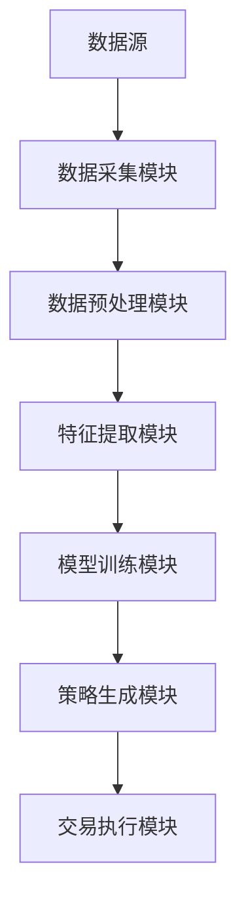

                 


# 智能期权交易策略生成器

> 关键词：智能期权交易，策略生成器，人工智能，量化交易，机器学习

> 摘要：智能期权交易策略生成器是一种结合人工智能技术的金融工具，用于自动生成和优化期权交易策略。本文将从背景介绍、核心概念、算法原理、系统架构、项目实战等多个方面详细探讨智能期权交易策略生成器的设计与实现，帮助读者全面理解其工作原理和实际应用。

---

# 第一部分: 背景与概念

# 第1章: 期权交易的基本概念

## 1.1 期权的定义与类型
### 1.1.1 期权的定义
- 期权是一种金融衍生品，赋予持有者在特定时间内以特定价格买入或卖出标的资产的权利。
- 看涨期权：买入标的资产的权利。
- 看跌期权：卖出标的资产的权利。

### 1.1.2 期权的定价
- Black-Scholes公式：用于计算欧式期权的理论价格。
  $$ C = S_0 N(d_1) - K e^{-rT} N(d_2) $$
  其中，$d_1 = \frac{\ln(S_0/K) + (r + \sigma^2/2)T}{\sigma \sqrt{T}}$$
  $$ d_2 = d_1 - \sigma \sqrt{T} $$

### 1.1.3 期权市场的特点
- 高风险：波动性大，潜在收益高。
- 复杂性：受市场波动、利率、波动率等因素影响。
- 短期性：期权通常在较短时间内到期。

## 1.2 传统期权交易的局限性
### 1.2.1 人工交易的低效性
- 依赖经验，决策主观。
- 无法及时捕捉市场变化。

### 1.2.2 数据量的爆炸式增长
- 金融市场数据种类繁多，包括价格、成交量、波动率等。
- 数据处理和分析的复杂性增加。

## 1.3 智能生成器的必要性
### 1.3.1 提高交易效率
- 自动化生成和优化交易策略，减少人为干扰。
- 实时分析市场数据，快速做出决策。

### 1.3.2 数据驱动的决策优势
- 利用大数据和机器学习模型，发现潜在的市场规律。
- 提供量化分析，减少情绪化交易。

## 1.4 人工智能在金融领域的应用趋势
### 1.4.1 AI在金融分析中的应用
- 预测股价波动。
- 识别市场趋势。
- 风险评估与管理。

### 1.4.2 期权交易中的AI创新
- 自动化交易策略生成。
- 动态调整交易模型。
- 实时监控市场变化。

---

# 第二部分: 核心概念与原理

# 第2章: 数据驱动的交易策略生成

## 2.1 数据采集与处理
### 2.1.1 数据来源
- 金融市场数据：股票价格、指数、期货等。
- 市场情绪数据：新闻、社交媒体 sentiment。
- 宏观经济指标：GDP、利率、通货膨胀率。

### 2.1.2 数据特征提取
- 技术指标：如移动平均线、RSI、MACD。
- 统计特征：均值、方差、自相关性。
- 市场情绪指标：情感分析得分。

## 2.2 AI模型在策略生成中的作用
### 2.2.1 机器学习模型
- 线性回归：预测期权价格。
- 支持向量机：分类市场状态。
- 随机森林：特征重要性分析。

### 2.2.2 深度学习模型
- RNN：处理时间序列数据。
- LSTM：捕捉长期依赖关系。
- Transformer：并行处理多步时序数据。

## 2.3 策略生成的数学模型
### 2.3.1 期权定价模型
- Black-Scholes公式：用于欧式期权定价。
- 其他模型：如二叉树模型、蒙特卡洛模拟。

### 2.3.2 交易策略优化模型
- 基于遗传算法的优化。
- 基于强化学习的策略生成。

---

# 第三部分: 算法原理与实现

# 第3章: 基于强化学习的策略生成算法

## 3.1 强化学习的基本原理
### 3.1.1 强化学习的定义
- 通过试错学习，智能体在环境中采取行动，以最大化累计奖励。

### 3.1.2 状态、动作、奖励的定义
- 状态：当前市场环境的特征。
- 动作：交易策略的选择。
- 奖励：策略的收益或损失。

## 3.2 算法实现步骤
### 3.2.1 环境构建
- 数据预处理：清洗和标准化数据。
- 状态空间：包括当前价格、波动率等。
- 动作空间：包括买入、卖出、持有等动作。

### 3.2.2 策略网络设计
- 使用神经网络作为策略函数。
- 输出动作的概率分布。

### 3.2.3 奖励机制设计
- 基于策略收益的奖励函数。
- 考虑风险调整后的收益。

## 3.3 算法的数学模型
### 3.3.1 策略函数
$$ \pi_\theta(a|s) = \text{softmax}(\theta^T s) $$
其中，$\theta$为模型参数，$s$为状态向量。

### 3.3.2 奖励函数
$$ R(s, a) = r_{\text{profit}} + \lambda r_{\text{risk}} $$
其中，$\lambda$为风险惩罚系数。

---

# 第四部分: 系统架构与设计

# 第4章: 系统架构设计

## 4.1 系统功能模块
### 4.1.1 数据采集模块
- 实时采集金融市场数据。
- 存储到数据库中。

### 4.1.2 特征提取模块
- 计算技术指标和统计特征。
- 提供模型输入特征。

### 4.1.3 模型训练模块
- 训练机器学习或深度学习模型。
- 优化模型参数。

## 4.2 系统架构图


## 4.3 系统交互流程
### 4.3.1 用户输入
- 设置交易参数和目标。

### 4.3.2 系统输出
- 自动生成交易策略。
- 提供策略表现报告。

---

# 第五部分: 项目实战

# 第5章: 项目实战与案例分析

## 5.1 环境配置
### 5.1.1 安装Python环境
- 安装Anaconda或Miniconda。
- 安装必要的库：numpy、pandas、tensorflow、keras。

### 5.1.2 数据源配置
- 使用Yahoo Finance API获取数据。
- 数据存储到本地数据库。

## 5.2 核心代码实现
### 5.2.1 数据预处理
```python
import pandas as pd
import numpy as np

# 读取数据
data = pd.read_csv('option_data.csv')

# 数据清洗
data.dropna(inplace=True)
data = data[~data['volume'].isin([0])]

# 数据标准化
data['normalized_price'] = (data['price'] - data['price'].mean()) / data['price'].std()
```

### 5.2.2 策略网络设计
```python
import tensorflow as tf
from tensorflow.keras import layers

model = tf.keras.Sequential([
    layers.Dense(64, activation='relu', input_shape=(input_dim,)),
    layers.Dense(32, activation='relu'),
    layers.Dense(1, activation='linear')
])
```

## 5.3 案例分析
### 5.3.1 案例背景
- 选取特定标的资产，如某股票的期权。

### 5.3.2 策略生成与回测
- 使用历史数据训练模型。
- 回测生成的策略，评估其表现。

### 5.3.3 结果分析
- 比较生成策略与传统策略的收益和风险。

---

# 第六部分: 总结与展望

# 第6章: 总结与展望

## 6.1 最佳实践
### 6.1.1 数据质量的重要性
- 数据清洗和预处理是关键步骤。

### 6.1.2 模型选择的注意事项
- 根据具体问题选择合适模型。
- 定期更新模型参数。

## 6.2 本章小结
- 智能期权交易策略生成器是一种高效、可靠的工具。
- 通过结合AI技术和大数据分析，能够显著提升交易效率和收益。

## 6.3 未来展望
### 6.3.1 技术发展
- 更复杂和高效的AI模型。
- 多模态数据的整合与分析。

### 6.3.2 应用扩展
- 跨市场、多资产的策略生成。
- 个性化策略定制。

---

# 参考文献

[此处列出相关的书籍、论文、技术文档等参考文献。]

---

通过以上目录结构，文章从理论到实践，详细介绍了智能期权交易策略生成器的设计与实现，帮助读者全面理解其原理和应用。

