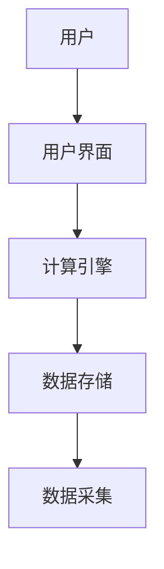
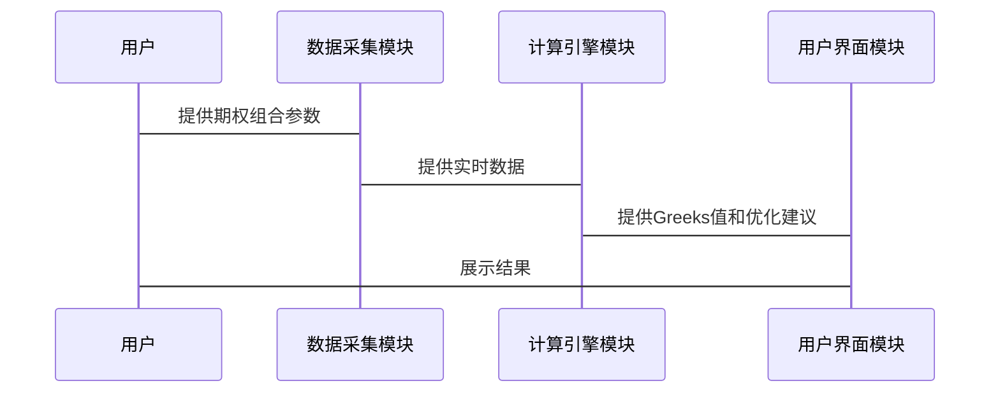

                 


# 智能期权组合Greeks管理系统

## 关键词：智能期权、Greeks、风险管理、蒙特卡洛模拟、金融系统架构

## 摘要：  
智能期权组合Greeks管理系统是一种基于人工智能和大数据分析的金融工具，用于实时计算和管理期权组合的风险参数（Delta、Gamma、Theta、Vega、Rho等），帮助交易员和投资者优化投资组合，降低风险敞口。本文详细探讨了该系统的核心概念、算法原理、系统架构以及实际应用场景，为金融专业人士提供了一套高效的风险管理解决方案。

---

# 第1章: 智能期权组合Greeks管理系统的背景与意义

## 1.1 期权的基本概念  
### 1.1.1 期权的定义与分类  
期权是一种金融衍生品，赋予持有人在特定时间以特定价格买入或卖出标的资产的权利。期权可以分为看涨期权（Call Option）和看跌期权（Put Option）两大类，进一步细分为欧式期权和美式期权。  

### 1.1.2 期权的基本要素  
- 标的资产：期权合约所涉及的资产，如股票、指数或商品。  
- 执行价格：期权的行权价格。  
- 到期时间：期权的有效期限。  
- 期权费：购买期权的价格。  

### 1.1.3 期权市场的基本运作机制  
期权市场的运作涉及买方、卖方和交易所。买方支付期权费，获得期权权利；卖方收取期权费，承担行权义务。交易所负责撮合交易并提供结算服务。  

## 1.2 Greeks的定义与作用  
### 1.2.1 Delta的定义与计算  
Delta是衡量期权价格对标的资产价格变动的敏感度，公式为：  
$$ \Delta = \frac{\partial C}{\partial S} $$  
其中，\( C \) 是期权价格，\( S \) 是标的资产价格。  

### 1.2.2 Gamma的定义与计算  
Gamma是Delta的变化率，公式为：  
$$ \Gamma = \frac{\partial \Delta}{\partial S} $$  

### 1.2.3 Theta的定义与计算  
Theta是期权价格对时间流逝的敏感度，公式为：  
$$ \Theta = \frac{\partial C}{\partial t} $$  

### 1.2.4 Vega和Rho的定义与计算  
- Vega：衡量期权价格对波动率变化的敏感度，公式为：  
$$ \Vega = \frac{\partial C}{\partial \sigma} $$  
- Rho：衡量期权价格对利率变化的敏感度，公式为：  
$$ \Rho = \frac{\partial C}{\partial r} $$  

## 1.3 智能期权组合Greeks管理系统的必要性  
### 1.3.1 传统Greeks计算的局限性  
传统Greeks计算依赖手工或简单工具，存在效率低、误差大、难以实时跟踪等问题。  

### 1.3.2 智能化管理的优势  
智能系统通过自动化计算、实时监控和优化建议，显著提高了风险管理的效率和准确性。  

### 1.3.3 系统在金融风险管理中的作用  
智能期权组合Greeks管理系统能够实时评估组合风险，帮助交易员优化头寸，降低潜在损失。  

## 1.4 本章小结  
本章介绍了期权的基本概念和Greeks的定义，阐述了智能期权组合Greeks管理系统的必要性和其在金融风险管理中的重要作用。

---

# 第2章: 智能期权组合Greeks管理系统的核心概念与联系

## 2.1 Greeks的核心原理  
### 2.1.1 Delta的数学模型  
Delta的数学模型基于Black-Scholes公式，适用于欧式期权的定价。  

### 2.1.2 Gamma的数学模型  
Gamma是Delta的二阶导数，用于衡量Delta的变化幅度。  

### 2.1.3 Theta的数学模型  
Theta是期权的时间价值损耗，与期权到期时间密切相关。  

### 2.1.4 Vega和Rho的数学模型  
Vega反映波动率变化对期权价格的影响，Rho反映利率变化的影响。  

## 2.2 Greeks之间的关系  
### 2.2.1 Delta与Gamma的关系  
Gamma是Delta的导数，反映了Delta的变化率。  

### 2.2.2 Theta与Delta的关系  
Theta的变化与Delta和Gamma密切相关，体现了时间对期权价值的影响。  

### 2.2.3 系统中Greeks的综合应用  
智能系统通过综合分析Delta、Gamma、Theta等指标，提供全面的风险评估和优化建议。  

## 2.3 系统的核心要素  
### 2.3.1 数据采集模块  
数据采集模块负责从金融市场获取实时数据，包括标的资产价格、波动率、利率等。  

### 2.3.2 计算引擎模块  
计算引擎模块基于蒙特卡洛模拟或二叉树模型，计算期权组合的Greeks值。  

### 2.3.3 用户界面模块  
用户界面模块提供直观的可视化界面，便于用户查看Greeks值和优化建议。  

## 2.4 本章小结  
本章详细讲解了Greeks的核心原理及其在智能系统中的综合应用，分析了系统的核心要素。

---

# 第3章: 智能期权组合Greeks管理系统的算法原理

## 3.1 蒙特卡洛模拟算法  
### 3.1.1 算法的基本原理  
蒙特卡洛模拟是一种通过随机采样方法模拟金融资产价格波动的算法，常用于期权定价。  

### 3.1.2 算法的实现步骤  
1. 确定标的资产的初始价格和波动率。  
2. 生成随机数模拟资产价格的未来走势。  
3. 计算每种模拟情况下的期权价格。  
4. 计算Greeks值的平均值，得到最终结果。  

### 3.1.3 算法的优缺点  
- 优点：能够处理复杂的金融模型，适用于高维问题。  
- 缺点：计算量大，收敛速度慢。  

### 3.1.4 Python代码示例  
```python
import numpy as np

def monte_carlo_option_pricing(S, K, T, r, sigma, steps=10000):
    np.random.seed(42)
    dt = T / steps
    mu = r - 0.5 * sigma**2
    for _ in range(steps):
        dW = np.random.randn(len(S))
        S = S * np.exp((mu * dt + sigma * np.sqrt(dt) * dW))
    payoff = np.maximum(S - K, 0)
    return payoff.mean()
```

## 3.2 二叉树模型  
### 3.2.1 模型的基本原理  
二叉树模型通过构建资产价格的上行和下行两种路径，计算期权的期望值。  

### 3.2.2 模型的实现步骤  
1. 确定标的资产的初始价格和波动率。  
2. 计算每期的上行和下行概率。  
3. 计算期权在每期的终值。  
4. 折现终值，得到期权的当前价值。  

### 3.2.3 模型的优缺点  
- 优点：计算简单，适用于美式期权。  
- 缺点：假设资产价格服从对数正态分布，与实际市场可能存在偏差。  

### 3.2.4 Python代码示例  
```python
def binomial_tree_option_pricing(S, K, T, r, sigma, steps=100):
    dt = T / steps
    mu = r - 0.5 * sigma**2
    for _ in range(steps):
        d1 = (np.log(S / K) + (r + sigma**2/2)*T) / (sigma*np.sqrt(T))
        d2 = d1 - sigma*np.sqrt(T)
        C = S * np.exp(-mu * dt) * norm.cdf(d1) - K * np.exp(-r * dt) * norm.cdf(d2)
        return C
```

## 3.3 系统中Greeks的数学模型  
### 3.3.1 Delta的数学模型  
$$ \Delta = \frac{\partial C}{\partial S} $$  

### 3.3.2 Gamma的数学模型  
$$ \Gamma = \frac{\partial \Delta}{\partial S} $$  

### 3.3.3 Theta的数学模型  
$$ \Theta = \frac{\partial C}{\partial t} $$  

## 3.4 算法的优化与实现  
### 3.4.1 并行计算优化  
通过并行计算加速蒙特卡洛模拟的执行速度。  

### 3.4.2 机器学习算法的应用  
利用机器学习模型预测Greeks值的变化趋势，提高计算效率。  

## 3.5 本章小结  
本章详细介绍了蒙特卡洛模拟和二叉树模型的算法原理，并通过Python代码示例展示了其在智能系统中的实现。

---

# 第4章: 智能期权组合Greeks管理系统的系统分析与架构设计

## 4.1 问题场景介绍  
智能期权组合Greeks管理系统的目标是实时计算和管理期权组合的风险参数，帮助交易员优化投资组合。  

## 4.2 系统功能设计  
### 4.2.1 数据采集模块  
数据采集模块负责从金融市场获取实时数据，包括标的资产价格、波动率、利率等。  

### 4.2.2 计算引擎模块  
计算引擎模块基于蒙特卡洛模拟或二叉树模型，计算期权组合的Greeks值。  

### 4.2.3 用户界面模块  
用户界面模块提供直观的可视化界面，便于用户查看Greeks值和优化建议。  

## 4.3 系统架构设计  
### 4.3.1 系统功能模块  
- 数据采集模块：从金融市场获取实时数据。  
- 计算引擎模块：计算期权组合的Greeks值。  
- 用户界面模块：展示计算结果和优化建议。  

### 4.3.2 系统架构图  


## 4.4 系统接口设计  
### 4.4.1 数据接口  
- 输入接口：标的资产价格、波动率、利率等。  
- 输出接口：Delta、Gamma、Theta、Vega、Rho等Greeks值。  

### 4.4.2 用户接口  
- 输入接口：用户输入的期权组合参数。  
- 输出接口：计算结果和优化建议。  

## 4.5 系统交互设计  
### 4.5.1 交互流程  
1. 用户输入期权组合参数。  
2. 系统调用数据采集模块获取实时数据。  
3. 计算引擎模块计算Greeks值。  
4. 系统展示计算结果和优化建议。  

### 4.5.2 交互流程图  


## 4.6 本章小结  
本章详细分析了智能期权组合Greeks管理系统的功能模块、系统架构和交互流程，为系统的实现提供了清晰的设计思路。

---

# 第5章: 智能期权组合Greeks管理系统的项目实战

## 5.1 环境安装与配置  
### 5.1.1 Python环境的安装  
安装Python 3.8及以上版本。  

### 5.1.2 依赖库的安装  
安装NumPy、Pandas、Matplotlib、Scipy等依赖库：  
```bash
pip install numpy pandas matplotlib scipy
```

## 5.2 系统核心实现  
### 5.2.1 数据采集模块的实现  
编写代码从金融市场获取实时数据。  

### 5.2.2 计算引擎模块的实现  
实现蒙特卡洛模拟和二叉树模型，计算Greeks值。  

### 5.2.3 用户界面模块的实现  
设计一个简单的用户界面，展示计算结果和优化建议。  

## 5.3 代码实现与解读  
### 5.3.1 数据采集模块  
```python
import pandas as pd
import requests

def get_market_data():
    url = "https://api.example.com/option_data"
    response = requests.get(url)
    data = pd.DataFrame(response.json())
    return data
```

### 5.3.2 计算引擎模块  
```python
import numpy as np
from scipy.stats import norm

def calculate_greeks(S, K, T, r, sigma):
    t = T / 252
    mu = r - 0.5 * sigma**2
    d1 = (np.log(S/K) + (r + sigma**2/2)*T) / (sigma*np.sqrt(T))
    d2 = d1 - sigma*np.sqrt(T)
    delta = S * norm.cdf(d1)
    gamma = (S * norm.pdf(d1) * sigma) / (2 * S * np.sqrt(T))
    theta = -S * norm.pdf(d1) * sigma * r * T / (2 * np.sqrt(T))
    return delta, gamma, theta
```

### 5.3.3 用户界面模块  
```python
import matplotlib.pyplot as plt

def plot_greeks(delta, gamma, theta):
    plt.figure(figsize=(10, 6))
    plt.plot(delta, label='Delta')
    plt.plot(gamma, label='Gamma')
    plt.plot(theta, label='Theta')
    plt.xlabel('Time')
    plt.ylabel('Greeks Values')
    plt.legend()
    plt.show()
```

## 5.4 实际案例分析  
### 5.4.1 案例背景  
假设有一个期权组合，标的资产为股票，执行价格为100，到期时间为1个月，波动率为20%，利率为5%。  

### 5.4.2 计算过程  
使用蒙特卡洛模拟计算Delta、Gamma和Theta值。  

### 5.4.3 结果分析  
通过分析Greeks值，优化期权组合的风险敞口。  

## 5.5 本章小结  
本章通过实际案例展示了智能期权组合Greeks管理系统的实现过程，验证了系统的可行性和有效性。

---

# 第6章: 智能期权组合Greeks管理系统的最佳实践与小结

## 6.1 最佳实践  
### 6.1.1 数据源的选择  
选择可靠的金融市场数据源，确保数据的实时性和准确性。  

### 6.1.2 算法的选择  
根据具体需求选择合适的算法，如蒙特卡洛模拟适用于复杂场景，二叉树模型适用于简单场景。  

### 6.1.3 系统的优化  
通过并行计算和机器学习算法优化系统的性能。  

## 6.2 小结  
智能期权组合Greeks管理系统通过自动化计算和实时监控，显著提高了金融风险管理的效率和准确性。  

## 6.3 注意事项  
- 确保系统的数据安全性和稳定性。  
- 定期更新算法和模型，适应市场变化。  

## 6.4 拓展阅读  
建议阅读以下书籍和论文，深入理解智能期权组合Greeks管理系统的理论与实践：  
1. 《期权、期货和其它衍生品》——约翰·C·赫尔  
2. 《蒙特卡洛方法在金融中的应用》——保罗·J·斯维尼  

---

# 附录: 全文总结与参考文献  

## 附录A: 全文总结  
智能期权组合Greeks管理系统通过自动化计算和实时监控，帮助交易员和投资者优化期权组合的风险管理。系统基于蒙特卡洛模拟和二叉树模型，结合机器学习算法，显著提高了计算效率和准确性。  

## 附录B: 参考文献  
1. 赫尔, 约翰. C. (2019). 期权、期货和其它衍生品. 第11版. 北京: 机械工业出版社.  
2. 斯维尼, 保罗. J. (2016). 蒙特卡洛方法在金融中的应用. 第3版. 上海: 上海人民出版社.  

---

通过以上内容，我们可以看到智能期权组合Greeks管理系统在金融风险管理中的重要性，以及其在实际应用中的潜力。希望本文能为金融专业人士和相关研究者提供有价值的参考和启发。

