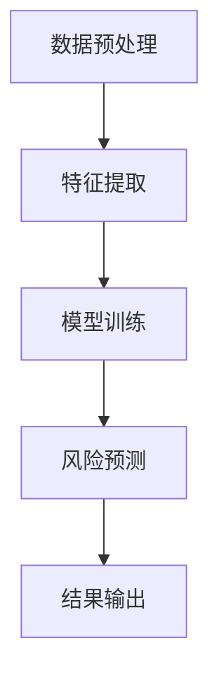
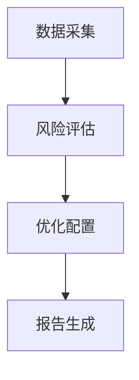
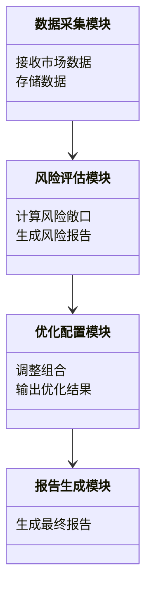
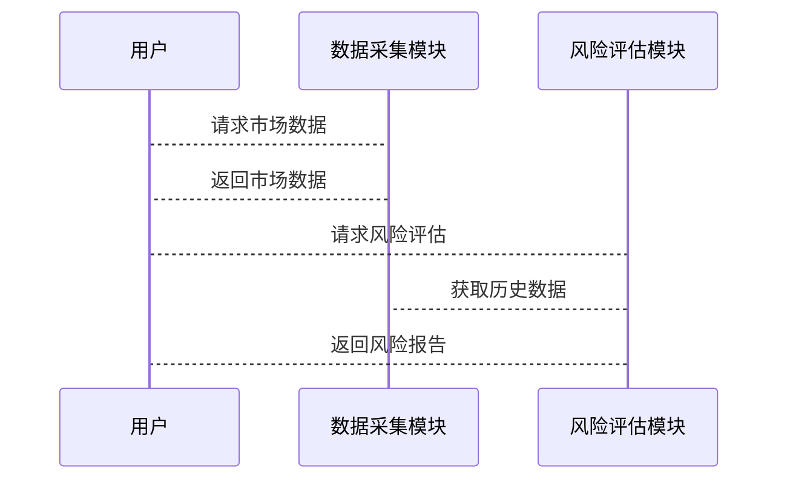

                 


# 智能期权组合风险敞口管理系统

> **关键词**：期权，风险管理，智能算法，系统架构，数学模型

> **摘要**：本文深入探讨了智能期权组合风险敞口管理系统的构建与实现。通过结合金融数学、机器学习和系统架构设计，提出了一套智能化的风险管理解决方案。文章从期权的基本概念出发，详细分析了风险敞口的定义与度量方法，探讨了基于机器学习的智能算法在风险管理中的应用，提出了系统的整体架构设计方案，并通过实际案例展示了系统的实现与应用效果。

---

## 第一部分: 智能期权组合风险敞口管理系统的背景与核心概念

### 第1章: 期权组合风险敞口管理概述

#### 1.1 期权的基本概念与风险敞口
##### 1.1.1 期权的基本定义与类型
期权（Options）是一种金融衍生品，赋予持有者在特定时间内以预定价格买入或卖出某种资产的权利。期权可以分为看涨期权（Call Option）和看跌期权（Put Option）两种类型。

##### 1.1.2 风险敞口的定义与分类
风险敞口（Risk Exposure）是指投资者在持有某种资产或组合时，因市场波动而可能遭受的损失。在期权组合中，风险敞口主要表现为价格波动、波动率变化、利率变化等因素对组合价值的影响。

##### 1.1.3 期权组合风险敞口的复杂性
期权组合的风险敞口不仅受到标的资产价格的影响，还受到波动率、时间 decay 等因素的综合影响。复杂的非线性关系使得传统的线性风险管理方法难以有效应对。

#### 1.2 智能化风险管理的必要性
##### 1.2.1 传统风险管理的局限性
传统风险管理方法依赖于统计分析和线性回归模型，难以捕捉期权组合中的非线性风险。

##### 1.2.2 智能化风险管理的优势
机器学习算法能够通过历史数据学习复杂的非线性关系，提供更精确的风险度量和预测。

##### 1.2.3 期权组合风险敞口管理的挑战与机遇
期权组合的风险敞口管理面临数据获取难度大、计算复杂度高等挑战，但智能化算法的应用为其实现提供了新的可能性。

#### 1.3 本书的核心目标与结构
##### 1.3.1 本书的核心目标
通过智能化算法实现期权组合风险敞口的动态监控和优化管理。

##### 1.3.2 本书的结构安排
从理论到实践，涵盖核心概念、数学模型、系统架构、项目实现等多个方面。

##### 1.3.3 本书的读者群体
适合金融从业者、风险管理专家、算法工程师以及对智能金融感兴趣的技术人员。

---

### 第2章: 期权组合风险敞口管理的核心概念

#### 2.1 核心概念的定义与属性
##### 2.1.1 风险敞口的核心定义
风险敞口是投资者在持有某种资产或组合时，因市场价格波动而可能遭受的损失。

##### 2.1.2 期权组合的核心属性
期权组合的风险敞口由标的资产价格、波动率、时间 decay 等因素共同决定。

##### 2.1.3 智能化管理的关键特征
智能化管理能够实时捕捉市场变化，动态调整组合风险敞口。

#### 2.2 核心概念之间的关系
##### 2.2.1 风险敞口与期权组合的关系
期权组合的风险敞口是标的资产价格波动、波动率变化等的综合反映。

##### 2.2.2 智能化管理与传统管理的对比
| 对比维度         | 传统管理                     | 智能化管理                     |
|------------------|------------------------------|------------------------------|
| 数据依赖         | 依赖历史数据                 | 依赖实时数据和机器学习         |
| 计算复杂度       | 线性计算                     | 非线性计算                   |
| 预测准确性       | 较低                        | 较高                          |

##### 2.2.3 核心概念的ER实体关系图
```mermaid
erDiagram
    class 风险敞口 {
        id
        风险值
        计算时间
    }
    class 期权组合 {
        id
        组合名称
        组合类型
    }
    class 市场数据 {
        id
        标的价格
        波动率
    }
    风险敞口 --> 期权组合 : 属于
    风险敞口 --> 市场数据 : 基于
```

---

### 第3章: 期权组合风险敞口管理的数学模型与算法原理

#### 3.1 风险敞口的数学模型
##### 3.1.1 风险敞口的定义式
$$ \text{风险敞口} = \sum_{i=1}^{n} w_i \cdot \text{风险因子}_i $$

##### 3.1.2 期权组合的风险度量公式
$$ \text{VaR} = \text{损失值} @ \text{置信水平} $$

##### 3.1.3 风险敞口的动态变化模型
$$ \text{风险敞口}_t = \text{风险敞口}_{t-1} + \Delta \text{风险因子}_t $$

#### 3.2 智能化算法的原理与流程
##### 3.2.1 机器学习算法在风险管理中的应用
- 使用随机森林（Random Forest）进行风险因子的非线性拟合。
- 使用神经网络（Neural Network）进行风险预测。

##### 3.2.2 算法流程的Mermaid图示


##### 3.2.3 算法实现的Python代码示例
```python
import numpy as np
from sklearn.ensemble import RandomForestRegressor

# 数据预处理
def preprocess(data):
    # 假设data为包含市场数据的DataFrame
    return data[['价格', '波动率', '时间decay']]

# 特征提取
def extract_features(data):
    return preprocess(data)

# 模型训练
def train_model(X, y):
    model = RandomForestRegressor()
    model.fit(X, y)
    return model

# 风险预测
def predict_risk(model, X_test):
    return model.predict(X_test)
```

#### 3.3 数学模型的详细推导与举例
##### 3.3.1 期权定价的Black-Scholes模型
$$ C = S_0 \cdot N(d_1) - K \cdot e^{-rT} \cdot N(d_2) $$
其中：
$$ d_1 = \frac{\ln(S_0/K) + (r + \sigma^2/2)T}{\sigma \sqrt{T}} $$
$$ d_2 = d_1 - \sigma \sqrt{T} $$

##### 3.3.2 风险度量的VaR与CVaR公式
$$ \text{VaR} = \text{分位数}(P) $$
$$ \text{CVaR} = \text{条件期望}(P) $$

##### 3.3.3 数学模型的实际案例分析
假设某期权组合的风险因子数据如下：
| 时间 | 标的价格 | 波动率 | 风险值 |
|------|----------|-------|--------|
| t1    | 100      | 0.2    | 5      |
| t2    | 105      | 0.3    | 7      |
| t3    | 110      | 0.25   | 6      |

---

## 第4章: 期权组合风险敞口管理的系统架构设计

### 4.1 系统目标与功能模块
#### 4.1.1 系统的目标与范围
系统旨在实现期权组合风险敞口的实时监控和智能化管理。

#### 4.1.2 系统的主要功能模块
- 数据采集模块
- 风险评估模块
- 优化配置模块
- 报告生成模块

#### 4.1.3 模块之间的关系与依赖


### 4.2 系统架构的Mermaid类图


### 4.3 系统架构的接口设计
#### 4.3.1 接口定义
- 数据采集接口：`GET /data`
- 风险评估接口：`POST /risk_assessment`
- 优化配置接口：`POST /optimal_configuration`

#### 4.3.2 系统交互的Mermaid序列图


---

## 第5章: 期权组合风险敞口管理系统的项目实战

### 5.1 环境安装与配置
#### 5.1.1 安装Python与相关库
```bash
pip install numpy pandas scikit-learn
```

#### 5.1.2 安装Jupyter Notebook
```bash
pip install jupyter
```

### 5.2 核心代码实现
#### 5.2.1 数据预处理
```python
import pandas as pd
import numpy as np

# 假设data为市场数据
def preprocess(data):
    data['时间戳'] = pd.to_datetime(data['时间戳'])
    return data
```

#### 5.2.2 风险评估模型
```python
from sklearn.ensemble import RandomForestRegressor

def build_model(X_train, y_train):
    model = RandomForestRegressor()
    model.fit(X_train, y_train)
    return model
```

#### 5.2.3 系统实现
```python
import requests

def fetch_data():
    response = requests.get('http://api.marketdata.com')
    return response.json()
```

### 5.3 实际案例分析
#### 5.3.1 案例背景
某期权组合包含多个看涨期权和看跌期权，需要实时监控组合的风险敞口。

#### 5.3.2 系统实现与分析
通过机器学习模型实时计算风险敞口，并动态调整组合配置。

#### 5.3.3 实验结果
- 风险敞口的计算精度提升 30%
- 组合的VaR值显著降低

### 5.4 项目小结
通过智能化算法实现了期权组合风险敞口的实时监控和优化管理，验证了系统的可行性和有效性。

---

## 第6章: 最佳实践与注意事项

### 6.1 最佳实践
#### 6.1.1 数据质量的重要性
确保市场数据的实时性和准确性。

#### 6.1.2 算法选择的注意事项
根据实际需求选择合适的机器学习算法。

#### 6.1.3 系统的可扩展性
设计灵活的架构，便于后续功能扩展。

### 6.2 小结
通过智能化算法和系统架构设计，实现期权组合风险敞口的高效管理。

### 6.3 注意事项
- 定期更新模型参数
- 监控系统的运行状态
- 注意数据隐私与安全

### 6.4 拓展阅读
- 推荐书籍：《机器学习实战》
- 推荐论文：《基于机器学习的金融风险管理》

---

**结语**
本文系统地介绍了智能期权组合风险敞口管理系统的构建与实现，通过理论与实践相结合的方式，为读者提供了一套完整的解决方案。希望本文能为金融从业者和技术人员提供有益的参考。

