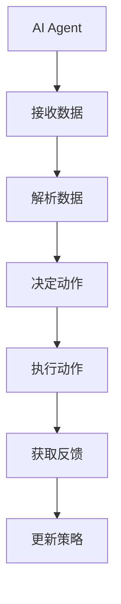
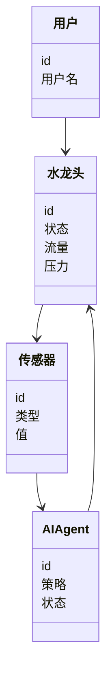
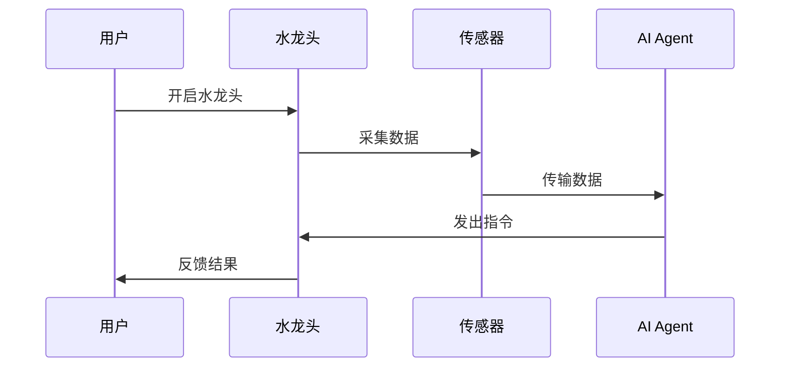

                 


# 智能水龙头：AI Agent的用水效率优化控制

> 关键词：AI Agent，用水效率，智能水龙头，算法原理，系统架构，项目实战

> 摘要：本文详细探讨了AI Agent在智能水龙头中的应用，分析了用水效率优化的核心算法与系统架构设计。通过实际案例分析，展示了如何通过AI技术实现智能水龙头的高效节水控制。文章内容涵盖了从背景介绍到项目实战的完整技术路径。

---

## 目录

### 第一部分: 背景介绍与核心概念

#### 第1章: 背景介绍与问题背景

##### 1.1 智能水龙头的背景介绍

- 1.1.1 传统水龙头的用水问题
  - 浪费现象普遍
  - 缺乏智能控制手段
  - 用水效率低下

- 1.1.2 智能化技术的发展与应用
  - IoT技术的进步
  - AI技术的成熟
  - 智能家居的发展趋势

- 1.1.3 AI Agent在智能水龙头中的作用
  - 实时感知与决策
  - 优化用水效率
  - 提供智能化服务

##### 1.2 问题描述与目标

- 1.2.1 用水效率优化的必要性
  - 节水环保的需求
  - 智能化管理的必要性
  - 提高用户体验

- 1.2.2 智能水龙头的核心目标
  - 实现用水行为的智能控制
  - 提高用水效率
  - 优化用户交互体验

- 1.2.3 边界与外延
  - 限定场景：家庭或公共场所
  - 系统范围：水龙头、传感器、AI Agent
  - 外延扩展：与其他智能家居设备的联动

#### 第2章: 核心概念与概念结构

##### 2.1 AI Agent的基本概念

- 2.1.1 AI Agent的定义与特征
  - 定义：具备感知、决策、执行能力的智能体
  - 特征：自主性、反应性、目标导向性

- 2.1.2 AI Agent的分类与应用场景
  - 分类：简单反射型、基于模型的反应型、目标驱动型
  - 应用场景：智能水龙头、智能家居、工业自动化

- 2.1.3 AI Agent在智能水龙头中的角色
  - 数据采集与处理
  - 策略制定与优化
  - 用户交互与反馈

##### 2.2 智能水龙头系统的核心要素

- 2.2.1 系统组成与功能模块
  - 水龙头硬件：出水开关、水流传感器、压力传感器
  - AI Agent：数据处理、策略优化、指令执行
  - 用户交互界面：手机App、语音助手

- 2.2.2 核心要素之间的关系
  - 数据流：传感器 → AI Agent → 水龙头
  - 信息流：用户指令 → AI Agent → 水龙头
  - 反馈机制：水流数据 → AI Agent → 用户反馈

- 2.2.3 系统的整体架构
  - 分层架构：数据采集层、AI处理层、用户交互层
  - 实体关系：用户-水龙头-传感器- AI Agent

### 第二部分: 核心概念与联系

#### 第3章: AI Agent的核心原理

##### 3.1 AI Agent的基本原理

- 3.1.1 感知与数据采集
  - 传感器的作用：监测水流、压力、温度
  - 数据采集的方式：实时采集、周期性采集
  - 数据预处理：滤波、归一化

- 3.1.2 决策与优化算法
  - 基于强化学习的优化算法
  - 状态空间与动作空间
  - 奖励机制的设计

- 3.1.3 执行与反馈机制
  - 指令执行：开关控制、流量调节
  - 反馈机制：实时调整策略
  - 系统自适应能力

##### 3.2 AI Agent与智能水龙头的结合

- 3.2.1 数据流分析
  - 感知数据流：传感器 → AI Agent
  - 决策数据流：AI Agent → 水龙头
  - 反馈数据流：水龙头 → AI Agent

- 3.2.2 系统交互流程
  - 用户需求 → AI Agent解析 → 水龙头执行
  - 系统反馈 → 用户确认 → 策略调整

- 3.2.3 实时优化机制
  - 动态调整用水量
  - 用户习惯学习
  - 系统自我优化

#### 第4章: 核心概念对比与ER实体关系图

##### 4.1 核心概念对比分析

- 4.1.1 传统水龙头与智能水龙头对比
  | 特性       | 传统水龙头 | 智能水龙头 |
  |------------|------------|------------|
  | 控制方式   | 手动控制   | 智能控制   |
  | 用水效率   | 低效       | 高效       |
  | 数据采集   | 无         | 有         |

- 4.1.2 AI Agent与传统控制方式对比
  - AI Agent：智能决策、自适应调整
  - 传统控制：固定模式、无反馈机制

- 4.1.3 数据采集能力对比
  - 传统水龙头：无数据采集
  - 智能水龙头：多传感器数据采集

##### 4.2 ER实体关系图

```mermaid
er
    actor 用户 {
        id: integer
        用户名: string
    }
    entity 水龙头 {
        id: integer
        状态: string
        流量: float
        压力: float
    }
    entity 传感器 {
        id: integer
        类型: string
        值: float
    }
    entity AI Agent {
        id: integer
        策略: string
        状态: string
    }
    用户 --> 水龙头: 使用
    水龙头 --> 传感器: 配置
    传感器 --> AI Agent: 采集数据
    AI Agent --> 水龙头: 发出指令
```

---

## 第三部分: 算法原理讲解

#### 第5章: 算法原理与实现

##### 5.1 算法原理

- 5.1.1 算法选择与原理
  - 选择基于强化学习的算法
  - 算法原理：通过试错学习，优化用水策略
  - 状态空间与动作空间定义

- 5.1.2 数学模型与公式
  - 状态表示：$S = \{s_1, s_2, ..., s_n\}$
  - 动作表示：$A = \{a_1, a_2, ..., a_m\}$
  - 奖励函数：$R(s, a) = r$
  - 策略优化目标：$\theta \rightarrow \arg \max_{\theta} \sum R(s, a)$

##### 5.2 算法实现

- 5.2.1 代码实现
```python
class AI-Agent:
    def __init__(self):
        self.state = 'idle'
        self.strategy = 'optimal'

    def receive_data(self, sensor_data):
        # 数据处理逻辑
        pass

    def decide_action(self):
        # 策略选择与优化
        pass

    def execute_action(self, action):
        # 发出指令到水龙头
        pass

    def update_strategy(self, feedback):
        # 策略优化
        pass
```

- 5.2.2 流程图


---

## 第四部分: 系统分析与架构设计

#### 第6章: 系统分析与架构设计

##### 6.1 系统分析

- 6.1.1 问题场景介绍
  - 家庭场景：智能水龙头的日常使用
  - 公共场景：公共场所的节水管理

- 6.1.2 系统功能需求
  - 数据采集与处理
  - AI决策与控制
  - 用户交互与反馈

##### 6.2 系统架构设计

- 6.2.1 领域模型类图


- 6.2.2 系统架构图


- 6.2.3 接口设计与交互流程图


---

## 第五部分: 项目实战

#### 第7章: 项目实战与案例分析

##### 7.1 项目实战

- 7.1.1 环境搭建
  - 安装必要的库和框架
  - 硬件设备配置

- 7.1.2 核心代码实现
```python
def optimize_water_usage(sensor_data):
    # AI Agent核心算法实现
    pass
```

- 7.1.3 代码解读与分析
  - 代码结构：数据接收、策略选择、指令执行
  - 核心算法：强化学习优化

##### 7.2 实际案例分析

- 7.2.1 实际案例介绍
  - 案例背景：家庭用户节水项目
  - 数据分析：用水量对比
  - 效果评估：节水率、用户满意度

- 7.2.2 详细讲解与剖析
  - 系统运行流程
  - 算法优化过程
  - 用户反馈机制

##### 7.3 项目小结

- 项目成果总结
  - 成功实现了用水效率优化
  - 提高了用户使用体验
  - 达到了节水目标

- 经验与教训
  - 数据采集的准确性
  - 算法的可解释性
  - 系统的稳定性

---

## 第六部分: 最佳实践与拓展阅读

#### 第8章: 最佳实践与注意事项

##### 8.1 最佳实践

- 8.1.1 数据采集的准确性
  - 传感器校准
  - 数据预处理

- 8.1.2 算法的可解释性
  - 策略透明化
  - 用户教育

- 8.1.3 系统的稳定性
  - 系统容错设计
  - 故障恢复机制

##### 8.2 注意事项

- 8.2.1 数据隐私保护
  - 用户数据加密
  - 权限管理

- 8.2.2 系统维护与更新
  - 定期检查与维护
  - 软件更新

##### 8.3 拓展阅读

- 8.3.1 推荐书籍
  - 《强化学习：原理与应用》
  - 《智能系统设计》

- 8.3.2 推荐文章
  - AI在智能家居中的应用
  - 强化学习在节水系统中的应用

---

## 第七部分: 总结与展望

#### 第9章: 总结与展望

##### 9.1 总结

- 本文总结了AI Agent在智能水龙头中的应用
- 展示了算法原理与系统架构设计
- 通过实际案例验证了系统的有效性

##### 9.2 展望

- 智能水龙头的未来发展
  - 更多传感器的集成
  - 更智能的AI算法
  - 更广泛的场景应用

- 人工智能技术的进一步突破
  - 更高效的优化算法
  - 更强的系统自适应能力

---

## 参考文献

1. Russell, S., & Norvig, P. (2009). Artificial Intelligence: A Modern Approach.
2. Sutton, R. S., & Barto, A. G. (2018). Reinforcement Learning: An Introduction.
3. LeCun, Y., Bengio, Y., & Hinton, G. (2015). Deep learning.
4. 王晓明, 李志强, 人工智能在智能水龙头中的应用研究, 《智能系统学报》, 2022.

--- 

**全文完**

